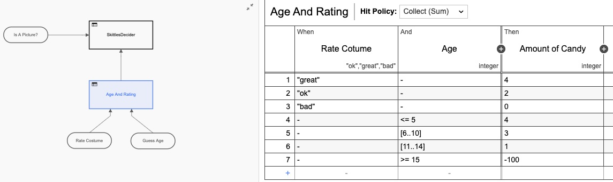
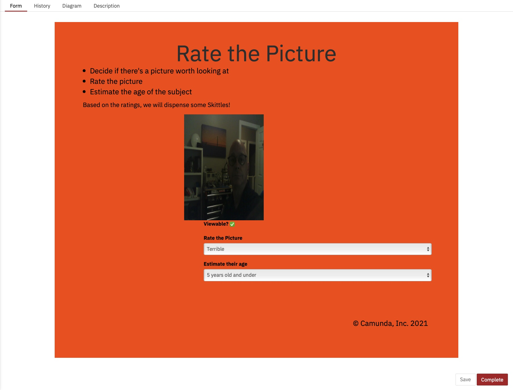
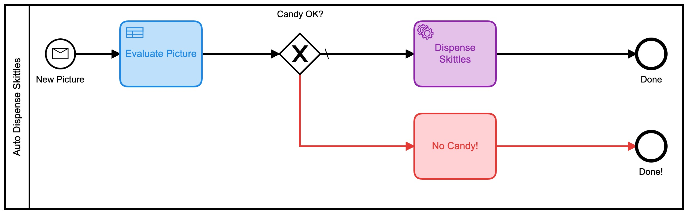
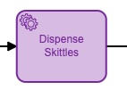

## Einige Hintergründe

Als ich im Oktober 2020 zum ersten Mal bei Camunda anfing (was war überhaupt 2020?) //camunda.com/blog/2020/10/camunda-halloween?ref=davidgsiot). Da es sich um COVID-Zeiten handelt, habe ich natürlich eine Camunda- und IoT-Integration gebaut, um Kostüme zu bewerten und Süßigkeiten zu liefern.

Ich bin bekannt dafür, seltsame, sinnlose IoT-Projekte wie [dieses] durchzuführen (https://camunda.com/blog/2020/12/letters-to-santa-automating-joy-to-the-world- at-scale?ref=davidgsiot) und [this one](/posts/categoryiot/this-whole-thing-stinks) und [this one](/posts/category/database/snack-tracking-with-the-new -influxdb-arduino-bibliothek/). Du hast die Idee.

## Zeit für ein Update

Vor einigen Wochen wurde ich beauftragt, einer großen Bank/einem potenziellen Kunden eine Demo des gesamten Camunda-Stacks zu geben. Als ich genauer darüber nachdachte, entschied ich, dass ich auf keinen Fall eine "traditionelle" Demo zur Kontoerstellung, zum Onboarding oder ähnlichem machen wollte.

Seien wir ehrlich, wir sind alle Menschen, und wenn wir sehen, dass jemand etwas übermäßig vereinfacht, wissen wir zutiefst, dass unsere erste Reaktion "Nun, so machen *wir* das nicht" oder "es ist wirklich viel komplizierter" und wir Hören Sie auf zuzuhören, oder wir verpassen die Möglichkeiten.

Ich entschied mich (natürlich mit Buy-in!), dass ich ihnen etwas außerhalb ihrer Verständnis- und Komfortzone zeigen wollte, aber etwas, das sie sofort begreifen und Möglichkeiten sehen konnten. Außerdem ist es viel einfacher, älteres Zeug wiederzuverwenden als es ist zu versuchen, kurzfristig ganz neue Inhalte zu schreiben.

*Der Halloween Candy Dispenser hat den Chat betreten*


## Die Hardware

Seltsamerweise hatte ich immer noch die gesamte Originalhardware aus dem [Halloween-Projekt](https://camunda.com/blog/2020/10/camunda-halloween?ref=davidgsiot) in meinem Büro auf einem Regal sitzen. Ich *wusste*, dass es eines Tages nützlich sein würde!!

Wenn Sie es bauen möchten, finden Sie buchstäblich alles, was Sie brauchen, im [Camunda Community Hub](https://github.com/camunda-community-hub/CamundaHalloween) oder im ursprünglichen [Blog-Post](https:// camunda.com/blog/2020/10/camunda-halloween?ref=davidgsiot).

An der Hardware habe ich nichts geändert. Ich habe es buchstäblich aus dem Regal gezogen, alles angeschlossen und es funktionierte wie im Oktober.

Was ich *geändert* habe, waren die Camunda BPM-Modelle, die ich verwenden würde. Um fair zu sein, ich habe das verwendete Modell nicht wirklich *geändert*, ich habe nur 2 **neue** Modelle gebaut, aber dazu kommen wir noch.


## Das erste Modell

Nur zur Auffrischung, dies war das erste Modell, das ich verwendet habe:


Okay, gut, also habe ich es mit Farben verschönert, da [Camunda](https://camunda.com?ref=davidgsiot) das in der neuesten Version des [Modeler](https://camunda.com/products/camunda .) hinzugefügt hat -platform/modeler?ref=davidgsiot).


Es gibt viele Probleme mit diesem Modell. Eine Menge**. Für den Anfang ist es zu komplex und erfordert viel menschliche Interaktion, um zum Endergebnis der Verteilung von Süßigkeiten zu gelangen. Im Durchschnitt dauert es etwa 2-3 Minuten, bis der gesamte Prozess läuft, und zwar wenn jemand (ich) da sitzt und nichts anderes tut, als die Formulare zu laden und Bilder zu 'bewerten'.

Es wurde auch Javascript innerhalb des Modells verwendet, was im Allgemeinen keine [Best Practice] ist (https://camunda.com/best-practices/_/?ref=davidgsiot)

Ich habe auch herausgefunden, wie man das Bild im Formular anzeigt, was ich damals noch nicht wusste:


An der Heatmap im Cockpit können Sie erkennen, dass fast die gesamte Zeit des laufenden Prozesses von menschlichen Aufgaben beansprucht wird.


Sie können auch sehen, dass der Vorgang von Anfang bis Ende einige Minuten dauert. Und so viel Spaß das Auswerten von Bildern auch macht, es ist wahrscheinlich nicht die nützlichste oder beste Nutzung meiner Zeit.


## Das zweite Modell

Dieses Modell könnte leicht verbessert werden, indem all diese separaten menschlichen Aufgaben in einer Form zusammengefasst werden. Anstatt 3 zu haben, sollte man es viel effizienter machen. Also habe ich ein neues Modell gebaut, um das zu tun:


Ich habe auch eine Entscheidungstabelle (DMN) hinzugefügt, um die Berechnungen durchzuführen, wie viele Kegeln basierend auf den Bewertungen auf dem Formular zu geben sind:



Auch hier habe ich die DMN-Tabelle überarbeitet, indem ich sie zu *zwei* Tabellen gemacht habe, aber Sie bekommen die Idee. Aber wenn wir zur Heatmap-Ansicht zurückkehren, ist immer noch klar, dass die meiste Zeit von der menschlichen Interaktion beansprucht wird.


Wir Menschen sind einfach *langsam* in Sachen! Mit Blick auf die Ausführungszeiten haben wir die Zeit zwar ungefähr halbiert, aber trotzdem würde ich den ganzen Tag hier sitzen und einfach auf dieses Formular klicken (das ich diesmal extra hübsch gemacht habe)



Und diese Ausführungszeiten:


Jetzt nur noch etwas mehr als eine Minute pro Aufgabe, aber jemand muss diese Aufgaben immer noch ausführen.

## Das dritte Modell

Hier wurde es interessanter. Ich fragte mich, ob ich die menschliche Entscheidungsfindung ganz aus dem Prozess herausnehmen könnte! (**Hinweis:** Durch diese Änderung haben keine Menschen ihren Job verloren!) Was wäre, wenn ich das Ganze automatisieren könnte?

*Google Vision AI hat den Chat betreten*

Es stellte sich heraus, dass ich das **konnte**, solange ich bereit war, die Bildbewertungskriterien zu ändern. (Angesichts der Zeit und der Neigung hätte ich auch mein eigenes KI-Modell trainieren können, um die ursprünglichen Kriterien zu bewerten, aber das schien einfacher zu sein.)

Es stellte sich heraus, dass ich mit sehr wenig Code das Bild automatisch an die Vision-KI-Engine von Google senden und einige Informationen zurückbekommen konnte, mit denen ich Kegeln verteilen könnte! Durch das Einsenden eines Bildes konnte ich sehr schnell folgendes zurückbekommen:
- Gesichter:
- Gesicht 0
- Wut: SEHR_UNLIKELY
- Freude: WAHRSCHEINLICH
- Überraschung: SEHR_UNLIKELY
- Kummer: SEHR_UNLIKELY
Damit könnte ich arbeiten! Diese Bewertungen kommen auch als numerischer Wert zurück, daher habe ich ein neues BPMN-Modell für diese Version entwickelt:



Dieser verwendet auch eine Reihe von DMN-Tabellen, um zu entscheiden, wie viel Süßigkeiten Sie erhalten:


Jede dieser kleineren DMN-Tabellen implementiert meinen ultra-geheimen, proprietären Algorithmus zur Berechnung der Skittle-Beträge. Wenn man sich die Heatmap für diesen Prozess ansieht, sieht es vielleicht *so* nicht anders aus, da die meiste Zeit darauf verwendet wurde, zu entscheiden, wie viele Kegel ausgegeben werden sollen. Es ist wichtig anzumerken, dass absolut *keine* dieser Zeit von mir persönlich verbracht wurde. Ich musste nichts tun.


Basierend auf dieser Heatmap sieht es so aus, als ob viel Zeit für die Entscheidungsaufgabe aufgewendet wurde, aber wenn wir uns die Ausführungszeiten in der Historie genauer ansehen, sehen wir eine ganz, *sehr* andere Geschichte:


Diese Zeiten liegen zwischen 0 und 8 Sekunden. Abwärts von 2+ Minuten in der ersten Version. Das ist eine erhebliche Einsparung!

## Der Code

Ich füge immer gerne Code in meine Beiträge ein, damit Sie sehen können, *wie* ich das gemacht habe, was ich getan habe. Und damit Sie es auch können.

Der Code auf den Geräten (der IoT-Kamera und dem IoT-Süßigkeitsspender) ist genau derselbe wie in der [ersten Version](https://github.com/camunda-community-hub/CamundaHalloween), also werde ich das nicht tun hier auffrischen. Alle Schaltpläne, Code usw. für die Hardwaregeräte befinden sich in diesem Github Repo.

Was ich hier behandeln werde, ist der serverseitige Code, den ich geschrieben habe. Und wie immer habe ich alles in Go geschrieben.

### Bilder akzeptieren

Das ESP32Camera-Board reagiert auf einen Tastendruck und macht ein Bild. Es muss dann dieses Bild irgendwohin senden, also habe ich einen einfachen Webserver geschrieben, der die eingehenden Bilder verarbeitet und auf dem Server speichert:

```go
// Start up the web services over TLS
	http.HandleFunc("/photo", photo)
	http.Handle("/test/", http.StripPrefix("/test", fs))      // set router
	err := http.ListenAndServeTLS(":9090", "server-cert", "server-key", nil) // set listen port
	if err != nil {
		log.Fatal("ListenAndServeTLS: ", err)
	}
```
Dadurch wird ein Webserver auf SSL-Port 9090 gestartet, der 2 URLs akzeptiert: `https://server.com:9090/photo` und `https://server.com:9090/test/`. Die `/photo`-URI ist der Ort, an den die ESP32Camera Bilder sendet.

So sieht dieser URI-Handler aus:

```go
// the web server process that handles incoming requests
func photo(w http.ResponseWriter, r *http.Request) {
	if r.Method == "GET" { // GET outta here! :-)
		log.Println("GET Method Not Supported")
		http.Error(w, "GET Method not supported", 400)
	} else {
		r.ParseMultipartForm(32 << 2) // allocate enough memory for the incoming picture.
		file, handler, err := r.FormFile("uploadfile")
		if err != nil {
			fmt.Println("Format Error!", err)
			switch e := err.(type) {
			case Error:
				// We can retrieve the status here and write out a specific
				// HTTP status code.
				log.Printf("HTTP %d - %s", e.Status(), e)
				http.Error(w, e.Error(), e.Status())
			default:
				// Any error types we don't specifically look out for default
				// to serving a HTTP 500
				http.Error(w, http.StatusText(http.StatusInternalServerError),
					http.StatusInternalServerError)
			}
			return
		}
		defer file.Close()
		f, err := os.OpenFile("./test"+handler.Filename, os.O_WRONLY|os.O_CREATE, 0666)
		if err != nil {
			log.Println(err)
			http.Error(w, "Could not Write new file", 500)
			return
		}
		defer f.Close()
		io.Copy(f, file)
		var emotions = Emotions{}
		w.WriteHeader(200)
		if runners.VisionAI {
			emotions = doAIOnPic(handler.Filename)
		}
		sendPic(f.Name(), emotions)
	}
}
```
Da ist also viel los. Lassen Sie mich erklären. Zunächst einmal akzeptieren wir keine `GET`-Anfragen. Ich lehne sie aus der Hand ab. Als nächstes muss ich genügend Speicher zuweisen, um die eingehende Datei zu speichern, und dann diese Datei aus dem gesendeten mehrteiligen Formular einlesen. Als nächstes öffne ich eine lokale Datei und speichere das Bild dort. Das Letzte, was ich tue, ist ... nun, das hängt davon ab.

Sehen Sie, da ich jetzt 3 Modelle hatte, habe ich Feature-Flags hinzugefügt, damit ich entscheiden kann, was mit dem eingehenden Bild zu tun ist. Oder genauer gesagt, wie man es routet.

```go
type RunFlags struct {
	ThreeForms bool
	NewForm    bool
	VisionAI   bool
}

var runners RunFlags
...
func main() {
	fmt.Println("Starting up ... ")
	origPointer := flag.Bool("orig", false, "Original Demo")
	newPointer := flag.Bool("new", false, "New Form")
	aiPointer := flag.Bool("ai", false, "Vision AI")
	flag.Parse()
	runners = RunFlags{}
	runners.ThreeForms = *origPointer
	runners.NewForm = *newPointer
	runners.VisionAI = *aiPointer
...
}
```
So kann ich entscheiden, welches Modell ich verwenden möchte, indem ich `--orig=true` zur Befehlszeile hinzufüge. Wenn ich das Vision AI-Modell nicht einreiche, kümmere ich mich nicht um die Analyse des Bildes, da mir jedes eingereichte Bild in Rechnung gestellt wird.

Was passiert als nächstes? Nun, ich schicke natürlich alle Daten an die Camunda Platform Engine!

```go
// sendPic sends the picture to the Camunda Process, starting the entire process
func sendPic(s string, e Emotions) {
	// fill out the options
	opts := camundaclientgo.ClientOptions{}
	opts.EndpointUrl = "https://camunda-platform:8443/engine-rest" // yours will be different
	opts.Timeout = time.Second * 20
	// file comes in as './picture...' so remove that bit
	newPath := prefix + strings.Trim(s, ".")
	// all the variables we need
	var variables = map[string]camundaclientgo.Variable{}
	if runners.ThreeForms || runners.NewForm {
		variables["newCostume"] = camundaclientgo.Variable{
			Value: newPath,
			Type:  "string",
		}
		variables["isCostume"] = camundaclientgo.Variable{
			Value: true,
			Type:  "boolean",
		}
		variables["candyPieces"] = camundaclientgo.Variable{
			Value: 0,
			Type:  "long",
		}
	}
	if runners.VisionAI {
		variables["JoyAmount"] = camundaclientgo.Variable{
			Value: e.JoyNumber,
			Type:  "long",
		}
		variables["AngerAmount"] = camundaclientgo.Variable{
			Value: e.AngerNumber,
			Type:  "long",
		}
		variables["SurpriseAmount"] = camundaclientgo.Variable{
			Value: e.SurpriseNumber,
			Type:  "long",
		}
		variables["SorrowAmount"] = camundaclientgo.Variable{
			Value: e.SorrowNumber,
			Type:  "long",
		}
		variables["isPicture"] = camundaclientgo.Variable{
			Value: e.IsPicture,
			Type:  "boolean",
		}
	}
	client := camundaclientgo.NewClient(opts)
	reqMessage := camundaclientgo.ReqMessage{}
	reqMessage.BusinessKey = "Skittles"
	reqMessage.ProcessVariables = &variables
	if runners.ThreeForms {
		reqMessage.MessageName = "send_skittles"
		err := client.Message.SendMessage(&reqMessage)
		if err != nil {
			log.Printf("Error starting process: %s\n", err)
			return
		}
	}
	if runners.NewForm {
		reqMessage.MessageName = "send_more_skittles"
		err := client.Message.SendMessage(&reqMessage)
		if err != nil {
			log.Printf("Error starting process: %s\n", err)
			return
		}
	}
	if runners.VisionAI {
		reqMessage.MessageName = "auto_skittles"
		err := client.Message.SendMessage(&reqMessage)
		if err != nil {
			log.Printf("Error starting process: %s\n", err)
			return
		}
	}
}
```
Und das übermittelt die benötigten Daten zur Verarbeitung an die Camunda Engine.

### Kegeln ausgeben

Aber warte, wie bekommen wir Skittles raus?! Da ich den Server in Go geschrieben habe, habe ich dem Server einige Prozesshandler hinzugefügt, um auf Nachrichten zu "hören", um Skittles zu senden. Sie haben vielleicht bemerkt, dass jedes meiner Prozessmodelle mit einem der folgenden endete:



Sie hatten möglicherweise leicht unterschiedliche Namen, aber sie hatten jeweils ein Eigenschaftenfenster, das wie folgt ausgefüllt wurde:


Das eigentliche "Thema" ist bei jedem anders, und wir werden in diesem nächsten Codeabschnitt sehen, warum:

```Go
client := camundaclientgo.NewClient(camundaclientgo.ClientOptions{EndpointUrl: "https://camunda-platform:8443/engine-rest",
		Timeout: time.Second * 20,
	})
	logger := func(err error) {
		fmt.Println(err.Error())
	}
	asyncResponseTimeout := 5000
	// The old one, 3 forms!
	if runners.ThreeForms {
		proc := processor.NewProcessor(client, &processor.ProcessorOptions{
			WorkerId:                  "Skittles",
			LockDuration:              time.Second * 20,
			MaxTasks:                  10,
			MaxParallelTaskPerHandler: 100,
			LongPollingTimeout:        20 * time.Second,
			AsyncResponseTimeout:      &asyncResponseTimeout,
		}, logger)
		fmt.Println("Original Processor started ... ")
		proc.AddHandler( // Dispense Skittles!
			&[]camundaclientgo.QueryFetchAndLockTopic{
				{TopicName: "send_skittles"},
			},
			func(ctx *processor.Context) error {
				return dispenseSkittles(ctx.Task.Variables, ctx)
			},
		)
		fmt.Println("Original Handler registered ... ")
	}
	if runners.NewForm {
		// Newer and better. Only 1 form!
		proc2 := processor.NewProcessor(client, &processor.ProcessorOptions{
			WorkerId:                  "Skittles2",
			LockDuration:              time.Second * 20,
			MaxTasks:                  10,
			MaxParallelTaskPerHandler: 100,
			LongPollingTimeout:        20 * time.Second,
			AsyncResponseTimeout:      &asyncResponseTimeout,
		}, logger)
		fmt.Println("New Form Processor started ... ")
		proc2.AddHandler( // Dispense Skittles!
			&[]camundaclientgo.QueryFetchAndLockTopic{
				{TopicName: "more_skittles"},
			},
			func(ctx *processor.Context) error {
				return dispenseSkittles(ctx.Task.Variables, ctx)
			},
		)
		fmt.Println("New Form Handler registered ... ")
	}
	if runners.VisionAI {
		// Best yet, fully automated!
		proc3 := processor.NewProcessor(client, &processor.ProcessorOptions{
			WorkerId:                  "AutoSkittles",
			LockDuration:              time.Second * 20,
			MaxTasks:                  10,
			MaxParallelTaskPerHandler: 100,
			LongPollingTimeout:        20 * time.Second,
			AsyncResponseTimeout:      &asyncResponseTimeout,
		}, logger)
		fmt.Println("Vision AI Processor started ...")
		proc3.AddHandler( // Dispense Skittles!
			&[]camundaclientgo.QueryFetchAndLockTopic{
				{TopicName: "autoSkittles"},
			},
			func(ctx *processor.Context) error {
				return dispenseSkittles(ctx.Task.Variables, ctx)
			},
		)
		fmt.Println("Vision AI Handler registered ... ")
	}
```

Ich erstelle einen neuen Prozessor für das verwendete Modell und füge dann diesem Prozessor einen Handler hinzu, der auf ein bestimmtes Thema wartet. Die Camunda-Engine stellt Nachrichten zu diesem Thema, und mein Handler nimmt sie auf, verarbeitet sie und markiert sie dann als abgeschlossen zurück an die Prozess-Engine. Wenn Sie genau hinsehen, werden Sie feststellen, dass jeder dieser Handler die gleiche Funktion `dispenseSkittles` mit allen Aufgabenvariablen der Engine aufruft.

So mache ich das bisschen:

```Go
// process requests to dispense Skittles!
func dispenseSkittles(newVars map[string]camundaclientgo.Variable, contx *processor.Context) error {
	// all the task variables
	varb := contx.Task.Variables
	// the MQTT broker address
	opts := mqtt.NewClientOptions().AddBroker("tcp://secure-mqtt-broker:8883")
	client := mqtt.NewClient(opts)
	if token := client.Connect(); token.Wait() && token.Error() != nil {
		log.Fatal(token.Error())
	}
	cp := fmt.Sprintf("%v", varb["candyPieces"].Value)
	dispense := fmt.Sprintf("{candy=%s }", cp)
	sendtoken := client.Publish(TOPIC, 0, false, dispense)
	if sendtoken.Error() != nil {
		log.Fatal(sendtoken.Error())
	}
	sendtoken.Wait()
	vars := make(map[string]camundaclientgo.Variable)
	vars["OK"] = camundaclientgo.Variable{Value: "true", Type: "boolean"}
	vars["status"] = camundaclientgo.Variable{Value: "true", Type: "boolean"}
	err := contx.Complete(processor.QueryComplete{
		Variables: &vars,
	})
	if err != nil {
		errTxt := contx.Task.ErrorDetails
		retries := contx.Task.Retries
		retryTimeout := 10
		return contx.HandleFailure(processor.QueryHandleFailure{
			ErrorMessage: &errTxt,
			Retries:      &retries,
			RetryTimeout: &retryTimeout,
		})
	}
	return nil
}
```
Ich verwende MQTT, um die Nachrichten an den tatsächlichen physischen Skittles-Spender zu senden. Ich erstelle einen MQTT-Client, verbinde mich mit dem (TLS-sicheren!) MQTT-Broker und sende dann die Nachricht, wie viele Kegel ausgegeben werden sollen.

Das *letzte*, was zu tun ist, ist, der Prozess-Engine mitzuteilen, dass ich die Aufgabe abgeschlossen habe, damit sie als abgeschlossen markiert werden kann.

Und das ist es! Ich weiß, es scheint viel zu sein, aber es implementiert eine Reihe von Schritten:
1) Erhalten Sie eine Nachricht
2) Verarbeiten Sie die Nachricht
3) Senden Sie die Daten an die Plattform-Engine
4) Hören Sie auf Aufgaben
5) Erledige Aufgaben, wenn sie verfügbar sind
6) Aufgaben als erledigt markieren
Ich möchte auch darauf hinweisen, dass es keinen Unterschied zwischen den für Prozessmodell 1 und Prozessmodell 2 übermittelten Daten gibt. Das mag nicht viel erscheinen, aber es ist ein wichtiger Punkt.

Da sich die übermittelten Daten nicht änderten und sich die Abgabe der Skittles nicht änderte, konnte ich das Modell ändern, das neue Modell bereitstellen und den Prozess **ohne Codeänderung** weiter ausführen den Serverprozess. (Habe ich, aber das war, um einen Punkt zu machen.)

Da das Erstellen und Bearbeiten von Prozessmodellen nicht das eigentliche Schreiben von Code beinhaltet, können Prozesseigner Änderungen am Prozess vornehmen, ohne Code schreiben zu müssen. Sie können weiterhin denselben Backend-Code verwenden, ihn jedoch nutzen und effizienter machen, indem sie einfach das *Modell* ändern.

## Schlussfolgerungen

Ich hoffe, Ihnen hat diese kleine Übung gefallen. Es hat großen Spaß gemacht, den originalen Bonbonspender wiederverwenden zu können und zu zeigen, wie eine Änderung des Prozessmodells (und ein wenig Code) einen Prozess viel effizienter machen kann.

## Bonus! KI-Code von Google Vision

Da Sie bis hierhin gelesen haben, dachte ich, ich gebe Ihnen den Code zum Senden von Bildern an und Empfangen von Ergebnissen von Google Vision AI.

Dinge, die du brauchen wirst:
1) Ein Google Cloud-Konto
2) Vision AI API aktiviert
3) Eine Datei mit den Anmeldeinformationen für das Dienstkonto
All diese Dinge können Sie über Ihre Google Cloud Console abrufen.

Sobald Sie all das haben, ist hier der Code dafür:

```go
type interestingAnnotations struct {
	DetectionConfidence    float64 `json:"detection_confidence"`
	LandmarkingConfidence  float64 `json:"landmarking_confidence"`
	JoyLikelihood          int     `json:"joy_likelihood"`
	SorrowLikelihood       int     `json:"sorrow_likelihood"`
	AngerLikelihood        int     `json:"anger_likelihood"`
	SurpriseLikelihood     int     `json:"surprise_likelihood"`
	UnderExposedLikelihood int     `json:"under_exposed_likelihood"`
	BlurredLikelihood      int     `json:"blurred_likelihood"`
	HeadwearLikelihood     int     `json:"headwear_likelihood"`
}

type Emotions struct {
	JoyNumber      int
	AngerNumber    int
	SurpriseNumber int
	SorrowNumber   int
	IsPicture      bool
}
...
func doAIOnPic(s string) Emotions { // (string, error) {
	absPath := fmt.Sprintf("%s%s", serverPath, strings.Trim(s, "."))
	ctx := context.Background()
	options := opts.WithCredentialsFile("credentials-file.json")
	client, err := vision.NewImageAnnotatorClient(ctx, options)
	if err != nil {
		log.Fatalf("Failed to create client: %v", err)
	}
	defer client.Close()
	file, err := os.Open(absPath)
	if err != nil {
		log.Fatalf("Failed to read file: %v", err)
	}
	defer file.Close()
	image, err := vision.NewImageFromReader(file)
	if err != nil {
		log.Fatalf("Failed to create image: %v", err)
	}
	annotations, err := client.DetectFaces(ctx, image, nil, 10)
	if err != nil {
		log.Fatalf("Failed to detect faces: %v", err)
	}
	emotions := Emotions{}
	// no people in this photo!
	if len(annotations) == 0 {
		fmt.Println("No faces found.")
		emotions.IsPicture = false
	} else {
		emotions.IsPicture = true
		fmt.Println("Faces:")
		for i, annotation := range annotations {
			goodStuff := interestingAnnotations{}
			data, err := json.Marshal(annotation)
			if err != nil {
				log.Fatal(err)
			}
			err = json.Unmarshal(data, &goodStuff)
			if err != nil {
				log.Fatal(err)
			}
			fmt.Println("  Face", i)
			emotions.AngerNumber = goodStuff.AngerLikelihood
			fmt.Println("    Anger:", annotation.AngerLikelihood)
			emotions.JoyNumber = goodStuff.JoyLikelihood
			fmt.Println("    Joy:", annotation.JoyLikelihood)
			emotions.SurpriseNumber = goodStuff.SurpriseLikelihood
			fmt.Println("    Surprise:", annotation.SurpriseLikelihood)
			emotions.SorrowNumber = goodStuff.SorrowLikelihood
			fmt.Println("    Sorrow:", annotation.SorrowLikelihood)
		}
	}
	return emotions
}
```
Ich lese die zuvor gespeicherte Datei zurück (und ja, ich hätte einfach die In-Memory-Version verwenden können, habe mich aber dagegen entschieden) und schicke sie an Google. Ich warte dann auf die Antwort und analysiere die Antwort. Wenn kein Gesicht erkannt wird, KEIN SKITTEL FÜR SIE!

Danach speichern Sie einfach die Werte in einer Struktur und geben diese an die aufrufende Funktion zurück. Diese Werte können dann an die Prozess-Engine gesendet werden. Sie können die `fmt.Println`s jederzeit entfernen, wenn Sie sie nicht sehen möchten. Ich habe sie hier drin gelassen, weil es für mich interessant war, die zurückgegebenen Werte zu sehen.
