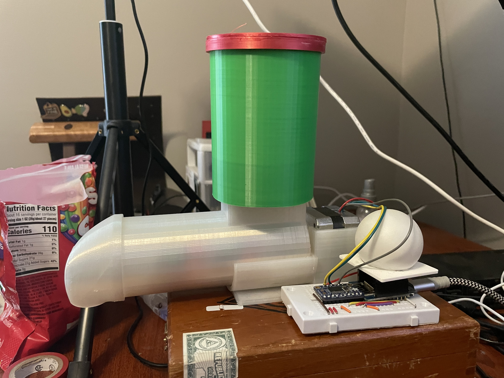
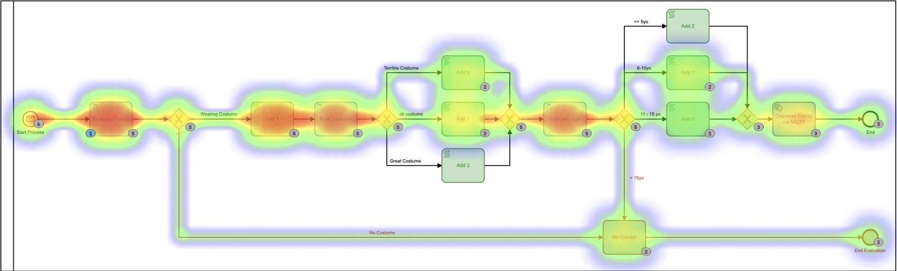
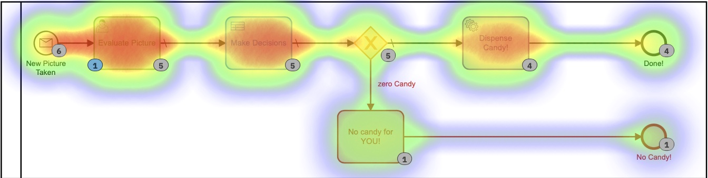
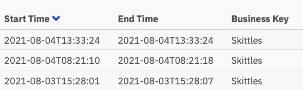
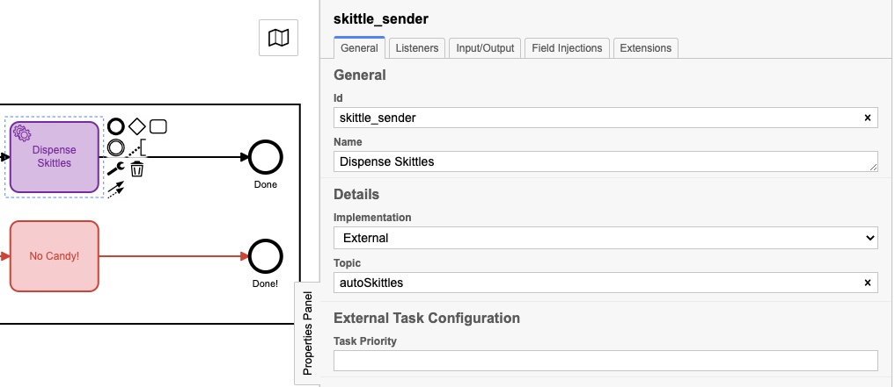

## Some Background

When I first started at Camunda back in October, 2020 (what was 2020 anyway?) the **very** first thing I was asked to do was come up with something I could do for a special [Halloween blog post](https://camunda.com/blog/2020/10/camunda-halloween?ref=davidgsiot). It being COVID-times, I of course built a Camunda and IoT integration to evaluate costumes and deliver candy.

I am sort of well-known for doing weird, pointless IoT projects like [this one](https://camunda.com/blog/2020/12/letters-to-santa-automating-joy-to-the-world-at-scale?ref=davidgsiot) and [this one](/posts/categoryiot/this-whole-thing-stinks), and [this one](/posts/category/database/snack-tracking-with-the-new-influxdb-arduino-library/). You get the idea.

## Time for an update

A few weeks ago I was tasked with giving a demo of the entire Camunda stack to a large bank/potential customer. In thinking more about it, I decided that there was no way I wnated to do a 'traditional' demo of account creation, on-boarding, or anything like that.

Let's face it, we are all humans, and when we see someone overly-simplify something we know deeply our first reaction is "well that's not how *we* do it", or "it's really a lot more complicated than that" and we stop listening, or we miss the possibilities.

I decided (with buy-in, of course!) that I wanted to show them something outside their understanding and comfort zone, but something they could immediately grasp and see possibilities in. Also, it's way easier to re-purpose older stuff than it is to try to write entirely fresh content on short notice.

*The Halloween Candy Dispenser has entered the chat*



## The Hardware

Oddly enough, I still had all the original hardware from the [Halloween Project](https://camunda.com/blog/2020/10/camunda-halloween?ref=davidgsiot) still just sitting on a shelf in my office. I *knew* it would come in handy someday!!

If you want to build it, literally everything you need is in the [Camunda Community Hub](https://github.com/camunda-community-hub/CamundaHalloween), or on the original [blog post](https://camunda.com/blog/2020/10/camunda-halloween?ref=davidgsiot).

I made no changes to the hardware whatsoever. I literally pulled it down off the shelf, plugged it all in, and it just worked as it did back in October.

What I *did* change were the Camunda BPM models that I would be using. To be fair, I didn't actually *change* the model I had been using, I just built 2 **new** models, but we'll get to that.


## The First Model

Just as a refresher, this was the first model I used:


Ok fine, so I prettied it up using colors since [Camunda](https://camunda.com?ref=davidgsiot) added that in the latest version of the [Modeler](https://camunda.com/products/camunda-platform/modeler?ref=davidgsiot).


There are a lot of problems with this model. A **lot**. For starters, it's overly complex and involves a lot of human interaction in order to get to the end result of handing out candy. On  average, it takes about 2-3 minutes for the entire process to run, and that's if someone (me) is sitting there doing nothing but loading the forms and 'evaluating' pictures.

It also used javascript inside the model, which is generally not a [best practice](https://camunda.com/best-practices/_/?ref=davidgsiot)

I also managed to figure out how to display the picture on the form, something I didn't know how to do back then:


From the Heatmap in Cockpit, you can see that almost all the time of the process running is taken up by human tasks.



You can also see that the process, from start to finish, takes a few minutes. And as much fun as evaluating pictures is, it probably isn't the most useful or best use of my time.


## The Second Model

That model could easily be improved upon with the simple act of combining all those separate human tasks into one form. Rather than having 3, one should make it much more efficient. So I built a new model to do that:


I also added in a decision table (DMN) in order to make the calculations of how many skittles to give based on the ratings on the form:


Again, I over-engineered the DMN table by making it *two* tables, but you get the idea. But if we go back to the heatmap view, it is still clear that most of the time is taken up by the human interaction.



We humans are just *slow* at things! Looking at the execution times, we have indeed cut the time roughly in half, but still, I'd be sitting here all day just clicking on this form (which I made extra pretty this time)


And those execution times:


Now just over a minute per task, but someone still has to perform those tasks.

## The Third Model

This is where things got more interesting. I wondered if I could cut the human decision-making out of the process altogether! (**Note:** No humans lost their jobs because of this change!) What if I could automate the entire thing?

*Google Vision AI has entered the chat*

It turns out I **could** do that, as long as I was willing to change the picture-evaluation criteria. (Given the time and the inclination, I could also have trained my own AI model to evaluate on the original criteria, but this seemed easier.)

Turns out with very little code, I could automatically submit the picture to Google's Vision AI engine and get back some information I could use to hand out skittles! By submitting a picture, I could get the following back really quickly:
- Faces:
  - Face 0
    - Anger: VERY_UNLIKELY
    - Joy: LIKELY
    - Surprise: VERY_UNLIKELY
    - Sorrow: VERY_UNLIKELY
I could work with that! Those evaluations also come back as a numeric value, so I came up with a new BPMN model for this version:


This one also uses a series of DMN tables to decide on how much candy you will get:


Each of those smaller DMN tables implements my ultra-secret, proprietary algorithm for calculating skittle-amounts. In looking at the heatmap for this process it may not look all *that* different, as most of the time was spent in deciding how many skittles to dispense. It's important to note that absolutely *none* of this time was spent by me, personally. I didn't have to do anything.


Based on this heat map, it does look like a lot of time was spent on the decision task, but if we drill down into the execution times in the history, we see a very, *very* different story:



Those times are between 0 and 8 seconds. Down from 2+ minutes in the first version. That is a significant savings!

## The Code

I always like to include code in my posts so that you can see *how* I did what I did. And so that you can do it too.

The code on the Devices (the IoT Camera and the IoT Candy Dispenser) is exactly the same as in the [first version](https://github.com/camunda-community-hub/CamundaHalloween) so I'm not going to rehash it here. All the schematics, code, etc. for the hardware devices is in that Github Repo.

What I will cover here is the server-side code I wrote. And as usual, I wrote it all in Go.

### Accepting pictures

The ESP32Camera board reacts to a button-press and takes a picture. It then needs to send that picture somewhere, so I wrote a simple webserver to handle the incoming pictures and store them on the server:

```go
// Start up the web services over TLS
	http.HandleFunc("/photo", photo)
	http.Handle("/test/", http.StripPrefix("/test", fs))      // set router
	err := http.ListenAndServeTLS(":9090", "server-cert", "server-key", nil) // set listen port
	if err != nil {
		log.Fatal("ListenAndServeTLS: ", err)
	}
```
This starts a webserver on SSL Port 9090 that will accept 2 URLs: `https://server.com:9090/photo` and `https://server.com:9090/test/`. The `/photo` URI is where the ESP32Camera sends pictures.

Here's what that URI handler looks like:

```go
// the web server process that handles incoming requests
func photo(w http.ResponseWriter, r *http.Request) {
	if r.Method == "GET" { // GET outta here! :-)
		log.Println("GET Method Not Supported")
		http.Error(w, "GET Method not supported", 400)
	} else {
		r.ParseMultipartForm(32 << 2) // allocate enough memory for the incoming picture.
		file, handler, err := r.FormFile("uploadfile")
		if err != nil {
			fmt.Println("Format Error!", err)
			switch e := err.(type) {
			case Error:
				// We can retrieve the status here and write out a specific
				// HTTP status code.
				log.Printf("HTTP %d - %s", e.Status(), e)
				http.Error(w, e.Error(), e.Status())
			default:
				// Any error types we don't specifically look out for default
				// to serving a HTTP 500
				http.Error(w, http.StatusText(http.StatusInternalServerError),
					http.StatusInternalServerError)
			}
			return
		}
		defer file.Close()
		f, err := os.OpenFile("./test"+handler.Filename, os.O_WRONLY|os.O_CREATE, 0666)
		if err != nil {
			log.Println(err)
			http.Error(w, "Could not Write new file", 500)
			return
		}
		defer f.Close()
		io.Copy(f, file)
		var emotions = Emotions{}
		w.WriteHeader(200)
		if runners.VisionAI {
			emotions = doAIOnPic(handler.Filename)
		}
		sendPic(f.Name(), emotions)
	}
}
```
So there's a lot going on there. Let me explain. First off, we don't accept `GET` requests. I reject them out of hand. Next, I need to allocate enough memory to store the incoming file, and then read that file in from the multi-part form that was sent. Next, I open a local file and save the picture there. The last thing I do is ... well, that depends.

You see, since I now had 3 models, I added feature flags so I could decide what to do with the incoming picture. Or, more accurately, how to route it.

```go
type RunFlags struct {
	ThreeForms bool
	NewForm    bool
	VisionAI   bool
}

var runners RunFlags
...
func main() {
	fmt.Println("Starting up ... ")
	origPointer := flag.Bool("orig", false, "Original Demo")
	newPointer := flag.Bool("new", false, "New Form")
	aiPointer := flag.Bool("ai", false, "Vision AI")
	flag.Parse()
	runners = RunFlags{}
	runners.ThreeForms = *origPointer
	runners.NewForm = *newPointer
	runners.VisionAI = *aiPointer
...
}
```
So I can decide which model I want to use by adding `--orig=true` to the command-line. If I'm not submitting to the Vision AI model, I don't bother analyzing the picture, since I get charged for each picture submitted.

What happens next? Well, I submit all the data to the Camunda Platform Engine, of course!

```go
// sendPic sends the picture to the Camunda Process, starting the entire process
func sendPic(s string, e Emotions) {
	// fill out the options
	opts := camundaclientgo.ClientOptions{}
	opts.EndpointUrl = "https://camunda-platform:8443/engine-rest" // yours will be different
	opts.Timeout = time.Second * 20
	// file comes in as './picture...' so remove that bit
	newPath := prefix + strings.Trim(s, ".")
	// all the variables we need
	var variables = map[string]camundaclientgo.Variable{}
	if runners.ThreeForms || runners.NewForm {
		variables["newCostume"] = camundaclientgo.Variable{
			Value: newPath,
			Type:  "string",
		}
		variables["isCostume"] = camundaclientgo.Variable{
			Value: true,
			Type:  "boolean",
		}
		variables["candyPieces"] = camundaclientgo.Variable{
			Value: 0,
			Type:  "long",
		}
	}
	if runners.VisionAI {
		variables["JoyAmount"] = camundaclientgo.Variable{
			Value: e.JoyNumber,
			Type:  "long",
		}
		variables["AngerAmount"] = camundaclientgo.Variable{
			Value: e.AngerNumber,
			Type:  "long",
		}
		variables["SurpriseAmount"] = camundaclientgo.Variable{
			Value: e.SurpriseNumber,
			Type:  "long",
		}
		variables["SorrowAmount"] = camundaclientgo.Variable{
			Value: e.SorrowNumber,
			Type:  "long",
		}
		variables["isPicture"] = camundaclientgo.Variable{
			Value: e.IsPicture,
			Type:  "boolean",
		}
	}
	client := camundaclientgo.NewClient(opts)
	reqMessage := camundaclientgo.ReqMessage{}
	reqMessage.BusinessKey = "Skittles"
	reqMessage.ProcessVariables = &variables
	if runners.ThreeForms {
		reqMessage.MessageName = "send_skittles"
		err := client.Message.SendMessage(&reqMessage)
		if err != nil {
			log.Printf("Error starting process: %s\n", err)
			return
		}
	}
	if runners.NewForm {
		reqMessage.MessageName = "send_more_skittles"
		err := client.Message.SendMessage(&reqMessage)
		if err != nil {
			log.Printf("Error starting process: %s\n", err)
			return
		}
	}
	if runners.VisionAI {
		reqMessage.MessageName = "auto_skittles"
		err := client.Message.SendMessage(&reqMessage)
		if err != nil {
			log.Printf("Error starting process: %s\n", err)
			return
		}
	}
}
```
And that submits the data required to the Camunda Engine for processing.

### Dispensing Skittles

But wait, how do we get Skittles out?! Since I wrote the server in Go, I added some process handlers to the server to 'listen' for messages to send skittles. You may have noticed that each of my process models ended with one of these:


They may have had slightly different names, but they each had a Properties Panel filled out like this:



The actual `Topic` is different for each one, and we'll see why in this next bit of code:

```Go
client := camundaclientgo.NewClient(camundaclientgo.ClientOptions{EndpointUrl: "https://camunda-platform:8443/engine-rest",
		Timeout: time.Second * 20,
	})
	logger := func(err error) {
		fmt.Println(err.Error())
	}
	asyncResponseTimeout := 5000
	// The old one, 3 forms!
	if runners.ThreeForms {
		proc := processor.NewProcessor(client, &processor.ProcessorOptions{
			WorkerId:                  "Skittles",
			LockDuration:              time.Second * 20,
			MaxTasks:                  10,
			MaxParallelTaskPerHandler: 100,
			LongPollingTimeout:        20 * time.Second,
			AsyncResponseTimeout:      &asyncResponseTimeout,
		}, logger)
		fmt.Println("Original Processor started ... ")
		proc.AddHandler( // Dispense Skittles!
			&[]camundaclientgo.QueryFetchAndLockTopic{
				{TopicName: "send_skittles"},
			},
			func(ctx *processor.Context) error {
				return dispenseSkittles(ctx.Task.Variables, ctx)
			},
		)
		fmt.Println("Original Handler registered ... ")
	}
	if runners.NewForm {
		// Newer and better. Only 1 form!
		proc2 := processor.NewProcessor(client, &processor.ProcessorOptions{
			WorkerId:                  "Skittles2",
			LockDuration:              time.Second * 20,
			MaxTasks:                  10,
			MaxParallelTaskPerHandler: 100,
			LongPollingTimeout:        20 * time.Second,
			AsyncResponseTimeout:      &asyncResponseTimeout,
		}, logger)
		fmt.Println("New Form Processor started ... ")
		proc2.AddHandler( // Dispense Skittles!
			&[]camundaclientgo.QueryFetchAndLockTopic{
				{TopicName: "more_skittles"},
			},
			func(ctx *processor.Context) error {
				return dispenseSkittles(ctx.Task.Variables, ctx)
			},
		)
		fmt.Println("New Form Handler registered ... ")
	}
	if runners.VisionAI {
		// Best yet, fully automated!
		proc3 := processor.NewProcessor(client, &processor.ProcessorOptions{
			WorkerId:                  "AutoSkittles",
			LockDuration:              time.Second * 20,
			MaxTasks:                  10,
			MaxParallelTaskPerHandler: 100,
			LongPollingTimeout:        20 * time.Second,
			AsyncResponseTimeout:      &asyncResponseTimeout,
		}, logger)
		fmt.Println("Vision AI Processor started ...")
		proc3.AddHandler( // Dispense Skittles!
			&[]camundaclientgo.QueryFetchAndLockTopic{
				{TopicName: "autoSkittles"},
			},
			func(ctx *processor.Context) error {
				return dispenseSkittles(ctx.Task.Variables, ctx)
			},
		)
		fmt.Println("Vision AI Handler registered ... ")
	}
```

I create a new Processor for the model I'm using, and then I add a Handler to that Processor that listens for a specific topic. The Camunda Engine puts messages on that topic, and my handler picks them up, handles them, then marks them completed back to the process engine. If you look closely, you'll notice that each one of those handlers calls the same function, `dispenseSkittles` with all of the task variables from the engine.

Here's how I do that bit:

```Go
// process requests to dispense Skittles!
func dispenseSkittles(newVars map[string]camundaclientgo.Variable, contx *processor.Context) error {
	// all the task variables
	varb := contx.Task.Variables
	// the MQTT broker address
	opts := mqtt.NewClientOptions().AddBroker("tcp://secure-mqtt-broker:8883")
	client := mqtt.NewClient(opts)
	if token := client.Connect(); token.Wait() && token.Error() != nil {
		log.Fatal(token.Error())
	}
	cp := fmt.Sprintf("%v", varb["candyPieces"].Value)
	dispense := fmt.Sprintf("{candy=%s }", cp)
	sendtoken := client.Publish(TOPIC, 0, false, dispense)
	if sendtoken.Error() != nil {
		log.Fatal(sendtoken.Error())
	}
	sendtoken.Wait()
	vars := make(map[string]camundaclientgo.Variable)
	vars["OK"] = camundaclientgo.Variable{Value: "true", Type: "boolean"}
	vars["status"] = camundaclientgo.Variable{Value: "true", Type: "boolean"}
	err := contx.Complete(processor.QueryComplete{
		Variables: &vars,
	})
	if err != nil {
		errTxt := contx.Task.ErrorDetails
		retries := contx.Task.Retries
		retryTimeout := 10
		return contx.HandleFailure(processor.QueryHandleFailure{
			ErrorMessage: &errTxt,
			Retries:      &retries,
			RetryTimeout: &retryTimeout,
		})
	}
	return nil
}
```
I'm using MQTT to send the messages to the actual physical Skittles dispenser. I create an MQTT client, connect to the (TLS-secure!) MQTT broker, and then send the message of how many skittles to dispense.

The *last* thing to do is tell the process engine that I've completed the task so it can be marked as completed.

And that's it! I know it seems like a lot, but it's implementing a straghtforward set of steps:
1) Receive a message
2) Process the message
3) Submit the data to the platform engine
4) Listen for tasks
5) Complete tasks when they become available
6) Mark tasks as complete
One thing I'd also point out is that there is no difference between the data submitted for Process Model 1 vs Process Model 2. That may not seem like much but it's a significant point.

Since the data submitted didn't change, and how the Skittles were dispensed didn't change, that means that I was able to change the Model, deploy the new model, and continue running the process **without changing any code** on the server process. (I did, but that was to make a point.)

Since creating and editing Process Models doesn't really involve writing code, process owners can make changes to the process without having to write code. They can continue to use the same backend code but leverage it, and make it more efficient, just by changing the *model*.

## Conclusions

I hope you enjoyed this little exercise. It was super fun to be able to re-use the original candy dispenser and show how changing the process model (and a little bit of code) can make a process much more efficient.

## Bonus! Google Vision AI Code

Since you've read this far, I thought I'd give you the code for submitting pictures to, and receiving results from, Google Vision AI.

Things you'll need:
1) A Google Cloud account
2) Vision AI API enabled
3) A service-account credentials file
You can get all of these things through your Google Cloud Console.

Once you have all that, here's the code for doing it:

```go
type interestingAnnotations struct {
	DetectionConfidence    float64 `json:"detection_confidence"`
	LandmarkingConfidence  float64 `json:"landmarking_confidence"`
	JoyLikelihood          int     `json:"joy_likelihood"`
	SorrowLikelihood       int     `json:"sorrow_likelihood"`
	AngerLikelihood        int     `json:"anger_likelihood"`
	SurpriseLikelihood     int     `json:"surprise_likelihood"`
	UnderExposedLikelihood int     `json:"under_exposed_likelihood"`
	BlurredLikelihood      int     `json:"blurred_likelihood"`
	HeadwearLikelihood     int     `json:"headwear_likelihood"`
}

type Emotions struct {
	JoyNumber      int
	AngerNumber    int
	SurpriseNumber int
	SorrowNumber   int
	IsPicture      bool
}
...
func doAIOnPic(s string) Emotions { // (string, error) {
	absPath := fmt.Sprintf("%s%s", serverPath, strings.Trim(s, "."))
	ctx := context.Background()
	options := opts.WithCredentialsFile("credentials-file.json")
	client, err := vision.NewImageAnnotatorClient(ctx, options)
	if err != nil {
		log.Fatalf("Failed to create client: %v", err)
	}
	defer client.Close()
	file, err := os.Open(absPath)
	if err != nil {
		log.Fatalf("Failed to read file: %v", err)
	}
	defer file.Close()
	image, err := vision.NewImageFromReader(file)
	if err != nil {
		log.Fatalf("Failed to create image: %v", err)
	}
	annotations, err := client.DetectFaces(ctx, image, nil, 10)
	if err != nil {
		log.Fatalf("Failed to detect faces: %v", err)
	}
	emotions := Emotions{}
	// no people in this photo!
	if len(annotations) == 0 {
		fmt.Println("No faces found.")
		emotions.IsPicture = false
	} else {
		emotions.IsPicture = true
		fmt.Println("Faces:")
		for i, annotation := range annotations {
			goodStuff := interestingAnnotations{}
			data, err := json.Marshal(annotation)
			if err != nil {
				log.Fatal(err)
			}
			err = json.Unmarshal(data, &goodStuff)
			if err != nil {
				log.Fatal(err)
			}
			fmt.Println("  Face", i)
			emotions.AngerNumber = goodStuff.AngerLikelihood
			fmt.Println("    Anger:", annotation.AngerLikelihood)
			emotions.JoyNumber = goodStuff.JoyLikelihood
			fmt.Println("    Joy:", annotation.JoyLikelihood)
			emotions.SurpriseNumber = goodStuff.SurpriseLikelihood
			fmt.Println("    Surprise:", annotation.SurpriseLikelihood)
			emotions.SorrowNumber = goodStuff.SorrowLikelihood
			fmt.Println("    Sorrow:", annotation.SorrowLikelihood)
		}
	}
	return emotions
}
```
I read back the file saved previously (and yes, I could have just used the in-memory version, but I decided not to) and send it off to Google. I then wait for the reply, and parse the reply. If there isn't a face detected, well, NO SKITTLES FOR YOU!

After that, just save the values into a struct, and return that to the calling function. Those values can then be submitted to the process engine. You can always remove the `fmt.Println`s if you don't want to see them. I left them in here because it was interesting to me to see the values returned. 