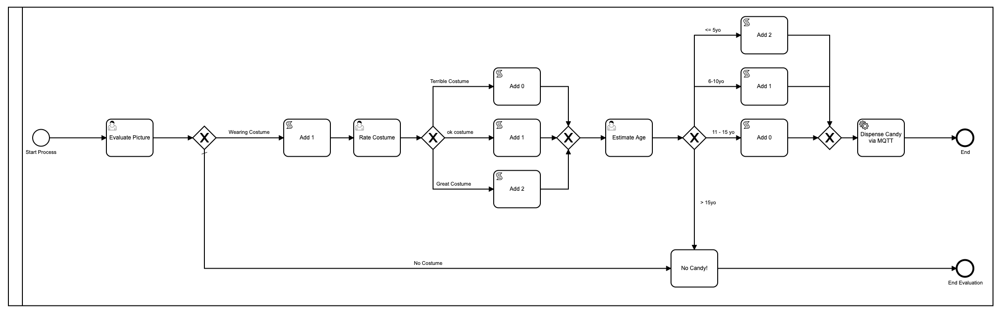
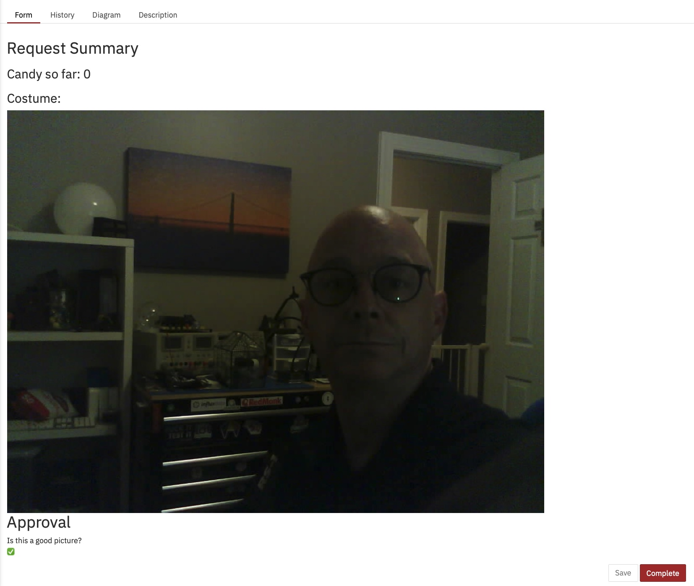
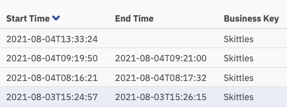

## Algunos antecedentes

Cuando comencé en Camunda en octubre de 2020 (¿qué fue 2020 de todos modos?), Lo **muy** primero que me pidieron que hiciera fue pensar en algo que pudiera hacer para una [publicación de blog de Halloween] especial (https: //camunda.com/blog/2020/10/camunda-halloween?ref=davidgsiot). Siendo COVID-times, por supuesto construí una integración de Camunda e IoT para evaluar disfraces y entregar dulces.

Soy bastante conocido por hacer proyectos de IoT extraños e inútiles como [este] (https://camunda.com/blog/2020/12/letters-to-santa-automating-joy-to-the-world- at-scale? ref = davidgsiot) y [este](/posts/categoryiot/this-whole-thing-stinks), y [este](/posts/category/database/snack-tracking-with-the-new-influxdb-arduino-library/). Entiendes la idea.

## Hora de una actualización

Hace unas semanas me encargaron dar una demostración de todo el conjunto de Camunda a un gran banco / cliente potencial. Al pensar más en ello, decidí que no había forma de que quisiera hacer una demostración 'tradicional' de creación de cuentas, incorporación o algo por el estilo.

Seamos realistas, todos somos humanos, y cuando vemos a alguien simplificar demasiado algo que conocemos profundamente, nuestra primera reacción es "bueno, no es así como*nosotros* lo hacemos", o "es mucho más complicado que eso" y deja de escuchar, o perdemos las posibilidades.

Decidí (¡con la aceptación, por supuesto!) Que quería mostrarles algo fuera de su zona de comprensión y comodidad, pero algo que pudieran comprender y ver posibilidades de inmediato. Además, es mucho más fácil reutilizar cosas más antiguas que eso. es intentar escribir contenido completamente nuevo en poco tiempo.

* El Dispensador de Dulces de Halloween ha entrado en el chat *


## El hardware

Por extraño que parezca, todavía tenía todo el hardware original del [Proyecto Halloween] (https://camunda.com/blog/2020/10/camunda-halloween?ref=davidgsiot) todavía en un estante de mi oficina. ¡Sabía * que sería útil algún día!

Si quieres construirlo, literalmente todo lo que necesitas está en el [Camunda Community Hub](https://github.com/camunda-community-hub/CamundaHalloween), o en la [publicación del blog] original (https: // camunda.com/blog/2020/10/camunda-halloween?ref=davidgsiot).

No realicé ningún cambio en el hardware. Literalmente lo bajé del estante, lo enchufé todo y funcionó como lo hizo en octubre.

Lo que*hice* cambié fueron los modelos Camunda BPM que estaría usando. Para ser justos, en realidad no * cambié * el modelo que había estado usando, solo construí 2 ** modelos nuevos **, pero llegaremos a eso.


## El primer modelo

Como recordatorio, este fue el primer modelo que utilicé:



Ok, bien, lo embellecí usando colores desde que [Camunda] (https://camunda.com?ref=davidgsiot) agregó eso en la última versión del [Modeler] (https://camunda.com/products/camunda -plataforma / modelador? ref = davidgsiot).


Hay muchos problemas con este modelo. Mucho**. Para empezar, es demasiado complejo e implica mucha interacción humana para llegar al resultado final de repartir dulces. En promedio, toma alrededor de 2-3 minutos para que se ejecute todo el proceso, y eso es si alguien (yo) está sentado allí sin hacer nada más que cargar los formularios y 'evaluar' las imágenes.

También usó javascript dentro del modelo, que generalmente no es una [práctica recomendada] (https://camunda.com/best-practices/_/?ref=davidgsiot)

También logré descubrir cómo mostrar la imagen en el formulario, algo que no sabía cómo hacer en ese entonces:



Desde el mapa de calor en Cockpit, puede ver que casi todo el tiempo del proceso en ejecución lo ocupan las tareas humanas.


También puede ver que el proceso, de principio a fin, tarda unos minutos. Y por muy divertido que sea evaluar imágenes, probablemente no sea la forma más útil o la mejor manera de utilizar mi tiempo.


## El segundo modelo

Ese modelo podría mejorarse fácilmente con el simple acto de combinar todas esas tareas humanas separadas en una forma. En lugar de tener 3, uno debería hacerlo mucho más eficiente. Entonces construí un nuevo modelo para hacer eso:


También agregué una tabla de decisiones (DMN) para hacer los cálculos de cuántos bolos dar en función de las calificaciones en el formulario:


Una vez más, diseñé en exceso la tabla DMN haciéndola*dos* tablas, pero entiendes la idea. Pero si volvemos a la vista del mapa de calor, queda claro que la mayor parte del tiempo lo ocupa la interacción humana.


¡Los humanos somos*lentos* en las cosas! En cuanto a los tiempos de ejecución, de hecho hemos reducido el tiempo aproximadamente a la mitad, pero aún así, estaría sentado aquí todo el día simplemente haciendo clic en este formulario (que hice más bonito esta vez)


Y esos tiempos de ejecución:



Ahora poco más de un minuto por tarea, pero alguien todavía tiene que realizar esas tareas.

## El tercer modelo

Aquí es donde las cosas se pusieron más interesantes. ¡Me preguntaba si podría eliminar por completo la toma de decisiones humanas del proceso! (** Nota: ** ¡Ningún humano perdió su trabajo debido a este cambio!) ¿Qué pasaría si pudiera automatizar todo?

* Google Vision AI ha entrado en el chat *

Resulta que ** podría ** hacer eso, siempre que estuviera dispuesto a cambiar los criterios de evaluación de imágenes. (Dado el tiempo y la inclinación, también podría haber entrenado mi propio modelo de IA para evaluar los criterios originales, pero esto parecía más fácil).

Resulta que con muy poco código, podría enviar automáticamente la imagen al motor Vision AI de Google y recuperar información que podría usar para repartir bolos. Al enviar una imagen, pude recuperar lo siguiente muy rápidamente:
- Caras:
- Cara 0
- Ira: MUY_UNLIKELY
- Alegría: PROBABLE
- Sorpresa: MUY_UNLIKELY
- Dolor: MUY_UNLIKELY
¡Podría trabajar con eso! Esas evaluaciones también regresan como un valor numérico, por lo que se me ocurrió un nuevo modelo BPMN para esta versión:


Este también usa una serie de tablas DMN para decidir cuántos dulces obtendrás:


Cada una de esas tablas DMN más pequeñas implementa mi algoritmo patentado ultrasecreto para calcular cantidades de bolos. Al mirar el mapa de calor para este proceso, es posible que no se vea tan*tan* diferente, ya que la mayor parte del tiempo se dedicó a decidir cuántos bolos dispensar. Es importante notar que absolutamente*nada* de este tiempo lo pasé personalmente. No tuve que hacer nada.


Según este mapa de calor, parece que se dedicó mucho tiempo a la tarea de decisión, pero si profundizamos en los tiempos de ejecución en el historial, vemos una historia muy,*muy* diferente:


Esos tiempos están entre 0 y 8 segundos. Menos de 2+ minutos en la primera versión. ¡Eso es un ahorro significativo!

## El código

Siempre me gusta incluir código en mis publicaciones para que puedas ver * cómo * hice lo que hice. Y para que tú también puedas hacerlo.

El código de los dispositivos (la cámara de IoT y el dispensador de caramelos de IoT) es exactamente el mismo que en la [primera versión](https://github.com/camunda-community-hub/CamundaHalloween), así que no voy a refrito aquí. Todos los esquemas, código, etc. de los dispositivos de hardware están en ese Github Repo.

Lo que cubriré aquí es el código del lado del servidor que escribí. Y como de costumbre, lo escribí todo en Go.

### Aceptación de fotografías

La placa ESP32Camera reacciona al presionar un botón y toma una foto. Luego debe enviar esa imagen a algún lugar, así que escribí un servidor web simple para manejar las imágenes entrantes y almacenarlas en el servidor:

```go
// Start up the web services over TLS
	http.HandleFunc("/photo", photo)
	http.Handle("/test/", http.StripPrefix("/test", fs))      // set router
	err := http.ListenAndServeTLS(":9090", "server-cert", "server-key", nil) // set listen port
	if err != nil {
		log.Fatal("ListenAndServeTLS: ", err)
	}
```
Esto inicia un servidor web en el puerto SSL 9090 que aceptará 2 URL: `https: //server.com: 9090 / photo` y` https: //server.com: 9090 / test / `. El URI `/ photo` es donde la ESP32Camera envía las imágenes.

Así es como se ve ese controlador de URI:

```go
// the web server process that handles incoming requests
func photo(w http.ResponseWriter, r *http.Request) {
	if r.Method == "GET" { // GET outta here! :-)
		log.Println("GET Method Not Supported")
		http.Error(w, "GET Method not supported", 400)
	} else {
		r.ParseMultipartForm(32 << 2) // allocate enough memory for the incoming picture.
		file, handler, err := r.FormFile("uploadfile")
		if err != nil {
			fmt.Println("Format Error!", err)
			switch e := err.(type) {
			case Error:
				// We can retrieve the status here and write out a specific
				// HTTP status code.
				log.Printf("HTTP %d - %s", e.Status(), e)
				http.Error(w, e.Error(), e.Status())
			default:
				// Any error types we don't specifically look out for default
				// to serving a HTTP 500
				http.Error(w, http.StatusText(http.StatusInternalServerError),
					http.StatusInternalServerError)
			}
			return
		}
		defer file.Close()
		f, err := os.OpenFile("./test"+handler.Filename, os.O_WRONLY|os.O_CREATE, 0666)
		if err != nil {
			log.Println(err)
			http.Error(w, "Could not Write new file", 500)
			return
		}
		defer f.Close()
		io.Copy(f, file)
		var emotions = Emotions{}
		w.WriteHeader(200)
		if runners.VisionAI {
			emotions = doAIOnPic(handler.Filename)
		}
		sendPic(f.Name(), emotions)
	}
}
```
Así que están sucediendo muchas cosas allí. Dejame explicar. En primer lugar, no aceptamos solicitudes "GET". Los rechazo de plano. A continuación, necesito asignar suficiente memoria para almacenar el archivo entrante y luego leer ese archivo desde el formulario de varias partes que se envió. A continuación, abro un archivo local y guardo la imagen allí. Lo último que hago es ... bueno, eso depende.

Verá, dado que ahora tenía 3 modelos, agregué banderas de funciones para poder decidir qué hacer con la imagen entrante. O, más exactamente, cómo enrutarlo.

```go
type RunFlags struct {
	ThreeForms bool
	NewForm    bool
	VisionAI   bool
}

var runners RunFlags
...
func main() {
	fmt.Println("Starting up ... ")
	origPointer := flag.Bool("orig", false, "Original Demo")
	newPointer := flag.Bool("new", false, "New Form")
	aiPointer := flag.Bool("ai", false, "Vision AI")
	flag.Parse()
	runners = RunFlags{}
	runners.ThreeForms = *origPointer
	runners.NewForm = *newPointer
	runners.VisionAI = *aiPointer
...
}
```
Entonces puedo decidir qué modelo quiero usar agregando `--orig = true` a la línea de comandos. Si no me envío al modelo Vision AI, no me molesto en analizar la imagen, ya que me cobran por cada imagen enviada.

¿Qué pasa después? Bueno, envío todos los datos a Camunda Platform Engine, ¡por supuesto!

```go
// sendPic sends the picture to the Camunda Process, starting the entire process
func sendPic(s string, e Emotions) {
	// fill out the options
	opts := camundaclientgo.ClientOptions{}
	opts.EndpointUrl = "https://camunda-platform:8443/engine-rest" // yours will be different
	opts.Timeout = time.Second * 20
	// file comes in as './picture...' so remove that bit
	newPath := prefix + strings.Trim(s, ".")
	// all the variables we need
	var variables = map[string]camundaclientgo.Variable{}
	if runners.ThreeForms || runners.NewForm {
		variables["newCostume"] = camundaclientgo.Variable{
			Value: newPath,
			Type:  "string",
		}
		variables["isCostume"] = camundaclientgo.Variable{
			Value: true,
			Type:  "boolean",
		}
		variables["candyPieces"] = camundaclientgo.Variable{
			Value: 0,
			Type:  "long",
		}
	}
	if runners.VisionAI {
		variables["JoyAmount"] = camundaclientgo.Variable{
			Value: e.JoyNumber,
			Type:  "long",
		}
		variables["AngerAmount"] = camundaclientgo.Variable{
			Value: e.AngerNumber,
			Type:  "long",
		}
		variables["SurpriseAmount"] = camundaclientgo.Variable{
			Value: e.SurpriseNumber,
			Type:  "long",
		}
		variables["SorrowAmount"] = camundaclientgo.Variable{
			Value: e.SorrowNumber,
			Type:  "long",
		}
		variables["isPicture"] = camundaclientgo.Variable{
			Value: e.IsPicture,
			Type:  "boolean",
		}
	}
	client := camundaclientgo.NewClient(opts)
	reqMessage := camundaclientgo.ReqMessage{}
	reqMessage.BusinessKey = "Skittles"
	reqMessage.ProcessVariables = &variables
	if runners.ThreeForms {
		reqMessage.MessageName = "send_skittles"
		err := client.Message.SendMessage(&reqMessage)
		if err != nil {
			log.Printf("Error starting process: %s\n", err)
			return
		}
	}
	if runners.NewForm {
		reqMessage.MessageName = "send_more_skittles"
		err := client.Message.SendMessage(&reqMessage)
		if err != nil {
			log.Printf("Error starting process: %s\n", err)
			return
		}
	}
	if runners.VisionAI {
		reqMessage.MessageName = "auto_skittles"
		err := client.Message.SendMessage(&reqMessage)
		if err != nil {
			log.Printf("Error starting process: %s\n", err)
			return
		}
	}
}
```
Y eso envía los datos requeridos a Camunda Engine para su procesamiento.

### Bolos dispensadores

Pero espera, ¿cómo sacamos a Skittles? Desde que escribí el servidor en Go, agregué algunos controladores de proceso al servidor para 'escuchar' mensajes para enviar bolos. Es posible que haya notado que cada uno de mis modelos de proceso terminó con uno de estos:


Es posible que tuvieran nombres ligeramente diferentes, pero cada uno tenía un Panel de propiedades llenado así:


El "tema" real es diferente para cada uno, y veremos por qué en el siguiente fragmento de código:

```Go
client := camundaclientgo.NewClient(camundaclientgo.ClientOptions{EndpointUrl: "https://camunda-platform:8443/engine-rest",
		Timeout: time.Second * 20,
	})
	logger := func(err error) {
		fmt.Println(err.Error())
	}
	asyncResponseTimeout := 5000
	// The old one, 3 forms!
	if runners.ThreeForms {
		proc := processor.NewProcessor(client, &processor.ProcessorOptions{
			WorkerId:                  "Skittles",
			LockDuration:              time.Second * 20,
			MaxTasks:                  10,
			MaxParallelTaskPerHandler: 100,
			LongPollingTimeout:        20 * time.Second,
			AsyncResponseTimeout:      &asyncResponseTimeout,
		}, logger)
		fmt.Println("Original Processor started ... ")
		proc.AddHandler( // Dispense Skittles!
			&[]camundaclientgo.QueryFetchAndLockTopic{
				{TopicName: "send_skittles"},
			},
			func(ctx *processor.Context) error {
				return dispenseSkittles(ctx.Task.Variables, ctx)
			},
		)
		fmt.Println("Original Handler registered ... ")
	}
	if runners.NewForm {
		// Newer and better. Only 1 form!
		proc2 := processor.NewProcessor(client, &processor.ProcessorOptions{
			WorkerId:                  "Skittles2",
			LockDuration:              time.Second * 20,
			MaxTasks:                  10,
			MaxParallelTaskPerHandler: 100,
			LongPollingTimeout:        20 * time.Second,
			AsyncResponseTimeout:      &asyncResponseTimeout,
		}, logger)
		fmt.Println("New Form Processor started ... ")
		proc2.AddHandler( // Dispense Skittles!
			&[]camundaclientgo.QueryFetchAndLockTopic{
				{TopicName: "more_skittles"},
			},
			func(ctx *processor.Context) error {
				return dispenseSkittles(ctx.Task.Variables, ctx)
			},
		)
		fmt.Println("New Form Handler registered ... ")
	}
	if runners.VisionAI {
		// Best yet, fully automated!
		proc3 := processor.NewProcessor(client, &processor.ProcessorOptions{
			WorkerId:                  "AutoSkittles",
			LockDuration:              time.Second * 20,
			MaxTasks:                  10,
			MaxParallelTaskPerHandler: 100,
			LongPollingTimeout:        20 * time.Second,
			AsyncResponseTimeout:      &asyncResponseTimeout,
		}, logger)
		fmt.Println("Vision AI Processor started ...")
		proc3.AddHandler( // Dispense Skittles!
			&[]camundaclientgo.QueryFetchAndLockTopic{
				{TopicName: "autoSkittles"},
			},
			func(ctx *processor.Context) error {
				return dispenseSkittles(ctx.Task.Variables, ctx)
			},
		)
		fmt.Println("Vision AI Handler registered ... ")
	}
```

Creo un nuevo procesador para el modelo que estoy usando y luego agrego un controlador a ese procesador que escucha un tema específico. El motor de Camunda envía mensajes sobre ese tema, y mi administrador los recoge, los maneja y luego los marca como completados en el motor de proceso. Si observa de cerca, notará que cada uno de esos manejadores llama a la misma función, "dispenseSkittles" con todas las variables de tarea del motor.

Así es como lo hago:

```Go
// process requests to dispense Skittles!
func dispenseSkittles(newVars map[string]camundaclientgo.Variable, contx *processor.Context) error {
	// all the task variables
	varb := contx.Task.Variables
	// the MQTT broker address
	opts := mqtt.NewClientOptions().AddBroker("tcp://secure-mqtt-broker:8883")
	client := mqtt.NewClient(opts)
	if token := client.Connect(); token.Wait() && token.Error() != nil {
		log.Fatal(token.Error())
	}
	cp := fmt.Sprintf("%v", varb["candyPieces"].Value)
	dispense := fmt.Sprintf("{candy=%s }", cp)
	sendtoken := client.Publish(TOPIC, 0, false, dispense)
	if sendtoken.Error() != nil {
		log.Fatal(sendtoken.Error())
	}
	sendtoken.Wait()
	vars := make(map[string]camundaclientgo.Variable)
	vars["OK"] = camundaclientgo.Variable{Value: "true", Type: "boolean"}
	vars["status"] = camundaclientgo.Variable{Value: "true", Type: "boolean"}
	err := contx.Complete(processor.QueryComplete{
		Variables: &vars,
	})
	if err != nil {
		errTxt := contx.Task.ErrorDetails
		retries := contx.Task.Retries
		retryTimeout := 10
		return contx.HandleFailure(processor.QueryHandleFailure{
			ErrorMessage: &errTxt,
			Retries:      &retries,
			RetryTimeout: &retryTimeout,
		})
	}
	return nil
}
```
Estoy usando MQTT para enviar los mensajes al dispensador de Skittles físico real. Creo un cliente MQTT, me conecto al corredor (TLS-secure!) MQTT y luego envío el mensaje de cuántos bolos dispensar.

Lo * último * que debe hacer es decirle al motor de procesos que he completado la tarea para que pueda marcarse como completada.

¡Y eso es! Sé que parece mucho, pero está implementando una serie de pasos sencillos:
1) Recibe un mensaje
2) Procesar el mensaje
3) Envíe los datos al motor de la plataforma.
4) Escuche las tareas
5) Completa las tareas cuando estén disponibles.
6) Marcar tareas como completadas
Una cosa que también señalaría es que no hay diferencia entre los datos enviados para el Modelo de proceso 1 y el Modelo de proceso 2. Puede que no parezca mucho, pero es un punto importante.

Dado que los datos enviados no cambiaron y la forma en que se dispensaron los Skittles no cambió, eso significa que pude cambiar el modelo, implementar el nuevo modelo y continuar ejecutando el proceso ** sin cambiar ningún código ** en el proceso del servidor. (Lo hice, pero eso fue para hacer un punto).

Dado que la creación y edición de modelos de proceso no implica realmente escribir código, los propietarios de procesos pueden realizar cambios en el proceso sin tener que escribir código. Pueden continuar usando el mismo código de backend pero aprovecharlo y hacerlo más eficiente, simplemente cambiando el*modelo*.

## Conclusiones

Espero que hayas disfrutado de este pequeño ejercicio. Fue muy divertido poder reutilizar el dispensador de dulces original y mostrar cómo cambiar el modelo de proceso (y un poco de código) puede hacer que un proceso sea mucho más eficiente.

## ¡Bonificación! Código de inteligencia artificial de Google Vision

Como ha leído hasta aquí, pensé en darle el código para enviar imágenes y recibir resultados de Google Vision AI.

Cosas que necesitarás:
1) Una cuenta de Google Cloud
2) API Vision AI habilitada
3) Un archivo de credenciales de cuenta de servicio
Puede obtener todas estas cosas a través de su Google Cloud Console.

Una vez que tenga todo eso, aquí está el código para hacerlo:

```go
type interestingAnnotations struct {
	DetectionConfidence    float64 `json:"detection_confidence"`
	LandmarkingConfidence  float64 `json:"landmarking_confidence"`
	JoyLikelihood          int     `json:"joy_likelihood"`
	SorrowLikelihood       int     `json:"sorrow_likelihood"`
	AngerLikelihood        int     `json:"anger_likelihood"`
	SurpriseLikelihood     int     `json:"surprise_likelihood"`
	UnderExposedLikelihood int     `json:"under_exposed_likelihood"`
	BlurredLikelihood      int     `json:"blurred_likelihood"`
	HeadwearLikelihood     int     `json:"headwear_likelihood"`
}

type Emotions struct {
	JoyNumber      int
	AngerNumber    int
	SurpriseNumber int
	SorrowNumber   int
	IsPicture      bool
}
...
func doAIOnPic(s string) Emotions { // (string, error) {
	absPath := fmt.Sprintf("%s%s", serverPath, strings.Trim(s, "."))
	ctx := context.Background()
	options := opts.WithCredentialsFile("credentials-file.json")
	client, err := vision.NewImageAnnotatorClient(ctx, options)
	if err != nil {
		log.Fatalf("Failed to create client: %v", err)
	}
	defer client.Close()
	file, err := os.Open(absPath)
	if err != nil {
		log.Fatalf("Failed to read file: %v", err)
	}
	defer file.Close()
	image, err := vision.NewImageFromReader(file)
	if err != nil {
		log.Fatalf("Failed to create image: %v", err)
	}
	annotations, err := client.DetectFaces(ctx, image, nil, 10)
	if err != nil {
		log.Fatalf("Failed to detect faces: %v", err)
	}
	emotions := Emotions{}
	// no people in this photo!
	if len(annotations) == 0 {
		fmt.Println("No faces found.")
		emotions.IsPicture = false
	} else {
		emotions.IsPicture = true
		fmt.Println("Faces:")
		for i, annotation := range annotations {
			goodStuff := interestingAnnotations{}
			data, err := json.Marshal(annotation)
			if err != nil {
				log.Fatal(err)
			}
			err = json.Unmarshal(data, &goodStuff)
			if err != nil {
				log.Fatal(err)
			}
			fmt.Println("  Face", i)
			emotions.AngerNumber = goodStuff.AngerLikelihood
			fmt.Println("    Anger:", annotation.AngerLikelihood)
			emotions.JoyNumber = goodStuff.JoyLikelihood
			fmt.Println("    Joy:", annotation.JoyLikelihood)
			emotions.SurpriseNumber = goodStuff.SurpriseLikelihood
			fmt.Println("    Surprise:", annotation.SurpriseLikelihood)
			emotions.SorrowNumber = goodStuff.SorrowLikelihood
			fmt.Println("    Sorrow:", annotation.SorrowLikelihood)
		}
	}
	return emotions
}
```
Leí el archivo guardado anteriormente (y sí, podría haber usado la versión en memoria, pero decidí no hacerlo) y lo envié a Google. Luego espero la respuesta y analizo la respuesta. Si no se detecta un rostro, bueno, ¡NO HAY BOLOS PARA USTED!

Después de eso, simplemente guarde los valores en una estructura y devuélvalo a la función de llamada. Luego, esos valores se pueden enviar al motor de proceso. Siempre puede eliminar los `fmt.Println`s si no desea verlos. Los dejé aquí porque fue interesante para mí ver los valores devueltos.
