## Quelques informations

Lorsque j'ai commencé à Camunda en octobre 2020 (qu'était-ce que 2020 de toute façon ?), la ** très** première chose qu'on m'a demandé de faire était de trouver quelque chose que je pourrais faire pour un [article de blog Halloween] spécial (https : //camunda.com/blog/2020/10/camunda-halloween?ref=davidgsiot). En période de COVID, j'ai bien sûr construit une intégration Camunda et IoT pour évaluer les costumes et livrer des bonbons.

Je suis en quelque sorte connu pour faire des projets IoT étranges et inutiles comme [celui-ci] (https://camunda.com/blog/2020/12/letters-to-santa-automating-joy-to-the-world- at-scale?ref=davidgsiot) et [celle-ci](/posts/categoryiot/this-whole-thing-stinks), et [celle-ci](/posts/category/database/snack-tracking-with-the-new -influxdb-arduino-library/). Vous avez eu l'idée.

## Temps pour une mise à jour

Il y a quelques semaines, j'ai été chargé de faire une démonstration de l'ensemble de la pile Camunda à une grande banque/client potentiel. En y réfléchissant davantage, j'ai décidé qu'il n'y avait aucun moyen pour moi de faire une démo «traditionnelle» de création de compte, d'intégration ou quelque chose comme ça.

Avouons-le, nous sommes tous des humains, et quand nous voyons quelqu'un simplifier à l'excès quelque chose que nous savons profondément, notre première réaction est "eh bien ce n'est pas comme ça que *nous* faisons", ou "c'est vraiment beaucoup plus compliqué que ça" et nous arrêtez d'écouter, ou nous manquons les possibilités.

J'ai décidé (avec l'adhésion, bien sûr !) est d'essayer d'écrire du contenu entièrement nouveau dans un court délai.

*Le distributeur de bonbons d'Halloween est entré dans le chat*

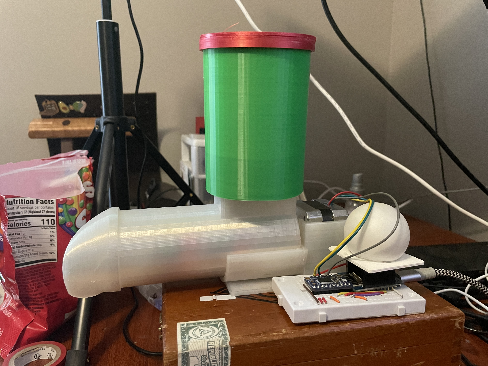

## Le matériel

Curieusement, j'avais toujours tout le matériel d'origine du [projet Halloween](https://camunda.com/blog/2020/10/camunda-halloween?ref=davidgsiot) toujours assis sur une étagère dans mon bureau. Je *savais* que ça me servirait un jour !!

Si vous voulez le construire, littéralement tout ce dont vous avez besoin se trouve dans le [Camunda Community Hub](https://github.com/camunda-community-hub/CamundaHalloween), ou sur le [blog] d'origine (https:// camunda.com/blog/2020/10/camunda-halloween?ref=davidgsiot).

Je n'ai fait aucune modification au matériel que ce soit. Je l'ai littéralement retiré de l'étagère, branché le tout, et cela a fonctionné comme en octobre.

Ce que j'ai *fait* changer, ce sont les modèles Camunda BPM que j'utiliserais. Pour être juste, je n'ai pas réellement *modifié* le modèle que j'utilisais, j'ai juste construit 2 **nouveaux** modèles, mais nous y reviendrons.


## Le premier modèle

Juste pour me rafraîchir la mémoire, voici le premier modèle que j'ai utilisé :

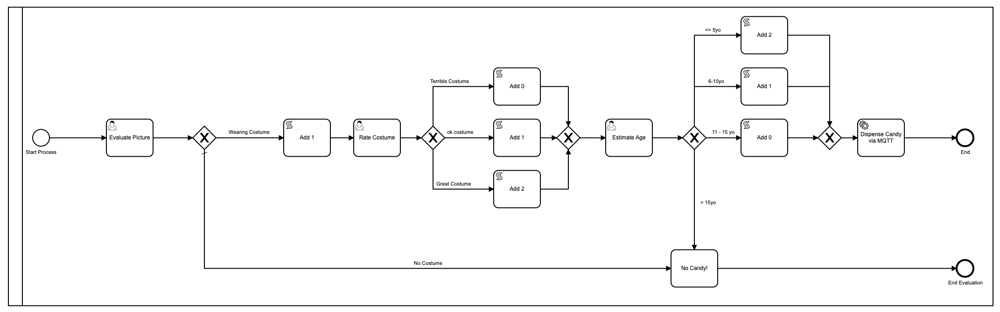

Ok très bien, donc je l'ai embelli en utilisant des couleurs puisque [Camunda](https://camunda.com?ref=davidgsiot) a ajouté cela dans la dernière version du [Modeler](https://camunda.com/products/camunda -platform/modeler?ref=davidgsiot).

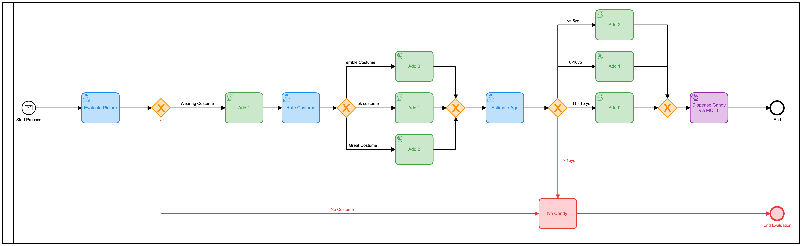

Il y a beaucoup de problèmes avec ce modèle. Beaucoup**. Pour commencer, c'est trop complexe et implique beaucoup d'interactions humaines afin d'arriver au résultat final de la distribution de bonbons. En moyenne, il faut environ 2 à 3 minutes pour que l'ensemble du processus s'exécute, et c'est si quelqu'un (moi) est assis là à ne rien faire d'autre que charger les formulaires et « évaluer » les images.

Il a également utilisé javascript à l'intérieur du modèle, ce qui n'est généralement pas une [meilleure pratique] (https://camunda.com/best-practices/_/?ref=davidgsiot)

J'ai aussi réussi à comprendre comment afficher l'image sur le formulaire, ce que je ne savais pas faire à l'époque :

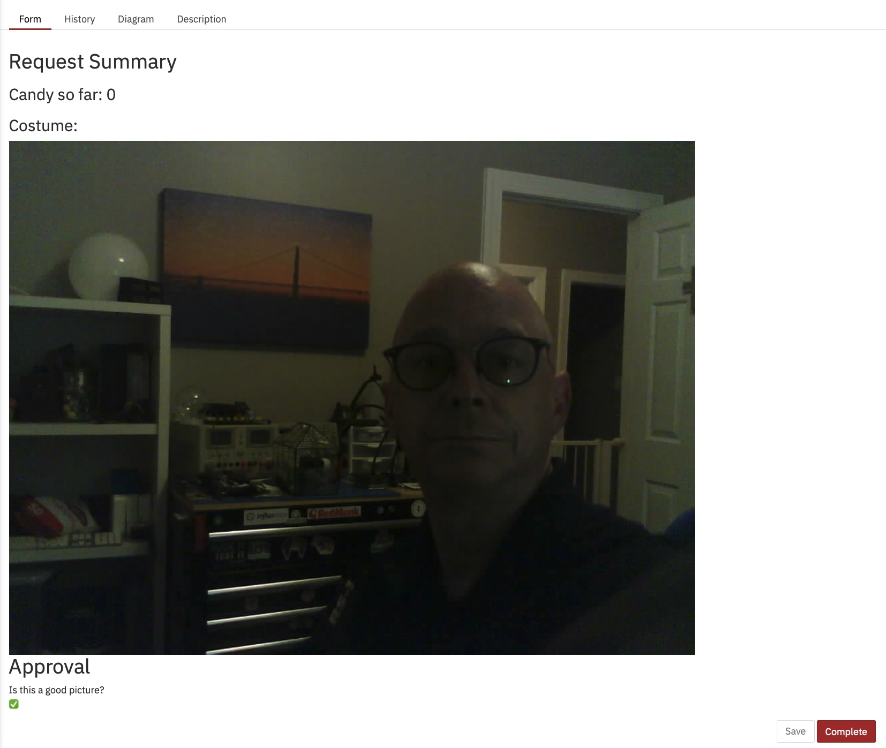

À partir de la Heatmap dans Cockpit, vous pouvez voir que presque tout le temps du processus en cours d'exécution est occupé par des tâches humaines.

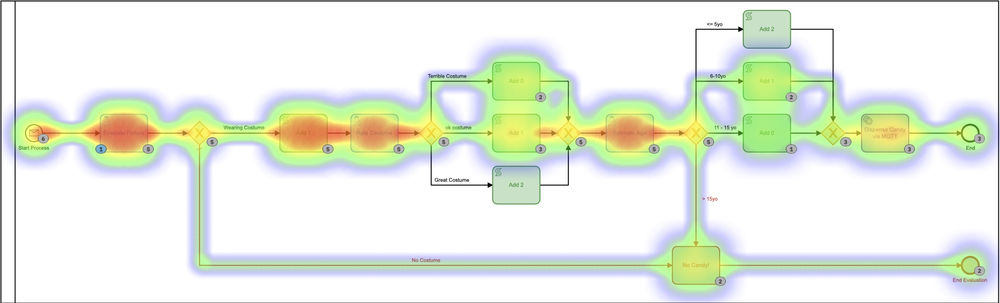

Vous pouvez également voir que le processus, du début à la fin, prend quelques minutes. Et aussi amusant que soit l'évaluation des images, ce n'est probablement pas l'utilisation la plus utile ou la meilleure de mon temps.

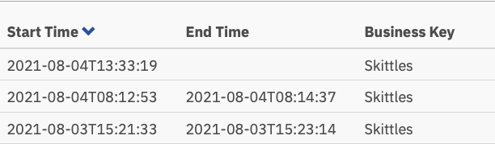

## Le deuxième modèle

Ce modèle pourrait facilement être amélioré par le simple fait de combiner toutes ces tâches humaines distinctes en une seule forme. Plutôt que d'en avoir 3, il faudrait le rendre beaucoup plus efficace. J'ai donc construit un nouveau modèle pour faire cela:

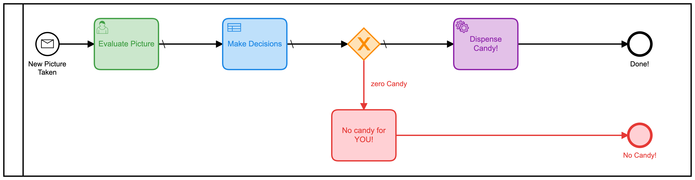

J'ai également ajouté dans une table de décision (DMN) afin de faire les calculs du nombre de quilles à donner en fonction des notes sur le formulaire :

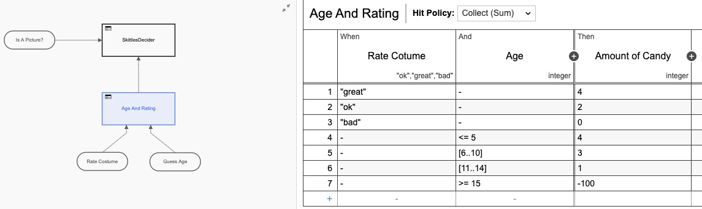

Encore une fois, j'ai sur-conçu la table DMN en en faisant *deux* tables, mais vous voyez l'idée. Mais si nous revenons à la vue heatmap, il est toujours clair que la plupart du temps est pris par l'interaction humaine.

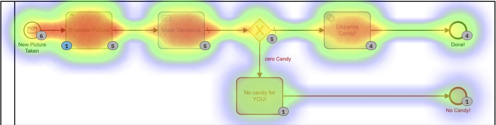

Nous, les humains, sommes juste *lents* aux choses ! En regardant les temps d'exécution, nous avons en effet réduit le temps de moitié, mais je serais assis ici toute la journée en cliquant simplement sur ce formulaire (que j'ai rendu encore plus joli cette fois)

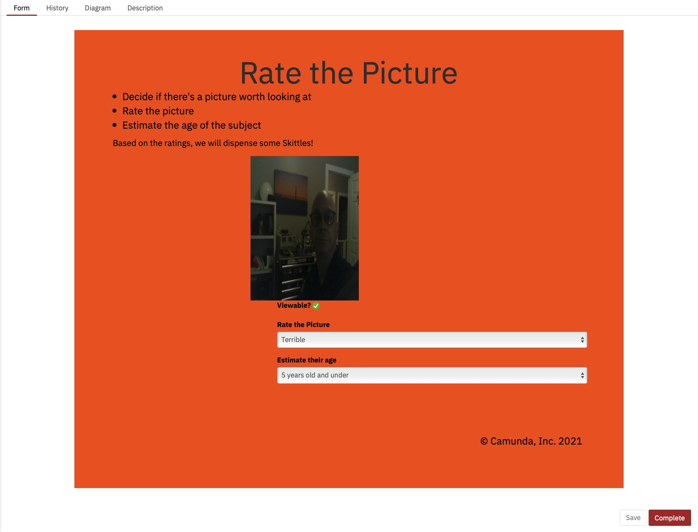

Et ces temps d'exécution :

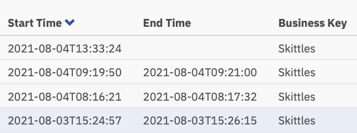

Maintenant, un peu plus d'une minute par tâche, mais quelqu'un doit encore effectuer ces tâches.

## Le troisième modèle

C'est là que les choses sont devenues plus intéressantes. Je me demandais si je pouvais éliminer complètement la prise de décision humaine du processus ! (**Remarque :** Aucun humain n'a perdu son emploi à cause de ce changement !) Et si je pouvais tout automatiser ?

*Google Vision AI est entré dans le chat*

Il s'avère que je **pourrais** faire ça, tant que j'étais prêt à changer les critères d'évaluation de l'image. (Compte tenu du temps et de l'envie, j'aurais également pu former mon propre modèle d'IA pour évaluer sur les critères d'origine, mais cela semblait plus facile.)

Il s'avère qu'avec très peu de code, je pourrais automatiquement soumettre l'image au moteur Vision AI de Google et récupérer des informations que je pourrais utiliser pour distribuer des quilles ! En soumettant une photo, j'ai pu récupérer les éléments suivants très rapidement :
- Visages:
- Visage 0
- Colère : TRÈS_IMABLE
- Joie : PROBABLE
- Surprise : TRÈS_UNLIKELY
- Chagrin : VERY_UNLIKELY
Je pourrais travailler avec ça ! Ces évaluations reviennent également sous forme de valeur numérique, j'ai donc proposé un nouveau modèle BPMN pour cette version :

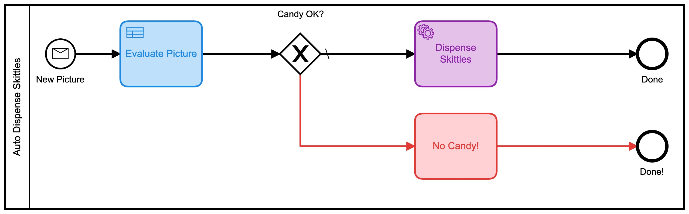

Celui-ci utilise également une série de tables DMN pour décider de la quantité de bonbons que vous obtiendrez :

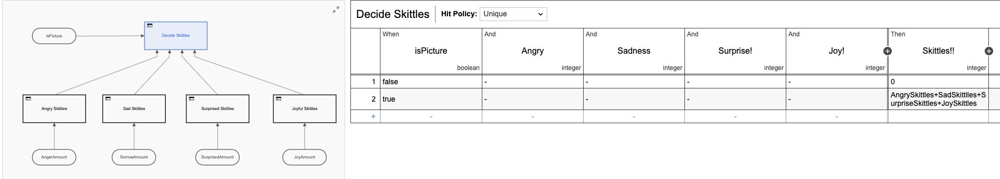

Chacune de ces petites tables DMN implémente mon algorithme propriétaire ultra-secret pour calculer les quantités de quilles. En regardant la carte thermique pour ce processus, cela peut ne pas sembler si différent, car la plupart du temps a été consacré à décider du nombre de quilles à distribuer. Il est important de noter qu'absolument *aucun* de ce temps n'a été passé par moi, personnellement. Je n'ai rien eu à faire.

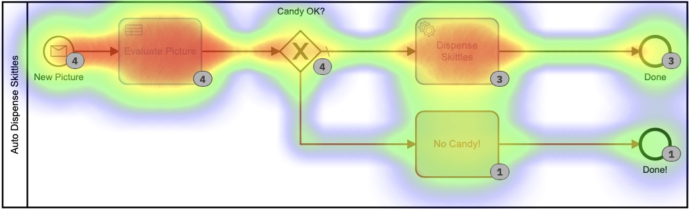

Sur la base de cette carte thermique, il semble que beaucoup de temps ait été consacré à la tâche de décision, mais si nous approfondissons les temps d'exécution dans l'historique, nous voyons une histoire très, *très* différente :

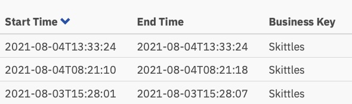

Ces temps sont compris entre 0 et 8 secondes. Au lieu de 2+ minutes dans la première version. C'est une économie importante !

## Le code

J'aime toujours inclure du code dans mes messages afin que vous puissiez voir *comment* j'ai fait ce que j'ai fait. Et pour que vous puissiez le faire aussi.

Le code sur les appareils (la caméra IoT et le distributeur de bonbons IoT) est exactement le même que dans la [première version](https://github.com/camunda-community-hub/CamundaHalloween) donc je ne vais pas ressasse-le ici. Tous les schémas, codes, etc. des périphériques matériels se trouvent dans ce référentiel Github.

Ce que je vais couvrir ici, c'est le code côté serveur que j'ai écrit. Et comme d'habitude, j'ai tout écrit en Go.

### Accepter les photos

La carte ESP32Camera réagit à une pression sur un bouton et prend une photo. Il doit ensuite envoyer cette image quelque part, j'ai donc écrit un simple serveur Web pour gérer les images entrantes et les stocker sur le serveur :

```go
// Start up the web services over TLS
	http.HandleFunc("/photo", photo)
	http.Handle("/test/", http.StripPrefix("/test", fs))      // set router
	err := http.ListenAndServeTLS(":9090", "server-cert", "server-key", nil) // set listen port
	if err != nil {
		log.Fatal("ListenAndServeTLS: ", err)
	}
```
Cela démarre un serveur Web sur le port SSL 9090 qui accepte 2 URL : `https://server.com:9090/photo` et `https://server.com:9090/test/`. L'URI `/photo` est l'endroit où l'ESP32Camera envoie des images.

Voici à quoi ressemble ce gestionnaire d'URI :

```go
// the web server process that handles incoming requests
func photo(w http.ResponseWriter, r *http.Request) {
	if r.Method == "GET" { // GET outta here! :-)
		log.Println("GET Method Not Supported")
		http.Error(w, "GET Method not supported", 400)
	} else {
		r.ParseMultipartForm(32 << 2) // allocate enough memory for the incoming picture.
		file, handler, err := r.FormFile("uploadfile")
		if err != nil {
			fmt.Println("Format Error!", err)
			switch e := err.(type) {
			case Error:
				// We can retrieve the status here and write out a specific
				// HTTP status code.
				log.Printf("HTTP %d - %s", e.Status(), e)
				http.Error(w, e.Error(), e.Status())
			default:
				// Any error types we don't specifically look out for default
				// to serving a HTTP 500
				http.Error(w, http.StatusText(http.StatusInternalServerError),
					http.StatusInternalServerError)
			}
			return
		}
		defer file.Close()
		f, err := os.OpenFile("./test"+handler.Filename, os.O_WRONLY|os.O_CREATE, 0666)
		if err != nil {
			log.Println(err)
			http.Error(w, "Could not Write new file", 500)
			return
		}
		defer f.Close()
		io.Copy(f, file)
		var emotions = Emotions{}
		w.WriteHeader(200)
		if runners.VisionAI {
			emotions = doAIOnPic(handler.Filename)
		}
		sendPic(f.Name(), emotions)
	}
}
```
Il s'y passe donc beaucoup de choses. Laisse-moi expliquer. Tout d'abord, nous n'acceptons pas les requêtes « GET ». Je les rejette d'emblée. Ensuite, je dois allouer suffisamment de mémoire pour stocker le fichier entrant, puis lire ce fichier à partir du formulaire en plusieurs parties qui a été envoyé. Ensuite, j'ouvre un fichier local et enregistre l'image là-bas. La dernière chose que je fais est... eh bien, ça dépend.

Vous voyez, puisque j'ai maintenant 3 modèles, j'ai ajouté des indicateurs de fonction afin que je puisse décider quoi faire avec l'image entrante. Ou, plus précisément, comment l'acheminer.

```go
type RunFlags struct {
	ThreeForms bool
	NewForm    bool
	VisionAI   bool
}

var runners RunFlags
...
func main() {
	fmt.Println("Starting up ... ")
	origPointer := flag.Bool("orig", false, "Original Demo")
	newPointer := flag.Bool("new", false, "New Form")
	aiPointer := flag.Bool("ai", false, "Vision AI")
	flag.Parse()
	runners = RunFlags{}
	runners.ThreeForms = *origPointer
	runners.NewForm = *newPointer
	runners.VisionAI = *aiPointer
...
}
```
Je peux donc décider quel modèle je veux utiliser en ajoutant `--orig=true` à la ligne de commande. Si je ne soumets pas au modèle Vision AI, je ne prends pas la peine d'analyser la photo, car je suis facturé pour chaque photo soumise.

Que se passe-t-il ensuite ? Eh bien, je soumets toutes les données à Camunda Platform Engine, bien sûr !

```go
// sendPic sends the picture to the Camunda Process, starting the entire process
func sendPic(s string, e Emotions) {
	// fill out the options
	opts := camundaclientgo.ClientOptions{}
	opts.EndpointUrl = "https://camunda-platform:8443/engine-rest" // yours will be different
	opts.Timeout = time.Second * 20
	// file comes in as './picture...' so remove that bit
	newPath := prefix + strings.Trim(s, ".")
	// all the variables we need
	var variables = map[string]camundaclientgo.Variable{}
	if runners.ThreeForms || runners.NewForm {
		variables["newCostume"] = camundaclientgo.Variable{
			Value: newPath,
			Type:  "string",
		}
		variables["isCostume"] = camundaclientgo.Variable{
			Value: true,
			Type:  "boolean",
		}
		variables["candyPieces"] = camundaclientgo.Variable{
			Value: 0,
			Type:  "long",
		}
	}
	if runners.VisionAI {
		variables["JoyAmount"] = camundaclientgo.Variable{
			Value: e.JoyNumber,
			Type:  "long",
		}
		variables["AngerAmount"] = camundaclientgo.Variable{
			Value: e.AngerNumber,
			Type:  "long",
		}
		variables["SurpriseAmount"] = camundaclientgo.Variable{
			Value: e.SurpriseNumber,
			Type:  "long",
		}
		variables["SorrowAmount"] = camundaclientgo.Variable{
			Value: e.SorrowNumber,
			Type:  "long",
		}
		variables["isPicture"] = camundaclientgo.Variable{
			Value: e.IsPicture,
			Type:  "boolean",
		}
	}
	client := camundaclientgo.NewClient(opts)
	reqMessage := camundaclientgo.ReqMessage{}
	reqMessage.BusinessKey = "Skittles"
	reqMessage.ProcessVariables = &variables
	if runners.ThreeForms {
		reqMessage.MessageName = "send_skittles"
		err := client.Message.SendMessage(&reqMessage)
		if err != nil {
			log.Printf("Error starting process: %s\n", err)
			return
		}
	}
	if runners.NewForm {
		reqMessage.MessageName = "send_more_skittles"
		err := client.Message.SendMessage(&reqMessage)
		if err != nil {
			log.Printf("Error starting process: %s\n", err)
			return
		}
	}
	if runners.VisionAI {
		reqMessage.MessageName = "auto_skittles"
		err := client.Message.SendMessage(&reqMessage)
		if err != nil {
			log.Printf("Error starting process: %s\n", err)
			return
		}
	}
}
```
Et cela soumet les données requises au moteur Camunda pour traitement.

### Distribution de quilles

Mais attendez, comment sortir Skittles ?! Depuis que j'ai écrit le serveur en Go, j'ai ajouté des gestionnaires de processus au serveur pour « écouter » les messages pour envoyer des quilles. Vous avez peut-être remarqué que chacun de mes modèles de processus se terminait par l'un de ceux-ci :

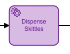

Ils avaient peut-être des noms légèrement différents, mais ils avaient chacun un panneau de propriétés rempli comme ceci :

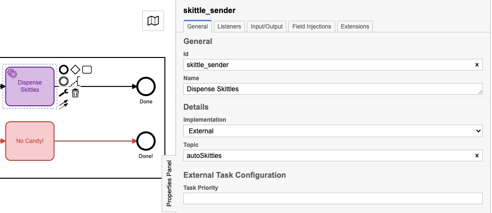

Le `sujet` réel est différent pour chacun, et nous verrons pourquoi dans ce prochain morceau de code :

```Go
client := camundaclientgo.NewClient(camundaclientgo.ClientOptions{EndpointUrl: "https://camunda-platform:8443/engine-rest",
		Timeout: time.Second * 20,
	})
	logger := func(err error) {
		fmt.Println(err.Error())
	}
	asyncResponseTimeout := 5000
	// The old one, 3 forms!
	if runners.ThreeForms {
		proc := processor.NewProcessor(client, &processor.ProcessorOptions{
			WorkerId:                  "Skittles",
			LockDuration:              time.Second * 20,
			MaxTasks:                  10,
			MaxParallelTaskPerHandler: 100,
			LongPollingTimeout:        20 * time.Second,
			AsyncResponseTimeout:      &asyncResponseTimeout,
		}, logger)
		fmt.Println("Original Processor started ... ")
		proc.AddHandler( // Dispense Skittles!
			&[]camundaclientgo.QueryFetchAndLockTopic{
				{TopicName: "send_skittles"},
			},
			func(ctx *processor.Context) error {
				return dispenseSkittles(ctx.Task.Variables, ctx)
			},
		)
		fmt.Println("Original Handler registered ... ")
	}
	if runners.NewForm {
		// Newer and better. Only 1 form!
		proc2 := processor.NewProcessor(client, &processor.ProcessorOptions{
			WorkerId:                  "Skittles2",
			LockDuration:              time.Second * 20,
			MaxTasks:                  10,
			MaxParallelTaskPerHandler: 100,
			LongPollingTimeout:        20 * time.Second,
			AsyncResponseTimeout:      &asyncResponseTimeout,
		}, logger)
		fmt.Println("New Form Processor started ... ")
		proc2.AddHandler( // Dispense Skittles!
			&[]camundaclientgo.QueryFetchAndLockTopic{
				{TopicName: "more_skittles"},
			},
			func(ctx *processor.Context) error {
				return dispenseSkittles(ctx.Task.Variables, ctx)
			},
		)
		fmt.Println("New Form Handler registered ... ")
	}
	if runners.VisionAI {
		// Best yet, fully automated!
		proc3 := processor.NewProcessor(client, &processor.ProcessorOptions{
			WorkerId:                  "AutoSkittles",
			LockDuration:              time.Second * 20,
			MaxTasks:                  10,
			MaxParallelTaskPerHandler: 100,
			LongPollingTimeout:        20 * time.Second,
			AsyncResponseTimeout:      &asyncResponseTimeout,
		}, logger)
		fmt.Println("Vision AI Processor started ...")
		proc3.AddHandler( // Dispense Skittles!
			&[]camundaclientgo.QueryFetchAndLockTopic{
				{TopicName: "autoSkittles"},
			},
			func(ctx *processor.Context) error {
				return dispenseSkittles(ctx.Task.Variables, ctx)
			},
		)
		fmt.Println("Vision AI Handler registered ... ")
	}
```

Je crée un nouveau processeur pour le modèle que j'utilise, puis j'ajoute un gestionnaire à ce processeur qui écoute un sujet spécifique. Le moteur Camunda met des messages sur ce sujet, et mon gestionnaire les récupère, les gère, puis les marque comme terminés dans le moteur de processus. Si vous regardez attentivement, vous remarquerez que chacun de ces gestionnaires appelle la même fonction, `dispenseSkittles` avec toutes les variables de tâche du moteur.

Voici comment je fais ce peu:

```Go
// process requests to dispense Skittles!
func dispenseSkittles(newVars map[string]camundaclientgo.Variable, contx *processor.Context) error {
	// all the task variables
	varb := contx.Task.Variables
	// the MQTT broker address
	opts := mqtt.NewClientOptions().AddBroker("tcp://secure-mqtt-broker:8883")
	client := mqtt.NewClient(opts)
	if token := client.Connect(); token.Wait() && token.Error() != nil {
		log.Fatal(token.Error())
	}
	cp := fmt.Sprintf("%v", varb["candyPieces"].Value)
	dispense := fmt.Sprintf("{candy=%s }", cp)
	sendtoken := client.Publish(TOPIC, 0, false, dispense)
	if sendtoken.Error() != nil {
		log.Fatal(sendtoken.Error())
	}
	sendtoken.Wait()
	vars := make(map[string]camundaclientgo.Variable)
	vars["OK"] = camundaclientgo.Variable{Value: "true", Type: "boolean"}
	vars["status"] = camundaclientgo.Variable{Value: "true", Type: "boolean"}
	err := contx.Complete(processor.QueryComplete{
		Variables: &vars,
	})
	if err != nil {
		errTxt := contx.Task.ErrorDetails
		retries := contx.Task.Retries
		retryTimeout := 10
		return contx.HandleFailure(processor.QueryHandleFailure{
			ErrorMessage: &errTxt,
			Retries:      &retries,
			RetryTimeout: &retryTimeout,
		})
	}
	return nil
}
```
J'utilise MQTT pour envoyer les messages au distributeur physique réel de Skittles. Je crée un client MQTT, me connecte au courtier MQTT (sécurisé TLS !), puis envoie le message indiquant le nombre de quilles à distribuer.

La *dernière* chose à faire est de dire au moteur de processus que j'ai terminé la tâche afin qu'elle puisse être marquée comme terminée.

Et c'est tout! Je sais que cela semble beaucoup, mais cela met en œuvre un ensemble d'étapes avancées :
1) Recevoir un message
2) Traiter le message
3) Soumettre les données au moteur de la plateforme
4) Écoutez les tâches
5) Terminez les tâches lorsqu'elles deviennent disponibles
6) Marquer les tâches comme terminées
Une chose que je voudrais également souligner est qu'il n'y a pas de différence entre les données soumises pour le modèle de processus 1 et le modèle de processus 2. Cela peut sembler peu, mais c'est un point important.

Étant donné que les données soumises n'ont pas changé et que la façon dont les Skittles ont été distribués n'a pas changé, cela signifie que j'ai pu modifier le modèle, déployer le nouveau modèle et continuer à exécuter le processus ** sans changer de code ** sur le processus serveur. (Je l'ai fait, mais c'était pour faire un point.)

Étant donné que la création et la modification de modèles de processus n'impliquent pas vraiment l'écriture de code, les propriétaires de processus peuvent apporter des modifications au processus sans avoir à écrire de code. Ils peuvent continuer à utiliser le même code backend mais l'exploiter et le rendre plus efficace, simplement en changeant le *modèle*.

## Conclusion

J'espère que ce petit exercice vous a plu. C'était super amusant de pouvoir réutiliser le distributeur de bonbons d'origine et de montrer comment changer le modèle de processus (et un peu de code) peut rendre un processus beaucoup plus efficace.

## Bonus! Google Vision AI Code

Puisque vous avez lu jusqu'ici, j'ai pensé vous donner le code pour envoyer des photos à Google Vision AI et recevoir les résultats de celle-ci.

Choses dont vous aurez besoin :
1) Un compte Google Cloud
2) API Vision AI activée
3) Un fichier d'informations d'identification de compte de service
Vous pouvez obtenir toutes ces choses via votre Google Cloud Console.

Une fois que vous avez tout cela, voici le code pour le faire :

```go
type interestingAnnotations struct {
	DetectionConfidence    float64 `json:"detection_confidence"`
	LandmarkingConfidence  float64 `json:"landmarking_confidence"`
	JoyLikelihood          int     `json:"joy_likelihood"`
	SorrowLikelihood       int     `json:"sorrow_likelihood"`
	AngerLikelihood        int     `json:"anger_likelihood"`
	SurpriseLikelihood     int     `json:"surprise_likelihood"`
	UnderExposedLikelihood int     `json:"under_exposed_likelihood"`
	BlurredLikelihood      int     `json:"blurred_likelihood"`
	HeadwearLikelihood     int     `json:"headwear_likelihood"`
}

type Emotions struct {
	JoyNumber      int
	AngerNumber    int
	SurpriseNumber int
	SorrowNumber   int
	IsPicture      bool
}
...
func doAIOnPic(s string) Emotions { // (string, error) {
	absPath := fmt.Sprintf("%s%s", serverPath, strings.Trim(s, "."))
	ctx := context.Background()
	options := opts.WithCredentialsFile("credentials-file.json")
	client, err := vision.NewImageAnnotatorClient(ctx, options)
	if err != nil {
		log.Fatalf("Failed to create client: %v", err)
	}
	defer client.Close()
	file, err := os.Open(absPath)
	if err != nil {
		log.Fatalf("Failed to read file: %v", err)
	}
	defer file.Close()
	image, err := vision.NewImageFromReader(file)
	if err != nil {
		log.Fatalf("Failed to create image: %v", err)
	}
	annotations, err := client.DetectFaces(ctx, image, nil, 10)
	if err != nil {
		log.Fatalf("Failed to detect faces: %v", err)
	}
	emotions := Emotions{}
	// no people in this photo!
	if len(annotations) == 0 {
		fmt.Println("No faces found.")
		emotions.IsPicture = false
	} else {
		emotions.IsPicture = true
		fmt.Println("Faces:")
		for i, annotation := range annotations {
			goodStuff := interestingAnnotations{}
			data, err := json.Marshal(annotation)
			if err != nil {
				log.Fatal(err)
			}
			err = json.Unmarshal(data, &goodStuff)
			if err != nil {
				log.Fatal(err)
			}
			fmt.Println("  Face", i)
			emotions.AngerNumber = goodStuff.AngerLikelihood
			fmt.Println("    Anger:", annotation.AngerLikelihood)
			emotions.JoyNumber = goodStuff.JoyLikelihood
			fmt.Println("    Joy:", annotation.JoyLikelihood)
			emotions.SurpriseNumber = goodStuff.SurpriseLikelihood
			fmt.Println("    Surprise:", annotation.SurpriseLikelihood)
			emotions.SorrowNumber = goodStuff.SorrowLikelihood
			fmt.Println("    Sorrow:", annotation.SorrowLikelihood)
		}
	}
	return emotions
}
```
J'ai relu le fichier enregistré précédemment (et oui, j'aurais pu simplement utiliser la version en mémoire, mais j'ai décidé de ne pas le faire) et l'ai envoyé à Google. J'attends ensuite la réponse et j'analyse la réponse. S'il n'y a pas de visage détecté, eh bien, PAS DE QUILLES POUR VOUS !

Après cela, enregistrez simplement les valeurs dans une structure et renvoyez-la à la fonction appelante. Ces valeurs peuvent ensuite être soumises au moteur de processus. Vous pouvez toujours supprimer les `fmt.Println`s si vous ne voulez pas les voir. Je les ai laissés ici parce que c'était intéressant pour moi de voir les valeurs renvoyées.
