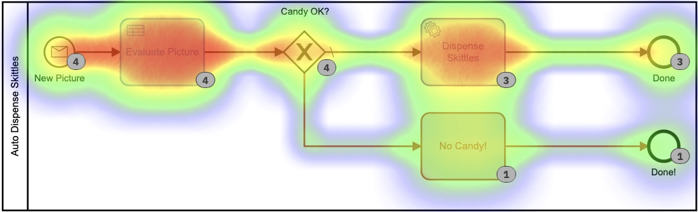

## Wat Achtergrond

Toen ik in oktober 2020 voor het eerst bij Camunda begon (wat was 2020 eigenlijk?) was het **zeer** eerste wat mij werd gevraagd iets te bedenken dat ik kon doen voor een speciale [Halloween-blogpost](https: //camunda.com/blog/2020/10/camunda-halloween?ref=davidgsiot). Omdat het COVID-tijden waren, heb ik natuurlijk een Camunda- en IoT-integratie gebouwd om kostuums te evalueren en snoep te bezorgen.

Ik sta bekend om het doen van rare, zinloze IoT-projecten zoals [deze](https://camunda.com/blog/2020/12/letters-to-santa-automating-joy-to-the-world- at-scale?ref=davidgsiot) en [deze](/posts/categoryiot/this-whole-thing-stinks), en [deze](/posts/category/database/snack-tracking-with-the-new -influxdb-arduino-bibliotheek/). Je snapt het idee.

## Tijd voor een update

Een paar weken geleden kreeg ik de opdracht om een demo te geven van de volledige Camunda-stack aan een grote bank/potentiële klant. Toen ik er verder over nadacht, besloot ik dat ik op geen enkele manier een 'traditionele' demo wilde doen van het maken van een account, onboarding of iets dergelijks.

Laten we eerlijk zijn, we zijn allemaal mensen, en als we zien dat iemand iets overdreven simplificeert, weten we heel goed dat onze eerste reactie is "nou, dat is niet hoe *we* het doen", of "het is echt een stuk ingewikkelder dan dat" en we stop met luisteren, of we missen de mogelijkheden.

Ik besloot (uiteraard met buy-in!) dat ik ze iets buiten hun begrip en comfortzone wilde laten zien, maar iets dat ze onmiddellijk konden begrijpen en mogelijkheden erin konden zien. Het is ook veel gemakkelijker om oudere dingen opnieuw te gebruiken dan het is om te proberen op korte termijn geheel nieuwe inhoud te schrijven.

*De Halloween Candy Dispenser is de chat binnengekomen*


## De hardware

Vreemd genoeg had ik alle originele hardware van het [Halloween Project](https://camunda.com/blog/2020/10/camunda-halloween?ref=davidgsiot) nog steeds gewoon op een plank in mijn kantoor. Ik *wist* dat het ooit van pas zou komen!!

Als je het wilt bouwen, staat letterlijk alles wat je nodig hebt in de [Camunda Community Hub](https://github.com/camunda-community-hub/CamundaHalloween), of in de originele [blogpost](https:// camunda.com/blog/2020/10/camunda-halloween?ref=davidgsiot).

Ik heb niets aan de hardware veranderd. Ik haalde het letterlijk van de plank, stopte het allemaal in het stopcontact en het werkte gewoon zoals het deed in oktober.

Wat ik *deed* veranderde waren de Camunda BPM-modellen die ik zou gebruiken. Om eerlijk te zijn, ik heb het model dat ik had gebruikt niet *veranderd*, ik heb net 2 **nieuwe** modellen gebouwd, maar daar komen we op terug.


## Het eerste model

Even ter opfrissing, dit was het eerste model dat ik gebruikte:


Oké prima, dus ik heb het mooier gemaakt met kleuren sinds [Camunda](https://camunda.com?ref=davidgsiot) dat heeft toegevoegd in de nieuwste versie van de [Modeler](https://camunda.com/products/camunda -platform/modeler?ref=davidgsiot).


Er zijn veel problemen met dit model. Heel veel**. Om te beginnen is het te ingewikkeld en komt er veel menselijke interactie bij kijken om tot het eindresultaat van het uitdelen van snoep te komen. Gemiddeld duurt het ongeveer 2-3 minuten voordat het hele proces is uitgevoerd, en dat is als iemand (ik) daar zit en niets anders doet dan de formulieren laden en foto's 'beoordelen'.

Het gebruikte ook javascript in het model, wat over het algemeen geen [best practice](https://camunda.com/best-practices/_/?ref=davidgsiot) is.

Ik ben er ook in geslaagd om erachter te komen hoe de afbeelding op het formulier moet worden weergegeven, iets wat ik toen niet wist:


Op de Heatmap in Cockpit kun je zien dat bijna alle tijd van het proces wordt ingenomen door menselijke taken.


Je kunt ook zien dat het proces, van begin tot eind, een paar minuten duurt. En hoe leuk het evalueren van foto's ook is, het is waarschijnlijk niet de nuttigste of beste besteding van mijn tijd.


## Het tweede model

Dat model zou gemakkelijk kunnen worden verbeterd door al die afzonderlijke menselijke taken in één vorm te combineren. In plaats van er 3 te hebben, zou men het veel efficiënter moeten maken. Dus heb ik een nieuw model gebouwd om dat te doen:


Ik heb ook een beslissingstabel (DMN) toegevoegd om te berekenen hoeveel kegels ik moet geven op basis van de beoordelingen op het formulier:


Nogmaals, ik heb de DMN-tabel over-engineered door er *twee* tabellen van te maken, maar je snapt het idee. Maar als we teruggaan naar de heatmap-weergave, is het nog steeds duidelijk dat de meeste tijd wordt ingenomen door de menselijke interactie.


Wij mensen zijn gewoon *traag* in dingen! Kijkend naar de uitvoeringstijden, hebben we de tijd inderdaad ongeveer gehalveerd, maar toch zou ik hier de hele dag zitten door op dit formulier te klikken (dat ik deze keer extra mooi heb gemaakt)


En die uitvoeringstijden:


Nu iets meer dan een minuut per taak, maar iemand moet die taken nog uitvoeren.

## Het derde model

Hier werd het interessanter. Ik vroeg me af of ik de menselijke besluitvorming helemaal uit het proces zou kunnen halen! (**Opmerking:** Geen mensen verloren hun baan door deze verandering!) Wat als ik het hele ding zou kunnen automatiseren?

*Google Vision AI is de chat binnengegaan*

Het bleek dat ik dat **kon** kon doen, zolang ik maar bereid was de beoordelingscriteria voor foto's te veranderen. (Gezien de tijd en de neiging, had ik ook mijn eigen AI-model kunnen trainen om te evalueren op de oorspronkelijke criteria, maar dit leek gemakkelijker.)

Blijkt dat ik met heel weinig code de afbeelding automatisch naar de Vision AI-engine van Google kon sturen en wat informatie terug kon krijgen die ik kon gebruiken om kegels uit te delen! Door een foto in te sturen, kon ik heel snel het volgende terugkrijgen:
- Gezichten:
- Gezicht 0
- Woede: VERY_UNLIKELY
- Vreugde: WAARSCHIJNLIJK
- Verrassing: VERY_UNLIKELY
- Verdriet: VERY_UNLIKELY
Daar zou ik mee kunnen werken! Die evaluaties komen ook terug als een numerieke waarde, dus ik bedacht een nieuw BPMN-model voor deze versie:


Deze gebruikt ook een reeks DMN-tabellen om te beslissen hoeveel snoep je krijgt:


Elk van die kleinere DMN-tabellen implementeert mijn ultrageheime, gepatenteerde algoritme voor het berekenen van kegelbedragen. Als je naar de heatmap voor dit proces kijkt, ziet het er misschien niet allemaal *dat* anders uit, omdat de meeste tijd werd besteed aan het beslissen hoeveel kegels er moesten worden afgegeven. Het is belangrijk op te merken dat absoluut*geen* van deze tijd door mij persoonlijk is besteed. Ik hoefde niets te doen.



Op basis van deze heatmap lijkt het erop dat er veel tijd is besteed aan de beslissingstaak, maar als we dieper ingaan op de uitvoeringstijden in de geschiedenis, zien we een heel, *heel* ander verhaal:


Die tijden liggen tussen 0 en 8 seconden. Verlaagd vanaf 2+ minuten in de eerste versie. Dat is een flinke besparing!

## De code

Ik vind het altijd leuk om code in mijn berichten op te nemen, zodat je kunt zien*hoe* ik deed wat ik deed. En zodat jij het ook kunt.

De code op de apparaten (de IoT-camera en de IoT-snoepautomaat) is precies hetzelfde als in de [eerste versie](https://github.com/camunda-community-hub/CamundaHalloween), dus ik ga het niet doen herhaal het hier. Alle schema's, code, enz. Voor de hardwareapparaten staan in die Github Repo.

Wat ik hier zal behandelen, is de server-side code die ik heb geschreven. En zoals gewoonlijk schreef ik het allemaal in Go.

### Foto's accepteren

Het ESP32Camera-bord reageert op een druk op de knop en maakt een foto. Het moet die foto dan ergens naartoe sturen, dus ik heb een eenvoudige webserver geschreven om de binnenkomende foto's te verwerken en op de server op te slaan:

```go
// Start up the web services over TLS
	http.HandleFunc("/photo", photo)
	http.Handle("/test/", http.StripPrefix("/test", fs))      // set router
	err := http.ListenAndServeTLS(":9090", "server-cert", "server-key", nil) // set listen port
	if err != nil {
		log.Fatal("ListenAndServeTLS: ", err)
	}
```
Dit start een webserver op SSL-poort 9090 die 2 URL's accepteert: `https://server.com:9090/photo` en `https://server.com:9090/test/`. De `/photo` URI is waar de ESP32Camera foto's naartoe stuurt.

Zo ziet die URI-handler eruit:

```go
// the web server process that handles incoming requests
func photo(w http.ResponseWriter, r *http.Request) {
	if r.Method == "GET" { // GET outta here! :-)
		log.Println("GET Method Not Supported")
		http.Error(w, "GET Method not supported", 400)
	} else {
		r.ParseMultipartForm(32 << 2) // allocate enough memory for the incoming picture.
		file, handler, err := r.FormFile("uploadfile")
		if err != nil {
			fmt.Println("Format Error!", err)
			switch e := err.(type) {
			case Error:
				// We can retrieve the status here and write out a specific
				// HTTP status code.
				log.Printf("HTTP %d - %s", e.Status(), e)
				http.Error(w, e.Error(), e.Status())
			default:
				// Any error types we don't specifically look out for default
				// to serving a HTTP 500
				http.Error(w, http.StatusText(http.StatusInternalServerError),
					http.StatusInternalServerError)
			}
			return
		}
		defer file.Close()
		f, err := os.OpenFile("./test"+handler.Filename, os.O_WRONLY|os.O_CREATE, 0666)
		if err != nil {
			log.Println(err)
			http.Error(w, "Could not Write new file", 500)
			return
		}
		defer f.Close()
		io.Copy(f, file)
		var emotions = Emotions{}
		w.WriteHeader(200)
		if runners.VisionAI {
			emotions = doAIOnPic(handler.Filename)
		}
		sendPic(f.Name(), emotions)
	}
}
```
Er gebeurt daar dus veel. Laat het me uitleggen. Ten eerste accepteren we geen 'GET'-verzoeken. Ik keur ze uit de hand. Vervolgens moet ik voldoende geheugen toewijzen om het inkomende bestand op te slaan en dat bestand vervolgens inlezen vanuit het meerdelige formulier dat is verzonden. Vervolgens open ik een lokaal bestand en sla ik de afbeelding daar op. Het laatste wat ik doe is... nou, dat hangt ervan af.

Zie je, aangezien ik nu 3 modellen had, heb ik feature flags toegevoegd zodat ik kon beslissen wat ik met de binnenkomende foto moest doen. Of, beter gezegd, hoe het te routeren.

```go
type RunFlags struct {
	ThreeForms bool
	NewForm    bool
	VisionAI   bool
}

var runners RunFlags
...
func main() {
	fmt.Println("Starting up ... ")
	origPointer := flag.Bool("orig", false, "Original Demo")
	newPointer := flag.Bool("new", false, "New Form")
	aiPointer := flag.Bool("ai", false, "Vision AI")
	flag.Parse()
	runners = RunFlags{}
	runners.ThreeForms = *origPointer
	runners.NewForm = *newPointer
	runners.VisionAI = *aiPointer
...
}
```
Dus ik kan beslissen welk model ik wil gebruiken door `--orig=true` toe te voegen aan de opdrachtregel. Als ik niet inlever bij het Vision AI-model, neem ik niet de moeite om de foto te analyseren, aangezien ik voor elke ingediende foto moet betalen.

Wat gebeurt er nu? Nou, ik stuur alle gegevens natuurlijk door naar de Camunda Platform Engine!

```go
// sendPic sends the picture to the Camunda Process, starting the entire process
func sendPic(s string, e Emotions) {
	// fill out the options
	opts := camundaclientgo.ClientOptions{}
	opts.EndpointUrl = "https://camunda-platform:8443/engine-rest" // yours will be different
	opts.Timeout = time.Second * 20
	// file comes in as './picture...' so remove that bit
	newPath := prefix + strings.Trim(s, ".")
	// all the variables we need
	var variables = map[string]camundaclientgo.Variable{}
	if runners.ThreeForms || runners.NewForm {
		variables["newCostume"] = camundaclientgo.Variable{
			Value: newPath,
			Type:  "string",
		}
		variables["isCostume"] = camundaclientgo.Variable{
			Value: true,
			Type:  "boolean",
		}
		variables["candyPieces"] = camundaclientgo.Variable{
			Value: 0,
			Type:  "long",
		}
	}
	if runners.VisionAI {
		variables["JoyAmount"] = camundaclientgo.Variable{
			Value: e.JoyNumber,
			Type:  "long",
		}
		variables["AngerAmount"] = camundaclientgo.Variable{
			Value: e.AngerNumber,
			Type:  "long",
		}
		variables["SurpriseAmount"] = camundaclientgo.Variable{
			Value: e.SurpriseNumber,
			Type:  "long",
		}
		variables["SorrowAmount"] = camundaclientgo.Variable{
			Value: e.SorrowNumber,
			Type:  "long",
		}
		variables["isPicture"] = camundaclientgo.Variable{
			Value: e.IsPicture,
			Type:  "boolean",
		}
	}
	client := camundaclientgo.NewClient(opts)
	reqMessage := camundaclientgo.ReqMessage{}
	reqMessage.BusinessKey = "Skittles"
	reqMessage.ProcessVariables = &variables
	if runners.ThreeForms {
		reqMessage.MessageName = "send_skittles"
		err := client.Message.SendMessage(&reqMessage)
		if err != nil {
			log.Printf("Error starting process: %s\n", err)
			return
		}
	}
	if runners.NewForm {
		reqMessage.MessageName = "send_more_skittles"
		err := client.Message.SendMessage(&reqMessage)
		if err != nil {
			log.Printf("Error starting process: %s\n", err)
			return
		}
	}
	if runners.VisionAI {
		reqMessage.MessageName = "auto_skittles"
		err := client.Message.SendMessage(&reqMessage)
		if err != nil {
			log.Printf("Error starting process: %s\n", err)
			return
		}
	}
}
```
En dat levert de benodigde gegevens aan de Camunda Engine voor verwerking.

### Kegels uitdelen

Maar wacht, hoe krijgen we Skittles eruit?! Sinds ik de server in Go heb geschreven, heb ik een aantal proceshandlers aan de server toegevoegd om te 'luisteren' naar berichten om kegels te verzenden. Je hebt misschien gemerkt dat elk van mijn procesmodellen eindigde met een van deze:


Ze hadden misschien iets andere namen, maar ze hadden elk een eigenschappenvenster dat als volgt was ingevuld:


Het eigenlijke 'onderwerp' is voor iedereen anders, en we zullen zien waarom in dit volgende stukje code:

```Go
client := camundaclientgo.NewClient(camundaclientgo.ClientOptions{EndpointUrl: "https://camunda-platform:8443/engine-rest",
		Timeout: time.Second * 20,
	})
	logger := func(err error) {
		fmt.Println(err.Error())
	}
	asyncResponseTimeout := 5000
	// The old one, 3 forms!
	if runners.ThreeForms {
		proc := processor.NewProcessor(client, &processor.ProcessorOptions{
			WorkerId:                  "Skittles",
			LockDuration:              time.Second * 20,
			MaxTasks:                  10,
			MaxParallelTaskPerHandler: 100,
			LongPollingTimeout:        20 * time.Second,
			AsyncResponseTimeout:      &asyncResponseTimeout,
		}, logger)
		fmt.Println("Original Processor started ... ")
		proc.AddHandler( // Dispense Skittles!
			&[]camundaclientgo.QueryFetchAndLockTopic{
				{TopicName: "send_skittles"},
			},
			func(ctx *processor.Context) error {
				return dispenseSkittles(ctx.Task.Variables, ctx)
			},
		)
		fmt.Println("Original Handler registered ... ")
	}
	if runners.NewForm {
		// Newer and better. Only 1 form!
		proc2 := processor.NewProcessor(client, &processor.ProcessorOptions{
			WorkerId:                  "Skittles2",
			LockDuration:              time.Second * 20,
			MaxTasks:                  10,
			MaxParallelTaskPerHandler: 100,
			LongPollingTimeout:        20 * time.Second,
			AsyncResponseTimeout:      &asyncResponseTimeout,
		}, logger)
		fmt.Println("New Form Processor started ... ")
		proc2.AddHandler( // Dispense Skittles!
			&[]camundaclientgo.QueryFetchAndLockTopic{
				{TopicName: "more_skittles"},
			},
			func(ctx *processor.Context) error {
				return dispenseSkittles(ctx.Task.Variables, ctx)
			},
		)
		fmt.Println("New Form Handler registered ... ")
	}
	if runners.VisionAI {
		// Best yet, fully automated!
		proc3 := processor.NewProcessor(client, &processor.ProcessorOptions{
			WorkerId:                  "AutoSkittles",
			LockDuration:              time.Second * 20,
			MaxTasks:                  10,
			MaxParallelTaskPerHandler: 100,
			LongPollingTimeout:        20 * time.Second,
			AsyncResponseTimeout:      &asyncResponseTimeout,
		}, logger)
		fmt.Println("Vision AI Processor started ...")
		proc3.AddHandler( // Dispense Skittles!
			&[]camundaclientgo.QueryFetchAndLockTopic{
				{TopicName: "autoSkittles"},
			},
			func(ctx *processor.Context) error {
				return dispenseSkittles(ctx.Task.Variables, ctx)
			},
		)
		fmt.Println("Vision AI Handler registered ... ")
	}
```

Ik maak een nieuwe processor voor het model dat ik gebruik, en dan voeg ik een handler toe aan die processor die naar een specifiek onderwerp luistert. De Camunda Engine plaatst berichten over dat onderwerp en mijn handler pakt ze op, behandelt ze en markeert ze vervolgens als voltooid terug naar de procesengine. Als je goed kijkt, zul je zien dat elk van die handlers dezelfde functie, `dispenseSkittles`, aanroept met alle taakvariabelen van de engine.

Hier is hoe ik dat stukje doe:

```Go
// process requests to dispense Skittles!
func dispenseSkittles(newVars map[string]camundaclientgo.Variable, contx *processor.Context) error {
	// all the task variables
	varb := contx.Task.Variables
	// the MQTT broker address
	opts := mqtt.NewClientOptions().AddBroker("tcp://secure-mqtt-broker:8883")
	client := mqtt.NewClient(opts)
	if token := client.Connect(); token.Wait() && token.Error() != nil {
		log.Fatal(token.Error())
	}
	cp := fmt.Sprintf("%v", varb["candyPieces"].Value)
	dispense := fmt.Sprintf("{candy=%s }", cp)
	sendtoken := client.Publish(TOPIC, 0, false, dispense)
	if sendtoken.Error() != nil {
		log.Fatal(sendtoken.Error())
	}
	sendtoken.Wait()
	vars := make(map[string]camundaclientgo.Variable)
	vars["OK"] = camundaclientgo.Variable{Value: "true", Type: "boolean"}
	vars["status"] = camundaclientgo.Variable{Value: "true", Type: "boolean"}
	err := contx.Complete(processor.QueryComplete{
		Variables: &vars,
	})
	if err != nil {
		errTxt := contx.Task.ErrorDetails
		retries := contx.Task.Retries
		retryTimeout := 10
		return contx.HandleFailure(processor.QueryHandleFailure{
			ErrorMessage: &errTxt,
			Retries:      &retries,
			RetryTimeout: &retryTimeout,
		})
	}
	return nil
}
```
Ik gebruik MQTT om de berichten naar de daadwerkelijke fysieke Skittles-dispenser te sturen. Ik maak een MQTT-client, maak verbinding met de (TLS-beveiligde!) MQTT-makelaar en stuur vervolgens het bericht hoeveel kegels ik moet uitgeven.

Het *laatste* wat je moet doen is de procesengine vertellen dat ik de taak heb voltooid, zodat deze als voltooid kan worden gemarkeerd.

En dat is het! Ik weet dat het veel lijkt, maar het implementeert een eenvoudige reeks stappen:
1) Ontvang een bericht
2) Verwerk het bericht
3) Dien de gegevens in bij de platformengine
4) Luister naar taken
5) Voltooi taken wanneer ze beschikbaar komen
6) Markeer taken als voltooid
Een ding waar ik ook op wil wijzen is dat er geen verschil is tussen de gegevens die zijn ingediend voor procesmodel 1 versus procesmodel 2. Dat lijkt misschien niet veel, maar het is een belangrijk punt.

Aangezien de ingediende gegevens niet veranderden en de manier waarop de Skittles werden afgegeven niet veranderde, betekent dit dat ik het model kon wijzigen, het nieuwe model kon implementeren en het proces kon voortzetten **zonder enige code** te wijzigen op het serverproces. (Dat deed ik, maar dat was om een punt te maken.)

Aangezien het maken en bewerken van procesmodellen niet echt het schrijven van code inhoudt, kunnen proceseigenaren wijzigingen in het proces aanbrengen zonder code te hoeven schrijven. Ze kunnen dezelfde backend-code blijven gebruiken, maar er gebruik van maken en efficiënter maken, gewoon door het *model* te wijzigen.

## Conclusies

Ik hoop dat je genoten hebt van deze kleine oefening. Het was superleuk om de originele snoepautomaat opnieuw te kunnen gebruiken en te laten zien hoe het veranderen van het procesmodel (en een klein beetje code) een proces veel efficiënter kan maken.

## Bonus! Google Vision AI-code

Aangezien je tot hier hebt gelezen, dacht ik dat ik je de code zou geven om foto's in te dienen bij en resultaten te ontvangen van Google Vision AI.

Dingen die je nodig hebt:
1) Een Google Cloud-account
2) Vision AI API ingeschakeld
3) Een bestand met inloggegevens voor een serviceaccount
U kunt al deze dingen krijgen via uw Google Cloud Console.

Als je dat allemaal hebt, is hier de code om het te doen:

```go
type interestingAnnotations struct {
	DetectionConfidence    float64 `json:"detection_confidence"`
	LandmarkingConfidence  float64 `json:"landmarking_confidence"`
	JoyLikelihood          int     `json:"joy_likelihood"`
	SorrowLikelihood       int     `json:"sorrow_likelihood"`
	AngerLikelihood        int     `json:"anger_likelihood"`
	SurpriseLikelihood     int     `json:"surprise_likelihood"`
	UnderExposedLikelihood int     `json:"under_exposed_likelihood"`
	BlurredLikelihood      int     `json:"blurred_likelihood"`
	HeadwearLikelihood     int     `json:"headwear_likelihood"`
}

type Emotions struct {
	JoyNumber      int
	AngerNumber    int
	SurpriseNumber int
	SorrowNumber   int
	IsPicture      bool
}
...
func doAIOnPic(s string) Emotions { // (string, error) {
	absPath := fmt.Sprintf("%s%s", serverPath, strings.Trim(s, "."))
	ctx := context.Background()
	options := opts.WithCredentialsFile("credentials-file.json")
	client, err := vision.NewImageAnnotatorClient(ctx, options)
	if err != nil {
		log.Fatalf("Failed to create client: %v", err)
	}
	defer client.Close()
	file, err := os.Open(absPath)
	if err != nil {
		log.Fatalf("Failed to read file: %v", err)
	}
	defer file.Close()
	image, err := vision.NewImageFromReader(file)
	if err != nil {
		log.Fatalf("Failed to create image: %v", err)
	}
	annotations, err := client.DetectFaces(ctx, image, nil, 10)
	if err != nil {
		log.Fatalf("Failed to detect faces: %v", err)
	}
	emotions := Emotions{}
	// no people in this photo!
	if len(annotations) == 0 {
		fmt.Println("No faces found.")
		emotions.IsPicture = false
	} else {
		emotions.IsPicture = true
		fmt.Println("Faces:")
		for i, annotation := range annotations {
			goodStuff := interestingAnnotations{}
			data, err := json.Marshal(annotation)
			if err != nil {
				log.Fatal(err)
			}
			err = json.Unmarshal(data, &goodStuff)
			if err != nil {
				log.Fatal(err)
			}
			fmt.Println("  Face", i)
			emotions.AngerNumber = goodStuff.AngerLikelihood
			fmt.Println("    Anger:", annotation.AngerLikelihood)
			emotions.JoyNumber = goodStuff.JoyLikelihood
			fmt.Println("    Joy:", annotation.JoyLikelihood)
			emotions.SurpriseNumber = goodStuff.SurpriseLikelihood
			fmt.Println("    Surprise:", annotation.SurpriseLikelihood)
			emotions.SorrowNumber = goodStuff.SorrowLikelihood
			fmt.Println("    Sorrow:", annotation.SorrowLikelihood)
		}
	}
	return emotions
}
```
Ik las het eerder opgeslagen bestand terug (en ja, ik had gewoon de in-memory-versie kunnen gebruiken, maar ik besloot het niet te doen) en stuur het naar Google. Ik wacht dan op het antwoord en analyseer het antwoord. Als er geen gezicht wordt gedetecteerd, nou, GEEN SKITTLES VOOR JOU!

Sla daarna de waarden op in een struct en stuur die terug naar de aanroepende functie. Die waarden kunnen vervolgens worden ingediend bij de procesengine. Je kunt de `fmt.Println`s altijd verwijderen als je ze niet wilt zien. Ik heb ze hier achtergelaten omdat ik het interessant vond om de waarden terug te zien.
