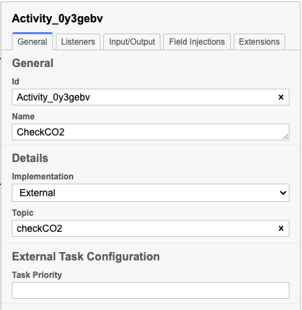
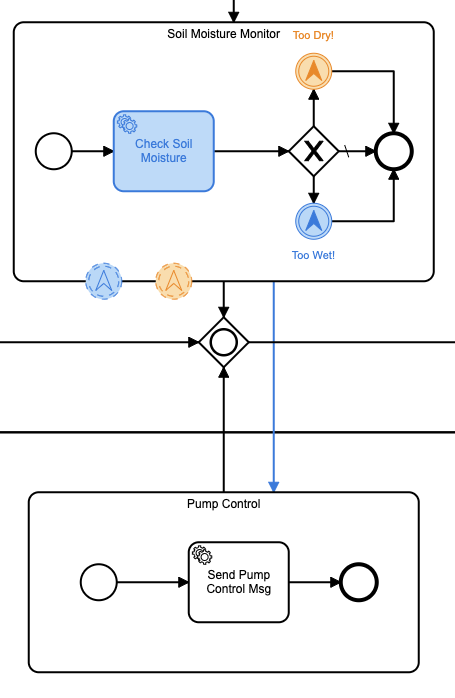

**Hinweis:** Ursprünglich veröffentlicht auf [DZone](https://dzone.com/articles/a-camunda-greenhouse-part-3), also vergiss nicht, ihm dort drüben ein ❤️ zu geben!

## Ausführen dieses Projekts

1) Klonen Sie das Repository
2) `cd` in das Projektverzeichnis:
1) Stellen Sie die Prozessdefinition „co2.bpmn“ auf Ihrem Camunda-Server bereit
2) `cd` in das `task-worker` Verzeichnis:
1) Führen Sie „go mod tidy“ aus, um das „task-worker“-Modul zu aktualisieren
2) Passen Sie alle konstanten Werte in der Datei „task-handler.go“ an
3) Führen Sie „go run task-handler.go“ aus
3) cd in das Verzeichnis „arduino-code“.
1) Öffnen Sie die Datei „Greenhouse.ino“ in der Arduino IDE
2) Passen Sie alle konstanten Werte in `Greenhouse.ino` an
3) Stellen Sie den Arduino-Code auf Ihrem Arduino-Board bereit
3) Viel Spaß!


## Beurteilung

Wenn Sie dieses (unglaublich langsame) Projekt verfolgt haben, dann haben Sie bereits [Teil 1](https://dzone.com/articles/a-proof-of-concept-for-camunda-platform-bpmn -mit) und [Teil 2](https://dzone.com/articles/camunda-iot-proof-of-concept-part-ii) und habe mich gefragt, ob Teil 3 jemals erscheinen würde. Nun, hier ist es! Dies ist der Teil, in dem ich alle vorherigen Teile zusammenführe und tatsächlich ein [Camunda](https://camunda.com?ref=davidgsiot) BPMN-betriebenes IoT-Gewächshaus einsetze!

Um nur ein bisschen nachzudenken, habe ich vorgeschlagen, ein Gewächshaus zu bauen, das von einigen IoT-Sensoren überwacht wird und dann vollständig von einem [Camunda](https://camunda.com?ref=davidgsIoT) BPMN-Prozess gesteuert wird. Der gesamte Prozess würde dann alle Aspekte des Gewächshauses steuern.

## Wie es läuft

Zuvor habe ich eine Wetterstation eingesetzt, die alle Außenwetterbedingungen überwachte, damit ich sie mit den Messwerten aus dem Gewächshaus korrelieren und entscheiden konnte, ob das Öffnen eines Fensters zur Kühlung oder Verringerung der Luftfeuchtigkeit im Inneren beitragen würde. Die Wetterstation ist jetzt seit einigen Monaten in Betrieb und es war an der Zeit, die Sensoren tatsächlich zu bauen und im Gewächshaus einzusetzen.

Bevor sich jemand aufregt, habe ich tatsächlich kein Gewächshaus in voller Größe oder sogar ein großes Gewächshaus in meinem Garten aufgestellt (so viel ich wollte). Stattdessen habe ich klein angefangen mit einem Tischgewächshaus (oder was man auch Terrarium nennen könnte).


Wie Sie sehen können, ist es nicht allzu groß, aber es hat eine Dachplatte, die ich öffnen und schließen kann, also reicht es hier für den Machbarkeitsnachweis.

## Die Sensoren

Um das Gewächshaus zu überwachen, wollte ich sicherstellen, dass ich eine Reihe von Sensoren habe, die die grundlegenden Umweltbedingungen im Gewächshaus verfolgen können. Ich entschied, dass die wichtigsten zu überwachenden Dinge Temperatur, Feuchtigkeit, CO2-Konzentration und Bodenfeuchtigkeit für die Pflanzen waren (mehr zu den „Pflanzen“ später).

Sie werden vielleicht feststellen, dass dies im Wesentlichen die gleichen Sensoren waren, die ich im Freien eingesetzt habe (mit Ausnahme der Wind-, Regen- und Blitzsensoren). Das war kein Zufall, denn ich wollte Daten zwischen den Paaren von Innen- und Außensensoren korrelieren können.

| Sensor | Messung | Teil-URL | Kosten |
|:---------------------:|:---------------------:|:--- -------------------------------------------------- -------------------:|:------:|
| Bodenfeuchte | Bodenfeuchte | [Sparkfun Bodenfeuchtesensor](https://www.sparkfun.com/products/13322) | $5,95 |
| SCD30 | CO2, Temperatur, Luftfeuchtigkeit | [Adafruit SCD 30 Ausbruch](https://www.adafruit.com/product/4867) | $58,95 |

Nachdem ich die Messwerte zwischen mehreren Sensoren verglichen hatte, entschied ich, dass die Temperatur- und Feuchtigkeitsmesswerte des SCD30 genau genug waren, dass ich keinen BME280 oder einen anderen Temperatur-/Feuchtigkeitssensor neben dem SCD30 einsetzen musste.

Zusätzlich zu den Sensoren brauchte ich einige _Aktuatoren_ im Gewächshaus, um Dinge wie das Öffnen der Tür, einen Ventilator und eine Pumpe zu tun, um die Pläne mit Wasser zu versorgen. Hier ist, was ich für diese Aktuatoren verwendet habe:

| Aktuator | Zweck | Teil-URL | Kosten |
|-------------|--------------------------------|-- -------------------------------------------------- -----------|-------|
| Abluftventilator | Luft aus dem Gewächshaus entfernen | [Adafruit RPi-Lüfter](https://www.adafruit.com/product/3368) | $3,50 |
| MG90D-Servo | Öffnen/schließen Sie die Lüftungsöffnung des Gewächshauses | [Adafruit MG90D-Servo](https://www.adafruit.com/product/1143) | 9,95 $ |

Das ist alles Material aus dem Weg! Jetzt musste ich nur noch alles zusammenziehen und im Gewächshaus einsetzen.

## Aufbau der Gewächshaussensoren

Ursprünglich hatte ich geplant, separate Mikrocontroller (die ESP-32-Boards) für jeden Sensor oder Aktor zu haben, aber ich erkannte schnell, dass dies angesichts der Platzbeschränkungen des winzigen Gewächshauses unpraktisch wäre. Stattdessen entschied ich mich für eine ESP-32-Platine, die alle Sensoren und Aktoren überwachen würde.

Ich habe mir eine vollständige Schaltung (eigentlich eine Reihe von Schaltungen) auf einer Prototyping-Platine gebaut, um die Dinge so kompakt wie möglich zu halten.


Wie Sie sehen, ist dort _viel_ los! Also lassen Sie mich ein bisschen erklären. Die große rote Platine in der Mitte ist die ESP-32-Platine, die ich verwende. Es ist alles (mit _sehr_ dünnem Anschlussdraht) mit dem Lüfter und der Pumpe (die Drähte auf der linken Seite), dem Servo (der Anschluss auf der linken Seite) und dem Bodenfeuchtesensor (die gelben, violetten und schwarzen Drähte auf der links).

Wenn Sie genau hinsehen, sehen Sie links eine Reihe von Schaltkreisen, die mit diesen Drähten verkeilt sind, also werde ich das ein wenig detaillierter beschreiben.

Eine Sache, auf die Sie immer achten sollten, wenn Sie einen Motor an einen Mikrocontroller anschließen, ist die Möglichkeit eines Impulses mit im Wesentlichen umgekehrter Spannung, wenn Sie den Motor ausschalten. Die meisten Motoren sind für eine 5-V-Gleichstromversorgung ausgelegt. Wenn Sie den Motor also aus- und wieder einschalten, erhalten Sie einen Impuls mit umgekehrter Spannung. Sie können Ihr Mikrocontroller-Board leicht zerstören, wenn Sie keinen Schaltungsschutz hinzufügen. Um das zu verhindern, habe ich eine sogenannte Flyback-Diode in diese Regler eingebaut.


Es besteht aus einer Diode, einem kleinen 220 kOhm Widerstand und einem Transistor zum Ein- und Ausschalten des Motors. Der Mittelschenkel des Transistors ist (über einen 220-K-Ohm-Widerstand) mit dem Mikrocontroller-Pin verbunden, mit dem ich den Motor ein- und ausschalte. Dadurch kann ich den Motor mit 5 V anstelle der minimalen Spannung, die vom I / O-Pin geliefert wird, ein- und ausschalten.

Ich musste einen davon auf jeden der angeschlossenen Motoren setzen. Das Servo hat eine eingebaute Flyback-Diode, so dass ich keine für das Servo bauen musste.

Der Bodenfeuchtesensor ist ein einfacher analoger Widerstandssensor, daher wird wiederum keine Freilaufdiode benötigt.

Auf der Unterseite dieses Boards passiert die ganze Magie. Sie können all den winzigen, dünnen Anschlussdraht sehen, mit dem ich alles verbunden habe. Das Löten mit diesem Draht ist nicht einfach, daher empfehle ich es nicht für Anfänger.


Ich musste einen externen Akku verwenden, um den Strom für das Servo zu liefern, da das ESP-32 einfach nicht in der Lage war, genügend Spannung zu liefern. Es könnte das Servo _bewegen_, aber bei Bedarf nicht an Ort und Stelle halten.

Der CO <sub>2</sub> -Sensor war am einfachsten anzuschließen, da ich einen mit einem QIIC-Anschluss für den I2C-Bus verwendet habe. Alles, was ich tun musste, war, es an den QIIC-Anschluss auf der ESP-32-Platine anzuschließen, und ich war fertig. Zumindest mit dem Hardwareteil!

Nun ging es an den Softwareteil.

## Schreiben der Software

Ich habe dies alles mit dem Arduino als Ausgangspunkt geschrieben, da das ESP-32 eine großartige Arduino-Unterstützung bietet. Zu Beginn musste ich sicherstellen, dass ich alle richtigen Bibliotheken installiert und alle Pins zur Steuerung von allem definiert hatte:

```Cpp
#include <WiFiClientSecure.h>
#include <PubSubClient.h>
#include <InfluxDbClient.h>
#include <Wire.h>
#include "ESP32Servo.h"
#include "SparkFun_SCD30_Arduino_Library.h"
#include <DNSServer.h>
#include <ESPmDNS.h>
#include <WiFiUdp.h>
#include <ArduinoJson.h>

#define SERVO_PIN 19
#define FAN_CTL 15
#define PUMP_CTL 18
#define SOIL_CTL 32
#define SOIL A2
```

Das war alles, was ich dafür brauchte. Jetzt war es an der Zeit sicherzustellen, dass alles korrekt eingerichtet und initialisiert wurde.

```cpp
void setup() {
  Serial.begin(115200);
  pinMode(FAN_CTL, OUTPUT);
  digitalWrite(FAN_CTL, HIGH);
  Serial.println("Fan set up complete...");
  pinMode(PUMP_CTL, OUTPUT);
  digitalWrite(PUMP_CTL, LOW);
  Serial.println("Pump set up complete...");
  pinMode(SOIL, INPUT);
  pinMode(SOIL_CTL, OUTPUT);
  digitalWrite(SOIL_CTL, LOW);
  Serial.println("Soil sensor set up complete...");
  Wire.begin();
  delay(1000);
  if (airSensor.begin() == false) {
    Serial.println("Air sensor not detected. Please check wiring. Freezing...");
    while (1)
      ;
  }
  Serial.println("Air sensor detected. ");
  Serial.println("Initializing Servo...");
  ESP32PWM::allocateTimer(0);
  ESP32PWM::allocateTimer(1);
  ESP32PWM::allocateTimer(2);
  ESP32PWM::allocateTimer(3);
  door_ctl.setPeriodHertz(50); // standard 50 hz servo
  door_ctl.attach(SERVO_PIN, 1000, 2000);
  door_ctl.write(0);
  delay(1000);
  door_ctl.write(90);
  delay(1000);
  door_ctl.write(180);
  delay(1000);
  door_ctl.write(90);
  delay(1000);
  door_ctl.write(0);
  Serial.println("Servo set up complete...");
  Serial.println("Initializing WiFi...");
  WiFi.mode(WIFI_STA);
  Serial.print("Connecting to wifi");
  setup_wifi();
  while (WiFi.begin(SID, PASSWORD) != WL_CONNECTED) {
    Serial.print(".");
    delay(100);
  }
  Serial.println("");
  Serial.println("WiFi connected");
  Serial.println("Setting up MQTT ...");
  mqttClient.setServer(MQTT_SERVER, MQTT_PORT);
  mqttClient.setCallback(incoming_MQTT);
  Serial.println("MQTT set up complete...");
  timeSync(TZ_INFO, "pool.ntp.org", "time.nis.gov");
  myPoint.addTag("sensor", "GRN_CO2");
  myPoint.addTag("location", "Apex");
  myPoint.addTag("Sensor_id", SENSOR_ID);
  Serial.println("Ready");
}
```

Zugegeben, da ist viel los (und das ist noch lange nicht alles!), also werde ich einiges erklären. Ich begann mit der Einrichtung der Stifte für den Lüfter und die Pumpe. Seltsamerweise war einer von ihnen „an“, wenn der Stift „hoch“ getrieben wurde, während der andere, wenn der Stift „niedrig“ getrieben wurde. Das war die Quelle einiger Bestürzung, glauben Sie mir.

Als nächstes richte ich den Bodenfeuchtesensor ein. Ich habe es von einem E / A-Pin gesteuert, weil ich nicht wollte, dass es die ganze Zeit eingeschaltet ist, da dies unnötige Energie verbrennen würde.

Ich habe dann den CO <sub>2</sub> Sensor eingerichtet. Ich habe eine Ausfallsicherung eingebaut, damit das Ganze aufhört, wenn der Sensor nicht da ist oder nicht gefunden werden kann. Andernfalls würde es später, wenn ich versuchte, den Sensor auszulesen, schlecht laufen.

Ich habe die ESP32PWM-Bibliothek verwendet, um das Servo zu steuern, also musste ich einen Timer für die Servos zuweisen und dann das Servo an den Pin anschließen. Ich musste auch die Periode des Servos auf 50 Hz einstellen. Ich habe einen Testcode eingefügt, damit das Servo seine voreingestellten Bewegungen durchläuft, nur um ein visuelles Feedback zu erhalten, dass es funktioniert.

Als nächstes musste ich einen MQTT-Client einrichten, damit ich Nachrichten an das Gerät zurücksenden konnte, um es zu steuern.

```cpp
  mqttClient.setServer(MQTT_SERVER, MQTT_PORT);
  mqttClient.setCallback(incoming_MQTT);
  Serial.println("MQTT set up complete...");
  Serial.println("");
  timeSync(TZ_INFO, "pool.ntp.org", "time.nis.gov");
```

Ich synchronisiere die Zeit in meinem gesamten Code, weil ich gerne TLS für die Kommunikation verwende und es empfindlich auf Zeitabweichungen reagieren kann.

## Speichern der Sensordaten

Es gibt viele Möglichkeiten, zu entscheiden, wo und wie Sie Ihre Sensordaten speichern. Ich habe mich diesmal für influxdb entschieden, weil ich die Wetterstationsdaten bereits in influxdb gespeichert habe und ich wusste, dass ich die Daten einfach so abfragen kann, dass ich die Wetterstationsdaten mit den Gewächshausdaten synthetisieren kann.

Ich habe die Arduino InfluxDB-Bibliothek verwendet, um die Daten zu verbinden und zu speichern.

```cpp
influx.setWriteOptions(WriteOptions().writePrecision(WritePrecision::MS));
  influx.setWriteOptions(WriteOptions().batchSize(10).bufferSize(50));
 WiFiClientSecure *client = new WiFiClientSecure;
  if (client) {
    client->setCACert(AlphaSSLCA);
    // Check server connection
    if (influx.validateConnection()) {
      Serial.print("Connected to InfluxDB: ");
      Serial.println(influx.getServerUrl());
    } else {
      Serial.print("InfluxDB connection failed: ");
      Serial.println(influx.getLastErrorMessage());
      //  waitForInflux();
    }
  }
  myPoint.addTag("sensor", "GRN_CO2");
  myPoint.addTag("location", "Apex");
  myPoint.addTag("Sensor_id", SENSOR_ID);
  Serial.println("Ready");
```

Das richtet meinen influxdb-Client so ein, dass er eine sichere Verbindung verwendet, und richtet ein „dataPoint“-Objekt mit den Tags ein, die ich verwenden möchte. Sobald all dies erledigt war, war der Prozess eingerichtet und einsatzbereit!

## Die Hauptschleife

Wie sich herausstellt, ist die Hauptschleife dafür ziemlich klein. Im Gegensatz zu vielen Arduino-Programmen verwende ich die `delay()`-Funktion nicht für das Timing, da ich möchte, dass das Gerät durch alle eingehenden MQTT-Nachrichten unterbrechbar ist.

```cpp
void loop() {
  if (!mqttClient.connected()) {
    reconnect();
  }
  mqttClient.loop();
  unsigned long currentMillis = millis();
  if (currentMillis - lastCO2Millis >= readingInterval) {
    lastCO2Millis = currentMillis;
    myPoint.clearFields();
    if (influx.isBufferFull()) {
      influx.flushBuffer();
    } if (airSensor.dataAvailable()) {
      co2 = airSensor.getCO2();
      float temp_c = airSensor.getTemperature();
      float hum = airSensor.getHumidity();
      int rssi = WiFi.RSSI();
      float temp_f = temp_c * 9.0 / 5.0 + 32.0;
      myPoint.addField("co2", co2);
      myPoint.addField("RSSI", rssi);
      myPoint.addField("temp_c", temp_c);
      myPoint.addField("humidity", hum);
      myPoint.addField("temp_f", temp_f);
    }
    digitalWrite(SOIL_CTL, HIGH);
    delay(10);
    int soil = analogRead(SOIL);
    digitalWrite(SOIL_CTL, LOW);
    myPoint.addField("soil", soil);
    influx.writePoint(myPoint);
  }
}
```

Jedes Mal, wenn ich die Schleife durchlaufe, stelle ich sicher, dass ich mit dem MQTT-Broker verbunden bin, und stelle sicher, dass ich den MQTT-Client bediene, falls Nachrichten eingehen. Da es keinen `delay()`-Aufruf gibt, bedeutet dies, dass der MQTT-Client mit großer Häufigkeit bedient wird.

Wenn es an der Zeit ist, Messwerte aufzunehmen und zu speichern, sammle ich alle Daten und sende sie an influxdb. Ich überprüfe den Puffer und sende jedes Mal alle Daten, wenn er voll ist.

Und ja, ich könnte die Konvertierung von Fahrenheit in Celsius in der Datenbank durchführen, aber ehrlich gesagt habe ich viel von diesem Boilerplate-Code aus meiner Zeit bei InfluxData übrig und ich neige dazu, nur funktionierende Sachen wiederzuverwenden.

## Steuerung des Gewächshauses

Der ganze Sinn dieses Projekts war es, es mit [Camunda](https://camunda.com?ref=davidgsiot) steuern zu können, also ist es an der Zeit, sich damit zu beschäftigen!


Ich gebe Ihnen eine Minute Zeit, um zu Atem zu kommen, bevor ich mich darauf einlasse, es zu erklären.

Zuerst der einfache Teil. Ich beginne den gesamten Prozess mit einem Timer-Ereignis, das alle 2 Minuten ausgelöst wird. In einem realen Szenario muss ich es wirklich nicht so häufig ausführen, aber ich wollte sicherstellen, dass ich sehen kann, wie die Dinge laufen und sich ändern, also habe ich den Timer sehr niedrig eingestellt.

Dieses Timer-Ereignis startet eine Reihe von Unterprozessen über einige parallele Gateways. Ich möchte, dass alle diese Teilprozesse gleichzeitig ausgeführt werden, also ist dies der Weg, dies zu erreichen.

Ich werde einen der Teilprozesse im Detail durchgehen, aber ich weiß nur, dass jeder von ihnen im Wesentlichen gleich ist.


Dieser Unterprozess ruft einen externen Dienst auf (auf den ich gleich noch zu sprechen komme), um den aktuellen CO <sub>2</sub> -Gehalt abzurufen. Anschließend vergleicht es diesen Schwellenwert mit den verschiedenen Schwellenwerten, die ich festgelegt habe, und sendet eine Nachricht an den MQTT-Broker, um eine entsprechende Aktion basierend auf dem Level auszulösen. Ich habe sie farbcodiert, damit man leicht erkennen kann, was wann passiert.

Das Schöne an der Verwendung von Camunda zur Steuerung des Prozesses ist, dass ich, falls sich die Bedürfnisse der Pflanzen ändern sollten, keinen der Sensoren neu codieren muss. Ich kann einfach in dieses Modell einsteigen, neue Schwellenwerte festlegen und den Prozess erneut implementieren. Dies ist der wirklich wichtige Teil bei der Verwendung von Camunda, um alles zu kontrollieren. Ich plane tatsächlich, zurückzugehen und Camunda in eine Reihe älterer Sensorprojekte zu integrieren, die ich habe und die fest codierte Schwellenwerte und Einstellungen verwenden, sodass ich alles von einer Prozessmanagementanwendung aus einstellen und ändern kann, anstatt es tun zu müssen jedes Mal alles neu kompilieren.

In der Welt des IoT kann die Bereitstellung neuer Firmware leicht ein _sehr_ teurer und zeitaufwändiger Prozess sein, so dass Sie auf diese Weise enorme Einsparungen erzielen können.

## Der externe Dienst

Wie gesagt, die Abwicklung der Datenbankabfrage erfolgt über einen externen Dienst. Ich bin ziemlich verliebt in Go, also habe ich den externen Dienst damit geschrieben.

Dieser Dienst verwendet 3 wichtige Bibliotheken:

- Die [Camunda Client](https://github.com/citilinkru/camunda-client-go/v2)-Bibliothek
- Die Bibliothek [Paho MQTT](https://github.com/eclipse/paho.mqtt.golang).
- Die Bibliothek [InfluxDB v2](https://github.com/influxdata/influxdb-client-go/v2).

Dadurch kann ich auf Arbeit aus dem Camunda-Prozess lauschen, die Datenbank abfragen und dann bei Bedarf Nachrichten an den MQTT-Broker senden.

Als erstes muss der Camunda-Client eingerichtet werden:

```go
client := camundaclientgo.NewClient(camundaclientgo.ClientOptions{
		UserAgent:   "",
		EndpointUrl: "http://localhost:8080/engine-rest",
		Timeout: time.Second * 10,
		ApiUser: "demo",
		ApiPassword: "demo",
	},
	)
	asyncResponseTimeout := 5000
	// get a process instance to work with
```

Das ist der Client, den der Rest des Prozesses verwenden wird. Als nächstes brauche ich einen Camunda-Prozessor, damit ich nach Aufgaben lauschen kann.

```go
	proc := processor.NewProcessor(client, &processor.ProcessorOptions{
		WorkerId:                  "GreenHouseHandler",
		LockDuration:              time.Second * 20,
		MaxTasks:                  10,
		MaxParallelTaskPerHandler: 100,
		LongPollingTimeout:        25 * time.Second,
		AsyncResponseTimeout:      &asyncResponseTimeout,
	}, logger)
	log.Debug("Processor started ... "
```
Jetzt, da ich einen Prozessor habe, kann ich damit beginnen, Handler hinzuzufügen, um auf die spezifischen Themen zu hören, die ich behandeln möchte.

```go
	// add a handler for checking the existing Queue
	proc.AddHandler(
		&[]camundaclientgo.QueryFetchAndLockTopic{
			{TopicName: "checkCO2"},
		},
		func(ctx *processor.Context) error {
			return checkCO2(ctx.Task.Variables, ctx)
		},
	)
```

Dieser spezielle Handler lauscht auf Nachrichten zum Thema „checkCO2“. Es ruft dann die Funktion "checkCO2" auf, um die Arbeit zu erledigen.

Ich habe das Thema `checkCO2` im Eigenschaftsfenster für die externe Aufgabe in Camunda Modeler definiert.



Schauen wir uns also die Funktion `chekcCO2()` an.

```go
func checkCO2(variables map[string]camundaclientgo.Variable, ctx *processor.Context) error {
	// Create a new client using an InfluxDB server base URL and an authentication token
	client := influxdb2.NewClient("https://influxserver.com:8086", "long_influxdb_token_string")
	// Get query client
	queryAPI := client.QueryAPI("influxdata")
	// get QueryTableResult
	result, err := queryAPI.Query(context.Background(), `from(bucket: "telegraf")
  |> range(start: -1m)
  |> filter(fn: (r) => r["_measurement"] == "greenhouse")
  |> filter(fn: (r) => r["_field"] == "co2" )` )
	var averageCO2 float64 = 0.00
	var numResults int = 0
	if err == nil {
		// Iterate over query response
		for result.Next() {
			// Access data
			foo := fmt.Sprintf("%v", result.Record().Value())
			foo64, err := strconv.ParseFloat(foo, 64)
			if err != nil {
				fmt.Println("bad value!")
        return err
			}
			averageCO2 = averageCO2 + foo64
			numResults++
		}
		// check for an error
		if result.Err() != nil {
			fmt.Printf("query parsing error: %s\n", result.Err().Error())
		}
		averageCO2 = (averageCO2 / float64(numResults))
		if math.IsNaN(averageCO2) {
			fmt.Println("Bad value! No donut!")
			averageCO2 = 0.00
		}
		varb := ctx.Task.Variables
		varb["co2"] = camundaclientgo.Variable{
      Value: averageCO2,
      Type: "double"
    }
		err := ctx.Complete(processor.QueryComplete{Variables: &varb})
		if err != nil {
			log.Error("queuStatus: ", err)
			return err
		}
	} else {
		log.Error("queuStatus: ", err)
		return err
	}
	Crop.CO2 = averageCO2
	// Ensures background processes finishes
	client.Close()
	return nil
}
```

Das ist also eine Menge Go-Code! Wenn Sie mit Go nicht vertraut sind, haben Sie höchstwahrscheinlich keine Ahnung, was das alles bewirkt, also gehen wir es durch. Zuerst erstelle ich einen neuen Client mit der InfluxDB-Clientbibliothek. Ich brauche das, um die Datenbank abzufragen. Als nächstes kommt die eigentliche Abfrage, die in „Flux“ geschrieben ist, der Abfragesprache, die InfluxData erfunden hat, um ihre Datenbank abzufragen. Ich verwende die "from"-Funktion, um den Bucket anzugeben, den ich abfragen möchte. Dann verwende ich die `range`-Funktion, um den Zeitbereich anzugeben. Dann verwende ich die "Filter"-Funktion, um die Daten herauszufiltern, die ich abfragen möchte. Der Bereich ist nur die letzte Minute, und wenn ich wollte, könnte ich Flux auch die letzten 'n' Minuten abfragen lassen und den Durchschnitt selbst zurückgeben, aber ich mache es hier nur zum Spaß.

Sobald ich den Durchschnitt berechnet habe, muss ich diesen Wert an den Camunda-Prozess zurückgeben, also erstelle ich eine Prozessvariable und setze sie auf den berechneten Durchschnitt.

Ich gebe diese Variable dann an die Camunda-Engine zurück und sage ihr, dass ich die Aufgabe abgeschlossen habe. Das ist alles.

Ich habe einen dieser Prozesshandler für jede der Datenbankabfragen geschrieben, die ich machen wollte, damit jede Datenbankabfrage als separate Aufgabe behandelt werden kann.

Einige von Ihnen haben vielleicht bemerkt, dass ich keine der Daten von der Wetterstation verwendet habe, um diese Entscheidungen zu treffen. Sie haben vollkommen recht. Hier ist der Grund: Das kleine Gewächshaus sitzt drinnen auf einem Schreibtisch. Die äußeren Bedingungen haben also absolut keinen Einfluss darauf, welche Öffnungsöffnungen usw. das Gewächshaus beeinflussen würden. Also habe ich sie weggelassen.

## Maßnahmen von Camunda ergreifen

Wie wir oben gesehen haben, ruft die Camunda-Engine jeden dieser Unterprozesse auf, um die Datenbank gleichzeitig (oder nahe bei ihr) abzufragen. Sobald die Abfrage abgeschlossen ist, wird der richtige Wert zurückgegeben und die Camunda-Engine fährt mit der Verarbeitung der nächsten Aufgabe fort.

Diese Abfragetasks werden dann entweder einfach beendet (wenn nichts zu tun ist) oder sie lösen ein Intermediate Escalation Event aus, je nachdem, welcher Schwellenwert überschritten wird. Schauen wir uns dazu an, was passiert, wenn wir den Bodenfeuchtesensor abfragen.



Dieser Teilprozess hat 2 Eskalationszustände: zu nass und zu trocken. Das ist es. Die Camunda-Engine löst dieses Eskalationsereignis abhängig vom Ergebnis aus. Wir haben dann _einen anderen_ Teilprozess, der herumsitzt und darauf wartet, dass eines dieser Eskalationsereignisse eintritt. Dieser Teilprozess steuert die Pumpe, die die Pflanzen bewässert. Bei zu trockener Bodenfeuchte wird die Pumpe eingeschaltet. Wenn die Bodenfeuchte zu nass ist, wird die Pumpe abgeschaltet.

* Randnotiz: * Die kleine Wasserpumpe, die ich verwendete, war übermäßig in der Lage, Wasser zu pumpen. Wenn sie auch nur für eine Minute eingeschaltet blieb, wurde das gesamte Gewächshaus überschwemmt, sodass ich dies später anpassen musste, um die Pumpe je nach Bodenfeuchte für eine bestimmte Zeit einzuschalten. Das Maximum, das ich jemals eingeschaltet hatte, war nicht länger als 7 Sekunden. Ich habe mich für einen Wert von 5 Sekunden entschieden.

Werfen wir einen Blick darauf, wie dieser Teilprozess funktioniert. Der Unterprozess Bodenfeuchteüberwachung benachrichtigt den Unterprozess Pumpensteuerung, wenn wir die Pumpe ein- oder ausschalten müssen. Wenn der Boden zu trocken ist, enthält das Eskalationsereignis den folgenden JSON:

```json
{
  "sensor": "soil-dry",
  "commands" : {
    "fan": "none",
    "vent": "none",
    "pump": "on"
  }
}
```

Tatsächlich enthalten alle Eskalationsereignisse ein ähnliches JSON-Objekt, das die durchzuführenden Aktionen enthält. In der Tat, wenn wir uns das Eskalationsereignis „CO2-kritisch“ ansehen, sehen wir:

```json
{
  "sensor": "co2-critical",
  "commands" : {
    "fan": "on",
    "vent": "open",
    "pump": "none"
  }
}
```

Denn wenn das CO <sub>2</sub> hoch ist, müssen wir alles tun, um es zu senken, und zwar schnell! Also schalten wir den Lüfter ein und öffnen die Entlüftung ganz.

Die „action“-Unterprozesse übernehmen dann diese JSON-Payloads in den Eskalationsereignissen und stellen sie in die Warteschlange eines anderen externen Prozesses mit dem Namen „control“.

Lassen Sie uns auch diese externe Implementierung durchgehen. Ich werde es aufteilen, damit es keine Codewand ist, damit ich es Stück für Stück durchgehen kann.

```go
func control(variables map[string]camundaclientgo.Variable,ctx *processor.Context) error {
	var tlsConf *tls.Config = nil
	tlsConf = &tls.Config{
		InsecureSkipVerify: true,
	}
	var opts = mqtt.ClientOptions{
		ClientID: "greenhouse",
		Username: "",
		Password: "",
		TLSConfig:            tlsConf,
		KeepAlive:            0,
		PingTimeout:          0,
		ConnectTimeout:       time.Second * 10,
		MaxReconnectInterval: 0,
		AutoReconnect:        false,
		ConnectRetryInterval: 0,
		ConnectRetry:         false,
		Store:                nil,
	}
  opts.AddBroker("tcp://my-broker.com:8883")
	opts.SetClientID("greenhouse")
	opts.SetMaxReconnectInterval(time.Second * 10)
	var client = mqtt.NewClient(&opts)
	token := client.Connect()
	for !token.WaitTimeout(3 * time.Second) {
	}
	if err := token.Error(); err != nil {
		return err
	}
  ```

This is all really just the setup code for using the [Paho MQTT](https://github.com/eclipse/paho.mqtt.golang) client. My MQTT broker uses TLS, so I have to set that up as well.

```go
eingehende := ControlMsg{}
varb := fmt.Sprintf("%v", ctx.Task.Variables["action"].Value)
fmt.Printf ("Roh:% v \ n", varb)
err := json.Unmarshal([]byte(varb), &amp;eingehend)
wenn err != nil {
Fehler zurückgeben
}
fmt.Println("Eingehender Sensor: ", eingehender.Sensor)
fmt.Printf("Eingehende Befehle: %v\n", eingehende.Befehle)
```
As with the previous external task handler, I get the variables from the process engine that I need. Since I sent those variables as a JSON object, I can unmarshal the data into my `ControlMsg` struct.

Wait, I didn't share that with you!

```go
Typ ControlMsg struct {
Sensor-String `json:"sensor"`
Befehle struct {
Fanstring `json:"fan"`
Entlüftungszeichenfolge `json:"vent"`
Pump-String `json:"pump"`
} `json:"Befehle"`
}
```

That should look suspiciously like the JSON object that was in the escalation event.

Now that I have those messages, I can turn around and publish them to the MQTT broker.

```go
t := client.Publish("Gewächshaus", 0, falsch, varb)
gehe func() {
_ = t.Warten()
if t.Error() !=nil {
log.Error(t.Error())
}
}()
```

Once the mqtt message is sent, I can then complete the process just as I've done before:

```go
varbs := ctx.Aufgabe.Variablen
varbs[eingehend.Sensor] = camundaclientgo.Variable{
Wert: eingehender.Sensor + "abgeschlossen",
Typ: "Zeichenfolge"
}
err = ctx.Complete(processor.QueryComplete{Variablen: &amp;varbs})
wenn err != nil {
log.Error("queuStatus: ", err)
Fehler zurückgeben
}
client.Trennen (250)
Null zurückgeben
}
```

And now the message has been sent, and the ESP-32 controller in the greenhouse will receive that message and act on it appropriately.

Since I left that part of the Arduino code out earlier, let's take a look at that now:

```cpp
void eingehende_MQTT(char *topic, byte *payload, unsigned int length) {
StaticJsonDocument <200> doc;
DeserializationError error = deserializeJson(doc, payload);
wenn (Fehler) {
Serial.println (error.f_str());
Rückkehr;
}
const char *fan = doc["Befehle"]["fan"];
const char *vent = doc["Befehle"]["vent"];
const char *pump = doc["commands"]["pump"];
wenn (Lüfter) {
if (strcmp(fan, "on") == 0) {
digitalWrite (FAN_CTL, NIEDRIG);
} else if (strcmp(fan, "off") == 0) {
digitalWrite (FAN_CTL, HIGH);
}
}
wenn (Pumpe) {
if (strcmp(pumpe, "on") == 0) {
digitalWrite (PUMP_CTL, HIGH);
} else if (strcmp(Pumpe, "aus") == 0) {
digitalWrite (PUMP_CTL, LOW);
}
}
wenn (entlüften) {
if (strcmp(vent, "open") == 0){
door_ctl.write (180);
Beitrag = 180;
} else if (strcmp(vent, "close") == 0) {
door_ctl.write (0);
Beitrag = 0;
} else if (strcmp(vent, "half") == 0) {
if(pos == 0 || pos == 180) {
door_ctl.write (90);
Beitrag = 90;
} sonst wenn (pos == 90) {
// schon halb
}
}
}
}
```

The external task handler sent the JSON object it received from the Camunda topic on to the MQTT broker, which then forwarded it on to the ESP-32, so this function deserializes the object into a JSON document. Once that's done. I can access the various fields of the document to decide what needs to happen.

Maybe you're starting to see now why I designed the escalation events the way I did!

I can act on all of the various control messages in the JSON, and then return. This code will actually flood my greenhouse because it simply turns the pump on or off, rather than turning it on for a specific time period.

```cpp
wenn (Pumpe) {
if (strcmp(pumpe, "on") == 0) {
digitalWrite (PUMP_CTL, HIGH);
Verzögerung (5000);
digitalWrite (PUMP_CTL, LOW);
}
}
```

Is a much better version of this as it only turns the pump on for 5 seconds at a time. Your values might differ, depending on the pump you're using.

In fact, had I realized the strength of the pump ahead of time, I would have made the length of time to turn the pump on part of the escalation event from the Camunda process so that I could compensate for different pumps at a higher level, rather than having to recompile and redeploy firmware depending on the pump.

## Conclusions

I hope that you can see the value of using a business process management platform to orchestrate an IoT process like this. I was skeptical at first myself until I started to see the overall benefits.

I could have made some things updateable over Over The Air updates, but this means recompiling and redeploying firmware.

I could have made the various levels of CO<sub>2</sub>, temperature, etc. hard-coded values, but then I'd have to recompile and re-deploy firmware to change to a crop that has different needs.

I could have made the various monitored levels part of the external process and forgone the entire BPMN orchestration, but then in order to change anything I'd have to have an engineer go in and make changes to the code.

By using a high-level BPMN process I can see the overall process at a glance. I can see what is monitored and what is acted on. I can even make changes to how the entire greenhouse runs without ever writing any code at all. Anyone could go in to the model, change the values for a new crop, redeploy the model with a single click, and change everything about how that crop is managed.

I have every intention of using Camunda to orchestrate and control most, if not all, of my IoT projects from here on out just so that I can more easily change how they run and how they function without all the re-compiling and deployment of firmware that I've been doing up to now.
