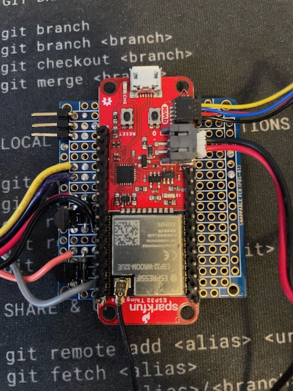
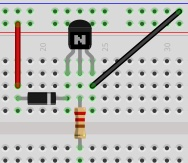
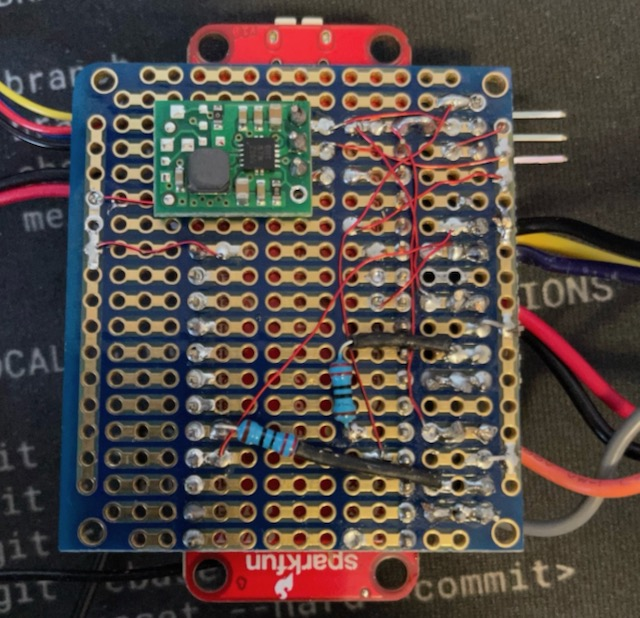
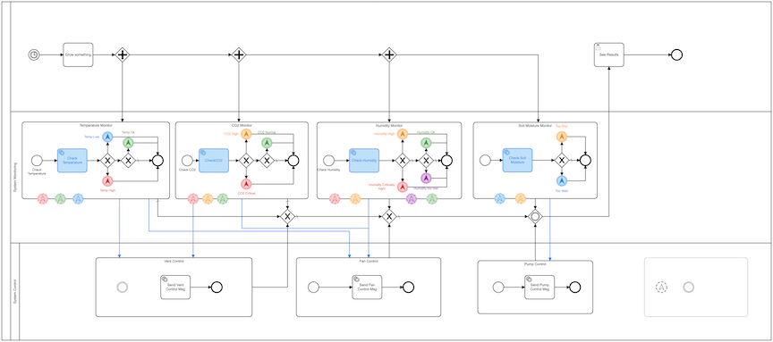
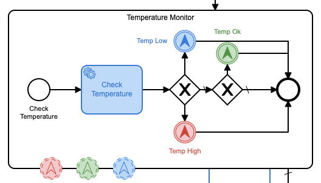
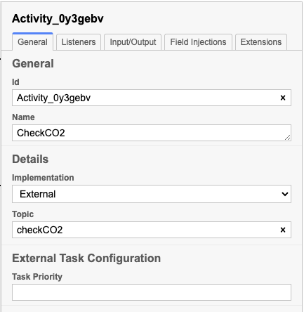
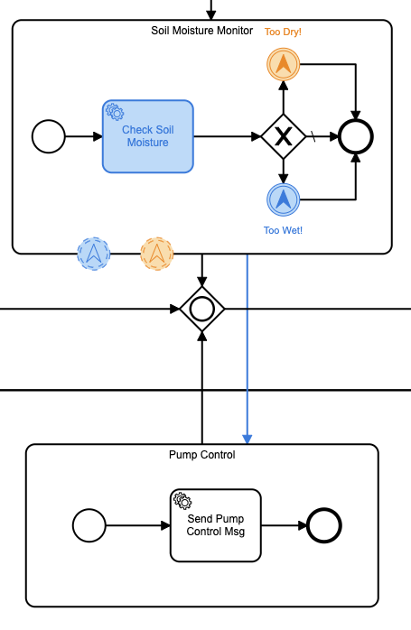

**Nota:** Publicado originalmente en [DZone](https://dzone.com/articles/a-camunda-greenhouse-part-3), ¡así que no olvides darle un poco de ❤️ allí!

## Ejecutando este proyecto

1) Clonar el repositorio
2) `cd` en el directorio del proyecto:
1) Implemente la definición del proceso `co2.bpmn` en su servidor Camunda
2) `cd` en el directorio `task-worker`:
1) ejecuta `go mod tidy` para actualizar el módulo `task-worker`
2) ajustar todos los valores constantes en el archivo `task-handler.go`
3) ejecutar `ir a ejecutar task-handler.go`
3) cd en el directorio `arduino-code`
1) abre el archivo `Greenhouse.ino` en el IDE de Arduino
2) ajustar todos los valores constantes en `Greenhouse.ino`
3) implemente el código Arduino en su placa Arduino
3) ¡Diviértete!


## Revisar

Si ha estado siguiendo este proyecto (increíblemente lento), entonces ya ha pasado por la [parte 1](https://dzone.com/articles/a-proof-of-concept-for-camunda-platform-bpmn-with) y [part 2](https://dzone.com/articles/camunda-iot-proof-of-concept-part-ii) y me preguntaba si alguna vez llegaría la parte 3. Bueno, ¡aquí está! ¡Esta es la parte en la que reúno todas las partes anteriores y de hecho implemento un [Camunda](https://camunda.com?ref=davidgsiot) Invernadero de IoT impulsado por BPMN!

Solo para revisar un poco, propuse construir un invernadero, monitoreado por algunos sensores IoT, que luego estaría completamente controlado por un proceso BPMN [Camunda] (https://camunda.com?ref=davidgsIoT). Todo el proceso controlaría todos los aspectos del Invernadero.

## Cómo va

Anteriormente, implementé una estación meteorológica que monitorearía todas las condiciones climáticas exteriores para poder correlacionarlas con las lecturas dentro del invernadero y decidir cosas como si abrir una ventana ayudaría a enfriar o reducir la humedad en el interior. La estación meteorológica ha estado en funcionamiento durante varios meses y ya era hora de construir los sensores e implementarlos en el invernadero.

Antes de que alguien se emocione, de hecho, no desplegué un invernadero de tamaño completo, o incluso uno grande, en mi jardín (por mucho que quisiera). En cambio, comencé poco a poco con un invernadero de escritorio (o lo que también podría llamarse un terrario).


Como puede ver, no es tan grande, pero tiene un panel de techo que puedo abrir y cerrar, por lo que servirá como prueba de concepto aquí.

## Los sensores

Para monitorear el invernadero, quería asegurarme de tener una cantidad de sensores que pudieran rastrear las condiciones ambientales básicas dentro del invernadero. Decidí que las cosas más importantes para monitorear eran la temperatura, la humedad, la concentración de CO2 y la humedad del suelo para las plantas (más sobre las 'plantas' más adelante).

Puede notar que estos eran en gran parte los mismos sensores que desplegué al aire libre (con la excepción de los sensores de viento, lluvia y rayos). Eso no fue por casualidad, ya que quería poder correlacionar los datos entre los pares de sensores interiores y exteriores.

| sensores | Medida | URL de la pieza | Costo |
|:-------------:|:--------------------------:|:--- -------------------------------------------------- -------------------:|:-------:|
| Humedad del suelo | Humedad del suelo | [Sensor de humedad del suelo Sparkfun](https://www.sparkfun.com/products/13322) | $5.95 |
| SCD30 | CO2, Temperatura, Humedad | [Desglose de Adafruit SCD 30](https://www.adafruit.com/product/4867) | $58,95 |

Después de comparar las lecturas entre varios sensores, decidí que las lecturas de temperatura y humedad del SCD30 eran lo suficientemente precisas como para no necesitar implementar un BME280 u otro sensor de temperatura/humedad junto con el SCD30.

Además de los sensores, iba a necesitar algunos _actuadores_ dentro del invernadero para hacer cosas como abrir la puerta, un ventilador y una bomba para suministrar agua a los planes. Esto es lo que usé para esos actuadores:

| Actuador | Propósito | URL de la pieza | Costo |
|-------------|--------------------------------|-- -------------------------------------------------- -----------|-------|
| Ventilador de escape | eliminar el aire del invernadero | [Ventilador RPi de Adafruit](https://www.adafruit.com/product/3368) | $3.50 |
| servomotor MG90D | Abrir/cerrar la ventilación del invernadero | [Adafruit MG90D Servo](https://www.adafruit.com/product/1143) | $9.95 |

¡Esos son todos los materiales fuera del camino! Ahora solo tenía que juntarlo todo y desplegarlo en el invernadero.

## Construyendo los sensores del invernadero

Originalmente, había planeado tener microcontroladores separados (las placas ESP-32) para cada sensor o actuador, pero rápidamente me di cuenta de que, dadas las limitaciones de espacio del diminuto invernadero, esto no sería práctico. En cambio, decidí tener una placa ESP-32 que monitoreara todos los sensores y actuadores.

Me construí un circuito completo (en realidad, un conjunto de circuitos) en una placa de prototipos para mantener las cosas lo más compactas posible.



Como puede ver, ¡muchas cosas están pasando allí! Así que déjame explicarte un poco. El tablero rojo grande en el medio es el tablero ESP-32 que estoy usando. está todo cableado (usando un cable de conexión _muy_ delgado) al ventilador y la bomba (los cables de la izquierda), el servo (el conector de la izquierda) y el sensor de humedad del suelo (los cables amarillo, morado y negro en el lado izquierdo). izquierda).

Si miras de cerca, verás un montón de circuitos encajados con esos cables de la izquierda, así que lo detallaré un poco.

Una cosa de la que siempre debe tener cuidado cuando conecta cualquier tipo de motor a un microcontrolador es la posibilidad de un pulso de voltaje esencialmente inverso cuando apaga el motor. La mayoría de los motores están diseñados para funcionar con un suministro de CC de 5 V, por lo que si apaga el motor y luego lo vuelve a encender, obtendrá un pulso de voltaje inverso. Puede arruinar fácilmente su placa de microcontrolador si no agrega alguna protección de circuito. Construí lo que se llama un diodo Flyback en estos controles para evitar eso.



Consiste en un diodo, una pequeña resistencia de 220k Ohm y un transistor para encender y apagar el motor. La pata central del transistor está conectada (a través de una resistencia de 220K Ohm) al pin del microcontrolador que uso para encender y apagar el motor. Esto me permite encender y apagar el motor usando 5v en lugar del voltaje mínimo suministrado por el pin de E/S.

Tuve que poner uno de esos en cada uno de los motores que conecté. El servo tiene un diodo flyback incorporado, por lo que no tuve que construir uno para el servo.

El sensor de humedad del suelo es un sensor de resistencia analógico simple, por lo que, de nuevo, no se necesita un diodo de retorno.

En la parte inferior de esta tabla es donde ocurre toda la magia. Puedes ver todo el cable de conexión pequeño y delgado que usé para conectar todo. Soldar con este cable no es fácil, por lo que no lo recomiendo para principiantes.



Tuve que usar una batería externa para suministrar la corriente al servo ya que el ESP-32 simplemente no era capaz de suministrar suficiente voltaje. Podría _mover_ el servo, pero no mantenerlo en su lugar cuando sea necesario.

El sensor de CO <sub>2</sub> fue el más fácil de conectar ya que usé uno que tenía un conector QIIC para manejar el bus I2C. Todo lo que tenía que hacer era conectarlo al conector QIIC en la placa ESP-32 y listo. ¡Al menos con la parte del hardware!

Ahora estaba en la parte del software.

## Escribiendo el software

Escribí todo esto usando el Arduino como punto de partida ya que el ESP-32 tiene un gran soporte para Arduino. Para comenzar, necesitaba asegurarme de tener todas las bibliotecas correctas en su lugar y todos los pines para controlar todo lo definido:

```Cpp
#include <WiFiClientSecure.h>
#include <PubSubClient.h>
#include <InfluxDbClient.h>
#include <Wire.h>
#include "ESP32Servo.h"
#include "SparkFun_SCD30_Arduino_Library.h"
#include <DNSServer.h>
#include <ESPmDNS.h>
#include <WiFiUdp.h>
#include <ArduinoJson.h>

#define SERVO_PIN 19
#define FAN_CTL 15
#define PUMP_CTL 18
#define SOIL_CTL 32
#define SOIL A2
```

Eso era todo lo que necesitaba para esos. Ahora era el momento de asegurarse de que todo estuviera configurado e inicializado correctamente.

```cpp
void setup() {
  Serial.begin(115200);
  pinMode(FAN_CTL, OUTPUT);
  digitalWrite(FAN_CTL, HIGH);
  Serial.println("Fan set up complete...");
  pinMode(PUMP_CTL, OUTPUT);
  digitalWrite(PUMP_CTL, LOW);
  Serial.println("Pump set up complete...");
  pinMode(SOIL, INPUT);
  pinMode(SOIL_CTL, OUTPUT);
  digitalWrite(SOIL_CTL, LOW);
  Serial.println("Soil sensor set up complete...");
  Wire.begin();
  delay(1000);
  if (airSensor.begin() == false) {
    Serial.println("Air sensor not detected. Please check wiring. Freezing...");
    while (1)
      ;
  }
  Serial.println("Air sensor detected. ");
  Serial.println("Initializing Servo...");
  ESP32PWM::allocateTimer(0);
  ESP32PWM::allocateTimer(1);
  ESP32PWM::allocateTimer(2);
  ESP32PWM::allocateTimer(3);
  door_ctl.setPeriodHertz(50); // standard 50 hz servo
  door_ctl.attach(SERVO_PIN, 1000, 2000);
  door_ctl.write(0);
  delay(1000);
  door_ctl.write(90);
  delay(1000);
  door_ctl.write(180);
  delay(1000);
  door_ctl.write(90);
  delay(1000);
  door_ctl.write(0);
  Serial.println("Servo set up complete...");
  Serial.println("Initializing WiFi...");
  WiFi.mode(WIFI_STA);
  Serial.print("Connecting to wifi");
  setup_wifi();
  while (WiFi.begin(SID, PASSWORD) != WL_CONNECTED) {
    Serial.print(".");
    delay(100);
  }
  Serial.println("");
  Serial.println("WiFi connected");
  Serial.println("Setting up MQTT ...");
  mqttClient.setServer(MQTT_SERVER, MQTT_PORT);
  mqttClient.setCallback(incoming_MQTT);
  Serial.println("MQTT set up complete...");
  timeSync(TZ_INFO, "pool.ntp.org", "time.nis.gov");
  myPoint.addTag("sensor", "GRN_CO2");
  myPoint.addTag("location", "Apex");
  myPoint.addTag("Sensor_id", SENSOR_ID);
  Serial.println("Ready");
}
```

Es cierto que están sucediendo muchas cosas allí (¡y eso no es todo!), así que explicaré algunas. Empecé a configurar los pines para el ventilador y la bomba. Curiosamente, uno de ellos estaba "encendido" cuando el pasador estaba "alto", mientras que el otro cuando el pasador estaba "bajo". Esta fue la fuente de cierta consternación, créanme.

A continuación configuro el sensor de humedad del suelo. Lo controlé desde un pin de E/S porque no quería que estuviera encendido todo el tiempo, ya que esto quemaría energía innecesaria.

Luego configuré el sensor de CO <sub>2</sub> . Instalé un dispositivo de seguridad para que, si el sensor no estuviera allí o no se pudiera encontrar, todo se detuviera. De lo contrario, más tarde, cuando intenté leer el sensor, las cosas irían mal.

Usé la biblioteca ESP32PWM para controlar el servo, así que tuve que asignar un temporizador para los servos y luego conectar el servo al pin. También tuve que configurar el período del servo a 50Hz. Dejé caer un código de prueba para que el servo pasara por sus movimientos preestablecidos solo para obtener algunos comentarios visuales de que estaba funcionando.

A continuación, tuve que configurar un cliente MQTT para poder enviar mensajes al dispositivo para controlarlo.

```cpp
  mqttClient.setServer(MQTT_SERVER, MQTT_PORT);
  mqttClient.setCallback(incoming_MQTT);
  Serial.println("MQTT set up complete...");
  Serial.println("");
  timeSync(TZ_INFO, "pool.ntp.org", "time.nis.gov");
```

Sincronizo la hora en todo mi código porque me gusta usar TLS para las comunicaciones y puede ser sensible a la desviación del tiempo.

## Almacenamiento de los datos del sensor

Hay muchas opciones a la hora de decidir dónde y cómo almacenar los datos de su sensor. Elegí usar influxdb esta vez porque ya estaba almacenando los datos de la estación meteorológica en influxdb y sabía que podría consultar fácilmente los datos de una manera que me permitiría sintetizar los datos de la estación meteorológica con los datos del invernadero.

Usé la biblioteca Arduino InfluxDB para conectar y almacenar los datos.

```cpp
influx.setWriteOptions(WriteOptions().writePrecision(WritePrecision::MS));
  influx.setWriteOptions(WriteOptions().batchSize(10).bufferSize(50));
 WiFiClientSecure *client = new WiFiClientSecure;
  if (client) {
    client->setCACert(AlphaSSLCA);
    // Check server connection
    if (influx.validateConnection()) {
      Serial.print("Connected to InfluxDB: ");
      Serial.println(influx.getServerUrl());
    } else {
      Serial.print("InfluxDB connection failed: ");
      Serial.println(influx.getLastErrorMessage());
      //  waitForInflux();
    }
  }
  myPoint.addTag("sensor", "GRN_CO2");
  myPoint.addTag("location", "Apex");
  myPoint.addTag("Sensor_id", SENSOR_ID);
  Serial.println("Ready");
```

Eso configura mi cliente influxdb para usar una conexión segura y configura un objeto `dataPoint` con las etiquetas que quiero usar. Una vez que se hizo todo eso, ¡el proceso estaba configurado y listo para funcionar!

## El bucle principal

Resulta que el bucle principal es bastante pequeño para esto. A diferencia de muchos programas de Arduino, no uso la función `delay()` para el tiempo, ya que quiero que el dispositivo sea interrumpible por cualquier mensaje MQTT entrante.

```cpp
void loop() {
  if (!mqttClient.connected()) {
    reconnect();
  }
  mqttClient.loop();
  unsigned long currentMillis = millis();
  if (currentMillis - lastCO2Millis >= readingInterval) {
    lastCO2Millis = currentMillis;
    myPoint.clearFields();
    if (influx.isBufferFull()) {
      influx.flushBuffer();
    } if (airSensor.dataAvailable()) {
      co2 = airSensor.getCO2();
      float temp_c = airSensor.getTemperature();
      float hum = airSensor.getHumidity();
      int rssi = WiFi.RSSI();
      float temp_f = temp_c * 9.0 / 5.0 + 32.0;
      myPoint.addField("co2", co2);
      myPoint.addField("RSSI", rssi);
      myPoint.addField("temp_c", temp_c);
      myPoint.addField("humidity", hum);
      myPoint.addField("temp_f", temp_f);
    }
    digitalWrite(SOIL_CTL, HIGH);
    delay(10);
    int soil = analogRead(SOIL);
    digitalWrite(SOIL_CTL, LOW);
    myPoint.addField("soil", soil);
    influx.writePoint(myPoint);
  }
}
```

Cada vez que paso por el bucle, me aseguro de estar conectado al agente MQTT y de dar servicio al cliente MQTT en caso de que haya algún mensaje entrante. Dado que no hay una llamada `delay()`, esto significa que el cliente MQTT recibe servicio con gran frecuencia.

Si ha llegado el momento de tomar y almacenar lecturas, recopilo todos los datos y los envío a influxdb. Me aseguro de revisar el búfer y enviar todos los datos si está lleno cada vez.

Y sí, podría hacer la conversión de Fahrenheit a Celsius en la base de datos, pero, bueno, sinceramente, me queda mucho de este código repetitivo de mis días en InfluxData y tiendo a reutilizar cosas que funcionan.

## Controlando el invernadero

El objetivo de este proyecto era poder controlarlo con [Camunda](https://camunda.com?ref=davidgsiot), ¡así que es hora de sumergirse en eso!



Te daré un minuto para que recuperes el aliento antes de sumergirme en la explicación.

Primero la parte fácil. Comienzo todo el proceso con un evento de temporizador que se activa cada 2 minutos. Realmente no necesito ejecutarlo con tanta frecuencia, en un escenario del mundo real, pero quería asegurarme de poder ver las cosas funcionar y cambiar, así que configuré el temporizador muy bajo.

Ese evento del temporizador inicia una serie de subprocesos a través de algunas puertas de enlace paralelas. Quiero que todos estos subprocesos se ejecuten simultáneamente, así que esta es la forma de lograrlo.

Revisaré uno de los subprocesos en detalle, pero solo sé que cada uno de ellos es esencialmente el mismo.



Este subproceso llama a un servicio externo (al que hablaré en un minuto) para obtener el nivel de CO <sub>2</sub> actual. Luego compara ese umbral con los diversos umbrales que he establecido y envía un mensaje al agente de MQTT para activar una acción adecuada según el nivel. Los he codificado por colores para que sea fácil ver qué sucede cuando.

Lo bueno de usar Camunda para controlar el proceso es que, si las necesidades de las plantas cambian, no tengo que volver a codificar ninguno de los sensores. Puedo ingresar a este modelo, establecer nuevos umbrales y volver a implementar el proceso. Esta es la parte realmente importante de usar Camunda para controlar todo. De hecho, estoy planeando regresar e integrar Camunda en un montón de proyectos de detección más antiguos que usan umbrales y configuraciones codificados para poder configurar todo, y cambiarlo, desde una aplicación de gestión de procesos en lugar de tener que recompilar todo cada vez.

En el mundo de IoT, implementar un nuevo firmware puede ser fácilmente un proceso _muy_ costoso y lento, por lo que hacerlo de esta manera supondrá un gran ahorro.

## El servicio exterior

Como dije, el manejo de la consulta de la base de datos se realiza a través de un servicio externo. Me enamoré bastante de Go, así que escribí el servicio externo usándolo.

Este servicio utilizará 3 bibliotecas importantes:

- La biblioteca [Camunda Client](https://github.com/citilinkru/camunda-client-go/v2)
- La biblioteca [Paho MQTT](https://github.com/eclipse/paho.mqtt.golang)
- La biblioteca [InfluxDB v2](https://github.com/influxdata/influxdb-client-go/v2)

Esto me permite escuchar el trabajo del proceso Camunda, consultar la base de datos y luego enviar mensajes al intermediario MQTT cuando sea necesario.

lo primero que se requiere es configurar el cliente Camunda:

```go
client := camundaclientgo.NewClient(camundaclientgo.ClientOptions{
		UserAgent:   "",
		EndpointUrl: "http://localhost:8080/engine-rest",
		Timeout: time.Second * 10,
		ApiUser: "demo",
		ApiPassword: "demo",
	},
	)
	asyncResponseTimeout := 5000
	// get a process instance to work with
```

Ese es el cliente que utilizará el resto del proceso. A continuación, necesitaré un procesador Camunda para poder escuchar las tareas.

```go
	proc := processor.NewProcessor(client, &processor.ProcessorOptions{
		WorkerId:                  "GreenHouseHandler",
		LockDuration:              time.Second * 20,
		MaxTasks:                  10,
		MaxParallelTaskPerHandler: 100,
		LongPollingTimeout:        25 * time.Second,
		AsyncResponseTimeout:      &asyncResponseTimeout,
	}, logger)
	log.Debug("Processor started ... "
```
Ahora que tengo un procesador, puedo comenzar a agregar controladores para escuchar los temas específicos que quiero manejar.

```go
	// add a handler for checking the existing Queue
	proc.AddHandler(
		&[]camundaclientgo.QueryFetchAndLockTopic{
			{TopicName: "checkCO2"},
		},
		func(ctx *processor.Context) error {
			return checkCO2(ctx.Task.Variables, ctx)
		},
	)
```

Este controlador en particular escuchará los mensajes sobre el tema `checkCO2`. Luego llamará a la función `checkCO2` para hacer el trabajo.

He definido el tema `checkCO2` en el panel de propiedades para la tarea externa en Camunda Modeler.



Así que veamos la función `chekcCO2()`.

```go
func checkCO2(variables map[string]camundaclientgo.Variable, ctx *processor.Context) error {
	// Create a new client using an InfluxDB server base URL and an authentication token
	client := influxdb2.NewClient("https://influxserver.com:8086", "long_influxdb_token_string")
	// Get query client
	queryAPI := client.QueryAPI("influxdata")
	// get QueryTableResult
	result, err := queryAPI.Query(context.Background(), `from(bucket: "telegraf")
  |> range(start: -1m)
  |> filter(fn: (r) => r["_measurement"] == "greenhouse")
  |> filter(fn: (r) => r["_field"] == "co2" )` )
	var averageCO2 float64 = 0.00
	var numResults int = 0
	if err == nil {
		// Iterate over query response
		for result.Next() {
			// Access data
			foo := fmt.Sprintf("%v", result.Record().Value())
			foo64, err := strconv.ParseFloat(foo, 64)
			if err != nil {
				fmt.Println("bad value!")
        return err
			}
			averageCO2 = averageCO2 + foo64
			numResults++
		}
		// check for an error
		if result.Err() != nil {
			fmt.Printf("query parsing error: %s\n", result.Err().Error())
		}
		averageCO2 = (averageCO2 / float64(numResults))
		if math.IsNaN(averageCO2) {
			fmt.Println("Bad value! No donut!")
			averageCO2 = 0.00
		}
		varb := ctx.Task.Variables
		varb["co2"] = camundaclientgo.Variable{
      Value: averageCO2,
      Type: "double"
    }
		err := ctx.Complete(processor.QueryComplete{Variables: &varb})
		if err != nil {
			log.Error("queuStatus: ", err)
			return err
		}
	} else {
		log.Error("queuStatus: ", err)
		return err
	}
	Crop.CO2 = averageCO2
	// Ensures background processes finishes
	client.Close()
	return nil
}
```

¡Así que eso es mucho código Go! Si no está familiarizado con Go, lo más probable es que no tenga idea de lo que hace, así que analicemos. Primero, estoy creando un nuevo cliente usando la biblioteca de clientes de InfluxDB. Necesitaré esto para consultar la base de datos. Luego viene la consulta real, que está escrita en `flux`, el lenguaje de consulta que inventó InfluxData para consultar su base de datos. Estoy usando la función `from` para especificar el depósito que quiero consultar. Luego estoy usando la función `rango` para especificar el rango de tiempo. Luego estoy usando la función `filter` para filtrar los datos que quiero consultar. El rango es solo el último minuto, y si quisiera, también podría hacer que Flux consultara los últimos `n` minutos y devolviera el promedio, pero lo hago aquí solo por diversión.

Una vez que he calculado el promedio, necesito devolver ese valor al proceso de Camunda, así que creo una variable de proceso y la configuro en el promedio calculado.

Luego devuelvo esa variable al motor Camunda y le digo que he completado la tarea. Eso es todo.

Escribí uno de estos controladores de procesos para cada una de las consultas de la base de datos que quería realizar para que cada consulta de la base de datos pudiera manejarse como una tarea separada.

Algunos de ustedes pueden haber notado que no usé ninguno de los datos de la estación meteorológica para informar estas decisiones. Tienes toda la razón. He aquí por qué: el pequeño invernadero está dentro, sobre un escritorio. Por lo tanto, las condiciones exteriores no tienen absolutamente ninguna relación con la apertura de ventilaciones, etc., que afectaría al invernadero. Así que los dejé fuera.

## Tomando acción desde Camunda

Como hemos visto anteriormente, el motor de Camunda llamará a cada uno de estos subprocesos para consultar la base de datos simultáneamente (o cerca de ella). Una vez que se completa la consulta, se devuelve el valor adecuado y el motor de Camunda continuará procesando la siguiente tarea.

Estas tareas de consulta simplemente finalizan (si no hay nada que hacer) o lanzan un evento de escalada intermedia según el umbral que se supere. Para seguir con esto, echemos un vistazo a lo que sucede cuando consultamos el sensor de humedad del suelo.



Este subproceso tiene 2 estados de escalada: demasiado húmedo y demasiado seco. Eso es todo. El motor de Camunda lanzará ese evento de escalada dependiendo del resultado. Entonces tenemos _otro_ subproceso que está sentado esperando que ocurra cualquiera de esos eventos de escalada. Este subproceso controla la bomba que regará las plantas. Si la humedad del suelo es demasiado seca, la bomba se encenderá. Si la humedad del suelo es demasiado húmeda, la bomba se apagará.

* Nota al margen: * La pequeña bomba de agua que utilicé era demasiado capaz de bombear agua. Si se dejaba encendido aunque sea por un minuto, todo el invernadero se inundaba, por lo que tenía que ajustar esto más tarde para encender la bomba durante un período de tiempo específico, dependiendo del nivel de humedad del suelo. Lo máximo que lo dejé encendido fue por no más de 7 segundos. Me conformé con un valor de 5 segundos.

Echemos un vistazo a cómo funciona ese subproceso. El subproceso Monitor de humedad del suelo notificará al subproceso Control de bombas si necesitamos encender o apagar la bomba. Si el suelo está demasiado seco, el evento de escalada contendrá el siguiente JSON:

```json
{
  "sensor": "soil-dry",
  "commands" : {
    "fan": "none",
    "vent": "none",
    "pump": "on"
  }
}
```

De hecho, todos los eventos de escalada contienen un objeto JSON similar que contiene las acciones a realizar. De hecho, si echamos un vistazo al evento de escalada `CO2-Critical` vemos:

```json
{
  "sensor": "co2-critical",
  "commands" : {
    "fan": "on",
    "vent": "open",
    "pump": "none"
  }
}
```

Porque cuando el CO <sub>2</sub> es alto, tenemos que hacer todo lo posible para reducirlo, ¡y rápido! Así que encendemos el ventilador y abrimos la ventilación por completo.

Los subprocesos de "acción" luego toman estas cargas JSON en los eventos de escalada y los colocan en la cola de otro proceso externo con el nombre `control`.

Repasemos también esa implementación externa. Lo dividiré para que no sea un muro de código para poder revisarlo poco a poco.

```go
func control(variables map[string]camundaclientgo.Variable,ctx *processor.Context) error {
	var tlsConf *tls.Config = nil
	tlsConf = &tls.Config{
		InsecureSkipVerify: true,
	}
	var opts = mqtt.ClientOptions{
		ClientID: "greenhouse",
		Username: "",
		Password: "",
		TLSConfig:            tlsConf,
		KeepAlive:            0,
		PingTimeout:          0,
		ConnectTimeout:       time.Second * 10,
		MaxReconnectInterval: 0,
		AutoReconnect:        false,
		ConnectRetryInterval: 0,
		ConnectRetry:         false,
		Store:                nil,
	}
  opts.AddBroker("tcp://my-broker.com:8883")
	opts.SetClientID("greenhouse")
	opts.SetMaxReconnectInterval(time.Second * 10)
	var client = mqtt.NewClient(&opts)
	token := client.Connect()
	for !token.WaitTimeout(3 * time.Second) {
	}
	if err := token.Error(); err != nil {
		return err
	}
  ```

This is all really just the setup code for using the [Paho MQTT](https://github.com/eclipse/paho.mqtt.golang) client. My MQTT broker uses TLS, so I have to set that up as well.

```go
entrante := ControlMsg{}
varb := fmt.Sprintf("%v", ctx.Tarea.Variables["acción"].Valor)
fmt.Printf ("Raw:% v \ n", varb)
err := json.Unmarshal([]byte(varb), &amp;entrante)
si yerra != nil {
error de retorno
}
fmt.Println("Sensor entrante: ", entrante.Sensor)
fmt.Printf("Comandos entrantes: %v\n", entrante.Comandos)
```
As with the previous external task handler, I get the variables from the process engine that I need. Since I sent those variables as a JSON object, I can unmarshal the data into my `ControlMsg` struct.

Wait, I didn't share that with you!

```go
escriba ControlMsg struct {
Cadena de sensores `json:"sensor"`
Estructura de comandos {
Cadena de ventilador `json:"ventilador"`
Cadena de ventilación `json:"ventilación"`
Cadena de bombeo `json:"bomba"`
} `json:"comandos"`
}
```

That should look suspiciously like the JSON object that was in the escalation event.

Now that I have those messages, I can turn around and publish them to the MQTT broker.

```go
t := cliente.Publicar("invernadero", 0, falso, varb)
ir func() {
_ = t.Esperar()
si t.Error() != nil {
log.Error(t.Error())
}
}()
```

Once the mqtt message is sent, I can then complete the process just as I've done before:

```go
varbs := ctx.Tarea.Variables
varbs[entrante.Sensor] = camundaclientgo.Variable{
Valor: entrante.Sensor + "completado",
Tipo: "cadena"
}
err = ctx.Complete(procesador.QueryComplete{Variables: &amp;varbs})
si yerra != nil {
log.Error("EstadoCola: ", err)
error de retorno
}
cliente.Desconectar(250)
devolver cero
}
```

And now the message has been sent, and the ESP-32 controller in the greenhouse will receive that message and act on it appropriately.

Since I left that part of the Arduino code out earlier, let's take a look at that now:

```cpp
void incoming_MQTT(char *tema, byte *carga útil, longitud int sin firmar) {
StaticJsonDocument <200> doc;
DeserializationError error = deserializeJson(doc, payload);
si (error) {
Serial.println(error.f_str());
regreso;
}
const char *ventilador = doc["comandos"]["ventilador"];
const char *ventilación = doc["comandos"]["ventilación"];
const char *bomba = doc["comandos"]["bomba"];
si (fanático) {
if (strcmp(ventilador, "encendido") == 0) {
escritura digital (VENTILADOR_CTL, BAJO);
} más si (strcmp(ventilador, "apagado") == 0) {
escritura digital (VENTILADOR_CTL, ALTO);
}
}
si (bomba) {
if (strcmp(bomba, "encendido") == 0) {
escritura digital (BOMBA_CTL, ALTO);
} más si (strcmp(bomba, "apagado") == 0) {
digitalWrite(BOMBA_CTL, BAJO);
}
}
si (ventilación) {
if (strcmp(ventilación, "abierto") == 0){
puerta_ctl.escribir(180);
puesto = 180;
} más si (strcmp(ventilación, "cerrar") == 0) {
puerta_ctl.escribir(0);
puesto = 0;
} más si (strcmp(ventilación, "mitad") == 0) {
si (posición == 0 || posición == 180) {
puerta_ctl.escribir(90);
puesto = 90;
} más si (pos == 90) {
// ya la mitad
}
}
}
}
```

The external task handler sent the JSON object it received from the Camunda topic on to the MQTT broker, which then forwarded it on to the ESP-32, so this function deserializes the object into a JSON document. Once that's done. I can access the various fields of the document to decide what needs to happen.

Maybe you're starting to see now why I designed the escalation events the way I did!

I can act on all of the various control messages in the JSON, and then return. This code will actually flood my greenhouse because it simply turns the pump on or off, rather than turning it on for a specific time period.

```cpp
si (bomba) {
if (strcmp(bomba, "encendido") == 0) {
escritura digital (BOMBA_CTL, ALTO);
retraso (5000);
digitalWrite(BOMBA_CTL, BAJO);
}
}
```

Is a much better version of this as it only turns the pump on for 5 seconds at a time. Your values might differ, depending on the pump you're using.

In fact, had I realized the strength of the pump ahead of time, I would have made the length of time to turn the pump on part of the escalation event from the Camunda process so that I could compensate for different pumps at a higher level, rather than having to recompile and redeploy firmware depending on the pump.

## Conclusions

I hope that you can see the value of using a business process management platform to orchestrate an IoT process like this. I was skeptical at first myself until I started to see the overall benefits.

I could have made some things updateable over Over The Air updates, but this means recompiling and redeploying firmware.

I could have made the various levels of CO<sub>2</sub>, temperature, etc. hard-coded values, but then I'd have to recompile and re-deploy firmware to change to a crop that has different needs.

I could have made the various monitored levels part of the external process and forgone the entire BPMN orchestration, but then in order to change anything I'd have to have an engineer go in and make changes to the code.

By using a high-level BPMN process I can see the overall process at a glance. I can see what is monitored and what is acted on. I can even make changes to how the entire greenhouse runs without ever writing any code at all. Anyone could go in to the model, change the values for a new crop, redeploy the model with a single click, and change everything about how that crop is managed.

I have every intention of using Camunda to orchestrate and control most, if not all, of my IoT projects from here on out just so that I can more easily change how they run and how they function without all the re-compiling and deployment of firmware that I've been doing up to now.
