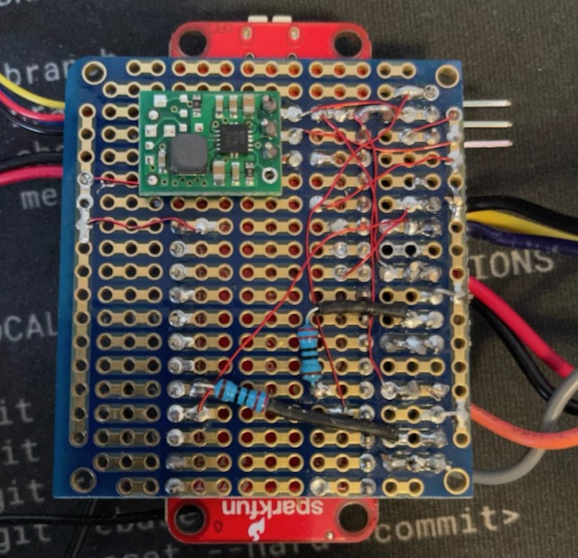

**Remarque :** Publié à l'origine sur [DZone](https://dzone.com/articles/a-camunda-greenhouse-part-3) alors n'oubliez pas de lui donner du ❤️ là-bas !

## Exécution de ce projet

1) Cloner le référentiel
2) `cd` dans le répertoire du projet :
1) Déployez la définition de processus `co2.bpmn` sur votre serveur Camunda
2) `cd` dans le répertoire `task-worker` :
1) lancez `go mod tidy` pour mettre à jour le module `task-worker`
2) ajustez toutes les valeurs constantes dans le fichier `task-handler.go`
3) lancez `go run task-handler.go`
3) cd dans le répertoire `arduino-code`
1) ouvrez le fichier `Greenhouse.ino` dans l'IDE Arduino
2) ajustez toutes les valeurs constantes dans `Greenhouse.ino`
3) déployer le code Arduino sur votre carte Arduino
3) Amusez-vous !


## La revue

Si vous avez suivi ce projet (incroyablement lent), alors vous avez déjà parcouru [partie 1](https://dzone.com/articles/a-proof-of-concept-for-camunda-platform-bpmn -with) et [part 2](https://dzone.com/articles/camunda-iot-proof-of-concept-part-ii) et je me demandais si la partie 3 arriverait un jour. Eh bien, le voici! C'est la partie où je rassemble toutes les parties précédentes et déploie réellement une [Camunda](https://camunda.com?ref=davidgsiot) IoT Greenhouse alimentée par BPMN !

Juste pour revoir un peu, j'ai proposé de construire une serre, surveillée par des capteurs IoT, qui serait ensuite entièrement contrôlée par un processus BPMN [Camunda](https://camunda.com?ref=davidgsIoT). L'ensemble du processus contrôlerait alors tous les aspects de la serre.

## Comment ça va

Auparavant, j'ai déployé une station météo qui surveillait toutes les conditions météorologiques extérieures afin que je puisse les corréler aux lectures de l'intérieur de la serre et décider des choses comme si l'ouverture d'une fenêtre aiderait à refroidir ou à réduire l'humidité à l'intérieur. La station météo est opérationnelle depuis plusieurs mois, et il était temps de construire les capteurs et de les déployer dans la serre.

Avant que quiconque ne soit tout excité, je n'ai pas, en fait, déployé une serre pleine grandeur, ni même une grande, dans ma cour (autant que je le voulais). Au lieu de cela, j'ai commencé petit avec une serre de bureau (ou ce que vous pourriez aussi appeler un terrarium).


Comme vous pouvez le voir, ce n'est pas si grand, mais il y a un panneau de toit que je peux ouvrir et fermer, donc ça ira pour la preuve de concept ici.

## Les capteurs

Afin de surveiller la serre, je voulais m'assurer que j'avais un certain nombre de capteurs capables de suivre les conditions environnementales de base à l'intérieur de la serre. J'ai décidé que les choses les plus importantes à surveiller étaient la température, l'humidité, la concentration de CO2 et l'humidité du sol pour les plantes (plus sur les «plantes» plus tard).

Vous remarquerez peut-être que ce sont en grande partie les mêmes capteurs que j'ai déployés à l'extérieur (à l'exception des capteurs de vent, de pluie et de foudre). Ce n'était pas par hasard, car je voulais pouvoir corréler les données entre les paires de capteurs intérieurs et extérieurs.

| Capteur | Mesure | URL de la partie | Coût |
|:------------- :| :--------------------- :| :--- -------------------------------------------------- ------------------- :| :------ :|
| Humidité du sol | Humidité du sol | [Capteur d'humidité du sol Sparkfun](https://www.sparkfun.com/products/13322) | 5,95 $ |
| SCD30 | CO2, Température, Humidité | [Adafruit SCD 30 Breakout](https://www.adafruit.com/product/4867) | 58,95 $ |

J'ai décidé, après avoir comparé les lectures entre plusieurs capteurs, que les lectures de température et d'humidité du SCD30 étaient suffisamment précises pour que je n'aie pas besoin de déployer un BME280 ou un autre capteur de température/humidité à côté du SCD30.

En plus des capteurs, j'allais avoir besoin d'_actionneurs_ à l'intérieur de la serre pour faire des choses comme ouvrir la porte, un ventilateur et une pompe pour fournir de l'eau aux plans. Voici ce que j'ai utilisé pour ces actionneurs :

| Actionneur | Objectif | URL de la partie | Coût |
|------------|--------------------------------|-- -------------------------------------------------- -----------|-------|
| Ventilateur d'extraction | retirer l'air de la serre | [Ventilateur Adafruit RPi](https://www.adafruit.com/product/3368) | 3,50 $ |
| Servomoteur MG90D | Ouvrir/fermer l'évent de la serre | [Servomoteur Adafruit MG90D](https://www.adafruit.com/product/1143) | 9,95 $ |

C'est tout le matériel à l'écart ! Maintenant, je n'avais plus qu'à tout rassembler et à le déployer dans la serre.

## Construire les capteurs de serre

À l'origine, j'avais prévu d'avoir des microcontrôleurs séparés (les cartes ESP-32) pour chaque capteur ou actionneur mais j'ai vite compris que, compte tenu des contraintes d'espace de la minuscule serre, ce serait peu pratique. Au lieu de cela, j'ai décidé d'avoir une carte ESP-32 qui surveillerait tous les capteurs et actionneurs.

Je me suis construit un circuit complet (en fait, un ensemble de circuits) sur une carte de prototypage pour garder les choses aussi compactes que possible.


Comme vous pouvez le voir, il se passe beaucoup de choses là-bas ! Alors laissez-moi vous expliquer un peu. La grande carte rouge au milieu est la carte ESP-32 que j'utilise. tout est câblé (à l'aide d'un fil de raccordement _très_ fin) au ventilateur et à la pompe (les fils à gauche), au servo (le connecteur à gauche) et au capteur d'humidité du sol (les fils jaune, violet et noir sur le la gauche).

Si vous regardez attentivement, vous verrez un tas de circuits coincés avec ces fils sur la gauche, donc je vais détailler un peu cela.

Une chose à laquelle vous devez toujours faire attention lorsque vous connectez n'importe quel type de moteur à un microcontrôleur est la possibilité d'une impulsion de tension essentiellement inverse lorsque vous éteignez le moteur. La plupart des moteurs sont conçus pour être alimentés par une alimentation 5V DC, donc si vous éteignez le moteur puis le rallumez, vous obtiendrez une impulsion de tension inverse. Vous pouvez facilement détruire votre carte de microcontrôleur si vous n'ajoutez pas de protection de circuit. J'ai intégré ce qu'on appelle une diode Flyback dans ces commandes pour éviter cela.


Il se compose d'une diode, d'une petite résistance de 220k Ohm et d'un transistor pour allumer et éteindre le moteur. La jambe centrale du transistor est connectée (via une résistance de 220K Ohm) à la broche du microcontrôleur que j'utilise pour allumer et éteindre le moteur. Cela me permet d'allumer et d'éteindre le moteur en utilisant 5v au lieu de la tension minimale fournie par la broche I/O.

J'ai dû en mettre un sur chacun des moteurs que j'ai connectés. Le servo a une diode flyback intégrée donc je n'ai pas eu besoin d'en construire une pour le servo.

Le capteur d'humidité du sol est un simple capteur de résistance analogique, donc encore une fois, aucune diode flyback n'est nécessaire.

Sur le dessous de ce tableau se trouve l'endroit où toute la magie opère. Vous pouvez voir tous les fils de connexion minuscules et fins que j'ai utilisés pour tout connecter. Souder avec ce fil n'est pas facile, je ne le recommande donc pas aux débutants.



J'ai dû utiliser une batterie externe pour fournir le courant au servo, car l'ESP-32 n'était tout simplement pas capable de fournir suffisamment de tension. Il pourrait _ déplacer _ le servo, mais le bot le maintiendrait en place si nécessaire.

Le capteur de CO <sub>2</sub> était le plus facile à connecter puisque j'en utilisais un qui avait un connecteur QIIC pour gérer le bus I2C. Tout ce que j'avais à faire était de le brancher sur le connecteur QIIC de la carte ESP-32 et j'avais terminé. Du moins avec la partie hardware !

Passons maintenant à la partie logicielle.

## Ecrire le logiciel

J'ai écrit tout cela en utilisant l'Arduino comme point de départ puisque l'ESP-32 a un excellent support Arduino. Pour commencer, je devais m'assurer d'avoir toutes les bonnes bibliothèques en place et toutes les broches pour contrôler tout ce qui était défini :

```Cpp
#include <WiFiClientSecure.h>
#include <PubSubClient.h>
#include <InfluxDbClient.h>
#include <Wire.h>
#include "ESP32Servo.h"
#include "SparkFun_SCD30_Arduino_Library.h"
#include <DNSServer.h>
#include <ESPmDNS.h>
#include <WiFiUdp.h>
#include <ArduinoJson.h>

#define SERVO_PIN 19
#define FAN_CTL 15
#define PUMP_CTL 18
#define SOIL_CTL 32
#define SOIL A2
```

C'était tout ce dont j'avais besoin pour ceux-là. Il était maintenant temps de s'assurer que tout était configuré et initialisé correctement.

```cpp
void setup() {
  Serial.begin(115200);
  pinMode(FAN_CTL, OUTPUT);
  digitalWrite(FAN_CTL, HIGH);
  Serial.println("Fan set up complete...");
  pinMode(PUMP_CTL, OUTPUT);
  digitalWrite(PUMP_CTL, LOW);
  Serial.println("Pump set up complete...");
  pinMode(SOIL, INPUT);
  pinMode(SOIL_CTL, OUTPUT);
  digitalWrite(SOIL_CTL, LOW);
  Serial.println("Soil sensor set up complete...");
  Wire.begin();
  delay(1000);
  if (airSensor.begin() == false) {
    Serial.println("Air sensor not detected. Please check wiring. Freezing...");
    while (1)
      ;
  }
  Serial.println("Air sensor detected. ");
  Serial.println("Initializing Servo...");
  ESP32PWM::allocateTimer(0);
  ESP32PWM::allocateTimer(1);
  ESP32PWM::allocateTimer(2);
  ESP32PWM::allocateTimer(3);
  door_ctl.setPeriodHertz(50); // standard 50 hz servo
  door_ctl.attach(SERVO_PIN, 1000, 2000);
  door_ctl.write(0);
  delay(1000);
  door_ctl.write(90);
  delay(1000);
  door_ctl.write(180);
  delay(1000);
  door_ctl.write(90);
  delay(1000);
  door_ctl.write(0);
  Serial.println("Servo set up complete...");
  Serial.println("Initializing WiFi...");
  WiFi.mode(WIFI_STA);
  Serial.print("Connecting to wifi");
  setup_wifi();
  while (WiFi.begin(SID, PASSWORD) != WL_CONNECTED) {
    Serial.print(".");
    delay(100);
  }
  Serial.println("");
  Serial.println("WiFi connected");
  Serial.println("Setting up MQTT ...");
  mqttClient.setServer(MQTT_SERVER, MQTT_PORT);
  mqttClient.setCallback(incoming_MQTT);
  Serial.println("MQTT set up complete...");
  timeSync(TZ_INFO, "pool.ntp.org", "time.nis.gov");
  myPoint.addTag("sensor", "GRN_CO2");
  myPoint.addTag("location", "Apex");
  myPoint.addTag("Sensor_id", SENSOR_ID);
  Serial.println("Ready");
}
```

Certes, il se passe beaucoup de choses là-dedans (et ce n'est pas tout !), alors je vais en expliquer quelques-unes. J'ai commencé par installer les broches pour le ventilateur et la pompe. Curieusement, l'un d'eux était « activé » lorsque la goupille était enfoncée « haut », tandis que l'autre lorsque la goupille était enfoncée « bas ». Ce fut la source d'une certaine consternation, croyez-moi.

Ensuite, j'ai installé le capteur d'humidité du sol. Je l'ai contrôlé à partir d'une broche d'E/S parce que je ne voulais pas qu'il soit allumé tout le temps car cela brûlerait de l'énergie inutilement.

J'ai ensuite mis en place le capteur de CO <sub>2</sub> . J'ai mis en place une sécurité intégrée pour que si le capteur n'était pas là, ou ne pouvait pas être trouvé, tout s'arrêterait. Sinon, plus tard, lorsque j'essaierais de lire le capteur, les choses se passeraient mal.

J'ai utilisé la bibliothèque ESP32PWM pour contrôler le servo, j'ai donc dû allouer une minuterie pour les servos, puis attacher le servo à la broche. J'ai également dû régler la période du servo à 50Hz. J'ai laissé tomber un code de test pour que le servo passe par ses mouvements prédéfinis juste pour un retour visuel indiquant qu'il fonctionnait.

Ensuite, j'ai dû configurer un client MQTT afin de pouvoir renvoyer des messages à l'appareil pour le contrôler.

```cpp
  mqttClient.setServer(MQTT_SERVER, MQTT_PORT);
  mqttClient.setCallback(incoming_MQTT);
  Serial.println("MQTT set up complete...");
  Serial.println("");
  timeSync(TZ_INFO, "pool.ntp.org", "time.nis.gov");
```

Je synchronise l'heure dans tout mon code car j'aime utiliser TLS pour les communications et cela peut être sensible à la dérive temporelle.

## Stockage des données du capteur

Il existe de nombreux choix pour décider où et comment stocker les données de votre capteur. J'ai choisi d'utiliser influxdb cette fois parce que je stockais déjà les données de la station météo dans influxdb et je savais que je serais capable d'interroger facilement les données d'une manière qui me permettrait de synthétiser les données de la station météo avec les données de serre.

J'ai utilisé la bibliothèque Arduino InfluxDB pour connecter et stocker les données.

```cpp
influx.setWriteOptions(WriteOptions().writePrecision(WritePrecision::MS));
  influx.setWriteOptions(WriteOptions().batchSize(10).bufferSize(50));
 WiFiClientSecure *client = new WiFiClientSecure;
  if (client) {
    client->setCACert(AlphaSSLCA);
    // Check server connection
    if (influx.validateConnection()) {
      Serial.print("Connected to InfluxDB: ");
      Serial.println(influx.getServerUrl());
    } else {
      Serial.print("InfluxDB connection failed: ");
      Serial.println(influx.getLastErrorMessage());
      //  waitForInflux();
    }
  }
  myPoint.addTag("sensor", "GRN_CO2");
  myPoint.addTag("location", "Apex");
  myPoint.addTag("Sensor_id", SENSOR_ID);
  Serial.println("Ready");
```

Cela configure mon client influxdb pour utiliser une connexion sécurisée et configure un objet `dataPoint` avec les balises que je souhaite utiliser. Une fois tout cela fait, le processus était configuré et prêt à démarrer !

## La boucle principale

Il s'avère que la boucle principale est assez petite pour cela. Contrairement à de nombreux programmes Arduino, je n'utilise pas la fonction `delay ()` pour la synchronisation, car je souhaite que l'appareil puisse être interrompu par tout message MQTT entrant.

```cpp
void loop() {
  if (!mqttClient.connected()) {
    reconnect();
  }
  mqttClient.loop();
  unsigned long currentMillis = millis();
  if (currentMillis - lastCO2Millis >= readingInterval) {
    lastCO2Millis = currentMillis;
    myPoint.clearFields();
    if (influx.isBufferFull()) {
      influx.flushBuffer();
    } if (airSensor.dataAvailable()) {
      co2 = airSensor.getCO2();
      float temp_c = airSensor.getTemperature();
      float hum = airSensor.getHumidity();
      int rssi = WiFi.RSSI();
      float temp_f = temp_c * 9.0 / 5.0 + 32.0;
      myPoint.addField("co2", co2);
      myPoint.addField("RSSI", rssi);
      myPoint.addField("temp_c", temp_c);
      myPoint.addField("humidity", hum);
      myPoint.addField("temp_f", temp_f);
    }
    digitalWrite(SOIL_CTL, HIGH);
    delay(10);
    int soil = analogRead(SOIL);
    digitalWrite(SOIL_CTL, LOW);
    myPoint.addField("soil", soil);
    influx.writePoint(myPoint);
  }
}
```

À chaque fois dans la boucle, je m'assure que je suis connecté au courtier MQTT et que je gère le client MQTT au cas où il y aurait des messages entrants. Puisqu'il n'y a pas d'appel `delay()`, cela signifie que le client MQTT est traité très fréquemment.

Si le moment est venu de prendre et de stocker des lectures, je rassemble toutes les données et les envoie à influxdb. Je m'assure de vérifier le tampon et d'envoyer toutes les données s'il est plein à chaque fois.

Et oui, je pourrais faire la conversion Fahrenheit en Celsius dans la base de données, mais, eh bien, honnêtement, il me reste beaucoup de ce code passe-partout de mes jours chez InfluxData et j'ai tendance à simplement réutiliser ce qui fonctionne.

## Contrôle de la serre

L'intérêt de ce projet était de pouvoir le contrôler avec [Camunda](https://camunda.com?ref=davidgsiot), il est donc temps de plonger là-dedans !


Je vais vous donner une minute pour reprendre votre souffle avant de plonger dans l'explication.

D'abord la partie facile. Je commence tout le processus avec un Timer Event qui se déclenche toutes les 2 minutes. Je n'ai vraiment pas besoin de l'exécuter aussi souvent, dans un scénario réel, mais je voulais m'assurer que je pouvais voir les choses fonctionner et changer, alors j'ai réglé la minuterie très bas.

Cet événement de minuterie lance une série de sous-processus via certaines passerelles parallèles. Je veux que tous ces sous-processus s'exécutent simultanément, c'est donc la façon d'y parvenir.

Je vais parcourir en détail l'un des sous-processus, mais sachez simplement que chacun d'eux est essentiellement le même.


Ce sous-processus appelle un service externe (auquel j'arriverai dans une minute) pour obtenir le niveau actuel de CO <sub>2</sub> . Il compare ensuite ce seuil aux différents seuils que j'ai définis et envoie un message au courtier MQTT pour déclencher une action appropriée en fonction du niveau. Je les ai codés par couleur pour qu'il soit facile de voir ce qui se passe quand.

L'avantage d'utiliser Camunda pour contrôler le processus est que, si les besoins des plantes changent, je n'ai pas besoin de recoder les capteurs. Je peux simplement entrer dans ce modèle, fixer de nouveaux seuils et redéployer le processus. C'est la partie vraiment importante de l'utilisation de Camunda pour tout contrôler. Je prévois en fait de revenir en arrière et d'intégrer Camunda dans un tas d'anciens projets de détection que j'ai qui utilisent des seuils et des paramètres codés en dur afin que je puisse tout définir - et le changer - à partir d'une application de gestion de processus plutôt que d'avoir à tout recompiler à chaque fois.

Dans le monde de l'IoT, le déploiement d'un nouveau micrologiciel peut facilement être un processus _très_ coûteux et chronophage, donc le faire de cette façon sera une énorme économie.

## Le service externe

Comme je l'ai dit, la gestion de la requête de la base de données se fait via un service externe. Je suis devenu assez amoureux de Go, j'ai donc écrit le service externe en l'utilisant.

Ce service utilisera 3 bibliothèques importantes :

- La bibliothèque [Client Camunda](https://github.com/citilinkru/camunda-client-go/v2)
- La bibliothèque [Paho MQTT](https://github.com/eclipse/paho.mqtt.golang)
- La bibliothèque [InfluxDB v2](https://github.com/influxdata/influxdb-client-go/v2)

Cela me permet d'écouter le travail du processus Camunda, d'interroger la base de données, puis d'envoyer des messages au courtier MQTT si nécessaire.

la première chose à faire est de configurer le client Camunda :

```go
client := camundaclientgo.NewClient(camundaclientgo.ClientOptions{
		UserAgent:   "",
		EndpointUrl: "http://localhost:8080/engine-rest",
		Timeout: time.Second * 10,
		ApiUser: "demo",
		ApiPassword: "demo",
	},
	)
	asyncResponseTimeout := 5000
	// get a process instance to work with
```

C'est le client que le reste du processus utilisera. Ensuite, j'aurai besoin d'un processeur Camunda pour pouvoir écouter les tâches.

```go
	proc := processor.NewProcessor(client, &processor.ProcessorOptions{
		WorkerId:                  "GreenHouseHandler",
		LockDuration:              time.Second * 20,
		MaxTasks:                  10,
		MaxParallelTaskPerHandler: 100,
		LongPollingTimeout:        25 * time.Second,
		AsyncResponseTimeout:      &asyncResponseTimeout,
	}, logger)
	log.Debug("Processor started ... "
```
Maintenant que j'ai un processeur, je peux commencer à ajouter des gestionnaires pour écouter les sujets spécifiques que je veux traiter.

```go
	// add a handler for checking the existing Queue
	proc.AddHandler(
		&[]camundaclientgo.QueryFetchAndLockTopic{
			{TopicName: "checkCO2"},
		},
		func(ctx *processor.Context) error {
			return checkCO2(ctx.Task.Variables, ctx)
		},
	)
```

Ce gestionnaire particulier écoutera les messages sur le sujet "checkCO2". Il appellera ensuite la fonction "checkCO2" pour effectuer le travail.

J'ai défini le sujet `checkCO2` dans le panneau des propriétés pour la tâche externe dans Camunda Modeler.


Regardons donc la fonction `chekcCO2()`.

```go
func checkCO2(variables map[string]camundaclientgo.Variable, ctx *processor.Context) error {
	// Create a new client using an InfluxDB server base URL and an authentication token
	client := influxdb2.NewClient("https://influxserver.com:8086", "long_influxdb_token_string")
	// Get query client
	queryAPI := client.QueryAPI("influxdata")
	// get QueryTableResult
	result, err := queryAPI.Query(context.Background(), `from(bucket: "telegraf")
  |> range(start: -1m)
  |> filter(fn: (r) => r["_measurement"] == "greenhouse")
  |> filter(fn: (r) => r["_field"] == "co2" )` )
	var averageCO2 float64 = 0.00
	var numResults int = 0
	if err == nil {
		// Iterate over query response
		for result.Next() {
			// Access data
			foo := fmt.Sprintf("%v", result.Record().Value())
			foo64, err := strconv.ParseFloat(foo, 64)
			if err != nil {
				fmt.Println("bad value!")
        return err
			}
			averageCO2 = averageCO2 + foo64
			numResults++
		}
		// check for an error
		if result.Err() != nil {
			fmt.Printf("query parsing error: %s\n", result.Err().Error())
		}
		averageCO2 = (averageCO2 / float64(numResults))
		if math.IsNaN(averageCO2) {
			fmt.Println("Bad value! No donut!")
			averageCO2 = 0.00
		}
		varb := ctx.Task.Variables
		varb["co2"] = camundaclientgo.Variable{
      Value: averageCO2,
      Type: "double"
    }
		err := ctx.Complete(processor.QueryComplete{Variables: &varb})
		if err != nil {
			log.Error("queuStatus: ", err)
			return err
		}
	} else {
		log.Error("queuStatus: ", err)
		return err
	}
	Crop.CO2 = averageCO2
	// Ensures background processes finishes
	client.Close()
	return nil
}
```

Cela fait donc beaucoup de code Go ! Si vous n'êtes pas familier avec Go, vous n'avez probablement aucune idée de ce que cela fait, alors allons-y. Tout d'abord, je crée un nouveau client à l'aide de la bibliothèque client InfluxDB. J'en aurai besoin pour interroger la base de données. Vient ensuite la requête proprement dite, qui est écrite en "flux", le langage de requête inventé par InfluxData pour interroger leur base de données. J'utilise la fonction `from` pour spécifier le compartiment que je veux interroger. Ensuite, j'utilise la fonction `range` pour spécifier la plage de temps. Ensuite, j'utilise la fonction `filter` pour filtrer les données que je veux interroger. La plage est juste la dernière minute, et si je le voulais, je pourrais aussi demander à Flux d'interroger les dernières `n` minutes et de renvoyer la moyenne elle-même, mais je le fais ici juste pour le plaisir.

Une fois que j'ai calculé la moyenne, je dois renvoyer cette valeur au processus Camunda, donc je crée une variable de processus et la règle sur la moyenne calculée.

Je renvoie ensuite cette variable au moteur Camunda et lui dis que j'ai terminé la tâche. C'est tout.

J'ai écrit l'un de ces gestionnaires de processus pour chacune des requêtes de base de données que je voulais faire afin que chaque requête de base de données puisse être traitée comme une tâche distincte.

Certains d'entre vous ont peut-être remarqué que je n'ai utilisé aucune des données de la station météo pour éclairer ces décisions. Vous avez tout à fait raison. Voici pourquoi : la petite serre est assise à l'intérieur, sur un bureau. Ainsi, les conditions extérieures n'ont absolument aucune incidence sur l'ouverture des évents, etc., qui affecterait la serre. Alors je les ai laissés de côté.

## Passer à l'action de Camunda

Comme nous l'avons vu plus haut, le moteur Camunda appellera chacun de ces sous-processus pour interroger la base de données simultanément (ou à proximité). Une fois la requête terminée, la valeur appropriée est renvoyée et le moteur Camunda continuera à traiter la tâche suivante.

Ces tâches de requête se terminent simplement (s'il n'y a rien à faire) ou déclenchent un événement d'escalade intermédiaire en fonction du seuil dépassé. Pour suivre cela, examinons ce qui se passe lorsque nous interrogeons le capteur d'humidité du sol.


Ce sous-processus a 2 états d'escalade : trop humide et trop sec. C'est ça. Le moteur Camunda lancera cet événement d'escalade en fonction du résultat. Nous avons alors _un autre_ sous-processus qui attend que l'un ou l'autre de ces événements d'escalade se produise. Ce sous-processus contrôle la pompe qui arrosera les plantes. Si l'humidité du sol est trop sèche, la pompe se mettra en marche. Si l'humidité du sol est trop humide, la pompe s'arrêtera.

*Remarque :* La petite pompe à eau que j'ai utilisée était trop capable de pomper de l'eau. S'il restait allumé ne serait-ce qu'une minute, toute la serre était inondée, j'ai donc dû ajuster cela plus tard pour allumer la pompe pendant une période de temps spécifique, en fonction du niveau d'humidité du sol. Le maximum que j'ai jamais laissé allumé n'était pas supérieur à 7 secondes. J'ai opté pour une valeur de 5 secondes.

Voyons comment fonctionne ce sous-processus. Le sous-processus de surveillance de l'humidité du sol informera le sous-processus de contrôle de la pompe si nous devons allumer ou éteindre la pompe. Si le sol est trop sec, l'événement d'escalade contiendra le JSON suivant :

```json
{
  "sensor": "soil-dry",
  "commands" : {
    "fan": "none",
    "vent": "none",
    "pump": "on"
  }
}
```

En fait, tous les événements d'escalade contiennent un objet JSON similaire contenant les actions à entreprendre. En fait, si nous examinons l'événement d'escalade "CO2-Critical", nous voyons :

```json
{
  "sensor": "co2-critical",
  "commands" : {
    "fan": "on",
    "vent": "open",
    "pump": "none"
  }
}
```

Car lorsque le CO <sub>2</sub> est élevé, il faut tout faire pour le faire baisser, et vite ! Nous allumons donc le ventilateur et ouvrons complètement l'évent.

Les sous-processus "action" prennent ensuite ces charges utiles JSON dans les événements d'escalade et les placent dans la file d'attente d'un autre processus externe avec le nom `control`.

Passons également en revue cette implémentation externe. Je vais le décomposer afin que ce ne soit pas un mur de code afin que je puisse le parcourir petit à petit.

```go
func control(variables map[string]camundaclientgo.Variable,ctx *processor.Context) error {
	var tlsConf *tls.Config = nil
	tlsConf = &tls.Config{
		InsecureSkipVerify: true,
	}
	var opts = mqtt.ClientOptions{
		ClientID: "greenhouse",
		Username: "",
		Password: "",
		TLSConfig:            tlsConf,
		KeepAlive:            0,
		PingTimeout:          0,
		ConnectTimeout:       time.Second * 10,
		MaxReconnectInterval: 0,
		AutoReconnect:        false,
		ConnectRetryInterval: 0,
		ConnectRetry:         false,
		Store:                nil,
	}
  opts.AddBroker("tcp://my-broker.com:8883")
	opts.SetClientID("greenhouse")
	opts.SetMaxReconnectInterval(time.Second * 10)
	var client = mqtt.NewClient(&opts)
	token := client.Connect()
	for !token.WaitTimeout(3 * time.Second) {
	}
	if err := token.Error(); err != nil {
		return err
	}
  ```

This is all really just the setup code for using the [Paho MQTT](https://github.com/eclipse/paho.mqtt.golang) client. My MQTT broker uses TLS, so I have to set that up as well.

```go
entrant := ControlMsg{}
varb := fmt.Sprintf("%v", ctx.Task.Variables["action"].Valeur)
fmt.Printf ("Raw:% v \ n", varb)
err := json.Unmarshal([]byte(varb), &amp;incoming)
si err != néant {
erreur de retour
}
fmt.Println("Capteur entrant : ", entrant.Capteur)
fmt.Printf("Commandes entrantes : %v\n", commandes.entrantes)
```
As with the previous external task handler, I get the variables from the process engine that I need. Since I sent those variables as a JSON object, I can unmarshal the data into my `ControlMsg` struct.

Wait, I didn't share that with you!

```go
tapez la structure ControlMsg {
Chaîne de capteur `json:"sensor"`
Structure des commandes {
Chaîne d'éventail `json:"fan"`
Chaîne de ventilation `json:"vent"`
Chaîne de pompe `json:"pump"`
} `json:"commandes"`
}
```

That should look suspiciously like the JSON object that was in the escalation event.

Now that I have those messages, I can turn around and publish them to the MQTT broker.

```go
t := client.Publish("serre", 0, faux, varb)
allez fonc() {
_ = t.Attendre()
si t.Erreur() != néant {
log.Error(t.Error())
}
}()
```

Once the mqtt message is sent, I can then complete the process just as I've done before:

```go
varbs := ctx.Task.Variables
varbs[incoming.Sensor] = camundaclientgo.Variable{
Valeur : entrant.Capteur + " terminé",
Tapez : "chaîne"
}
err = ctx.Complete(processor.QueryComplete{Variables : &amp;varbs})
si err != néant {
log.Error("queuStatus : ", erreur)
erreur de retour
}
client.Déconnecter(250)
retour nul
}
```

And now the message has been sent, and the ESP-32 controller in the greenhouse will receive that message and act on it appropriately.

Since I left that part of the Arduino code out earlier, let's take a look at that now:

```cpp
void coming_MQTT(char *topic, byte *payload, unsigned int length) {
StaticJsonDocument <200> doc ;
Erreur DeserializationError = deserializeJson(doc, payload);
si (erreur) {
Serial.println(error.f_str());
retourner;
}
const char *fan = doc["commandes"]["fan"] ;
const char *vent = doc["commandes"]["vent"] ;
const char *pompe = doc["commandes"]["pompe"] ;
si (ventilateur) {
si (strcmp(ventilateur, "on") == 0) {
digitalWrite(FAN_CTL, LOW);
} sinon si (strcmp(ventilateur, "off") == 0) {
digitalWrite(FAN_CTL, HIGH);
}
}
si(pompe) {
si (strcmp(pompe, "marche") == 0) {
digitalWrite(PUMP_CTL, HIGH);
} sinon si (strcmp(pompe, "off") == 0) {
digitalWrite(PUMP_CTL, LOW);
}
}
si (évent) {
if (strcmp(vent, "open") == 0){
door_ctl.write(180);
poste = 180 ;
} sinon si (strcmp(vent, "fermer") == 0) {
door_ctl.write(0);
poste = 0 ;
} sinon si (strcmp(vent, "half") == 0) {
si(pos == 0 || pos == 180) {
door_ctl.write(90);
poste = 90 ;
} sinon si (pos == 90) {
// déjà la moitié
}
}
}
}
```

The external task handler sent the JSON object it received from the Camunda topic on to the MQTT broker, which then forwarded it on to the ESP-32, so this function deserializes the object into a JSON document. Once that's done. I can access the various fields of the document to decide what needs to happen.

Maybe you're starting to see now why I designed the escalation events the way I did!

I can act on all of the various control messages in the JSON, and then return. This code will actually flood my greenhouse because it simply turns the pump on or off, rather than turning it on for a specific time period.

```cpp
si(pompe) {
si (strcmp(pompe, "marche") == 0) {
digitalWrite(PUMP_CTL, HIGH);
retard (5000);
digitalWrite(PUMP_CTL, LOW);
}
}
```

Is a much better version of this as it only turns the pump on for 5 seconds at a time. Your values might differ, depending on the pump you're using.

In fact, had I realized the strength of the pump ahead of time, I would have made the length of time to turn the pump on part of the escalation event from the Camunda process so that I could compensate for different pumps at a higher level, rather than having to recompile and redeploy firmware depending on the pump.

## Conclusions

I hope that you can see the value of using a business process management platform to orchestrate an IoT process like this. I was skeptical at first myself until I started to see the overall benefits.

I could have made some things updateable over Over The Air updates, but this means recompiling and redeploying firmware.

I could have made the various levels of CO<sub>2</sub>, temperature, etc. hard-coded values, but then I'd have to recompile and re-deploy firmware to change to a crop that has different needs.

I could have made the various monitored levels part of the external process and forgone the entire BPMN orchestration, but then in order to change anything I'd have to have an engineer go in and make changes to the code.

By using a high-level BPMN process I can see the overall process at a glance. I can see what is monitored and what is acted on. I can even make changes to how the entire greenhouse runs without ever writing any code at all. Anyone could go in to the model, change the values for a new crop, redeploy the model with a single click, and change everything about how that crop is managed.

I have every intention of using Camunda to orchestrate and control most, if not all, of my IoT projects from here on out just so that I can more easily change how they run and how they function without all the re-compiling and deployment of firmware that I've been doing up to now.
