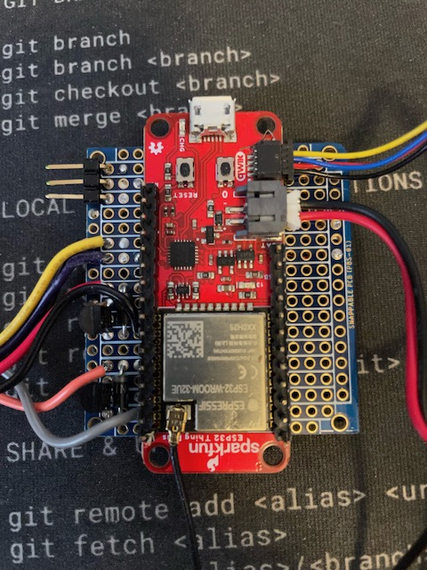
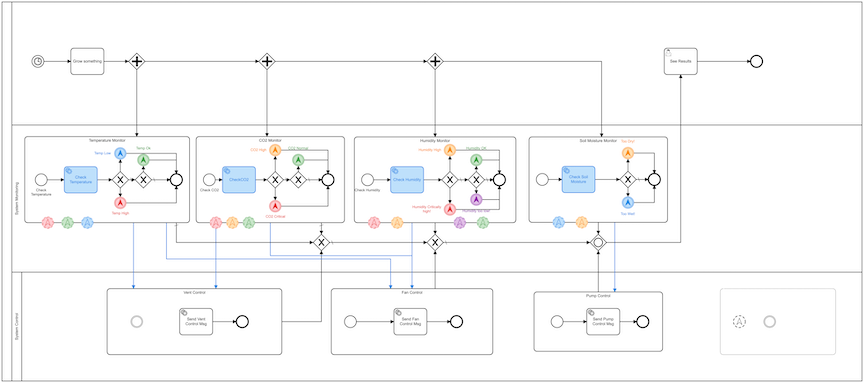
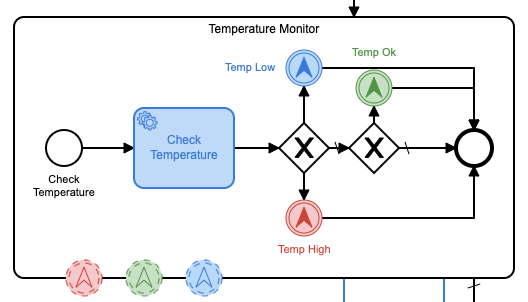

**Opmerking:** Oorspronkelijk gepubliceerd op [DZone](https://dzone.com/articles/a-camunda-greenhouse-part-3) dus vergeet niet om daar wat ❤️ te geven!

## Dit project uitvoeren

1) Kloon de repository
2) `cd` in de projectdirectory:
1) Implementeer de `co2.bpmn` procesdefinitie op uw Camunda-server
2) `cd` in de `task-worker` directory:
1) voer `go mod netjes` uit om de `taakwerker`-module bij te werken
2) pas alle constante waarden aan in het `task-handler.go` bestand
3) voer `go run task-handler.go` uit
3) cd in de `arduino-code` directory
1) open het bestand `Greenhouse.ino` in de Arduino IDE
2) pas alle constante waarden aan in `Greenhouse.ino`
3) implementeer de Arduino-code op uw Arduino-bord
3) Veel plezier!


## Recensie

Als je dit (ongelooflijk trage) project hebt gevolgd, heb je [deel 1](https://dzone.com/articles/a-proof-of-concept-for-camunda-platform-bpmn) al doorlopen -with) en [deel 2](https://dzone.com/articles/camunda-iot-proof-of-concept-part-ii) en vroegen me af of deel 3 ooit zou komen. Nou, hier is het! Dit is het deel waar ik alle voorgaande delen samenvoeg en daadwerkelijk een [Camunda](https://camunda.com?ref=davidgsiot) BPMN-aangedreven IoT-kas implementeer!

Om een beetje terug te blikken, stelde ik voor om een kas te bouwen, gecontroleerd door enkele IoT-sensoren, die dan volledig zou worden bestuurd door een [Camunda](https://camunda.com?ref=davidgsIoT) BPMN-proces. Het hele proces zou dan alle aspecten van de Kas beheersen.

## Hoe gaat het

Voorheen gebruikte ik een weerstation dat alle weersomstandigheden buiten in de gaten hield, zodat ik ze kon correleren met de metingen in de kas en dingen kon beslissen zoals of het openen van een raam zou helpen om de binnenkant af te koelen of de luchtvochtigheid te verlagen. Het weerstation draait nu een aantal maanden en het werd tijd om de sensoren daadwerkelijk te bouwen en in de kas te plaatsen.

Voordat iemand helemaal opgewonden raakt, heb ik in feite geen grote of zelfs een grote kas in mijn tuin geplaatst (zoveel als ik wilde). In plaats daarvan begon ik klein met een desktopkas (of wat je ook een terrarium zou kunnen noemen).


Zoals je kunt zien, is het niet zo groot, maar het heeft wel een dakpaneel dat ik kan openen en sluiten, dus het zal hier voldoende zijn voor de proof of concept.

## De sensoren

Om de kas te bewaken, wilde ik er zeker van zijn dat ik een aantal sensoren had die de basisomgevingsomstandigheden in de kas konden volgen. Ik besloot dat de belangrijkste dingen om te controleren temperatuur, vochtigheid, CO2-concentratie en bodemvocht voor de planten waren (later meer over de 'planten').

Het zal je misschien opvallen dat dit grotendeels dezelfde sensoren waren die ik buiten heb ingezet (met uitzondering van de wind-, regen- en bliksemsensoren). Dat was geen toeval, want ik wilde gegevens kunnen correleren tussen de paren binnen- en buitensensoren.

| Sensor | Meting | Onderdeel-URL | Kosten |
|:-------------:|:--------------------------:|:--- -------------------------------------------------- -------------------:|:------:|
| Bodemvocht | Bodemvocht | [Sparkfun Bodemvochtsensor](https://www.sparkfun.com/products/13322) | $ 5,95 |
| SCD30 | CO2, temperatuur, vochtigheid | [Adafruit SCD 30 Breakout](https://www.adafruit.com/product/4867) | $ 58,95 |

Ik besloot, na het vergelijken van de metingen tussen verschillende sensoren, dat de temperatuur- en vochtigheidsmetingen van de SCD30 nauwkeurig genoeg waren zodat ik geen BME280 of andere temperatuur-/vochtigheidssensor naast de SCD30 hoefde te gebruiken.

Naast sensoren zou ik een aantal _actuators_ in de kas nodig hebben om dingen te doen zoals het openen van de deur, een ventilator en een pomp om water te leveren aan de plannen. Dit is wat ik voor die actuatoren heb gebruikt:

| Actuator | doel | Onderdeel-URL | Kosten |
|-------------|--------------------------------|-- -------------------------------------------------- -----------|-------|
| Afzuigventilator | lucht uit de kas verwijderen | [Adafruit RPi-fan](https://www.adafruit.com/product/3368) | $3,50 |
| MG90D Servo | Kasluik openen/sluiten | [Adafruit MG90D Servo](https://www.adafruit.com/product/1143) | $ 9,95 |

Dat is al het materiaal uit de weg! Nu hoefde ik alleen nog maar alles samen te trekken en in de kas te plaatsen.

## De kassensoren bouwen

Oorspronkelijk was ik van plan om voor elke sensor of actuator afzonderlijke microcontrollers (de ESP-32-kaarten) te hebben, maar ik realiseerde me al snel dat dit, gezien de beperkte ruimte van de kleine kas, onpraktisch zou zijn. In plaats daarvan besloot ik om één ESP-32-bord te hebben dat alle sensoren en actuatoren zou bewaken.

Ik heb voor mezelf een volledig circuit gebouwd (eigenlijk een set circuits) op een prototypebord om de zaken zo compact mogelijk te houden.



Zoals je kunt zien, is daar een _lot_ gaande! Dus laat me het even uitleggen. Het grote rode bord in het midden is het ESP-32-bord dat ik gebruik. het is allemaal aangesloten (met behulp van _zeer_ dunne aansluitdraad) naar de ventilator en pomp (de draden aan de linkerkant), de servo (de connector aan de linkerkant) en de bodemvochtsensor (de gele, paarse en zwarte draden aan de links).

Als je goed kijkt, zie je een aantal circuits ingeklemd tussen die draden aan de linkerkant, dus ik zal dat een beetje detailleren.

Een ding waar je altijd voorzichtig mee wilt zijn als je een motor aan een microcontroller haakt, is de mogelijkheid van een puls van in wezen omgekeerde spanning wanneer je de motor uitzet. De meeste motoren zijn ontworpen om te worden gevoed door een 5V DC-voeding, dus als u de motor uit- en weer inschakelt, krijgt u een puls van sperspanning. Je kunt je microcontrollerkaart gemakkelijk kapot maken als je geen circuitbeveiliging toevoegt. Ik heb in deze bedieningselementen een zogenaamde Flyback-diode ingebouwd om dat te voorkomen.


Het bestaat uit een diode, een kleine 220k Ohm weerstand en een transistor om de motor aan en uit te zetten. De middelste poot van de transistor is verbonden (via een 220K Ohm weerstand) microcontroller-pin die ik gebruik om de motor aan en uit te zetten. Hierdoor kan ik de motor in- en uitschakelen met 5v in plaats van de minimale spanning die wordt geleverd door de I/O-pin.

Ik moest er een op elk van de motoren plaatsen die ik had aangesloten. De servo heeft een ingebouwde flyback-diode, dus ik hoefde er geen te bouwen voor de servo.

De bodemvochtsensor is een eenvoudige analoge weerstandssensor, dus nogmaals, geen flyback-diode nodig.

Aan de onderkant van dit bord gebeurt alle magie. Je kunt alle kleine, dunne aansluitdraad zien die ik heb gebruikt om alles aan te sluiten. Solderen met deze draad is niet eenvoudig, dus ik raad het niet aan voor beginners.


Ik moest een extern batterijpakket gebruiken om de servo van stroom te voorzien, omdat de ESP-32 gewoon niet genoeg spanning kon leveren. Het kan de servo _verplaatsen_, maar houdt het op zijn plaats wanneer dat nodig is.

De CO <sub>2</sub> -sensor was het gemakkelijkst aan te sluiten omdat ik er een gebruikte met een QIIC-connector om de I2C-bus te verwerken. Het enige wat ik hoefde te doen was hem in de QIIC-connector op het ESP-32-bord steken en ik was klaar. In ieder geval met het hardware gedeelte!

Nu was het over naar het softwaregedeelte.

## De software schrijven

Ik heb dit allemaal geschreven met de Arduino als uitgangspunt, omdat de ESP-32 geweldige Arduino-ondersteuning heeft. Om te beginnen, moest ik ervoor zorgen dat ik de juiste bibliotheken had en alle pinnen om alles te regelen:

```Cpp
#include <WiFiClientSecure.h>
#include <PubSubClient.h>
#include <InfluxDbClient.h>
#include <Wire.h>
#include "ESP32Servo.h"
#include "SparkFun_SCD30_Arduino_Library.h"
#include <DNSServer.h>
#include <ESPmDNS.h>
#include <WiFiUdp.h>
#include <ArduinoJson.h>

#define SERVO_PIN 19
#define FAN_CTL 15
#define PUMP_CTL 18
#define SOIL_CTL 32
#define SOIL A2
```

Dat was alles wat ik daarvoor nodig had. Nu was het tijd om ervoor te zorgen dat alles correct was ingesteld en geïnitialiseerd.

```cpp
void setup() {
  Serial.begin(115200);
  pinMode(FAN_CTL, OUTPUT);
  digitalWrite(FAN_CTL, HIGH);
  Serial.println("Fan set up complete...");
  pinMode(PUMP_CTL, OUTPUT);
  digitalWrite(PUMP_CTL, LOW);
  Serial.println("Pump set up complete...");
  pinMode(SOIL, INPUT);
  pinMode(SOIL_CTL, OUTPUT);
  digitalWrite(SOIL_CTL, LOW);
  Serial.println("Soil sensor set up complete...");
  Wire.begin();
  delay(1000);
  if (airSensor.begin() == false) {
    Serial.println("Air sensor not detected. Please check wiring. Freezing...");
    while (1)
      ;
  }
  Serial.println("Air sensor detected. ");
  Serial.println("Initializing Servo...");
  ESP32PWM::allocateTimer(0);
  ESP32PWM::allocateTimer(1);
  ESP32PWM::allocateTimer(2);
  ESP32PWM::allocateTimer(3);
  door_ctl.setPeriodHertz(50); // standard 50 hz servo
  door_ctl.attach(SERVO_PIN, 1000, 2000);
  door_ctl.write(0);
  delay(1000);
  door_ctl.write(90);
  delay(1000);
  door_ctl.write(180);
  delay(1000);
  door_ctl.write(90);
  delay(1000);
  door_ctl.write(0);
  Serial.println("Servo set up complete...");
  Serial.println("Initializing WiFi...");
  WiFi.mode(WIFI_STA);
  Serial.print("Connecting to wifi");
  setup_wifi();
  while (WiFi.begin(SID, PASSWORD) != WL_CONNECTED) {
    Serial.print(".");
    delay(100);
  }
  Serial.println("");
  Serial.println("WiFi connected");
  Serial.println("Setting up MQTT ...");
  mqttClient.setServer(MQTT_SERVER, MQTT_PORT);
  mqttClient.setCallback(incoming_MQTT);
  Serial.println("MQTT set up complete...");
  timeSync(TZ_INFO, "pool.ntp.org", "time.nis.gov");
  myPoint.addTag("sensor", "GRN_CO2");
  myPoint.addTag("location", "Apex");
  myPoint.addTag("Sensor_id", SENSOR_ID);
  Serial.println("Ready");
}
```

Toegegeven, er gebeurt daar veel (en dat is nog niet alles!) Dus ik zal wat uitleggen. Ik begon met het opzetten van de pinnen voor de ventilator en de pomp. Vreemd genoeg was een van hen 'aan' wanneer de pin 'hoog' werd gedreven, terwijl de andere wanneer de pin 'laag' werd gedreven. Dit was de bron van enige consternatie, geloof me.

Vervolgens heb ik de bodemvochtsensor ingesteld. Ik bestuurde het vanaf een I/O-pin omdat ik niet wilde dat het de hele tijd aan stond, omdat dit onnodige stroom zou verbruiken.

Ik heb toen de CO <sub>2</sub> -sensor ingesteld. Ik heb een fail-safe geplaatst, zodat als de sensor er niet was, of niet kon worden gevonden, het hele ding zou stoppen. Anders zou het later, toen ik probeerde de sensor te lezen, slecht gaan.

Ik gebruikte de ESP32PWM-bibliotheek om de servo te besturen, dus ik moest een timer voor de servo's toewijzen en vervolgens de servo aan de pin bevestigen. Ik moest ook de periode van de servo instellen op 50Hz. Ik liet wat testcode vallen zodat de servo zijn vooraf ingestelde bewegingen zou doorlopen, alleen voor wat visuele feedback dat het werkte.

Vervolgens moest ik een MQTT-client instellen zodat ik berichten naar het apparaat kon sturen om het te bedienen.

```cpp
  mqttClient.setServer(MQTT_SERVER, MQTT_PORT);
  mqttClient.setCallback(incoming_MQTT);
  Serial.println("MQTT set up complete...");
  Serial.println("");
  timeSync(TZ_INFO, "pool.ntp.org", "time.nis.gov");
```

Ik synchroniseer de tijd in al mijn code omdat ik graag TLS gebruik voor communicatie en het kan gevoelig zijn voor tijdafwijking.

## Opslaan van de sensorgegevens

Er zijn veel keuzes bij het beslissen waar en hoe u uw sensorgegevens wilt opslaan. Ik koos deze keer voor influxdb omdat ik de gegevens van het weerstation al in influxdb opsloeg en ik wist dat ik de gegevens gemakkelijk zou kunnen opvragen op een manier die me in staat zou stellen de gegevens van het weerstation te synthetiseren met de kasgegevens.

Ik heb de Arduino InfluxDB-bibliotheek gebruikt om de gegevens aan te sluiten en op te slaan.

```cpp
influx.setWriteOptions(WriteOptions().writePrecision(WritePrecision::MS));
  influx.setWriteOptions(WriteOptions().batchSize(10).bufferSize(50));
 WiFiClientSecure *client = new WiFiClientSecure;
  if (client) {
    client->setCACert(AlphaSSLCA);
    // Check server connection
    if (influx.validateConnection()) {
      Serial.print("Connected to InfluxDB: ");
      Serial.println(influx.getServerUrl());
    } else {
      Serial.print("InfluxDB connection failed: ");
      Serial.println(influx.getLastErrorMessage());
      //  waitForInflux();
    }
  }
  myPoint.addTag("sensor", "GRN_CO2");
  myPoint.addTag("location", "Apex");
  myPoint.addTag("Sensor_id", SENSOR_ID);
  Serial.println("Ready");
```

Dat stelt mijn influxdb-client in om een beveiligde verbinding te gebruiken en stelt een `dataPoint`-object in met de tags die ik wil gebruiken. Toen dat allemaal was gebeurd, was het proces ingesteld en klaar voor gebruik!

## De hoofdlus

Het blijkt dat de hoofdlus hiervoor vrij klein is. In tegenstelling tot veel Arduino-programma's gebruik ik de functie `delay()` niet voor timing, omdat ik wil dat het apparaat kan worden onderbroken door inkomende MQTT-berichten.

```cpp
void loop() {
  if (!mqttClient.connected()) {
    reconnect();
  }
  mqttClient.loop();
  unsigned long currentMillis = millis();
  if (currentMillis - lastCO2Millis >= readingInterval) {
    lastCO2Millis = currentMillis;
    myPoint.clearFields();
    if (influx.isBufferFull()) {
      influx.flushBuffer();
    } if (airSensor.dataAvailable()) {
      co2 = airSensor.getCO2();
      float temp_c = airSensor.getTemperature();
      float hum = airSensor.getHumidity();
      int rssi = WiFi.RSSI();
      float temp_f = temp_c * 9.0 / 5.0 + 32.0;
      myPoint.addField("co2", co2);
      myPoint.addField("RSSI", rssi);
      myPoint.addField("temp_c", temp_c);
      myPoint.addField("humidity", hum);
      myPoint.addField("temp_f", temp_f);
    }
    digitalWrite(SOIL_CTL, HIGH);
    delay(10);
    int soil = analogRead(SOIL);
    digitalWrite(SOIL_CTL, LOW);
    myPoint.addField("soil", soil);
    influx.writePoint(myPoint);
  }
}
```

Elke keer dat ik door de lus ga, zorg ik ervoor dat ik verbonden ben met de MQTT-makelaar en zorg ik ervoor dat ik de MQTT-client onderhoud voor het geval er binnenkomende berichten zijn. Aangezien er geen `delay()`-aanroep is, betekent dit dat de MQTT-client met grote frequentie wordt onderhouden.

Als het tijd is om metingen te doen en op te slaan, verzamel ik alle gegevens en stuur deze naar influxdb. Ik zorg ervoor dat ik de buffer controleer en elke keer alle gegevens verzend als deze vol is.

En ja, ik zou de Fahrenheit naar Celsius-conversie in de database kunnen doen, maar, nou, ik heb eerlijk gezegd veel van deze boilerplate-code over van mijn dagen bij InfluxData en ik heb de neiging om dingen die werken gewoon opnieuw te gebruiken.

## De kas aansturen

Het hele punt van dit project was om het te kunnen besturen met [Camunda](https://camunda.com?ref=davidgsiot), dus het is tijd om erin te duiken!



Ik geef je een minuut om op adem te komen voordat ik erin duik om het uit te leggen.

Eerst het makkelijke gedeelte. Ik start het hele proces met een Timer Event dat elke 2 minuten afgaat. Ik hoef het echt niet zo vaak te draaien, in een echt scenario, maar ik wilde er zeker van zijn dat ik dingen kon zien lopen en veranderen, dus zette ik de timer erg laag.

Die timer-gebeurtenis start een reeks subprocessen via enkele parallelle gateways. Ik wil dat al deze subprocessen tegelijkertijd lopen, dus dit is de manier om dat te laten gebeuren.

Ik zal een van de subprocessen in detail doornemen, maar weet dat elk van hen in wezen hetzelfde is.



Dit subproces roept een externe service aan (waar ik zo op kom) om het huidige CO2 <sub>-</sub> niveau te krijgen. Vervolgens vergelijkt het die drempel met de verschillende drempels die ik heb ingesteld, en stuurt een bericht naar de MQTT-makelaar om een passende actie te starten op basis van het niveau. Ik heb ze een kleurcode gegeven, zodat het gemakkelijk is om te zien wat er wanneer gebeurt.

Het leuke van het gebruik van Camunda om het proces te besturen, is dat als de behoeften van de planten veranderen, ik geen van de sensoren opnieuw hoef te coderen. Ik kan gewoon in dit model komen, nieuwe drempels stellen en het proces opnieuw implementeren. Dit is het echt belangrijke onderdeel van het gebruik van Camunda om alles te besturen. Ik ben eigenlijk van plan om terug te gaan en Camunda te integreren in een aantal oudere detectieprojecten die ik heb die hardgecodeerde drempels en instellingen gebruiken, zodat ik alles kan instellen - en wijzigen - vanuit een procesbeheertoepassing in plaats van te moeten elke keer alles opnieuw compileren.

In de wereld van IoT kan het implementeren van nieuwe firmware gemakkelijk een _zeer_ duur en tijdrovend proces zijn, dus het op deze manier doen zal een enorme besparing opleveren.

## De externe dienst

Zoals ik al zei, wordt de afhandeling van de databasequery gedaan via een externe service. Ik ben behoorlijk gecharmeerd geraakt van Go, dus ik heb de externe service ermee geschreven.

Deze service maakt gebruik van 3 belangrijke bibliotheken:

- De [Camunda Client](https://github.com/citilinkru/camunda-client-go/v2) Bibliotheek
- De [Paho MQTT](https://github.com/eclipse/paho.mqtt.golang) Bibliotheek
- De [InfluxDB v2](https://github.com/influxdata/influxdb-client-go/v2) Bibliotheek

Hierdoor kan ik luisteren naar werk van het Camunda-proces, de database doorzoeken en vervolgens indien nodig berichten naar de MQTT-makelaar sturen.

het eerste dat nodig is, is het instellen van de Camunda-client:

```go
client := camundaclientgo.NewClient(camundaclientgo.ClientOptions{
		UserAgent:   "",
		EndpointUrl: "http://localhost:8080/engine-rest",
		Timeout: time.Second * 10,
		ApiUser: "demo",
		ApiPassword: "demo",
	},
	)
	asyncResponseTimeout := 5000
	// get a process instance to work with
```

Dat is de client die de rest van het proces zal gebruiken. Vervolgens heb ik een Camunda-processor nodig zodat ik naar taken kan luisteren.

```go
	proc := processor.NewProcessor(client, &processor.ProcessorOptions{
		WorkerId:                  "GreenHouseHandler",
		LockDuration:              time.Second * 20,
		MaxTasks:                  10,
		MaxParallelTaskPerHandler: 100,
		LongPollingTimeout:        25 * time.Second,
		AsyncResponseTimeout:      &asyncResponseTimeout,
	}, logger)
	log.Debug("Processor started ... "
```
Nu ik een processor heb, kan ik handlers toevoegen om te luisteren naar de specifieke onderwerpen die ik wil behandelen.

```go
	// add a handler for checking the existing Queue
	proc.AddHandler(
		&[]camundaclientgo.QueryFetchAndLockTopic{
			{TopicName: "checkCO2"},
		},
		func(ctx *processor.Context) error {
			return checkCO2(ctx.Task.Variables, ctx)
		},
	)
```

Deze specifieke handler luistert naar berichten over het `checkCO2'-onderwerp. Het zal dan de functie `checkCO2` aanroepen om het werk te doen.

Ik heb het `checkCO2`-onderwerp gedefinieerd in het eigenschappenvenster voor de externe taak in Camunda Modeler.


Laten we dus eens kijken naar de functie `chekcCO2()`.

```go
func checkCO2(variables map[string]camundaclientgo.Variable, ctx *processor.Context) error {
	// Create a new client using an InfluxDB server base URL and an authentication token
	client := influxdb2.NewClient("https://influxserver.com:8086", "long_influxdb_token_string")
	// Get query client
	queryAPI := client.QueryAPI("influxdata")
	// get QueryTableResult
	result, err := queryAPI.Query(context.Background(), `from(bucket: "telegraf")
  |> range(start: -1m)
  |> filter(fn: (r) => r["_measurement"] == "greenhouse")
  |> filter(fn: (r) => r["_field"] == "co2" )` )
	var averageCO2 float64 = 0.00
	var numResults int = 0
	if err == nil {
		// Iterate over query response
		for result.Next() {
			// Access data
			foo := fmt.Sprintf("%v", result.Record().Value())
			foo64, err := strconv.ParseFloat(foo, 64)
			if err != nil {
				fmt.Println("bad value!")
        return err
			}
			averageCO2 = averageCO2 + foo64
			numResults++
		}
		// check for an error
		if result.Err() != nil {
			fmt.Printf("query parsing error: %s\n", result.Err().Error())
		}
		averageCO2 = (averageCO2 / float64(numResults))
		if math.IsNaN(averageCO2) {
			fmt.Println("Bad value! No donut!")
			averageCO2 = 0.00
		}
		varb := ctx.Task.Variables
		varb["co2"] = camundaclientgo.Variable{
      Value: averageCO2,
      Type: "double"
    }
		err := ctx.Complete(processor.QueryComplete{Variables: &varb})
		if err != nil {
			log.Error("queuStatus: ", err)
			return err
		}
	} else {
		log.Error("queuStatus: ", err)
		return err
	}
	Crop.CO2 = averageCO2
	// Ensures background processes finishes
	client.Close()
	return nil
}
```

Dat is dus veel Go-code! Als je Go niet kent, heb je waarschijnlijk geen idee wat dat allemaal doet, dus laten we er eens doorheen lopen. Eerst maak ik een nieuwe client met behulp van de InfluxDB-clientbibliotheek. Ik heb dit nodig om de database te doorzoeken. Vervolgens komt de eigenlijke zoekopdracht, die is geschreven in `flux`, de zoektaal die InfluxData heeft uitgevonden om hun database te doorzoeken. Ik gebruik de functie `van` om de bucket op te geven die ik wil opvragen. Vervolgens gebruik ik de functie `bereik` om het tijdbereik op te geven. Vervolgens gebruik ik de functie `filter` om de gegevens uit te filteren die ik wil opvragen. Het bereik is alleen de laatste minuut, en als ik zou willen, zou ik Flux ook de laatste `n` minuten kunnen laten opvragen en het gemiddelde zelf teruggeven, maar ik doe het hier gewoon voor de lol.

Zodra ik het gemiddelde heb berekend, moet ik die waarde teruggeven aan het Camunda-proces, dus maak ik een procesvariabele en stel deze in op het berekende gemiddelde.

Ik stuur die variabele vervolgens terug naar de Camunda-engine en vertel hem dat ik de taak heb voltooid. Dat is alles.

Ik heb een van deze proceshandlers geschreven voor elk van de databasequery's die ik wilde maken, zodat elke databasequery als een afzonderlijke taak kon worden afgehandeld.

Sommigen van jullie hebben misschien gemerkt dat ik geen gegevens van het weerstation heb gebruikt om deze beslissingen te nemen. Je hebt helemaal gelijk. Dit is waarom: de kleine kas zit binnen, op een bureau. De buitenomstandigheden hebben dus absoluut geen invloed op welke ventilatieopeningen ed de kas zouden beïnvloeden. Dus ik heb ze weggelaten.

## Actie ondernemen vanuit Camunda

Zoals we hierboven hebben gezien, roept de Camunda-engine elk van deze subprocessen aan om de database tegelijkertijd (of ernaast) te doorzoeken. Zodra de query is voltooid, wordt de juiste waarde geretourneerd en zal de Camunda-engine doorgaan met het verwerken van de volgende taak.

Deze querytaken eindigen dan ofwel simpelweg (als er niets aan te doen is) of ze veroorzaken een tussentijdse escalatiegebeurtenis, afhankelijk van welke drempel wordt overschreden. Laten we, om dit te volgen, eens kijken wat er gebeurt als we de bodemvochtsensor opvragen.


Dit subproces kent 2 escalatietoestanden: te nat en te droog. Dat is het. De Camunda-engine zal die escalatie-gebeurtenis veroorzaken, afhankelijk van het resultaat. We hebben dan een _ander_ subproces dat wacht tot een van die escalatiegebeurtenissen plaatsvindt. Dit deelproces stuurt de pomp aan die de planten water gaat geven. Als het bodemvocht te droog is, wordt de pomp ingeschakeld. Als het bodemvocht te nat is, wordt de pomp uitgeschakeld.

* Kanttekening: * De kleine waterpomp die ik gebruikte was overdreven in staat om water te pompen. Als het ook maar een minuut aan stond, stond de hele kas onder water, dus ik moest dit later aanpassen om de pomp voor een bepaalde tijd aan te zetten, afhankelijk van het bodemvochtgehalte. Het maximum dat ik ooit heb laten staan, was niet langer dan 7 seconden. Ik nam genoegen met een waarde van 5 seconden.

Laten we eens kijken hoe dat subproces werkt. Het subproces Bodemvochtmonitor zal het subproces Pompregeling op de hoogte stellen als we de pomp aan of uit moeten zetten. Als de grond te droog is, bevat de escalatiegebeurtenis de volgende JSON:

```json
{
  "sensor": "soil-dry",
  "commands" : {
    "fan": "none",
    "vent": "none",
    "pump": "on"
  }
}
```

In feite bevatten alle escalatiegebeurtenissen een soortgelijk JSON-object met de uit te voeren acties. Als we kijken naar de 'CO2-kritieke' escalatie, zien we in feite:

```json
{
  "sensor": "co2-critical",
  "commands" : {
    "fan": "on",
    "vent": "open",
    "pump": "none"
  }
}
```

Want als de CO <sub>2</sub> hoog is, moeten we er alles aan doen om die omlaag te krijgen, en wel snel! Dus we zetten de ventilator aan en zetten de ventilatie helemaal open.

De "action"-subprocessen nemen deze JSON-payloads vervolgens mee in de escalatiegebeurtenissen en plaatsen ze in de wachtrij van een ander extern proces met de naam `control`.

Laten we die externe implementatie ook eens doornemen. Ik zal het opsplitsen, zodat het geen muur van code is, zodat ik het beetje bij beetje kan doornemen.

```go
func control(variables map[string]camundaclientgo.Variable,ctx *processor.Context) error {
	var tlsConf *tls.Config = nil
	tlsConf = &tls.Config{
		InsecureSkipVerify: true,
	}
	var opts = mqtt.ClientOptions{
		ClientID: "greenhouse",
		Username: "",
		Password: "",
		TLSConfig:            tlsConf,
		KeepAlive:            0,
		PingTimeout:          0,
		ConnectTimeout:       time.Second * 10,
		MaxReconnectInterval: 0,
		AutoReconnect:        false,
		ConnectRetryInterval: 0,
		ConnectRetry:         false,
		Store:                nil,
	}
  opts.AddBroker("tcp://my-broker.com:8883")
	opts.SetClientID("greenhouse")
	opts.SetMaxReconnectInterval(time.Second * 10)
	var client = mqtt.NewClient(&opts)
	token := client.Connect()
	for !token.WaitTimeout(3 * time.Second) {
	}
	if err := token.Error(); err != nil {
		return err
	}
  ```

This is all really just the setup code for using the [Paho MQTT](https://github.com/eclipse/paho.mqtt.golang) client. My MQTT broker uses TLS, so I have to set that up as well.

```go
inkomend := ControleMsg{}
varb := fmt.Sprintf("%v", ctx.Task.Variabelen["actie"].Waarde)
fmt.Printf ("Raw:% v \ n", varb)
err := json.Unmarshal([]byte(varb), &amp;inkomend)
als fout != nul {
fout terug
}
fmt.Println ("Inkomende sensor:", inkomende.Sensor)
fmt.Printf("Inkomende opdrachten: %v\n", inkomende.Opdrachten)
```
As with the previous external task handler, I get the variables from the process engine that I need. Since I sent those variables as a JSON object, I can unmarshal the data into my `ControlMsg` struct.

Wait, I didn't share that with you!

```go
typ ControlMsg struct {
Sensorstring `json:"sensor"`
Commando's structuur {
Ventilatorreeks `json:"fan"`
Vent-string `json:"vent"`
Pompstring `json:"pomp"`
} `json:"commando's"`
}
```

That should look suspiciously like the JSON object that was in the escalation event.

Now that I have those messages, I can turn around and publish them to the MQTT broker.

```go
t := client.Publish("broeikas", 0, false, varb)
ga func() {
_ = t.Wacht()
if t.Fout() != nul {
log.Fout(t.Fout())
}
}()
```

Once the mqtt message is sent, I can then complete the process just as I've done before:

```go
varbs := ctx.Taak.Variabelen
varbs[incoming.Sensor] = camundaclientgo.Variable{
Waarde: inkomend.Sensor + "voltooid",
Typ: "string"
}
err = ctx.Complete(processor.QueryComplete{Variabelen: &amp;varbs})
als fout != nul {
log.Error("queuStatus:", err)
fout terug
}
client.Verbinding verbreken(250)
retour nihil
}
```

And now the message has been sent, and the ESP-32 controller in the greenhouse will receive that message and act on it appropriately.

Since I left that part of the Arduino code out earlier, let's take a look at that now:

```cpp
ongeldige inkomende_MQTT(char *topic, byte *payload, unsigned int lengte) {
StaticJsonDocument <200> doc;
DeserializationError-fout = deserializeJson (doc, payload);
als (fout) {
Serial.println(error.f_str());
opbrengst;
}
const char *fan = doc["commando's"]["fan"];
const char *vent = doc["commando's"]["vent"];
const char *pomp = doc["commando's"]["pomp"];
als (fan) {
if (strcmp(fan, "aan") == 0) {
digitalWrite (FAN_CTL, LAAG);
} else if (strcmp(fan, "uit") == 0) {
digitalWrite (FAN_CTL, HOOG);
}
}
als (pomp) {
if (strcmp(pomp, "aan") == 0) {
digitalWrite (PUMP_CTL, HOOG);
} else if (strcmp(pomp, "uit") == 0) {
digitalWrite (PUMP_CTL, LAAG);
}
}
als (ventilatie) {
if (strcmp(vent, "open") == 0){
door_ctl.write(180);
plaatsen = 180;
} else if (strcmp(vent, "close") == 0) {
door_ctl.write(0);
bericht = 0;
} else if (strcmp(vent, "half") == 0) {
if(pos == 0 || pos == 180) {
door_ctl.write(90);
paal = 90;
} anders als (pos == 90) {
// al de helft
}
}
}
}
```

The external task handler sent the JSON object it received from the Camunda topic on to the MQTT broker, which then forwarded it on to the ESP-32, so this function deserializes the object into a JSON document. Once that's done. I can access the various fields of the document to decide what needs to happen.

Maybe you're starting to see now why I designed the escalation events the way I did!

I can act on all of the various control messages in the JSON, and then return. This code will actually flood my greenhouse because it simply turns the pump on or off, rather than turning it on for a specific time period.

```cpp
als (pomp) {
if (strcmp(pomp, "aan") == 0) {
digitalWrite (PUMP_CTL, HOOG);
vertraging (5000);
digitalWrite (PUMP_CTL, LAAG);
}
}
```

Is a much better version of this as it only turns the pump on for 5 seconds at a time. Your values might differ, depending on the pump you're using.

In fact, had I realized the strength of the pump ahead of time, I would have made the length of time to turn the pump on part of the escalation event from the Camunda process so that I could compensate for different pumps at a higher level, rather than having to recompile and redeploy firmware depending on the pump.

## Conclusions

I hope that you can see the value of using a business process management platform to orchestrate an IoT process like this. I was skeptical at first myself until I started to see the overall benefits.

I could have made some things updateable over Over The Air updates, but this means recompiling and redeploying firmware.

I could have made the various levels of CO<sub>2</sub>, temperature, etc. hard-coded values, but then I'd have to recompile and re-deploy firmware to change to a crop that has different needs.

I could have made the various monitored levels part of the external process and forgone the entire BPMN orchestration, but then in order to change anything I'd have to have an engineer go in and make changes to the code.

By using a high-level BPMN process I can see the overall process at a glance. I can see what is monitored and what is acted on. I can even make changes to how the entire greenhouse runs without ever writing any code at all. Anyone could go in to the model, change the values for a new crop, redeploy the model with a single click, and change everything about how that crop is managed.

I have every intention of using Camunda to orchestrate and control most, if not all, of my IoT projects from here on out just so that I can more easily change how they run and how they function without all the re-compiling and deployment of firmware that I've been doing up to now.
