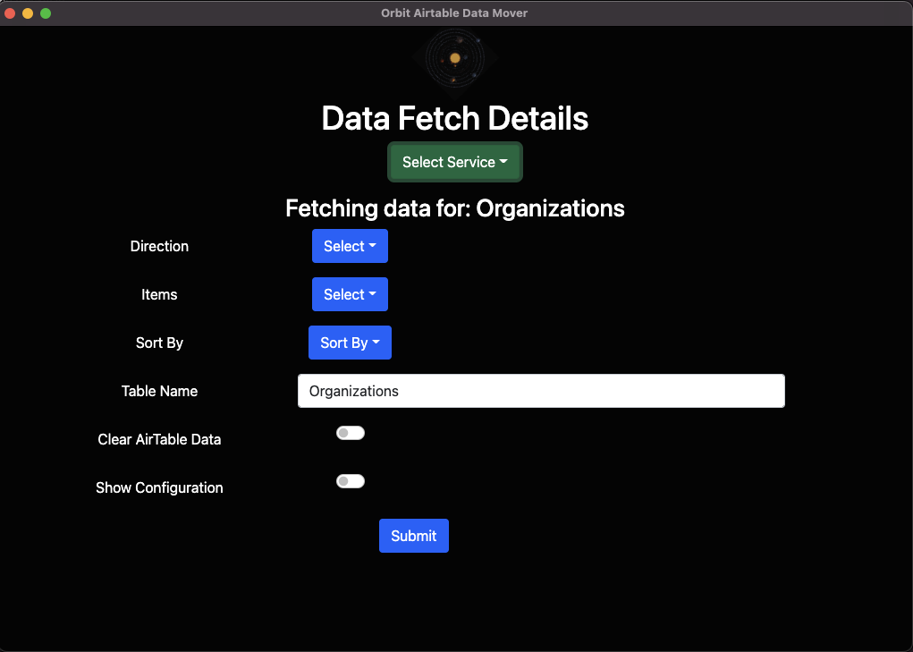
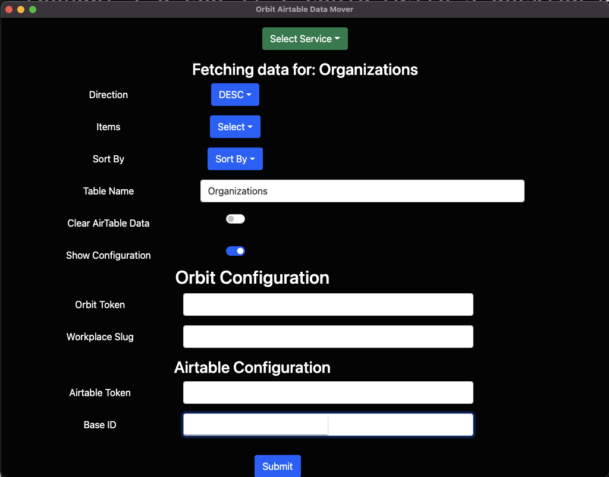
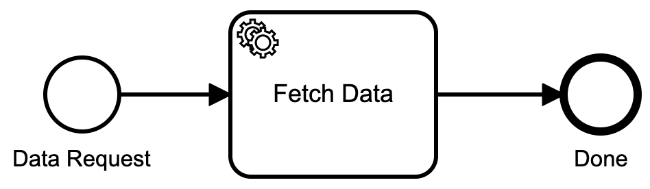

## Etwas Hintergrund

Ich habe ein wenig über die Verwendung von [Camunda](https://camunda.com?ref=davidgsiot) geschrieben, um alle möglichen Dinge von [Automatisierung von IoT-Prozessen](https://davidgs.com/posts/category/camunda /automating-iot-camunda/) bis hin zur Unterstützung bei der Verwaltung einer Slack-Community. Ok, also habe ich nicht über all diese Dinge geschrieben, aber ich habe sie auf jeden Fall _getan_.

In all diesen Projekten habe ich [Camunda](https://camunda.com?ref=davidgsiot) Platform 7 verwendet, um meine Prozesse bereitzustellen und auszuführen, aber die eigentliche Arbeit wurde größtenteils von externen Aufgaben erledigt, die ich in Golang geschrieben habe . Das ist entschieden _nicht_ die Art und Weise, wie ich die Dinge tun sollte. Die meisten Benutzer der Camunda-Plattform schreiben alles in Java. Ich habe Java schon verwendet, bevor es 1995 tatsächlich von Sun Microsystems veröffentlicht wurde (einen Moment der Stille bitte für ein fantastisches Unternehmen, das die Branche verändert hat, bitte).

Ich war 1996 ein „Java Technologist“, ein Job, den wir heute entweder als Evangelist oder Developer Advocate bezeichnen würden. Aber das ist nicht der Punkt. Der Punkt ist, dass ich selbst mit dieser Geschichte mit Java seit über 10 Jahren keinen sinnvollen Java-Code geschrieben habe. Aber ich schreibe jetzt viel Go-Code, also hier sind wir.

Letzter Hintergrund: Ich habe in letzter Zeit versucht, mir selbst React.js beizubringen, mit einigem (meistens begrenztem) Erfolg. Als ein anderes Teammitglied um Hilfe bei der Automatisierung des Verschiebens von Daten von [Orbit](https://orbit.love) nach [Airtable](https://airtable.com) bat, dachte ich, ich würde sehen, ob ich eine Desktop-Reaktion schreiben könnte App dazu.

## Schreiben der React-App

Es war wirklich keine komplizierte Bewerbung zu schreiben. Rufen Sie die Orbit-API auf, um die angeforderten Daten abzurufen, formatieren Sie sie ein wenig neu und rufen Sie dann die Airtable-API auf, um sie zu speichern. Ziemlich einfach.

So sieht die App aus:



Schön und einfach. Und es gibt einen kleinen Schieberegler, der Ihnen die Konfiguration der App für Dinge wie die Authentifizierungstoken usw. zeigt.



Als Randnotiz habe ich eines Tages Gewalt gewählt und dies zur Benutzeroberfläche gemacht:


Ich bin nicht stolz auf die Entscheidungen, die ich an diesem Tag getroffen habe.

## Camunda Cloud einen Wirbel geben

Am Tag, nachdem ich meiner Kollegin die App geliefert hatte, kam sie zurück und sagte: „[Mary](https://twitter.com/mary_grace) fragte, ob dies Camunda Cloud verwendet.“

Ich hatte die App ursprünglich mit Camunda Platform 7 erstellt, aber es stellte sich als problematisch heraus, die React App direkt auf der Camunda Platform zu posten, also habe ich Camunda einfach komplett umgangen.

Aber da ich gefragt wurde, _ob_ ich Camunda Cloud verwende, beschloss ich zu sehen, ob ich Camunda Cloud verwenden _könnte_! Also habe ich mir zuerst dieses superkomplizierte BPMN-Diagramm ausgedacht:



Einfacher geht es nicht, oder?

Ich habe diesen einfachen Prozess in Camunda Cloud bereitgestellt und mich dann daran gemacht, die Handler dafür zu schreiben.

## Umgang mit Camunda Cloud

Ich war sehr glücklich zu sehen, dass eine der für Camunda Cloud verfügbaren Bibliotheken eine Golang-Bibliothek war! Oh, glücklicher Tag!!

```go
import (
	"github.com/camunda-cloud/zeebe/clients/go/pkg/entities"
	"github.com/camunda-cloud/zeebe/clients/go/pkg/worker"
	"github.com/camunda-cloud/zeebe/clients/go/pkg/zbc"
)
```

Hat mir all die Go-Güte gegeben, die ich für die Verbindung mit Camunda Cloud benötigen würde. Eine Sache, auf die ich gestoßen bin, war, dass die Go-Bibliothek davon ausgeht, dass alle Variablen für die Verbindung zur Cloud in Umgebungsvariablen gespeichert werden. Ich habe das anfangs nicht bemerkt, also habe ich alle meine Zugangsdaten in einer `config.yaml`-Datei gespeichert und ... es hat immer noch nicht funktioniert. Ach ja, Umgebungsvariablen.

```go
type ENV struct {
	ZeebeAddress      string `yaml:"zeebeAddress"`
	ZeebeeClientID    string `yaml:"zeebeeClientID"`
	ZeebeClientSecret string `yaml:"zeebeeClientSecret"`
	ZeebeAuthServer   string `yaml:"zeebeAuthServer"`
}

var config = ENV{}

func init(){
  dat, err := ioutil.ReadFile("path/to/config/zeebe.yaml")
	if err != nil {
		log.Fatal("No startup file: ", err)
	}
	err = yaml.Unmarshal(dat, &config)
	if err != nil {
		log.Fatal(err)
	}
  config.ZeebeAddress = os.Getenv("ZEEBE_ADDRESS")
	if config.ZeebeAddress == "" {
		a.init_proc()
		os.Setenv("ZEEBE_ADDRESS", config.ZeebeAddress)
		os.Setenv("ZEEBE_CLIENT_ID", config.ZeebeeClientID)
		os.Setenv("ZEEBE_CLIENT_SECRET", config.ZeebeClientSecret)
		os.Setenv("ZEEBE_AUTH_SERVER", config.ZeebeAuthServer)
	}
  client, err := zbc.NewClient(&zbc.ClientConfig{
		GatewayAddress: config.ZeebeAddress,
	})
	if err != nil {
		panic(err)
	}
	jobWorker := client.NewJobWorker().JobType("fetch_data").Handler(a.handleJob).Open()
	go func() {
    <- readyClose
	  jobWorker.Close()
	  jobWorker.AwaitClose()
  }()
}
```

Ich beschloss, dieses kleine Konfigurationsbit einfach beizubehalten, da ich diesen Prozess als Systemdienst ausführen würde und ich nicht mit Umgebungsvariablen für einen Systemdienst herumspielen wollte.

Nachdem ich den Client initialisiert hatte, musste ich einen Handler für den Start eines Prozesses einrichten (ich werde gleich darauf zurückkommen, wie ich den Prozess gestartet habe). Der Prozess-Handler „jobWorker“ wartet auf Aufgaben namens „fetch_data“ und wenn er eine erhält, ruft er „handleJob“ auf, um sich darum zu kümmern. Es verwendet einen Kanal innerhalb einer Funktion, sodass ich bei Bedarf mehrere Anfragen gleichzeitig verarbeiten kann.

## Starten eines Prozesses

Da ich Probleme mit Camunda Platform und CORS-Headern hatte, musste ich einen Serverprozess schreiben, der die eingehenden Anfragen der Anwendung verarbeiten konnte.

```go
// The URLs I will accept, handle OPTIONS for CORS
func (a *App) InitializeRoutes() {
	a.Router.HandleFunc("/myEndPoint", a.handleOrgs).Methods("OPTIONS", "POST")
}

// Run it!
func (a *App) Run(addr string) {
	credentials := handlers.AllowCredentials()
	handlers.AllowedHeaders([]string{"X-Requested-With", "Content-Type", "Authorization", "Referer", "Origin"})
	methods := handlers.AllowedMethods([]string{"POST", "GET", "OPTIONS"})
	origins := handlers.AllowedOriginValidator(originValidator)
	log.Fatal(http.ListenAndServeTLS(addr, cert, key, handlers.CORS(credentials, methods, origins, handlers.IgnoreOptions())(a.Router)))
}

// handle the CORS preflight request
func (a *App) handleCORS(w http.ResponseWriter, r *http.Request) {
	w.Header().Set("Access-Control-Allow-Origin", "*")
	w.Header().Set("Access-Control-Allow-Methods", "POST, GET, OPTIONS, PUT, DELETE")
	w.Header().Set("Access-Control-Allow-Headers", "Accept, Content-Type, Content-Length, Accept-Encoding, X-CSRF-Token, Authorization")
}

// handle the incoming request
func (a *App) handleOrgs(w http.ResponseWriter, r *http.Request) {
	if r.Method == "OPTIONS" {
		a.handleCORS(w, r) // preflight
		return
	}
	if r.Header.Get("Content-Type") != "" {
		value, _ := header.ParseValueAndParams(r.Header, "Content-Type")
		if value != "application/json" {
			msg := "Content-Type header is not application/json"
			http.Error(w, msg, http.StatusUnsupportedMediaType)
			return
		}
	}
	body, err := ioutil.ReadAll(r.Body)
	if err != nil {
		fmt.Println(err)
	}
  // limit to 1MB
	r.Body = http.MaxBytesReader(w, r.Body, 1048576)
	pdat := ProcessData{}
	err = json.Unmarshal(body, &pdat)
	dec := json.NewDecoder(r.Body)
	if err != nil {
		var syntaxError *json.SyntaxError
		var unmarshalTypeError *json.UnmarshalTypeError
		switch {
		// Catch any syntax errors in the JSON
		case errors.As(err, &syntaxError):
			msg := fmt.Sprintf("Request body contains badly-formed JSON (at position %d)", syntaxError.Offset)
			http.Error(w, msg, http.StatusBadRequest)
		// In some circumstances Decode() may also return an
		// io.ErrUnexpectedEOF error for syntax errors in the JSON.
		case errors.Is(err, io.ErrUnexpectedEOF):
			msg := "Request body contains badly-formed JSON"
			http.Error(w, msg, http.StatusBadRequest)
		// Catch any type errors We can interpolate the relevant
    // field name and position into the error
		// message to make it easier for the client to fix.
		case errors.As(err, &unmarshalTypeError):
			msg := fmt.Sprintf("Request body contains an invalid value for the %q field (at position %d)", unmarshalTypeError.Field, unmarshalTypeError.Offset)
			http.Error(w, msg, http.StatusBadRequest)
		// Catch the error caused by extra unexpected fields in the request body
		case strings.HasPrefix(err.Error(), "json: unknown field "):
			fieldName := strings.TrimPrefix(err.Error(), "json: unknown field ")
			msg := fmt.Sprintf("Request body contains unknown field %s", fieldName)
			http.Error(w, msg, http.StatusBadRequest)
		// An io.EOF error is returned by Decode() if the request body is
		// empty.
		case errors.Is(err, io.EOF):
			msg := "Request body must not be empty"
			http.Error(w, msg, http.StatusBadRequest)
		// Catch the error caused by the request body being too large.
		case err.Error() == "http: request body too large":
			msg := "Request body must not be larger than 1MB"
			http.Error(w, msg, http.StatusRequestEntityTooLarge)
		// Otherwise default to logging the error and sending a 500 Internal
		// Server Error response.
		default:
			log.Println(err.Error())
			http.Error(w, http.StatusText(http.StatusInternalServerError), http.StatusInternalServerError)
		}
		return
	}
	// Call decode again, using a pointer to an empty anonymous struct as
	// the destination. If the request body only contained a single JSON
	// object this will return an io.EOF error. So if we get anything else,
	// we know that there is additional data in the request body.
	err = dec.Decode(&struct{}{})
	if err != io.EOF {
		msg := "Request body must only contain a single JSON object"
		http.Error(w, msg, http.StatusBadRequest)
		return
	}
  // error free, we can start the process
	err = startProcess(pdat)
	if err != nil {
		fmt.Println(err)
		http.Error(w, err.Error(), http.StatusInternalServerError)
		return
	}
}

func startProcess(pdat ProcessData) error {
	client, err := zbc.NewClient(&zbc.ClientConfig{
		GatewayAddress: config.ZeebeAddress,
	})
	if err != nil {
		return err
	}
  // turn the data structure into a map, which is what the Zeebe API expects
	var b map[string]interface{}
	inter, err := json.Marshal(pdat)
	if err != nil {
		return err
	}
	json.Unmarshal([]byte(inter), &b)
  // create the process
	ctx := context.Background()
	request, err := client.NewCreateInstanceCommand().BPMNProcessId("orbit-data").LatestVersion().VariablesFromMap(b)
	if err != nil {
		return err
	}
	msg, err := request.Send(ctx)
	if err != nil {
		return err
	}
	return nil
}
```

Das war alles, was Sie brauchten, um eingehende Anfragen von der Anwendung zu akzeptieren und dann einen Prozess in Camunda Cloud zu starten.

## Bearbeitung der Aufgabenerledigung

Jetzt, da ich eine Möglichkeit habe, den Prozess zu starten, muss ich die Aufgaben erledigen, während sie anfallen.

Wenn Sie sich erinnern, hatte ich früher einen Task-Handler für den Prozess eingerichtet:

```go
jobWorker := client.NewJobWorker().JobType("fetch_data").Handler(a.handleJob).Open()
	go func() {
    <- readyClose
	  jobWorker.Close()
	  jobWorker.AwaitClose()
  }()
```

Jetzt ist es an der Zeit, das ganze `handleJob`-Ding zu schreiben.

```go
func (a *App) handleJob(client worker.JobClient, job entities.Job){
	jobKey := job.GetKey()
    _, err := job.GetCustomHeadersAsMap()
    if err != nil {
        a.failJob(client, job)
        return
    }
    // get all the submitted variables
    variables, err := job.GetVariablesAsMap()
    if err != nil {
        a.failJob(client, job)
        return
    }
    request, err := client.NewCompleteJobCommand().JobKey(jobKey).VariablesFromMap(variables)
    if err != nil {
        a.failJob(client, job)
        return
    }
		incomingData := ProcessData{}
		jsonStr, err := json.Marshal(variables)
		if err != nil {
			fmt.Println(err)
		}
		err = json.Unmarshal(jsonStr, &incomingData)
		if err != nil {
			fmt.Println("Json unmarshall: ", err)
		}
    // this is where I get the data from Orbit, and send it to Airtable.
		err =	handleProcess(incomingData)
		if err != nil {
			a.failJob(client, job)
			return
		}
    // If all of that works, complete the job
    ctx := context.Background()
    _, err = request.Send(ctx)
    if err != nil {
        panic(err)
    }
    log.Println("Successfully completed job")
    //close(readyClose)
}

// Handle failing a job
func (a *App) failJob(client worker.JobClient, job entities.Job) {
    log.Println("Failed to complete job", job.GetKey())
    ctx := context.Background()
    _, err := client.NewFailJobCommand().JobKey(job.GetKey()).Retries(job.Retries - 1).Send(ctx)
    if err != nil {
        panic(err)
    }
}
```

Das ist so ziemlich alles! Ich werde Sie nicht mit all den Spielereien langweilen, die ich durchmachen musste, um die Daten aus dem Orbit in Airtable zu bekommen, da das für den Camunda Cloud-Prozess nicht ganz relevant ist.

## Eine Beschwerde gegen Airtable

Ich werde eine große Beschwerde gegen die Airtable-API erheben, weil sie Datensätze aus einer Tabelle gelöscht hat. Ok, vielleicht 2.

1) Es gibt keine Möglichkeit, einfach alle Daten aus einer Tabelle zu löschen. Sie können nur 10 Datensätze gleichzeitig löschen, und Sie müssen zuerst alle Daten aus der Tabelle abrufen, um die Datensatz-IDs zu erhalten. Dann lösche sie 10 auf einmal. Dies ist eine Verschwendung von Zeit und Ressourcen.
2) Die Airtable-API zum Löschen von Datensätzen ist Müll.

Die Dokumente sagen:
> Um Tabellendatensätze zu löschen, senden Sie eine DELETE-Anforderung an den Tabellenendpunkt. Beachten Sie, dass Tabellennamen und Tabellen-IDs austauschbar verwendet werden können. Die Verwendung von Tabellen-IDs bedeutet, dass Änderungen an Tabellennamen keine Änderungen an Ihrer API-Anfrage erfordern.
>
> Ihre Anfrage sollte ein URL-codiertes Array von bis zu 10 zu löschenden Datensatz-IDs enthalten.

Und der von Airtable bereitgestellte Beispielcode lautet:

```shell
curl -v -X DELETE https://api.airtable.com/v0/BASE_ID/TABLE_NAME \
 -H "Authorization: Bearer YOUR_API_KEY" \
 -G \
 --data-urlencode 'records[]=rec9mP3czPxkvf9IR' \
 --data-urlencode 'records[]=recMxJ0texTTI5BPq'
```
Ich nehme an, Sie können das Problem hier sehen. **Das ist kein Array von Datensatz-IDs!!** Sie müssen jede Datensatz-ID in eine separate Zeile einfügen und dann alles als `application/x-www-form-urlencoded`-Daten senden. Und aus irgendeinem dummen Grund **muss** der URL-Parameter `records[]` heißen. Ich denke, sie haben beschlossen, das `[]` hinzuzufügen, damit sie es ein Array nennen können. Es ist immer noch kein Array. Es ist einfach nicht. Das ist ein Hügel, auf dem ich sterben werde.


Ich habe eine Stunde meines Lebens damit verloren.

```go
func deleteNow(delData AirtableData) error {
  recordCounter := 0
	records := make([]string, 10)
  // delData is a struct{} that holds all the records to delete
  // All of this is because the API doesn't actually take an array
	for _, record := range delData.Records {
		records[recordCounter] = "records[]=" + record.ID
		recordCounter++
		if recordCounter == 10 {
			urlParm := strings.Join(records, "&")
			err = deleteNow(urlParm, incoming)
			if err != nil {
				return err
			}
		recordCounter = 0
		records = make([]string, 10)
		}
	}
	if recordCounter > 0 {
		urlParm := strings.Join(records, "&")
		err = deleteNow(urlParm, incoming)
		if err != nil {
			return err
		}
	}
  return nil
}

func deleteNow(urlParm string, incoming AirtableData) error {
	client := &http.Client{}
	delReq, err := http.NewRequest("DELETE", "https://api.airtable.com/v0/" + incoming.BaseID + "/" + incoming.TableName + "?" + urlParm, nil)
		if err != nil {
			return err
		}
		parseFormErr := delReq.ParseForm()
		if parseFormErr != nil {
	  	fmt.Println(parseFormErr)
		}
		delReq.Header.Add("Authorization", "Bearer " + incoming.AirtableToken)
		delReq.Header.Add("Content-Type", "application/x-www-form-urlencoded; charset=utf-8")
		_, err = client.Do(delReq)
		if err != nil {
			fmt.Println("Failure : ", err)
		}
		return nil
}
```

Wenn Sie also auch versuchen, Datensätze aus einer Airtable-Tabelle zu löschen, habe ich es gerade für Sie gelöst. Ignorieren Sie ihre API-Dokumente.

## Schlussfolgerungen

Camunda Cloud führt im Grunde fast alles als externe Aufgabe aus, die alle in Golang geschrieben werden können. Da ich vorher sowieso alles so gemacht habe, wird Camunda Cloud von nun an mein Standard sein! Ich kann sogar einige meiner Camunda-Plattform-Prozesse in Camunda-Cloud-Prozesse umschreiben, da die gesamte Aufgabenbearbeitung bereits in Go erfolgt ist.

Zumindest für mich ist diese neue Art der Umsetzung sehr natürlich und macht sehr viel Sinn. Es passt genau in meine bisherige Arbeitsweise, also ist es für mich ein Volltreffer, es weiter zu machen!

Ich würde gerne hören, was Sie über diese neue Art, Dinge zu tun, denken, also zögern Sie nicht, Kommentare usw. zu hinterlassen!
