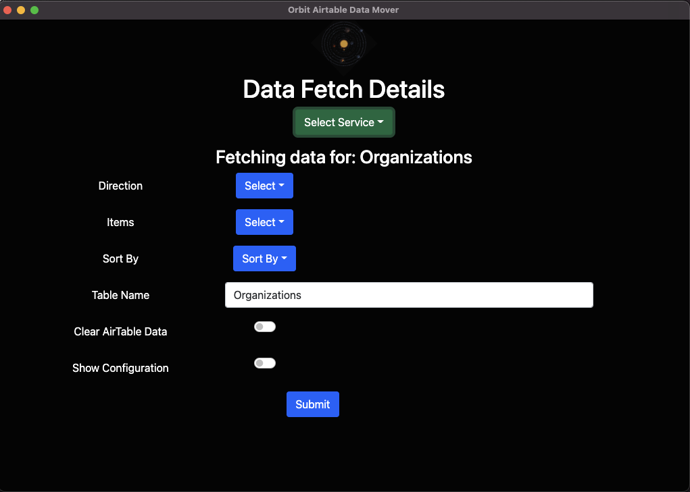
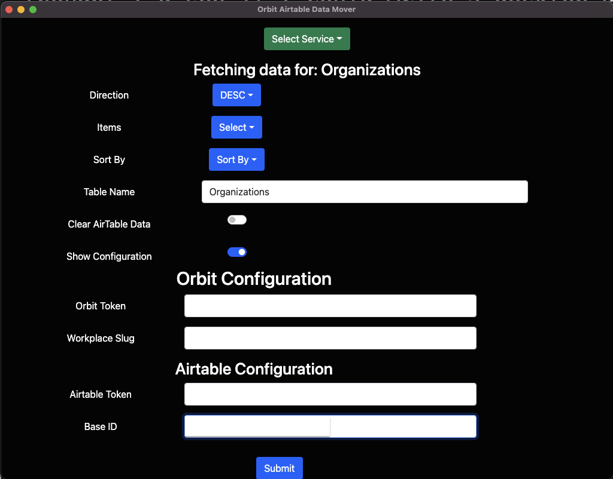
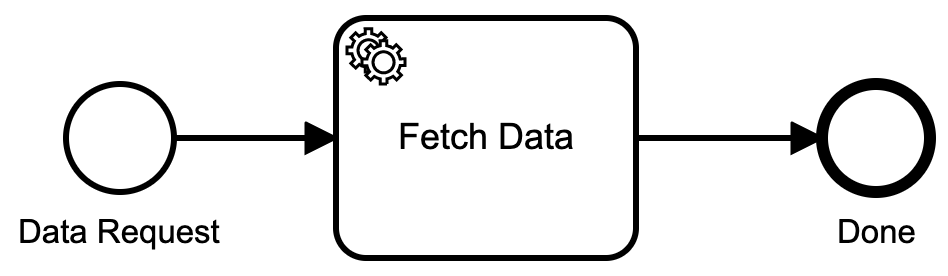

## Wat achtergrond

Ik heb iets geschreven over het gebruik van [Camunda](https://camunda.com?ref=davidgsiot) om allerlei dingen te doen van [het automatiseren van IoT-processen](https://davidgs.com/posts/category/camunda /automating-iot-camunda/) om te helpen bij het beheer van een Slack-community. Ok, dus ik heb niet over al die dingen geschreven, maar ik heb ze zeker gedaan.

In al die projecten heb ik [Camunda](https://camunda.com?ref=davidgsiot) Platform 7 gebruikt om mijn processen te implementeren en uit te voeren, maar het meeste eigenlijke werk werd gedaan door externe taken die ik in Golang schreef . Dit is beslist _niet_ de manier waarop ik de dingen zou moeten doen. De meeste gebruikers van Camunda Platform schrijven alles in Java. Ik gebruik Java al voordat het in 1995 door Sun Microsystems werd uitgebracht (een moment van stilte alstublieft voor een fantastisch bedrijf dat de industrie heeft veranderd, alstublieft).

Ik was een "Java Technologist" in 1996, een baan die we nu een evangelist of een Developer Advocate zouden noemen. Maar daar gaat het niet om. Het punt is dat ik zelfs met die geschiedenis met Java in meer dan 10 jaar geen zinvolle Java-code heb geschreven. Maar ik schrijf nu veel Go-code, dus hier zijn we.

Laatste stukje achtergrond: ik heb mezelf de laatste tijd React.js aangeleerd met enig (meestal beperkt) succes. Dus toen een ander teamlid om hulp vroeg bij het automatiseren van het verplaatsen van gegevens van [Orbit](https://orbit.love) naar [Airtable](https://airtable.com), dacht ik dat ik zou kijken of ik een desktop React kon schrijven App om het te doen.

## Schrijven van de React-app

Het was echt geen ingewikkelde applicatie om te schrijven. Roep de Orbit-API aan om de gevraagde gegevens op te halen, formatteer deze een beetje en roep vervolgens de Airtable-API aan om deze op te slaan. Vrij eenvoudig.

Zo ziet de app eruit:



Lekker simpel. En er is een kleine schuifregelaar die u de configuratie van de app laat zien voor zaken als de authenticatietokens, enz.



Als een kanttekening koos ik op een dag voor geweld en maakte dit de gebruikersinterface:


Ik ben niet trots op de keuzes die ik die dag heb gemaakt.

## Camunda Cloud een draai geven

De dag nadat ik de app bij mijn collega had afgeleverd, kwam ze terug en zei: "[Mary](https://twitter.com/mary_grace) vroeg of dit Camunda Cloud gebruikt."

Ik had de app oorspronkelijk gemaakt met Camunda Platform 7, maar het was problematisch om de React-app rechtstreeks op Camunda Platform te laten posten, dus ik heb Camunda gewoon helemaal omzeild.

Maar omdat mij werd gevraagd _of_ ik Camunda Cloud gebruikte, besloot ik te kijken of ik Camunda Cloud _kon_ gebruiken! Dus eerst bedacht ik dit supergecompliceerde BPMN-diagram:



Eenvoudiger dan dat wordt het niet, toch?

Ik heb dat eenvoudige proces in Camunda Cloud geïmplementeerd en ben toen begonnen met het schrijven van de handlers ervoor.

## Omgaan met Camunda Cloud

Ik was super blij om te zien dat een van de beschikbare bibliotheken voor Camunda Cloud een Golang-bibliotheek was! Oh blije dag!!

```go
import (
	"github.com/camunda-cloud/zeebe/clients/go/pkg/entities"
	"github.com/camunda-cloud/zeebe/clients/go/pkg/worker"
	"github.com/camunda-cloud/zeebe/clients/go/pkg/zbc"
)
```

Heeft me alle Go-goedheid gegeven die ik nodig zou hebben om verbinding te maken met Camunda Cloud. Een ding dat ik tegenkwam, was dat de Go-bibliotheek ervan uitgaat dat alle variabelen voor verbinding met de cloud worden opgeslagen in omgevingsvariabelen. Ik vergat dit eerst op te merken, dus ik bewaarde al mijn inloggegevens in een `config.yaml`-bestand en ... het werkte nog steeds niet. Oh ja, omgevingsvariabelen.

```go
type ENV struct {
	ZeebeAddress      string `yaml:"zeebeAddress"`
	ZeebeeClientID    string `yaml:"zeebeeClientID"`
	ZeebeClientSecret string `yaml:"zeebeeClientSecret"`
	ZeebeAuthServer   string `yaml:"zeebeAuthServer"`
}

var config = ENV{}

func init(){
  dat, err := ioutil.ReadFile("path/to/config/zeebe.yaml")
	if err != nil {
		log.Fatal("No startup file: ", err)
	}
	err = yaml.Unmarshal(dat, &config)
	if err != nil {
		log.Fatal(err)
	}
  config.ZeebeAddress = os.Getenv("ZEEBE_ADDRESS")
	if config.ZeebeAddress == "" {
		a.init_proc()
		os.Setenv("ZEEBE_ADDRESS", config.ZeebeAddress)
		os.Setenv("ZEEBE_CLIENT_ID", config.ZeebeeClientID)
		os.Setenv("ZEEBE_CLIENT_SECRET", config.ZeebeClientSecret)
		os.Setenv("ZEEBE_AUTH_SERVER", config.ZeebeAuthServer)
	}
  client, err := zbc.NewClient(&zbc.ClientConfig{
		GatewayAddress: config.ZeebeAddress,
	})
	if err != nil {
		panic(err)
	}
	jobWorker := client.NewJobWorker().JobType("fetch_data").Handler(a.handleJob).Open()
	go func() {
    <- readyClose
	  jobWorker.Close()
	  jobWorker.AwaitClose()
  }()
}
```

Ik besloot om dat kleine beetje configuratie te behouden, omdat ik dit proces als een systeemservice zou uitvoeren, en ik wilde niet gaan rommelen met omgevingsvariabelen voor een systeemservice.

Nadat ik de client had geïnitialiseerd, moest ik een handler instellen voor wanneer een proces van start ging (ik kom zo te weten hoe ik het proces heb gestart). De procesbehandelaar `jobWorker` luistert naar taken die `fetch_data` worden genoemd en wanneer hij er een krijgt, roept hij `handleJob` aan om ervoor te zorgen. Het gebruikt een kanaal in een functie, zodat ik meerdere verzoeken tegelijk kan verwerken, als dat nodig is.

## Een proces starten

Omdat ik problemen had met Camunda Platform en CORS-headers, moest ik een serverproces schrijven dat de inkomende verzoeken van de applicatie kon verwerken.

```go
// The URLs I will accept, handle OPTIONS for CORS
func (a *App) InitializeRoutes() {
	a.Router.HandleFunc("/myEndPoint", a.handleOrgs).Methods("OPTIONS", "POST")
}

// Run it!
func (a *App) Run(addr string) {
	credentials := handlers.AllowCredentials()
	handlers.AllowedHeaders([]string{"X-Requested-With", "Content-Type", "Authorization", "Referer", "Origin"})
	methods := handlers.AllowedMethods([]string{"POST", "GET", "OPTIONS"})
	origins := handlers.AllowedOriginValidator(originValidator)
	log.Fatal(http.ListenAndServeTLS(addr, cert, key, handlers.CORS(credentials, methods, origins, handlers.IgnoreOptions())(a.Router)))
}

// handle the CORS preflight request
func (a *App) handleCORS(w http.ResponseWriter, r *http.Request) {
	w.Header().Set("Access-Control-Allow-Origin", "*")
	w.Header().Set("Access-Control-Allow-Methods", "POST, GET, OPTIONS, PUT, DELETE")
	w.Header().Set("Access-Control-Allow-Headers", "Accept, Content-Type, Content-Length, Accept-Encoding, X-CSRF-Token, Authorization")
}

// handle the incoming request
func (a *App) handleOrgs(w http.ResponseWriter, r *http.Request) {
	if r.Method == "OPTIONS" {
		a.handleCORS(w, r) // preflight
		return
	}
	if r.Header.Get("Content-Type") != "" {
		value, _ := header.ParseValueAndParams(r.Header, "Content-Type")
		if value != "application/json" {
			msg := "Content-Type header is not application/json"
			http.Error(w, msg, http.StatusUnsupportedMediaType)
			return
		}
	}
	body, err := ioutil.ReadAll(r.Body)
	if err != nil {
		fmt.Println(err)
	}
  // limit to 1MB
	r.Body = http.MaxBytesReader(w, r.Body, 1048576)
	pdat := ProcessData{}
	err = json.Unmarshal(body, &pdat)
	dec := json.NewDecoder(r.Body)
	if err != nil {
		var syntaxError *json.SyntaxError
		var unmarshalTypeError *json.UnmarshalTypeError
		switch {
		// Catch any syntax errors in the JSON
		case errors.As(err, &syntaxError):
			msg := fmt.Sprintf("Request body contains badly-formed JSON (at position %d)", syntaxError.Offset)
			http.Error(w, msg, http.StatusBadRequest)
		// In some circumstances Decode() may also return an
		// io.ErrUnexpectedEOF error for syntax errors in the JSON.
		case errors.Is(err, io.ErrUnexpectedEOF):
			msg := "Request body contains badly-formed JSON"
			http.Error(w, msg, http.StatusBadRequest)
		// Catch any type errors We can interpolate the relevant
    // field name and position into the error
		// message to make it easier for the client to fix.
		case errors.As(err, &unmarshalTypeError):
			msg := fmt.Sprintf("Request body contains an invalid value for the %q field (at position %d)", unmarshalTypeError.Field, unmarshalTypeError.Offset)
			http.Error(w, msg, http.StatusBadRequest)
		// Catch the error caused by extra unexpected fields in the request body
		case strings.HasPrefix(err.Error(), "json: unknown field "):
			fieldName := strings.TrimPrefix(err.Error(), "json: unknown field ")
			msg := fmt.Sprintf("Request body contains unknown field %s", fieldName)
			http.Error(w, msg, http.StatusBadRequest)
		// An io.EOF error is returned by Decode() if the request body is
		// empty.
		case errors.Is(err, io.EOF):
			msg := "Request body must not be empty"
			http.Error(w, msg, http.StatusBadRequest)
		// Catch the error caused by the request body being too large.
		case err.Error() == "http: request body too large":
			msg := "Request body must not be larger than 1MB"
			http.Error(w, msg, http.StatusRequestEntityTooLarge)
		// Otherwise default to logging the error and sending a 500 Internal
		// Server Error response.
		default:
			log.Println(err.Error())
			http.Error(w, http.StatusText(http.StatusInternalServerError), http.StatusInternalServerError)
		}
		return
	}
	// Call decode again, using a pointer to an empty anonymous struct as
	// the destination. If the request body only contained a single JSON
	// object this will return an io.EOF error. So if we get anything else,
	// we know that there is additional data in the request body.
	err = dec.Decode(&struct{}{})
	if err != io.EOF {
		msg := "Request body must only contain a single JSON object"
		http.Error(w, msg, http.StatusBadRequest)
		return
	}
  // error free, we can start the process
	err = startProcess(pdat)
	if err != nil {
		fmt.Println(err)
		http.Error(w, err.Error(), http.StatusInternalServerError)
		return
	}
}

func startProcess(pdat ProcessData) error {
	client, err := zbc.NewClient(&zbc.ClientConfig{
		GatewayAddress: config.ZeebeAddress,
	})
	if err != nil {
		return err
	}
  // turn the data structure into a map, which is what the Zeebe API expects
	var b map[string]interface{}
	inter, err := json.Marshal(pdat)
	if err != nil {
		return err
	}
	json.Unmarshal([]byte(inter), &b)
  // create the process
	ctx := context.Background()
	request, err := client.NewCreateInstanceCommand().BPMNProcessId("orbit-data").LatestVersion().VariablesFromMap(b)
	if err != nil {
		return err
	}
	msg, err := request.Send(ctx)
	if err != nil {
		return err
	}
	return nil
}
```

Dat is alles wat nodig was om inkomende verzoeken van de applicatie te accepteren en vervolgens een proces te starten in Camunda Cloud.

## De voltooiing van de taak afhandelen

Nu ik een manier heb om het proces te starten, moet ik de taken afhandelen zoals ze gebeuren.

Als je je nog herinnert dat ik een taakafhandelaar voor het proces had ingesteld:

```go
jobWorker := client.NewJobWorker().JobType("fetch_data").Handler(a.handleJob).Open()
	go func() {
    <- readyClose
	  jobWorker.Close()
	  jobWorker.AwaitClose()
  }()
```

Dus nu is het tijd om dat hele `handleJob'-ding te schrijven.

```go
func (a *App) handleJob(client worker.JobClient, job entities.Job){
	jobKey := job.GetKey()
    _, err := job.GetCustomHeadersAsMap()
    if err != nil {
        a.failJob(client, job)
        return
    }
    // get all the submitted variables
    variables, err := job.GetVariablesAsMap()
    if err != nil {
        a.failJob(client, job)
        return
    }
    request, err := client.NewCompleteJobCommand().JobKey(jobKey).VariablesFromMap(variables)
    if err != nil {
        a.failJob(client, job)
        return
    }
		incomingData := ProcessData{}
		jsonStr, err := json.Marshal(variables)
		if err != nil {
			fmt.Println(err)
		}
		err = json.Unmarshal(jsonStr, &incomingData)
		if err != nil {
			fmt.Println("Json unmarshall: ", err)
		}
    // this is where I get the data from Orbit, and send it to Airtable.
		err =	handleProcess(incomingData)
		if err != nil {
			a.failJob(client, job)
			return
		}
    // If all of that works, complete the job
    ctx := context.Background()
    _, err = request.Send(ctx)
    if err != nil {
        panic(err)
    }
    log.Println("Successfully completed job")
    //close(readyClose)
}

// Handle failing a job
func (a *App) failJob(client worker.JobClient, job entities.Job) {
    log.Println("Failed to complete job", job.GetKey())
    ctx := context.Background()
    _, err := client.NewFailJobCommand().JobKey(job.GetKey()).Retries(job.Retries - 1).Send(ctx)
    if err != nil {
        panic(err)
    }
}
```

Dat is het zo'n beetje! Ik zal je niet vervelen met alle shenanigans die ik moest doorstaan om de gegevens uit Orbit en in Airtable te krijgen, aangezien dat niet helemaal relevant is voor het Camunda Cloud-proces.

## Een klacht tegen Airtable

Ik zal een grote klacht indienen tegen de Airtable API voor het verwijderen van records uit een tabel. Oké, misschien 2.

1) Er is geen manier om alle gegevens uit een tabel te wissen. U kunt slechts 10 records tegelijk verwijderen en u moet eerst alle gegevens uit de tabel halen om de record-ID's te krijgen. Ga ze dan 10 tegelijk verwijderen. Dit is een verspilling van tijd en middelen.
2) De Airtable API voor het verwijderen van records is onzin.

De documenten zeggen:
> Als u tabelrecords wilt verwijderen, stuurt u een DELETE-verzoek naar het tabeleindpunt. Merk op dat tabelnamen en tabel-ID's door elkaar kunnen worden gebruikt. Het gebruik van tabel-ID's betekent dat voor het wijzigen van de tabelnaam geen aanpassingen aan uw API-verzoek nodig zijn.
>
> Uw verzoek moet een URL-gecodeerde array van maximaal 10 record-ID's bevatten om te verwijderen.

En de voorbeeldcode die door Airtable wordt geleverd, is:

```shell
curl -v -X DELETE https://api.airtable.com/v0/BASE_ID/TABLE_NAME \
 -H "Authorization: Bearer YOUR_API_KEY" \
 -G \
 --data-urlencode 'records[]=rec9mP3czPxkvf9IR' \
 --data-urlencode 'records[]=recMxJ0texTTI5BPq'
```
Ik neem aan dat je het probleem hier kunt zien. **Dat is geen array van record-ID's!!** Je moet elke record-ID op een aparte regel zetten, en het dan allemaal verzenden als `application/x-www-form-urlencoded` data. En om de een of andere domme reden moet de URL-parameter **moet** `records[]` heten. Ik denk dat ze besloten hebben om de `[]` toe te voegen zodat ze het een array konden noemen. Het is nog steeds geen array. Het is gewoon niet. Dit is een heuvel waarop ik zal sterven.


Ik heb hier een uur van mijn leven aan verloren.

```go
func deleteNow(delData AirtableData) error {
  recordCounter := 0
	records := make([]string, 10)
  // delData is a struct{} that holds all the records to delete
  // All of this is because the API doesn't actually take an array
	for _, record := range delData.Records {
		records[recordCounter] = "records[]=" + record.ID
		recordCounter++
		if recordCounter == 10 {
			urlParm := strings.Join(records, "&")
			err = deleteNow(urlParm, incoming)
			if err != nil {
				return err
			}
		recordCounter = 0
		records = make([]string, 10)
		}
	}
	if recordCounter > 0 {
		urlParm := strings.Join(records, "&")
		err = deleteNow(urlParm, incoming)
		if err != nil {
			return err
		}
	}
  return nil
}

func deleteNow(urlParm string, incoming AirtableData) error {
	client := &http.Client{}
	delReq, err := http.NewRequest("DELETE", "https://api.airtable.com/v0/" + incoming.BaseID + "/" + incoming.TableName + "?" + urlParm, nil)
		if err != nil {
			return err
		}
		parseFormErr := delReq.ParseForm()
		if parseFormErr != nil {
	  	fmt.Println(parseFormErr)
		}
		delReq.Header.Add("Authorization", "Bearer " + incoming.AirtableToken)
		delReq.Header.Add("Content-Type", "application/x-www-form-urlencoded; charset=utf-8")
		_, err = client.Do(delReq)
		if err != nil {
			fmt.Println("Failure : ", err)
		}
		return nil
}
```

Dus als je ook probeert om records uit een Airtable-tabel te verwijderen, heb ik het zojuist voor je opgelost. Negeer hun API-documenten.

## Conclusies

Camunda Cloud voert in principe bijna alles uit als een externe taak, die allemaal in Golang kan worden geschreven. Aangezien ik toch alles op deze manier deed, wordt Camunda Cloud vanaf nu mijn standaard! Ik kan zelfs een aantal van mijn Camunda Platform-processen herschrijven als Camunda Cloud-processen, aangezien alle taakafhandeling al in Go is gedaan.

Voor mij is deze nieuwe manier van implementeren in ieder geval heel natuurlijk en heel logisch. Het past precies in hoe ik al werk, dus het is een slam-dunk voor mij om het te blijven doen!

Ik hoor graag wat je van deze nieuwe manier van doen vindt, dus laat gerust reacties achter, enz.!
