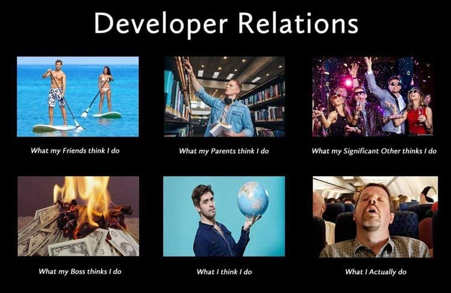

Ich habe in letzter Zeit viele Vorstellungsgespräche geführt (und nein, ich möchte nicht darüber reden). Ich werde fast ständig gefragt: „Wie definieren Sie Entwicklerbeziehungen?“ und dieser Beitrag ist die ausführliche Antwort auf diese Frage.

Ich schreibe es, weil fast jeder Interviewer, dem ich das gegeben habe, in irgendeiner Form gesagt hat: „Das ist eine wirklich gute Analogie! Sie sollten das als Blogbeitrag verfassen.“ So hier sind wir.

## Erstens ist DevRel _keine_ Partei

DevRel ist vieles, aber eine Party gehört nicht dazu. Tatsächlich handelt es sich um einen der härtesten Jobs im technischen Bereich. Es ist, als hätte man vier oder fünf Jobs gleichzeitig.
1. Sie sind Entwickler
2. Sie sind ein Vermarkter
3. Sie sind ein Verkäufer
4. Sie sind Produktmanager
5. Du bist Lehrer

Und um das Ganze abzurunden, müssen Sie in der Lage sein, Marketing, Technik, Vertrieb und Produktmanagement zu *beeinflussen*, ohne über irgendeine *Autorität* zu verfügen. Sie können niemandem direkt sagen, was er tun soll, da keiner von ihnen Ihnen oder oft sogar Ihren Organisationen unterstellt ist. Aber Sie müssen in der Lage sein, sie davon abzuhalten, dumme Dinge zu tun, die Entwickler hassen würden, und sie dazu zu überreden, Dinge zu tun, die Entwickler *wollen*.

Das Marketing möchte Werbung für eine Konferenz machen, die ... schlecht beraten ist, und Sie müssen sie davon überzeugen, es nicht zu tun. Ich habe Beispiele. Es ist besser, wenn Sie eine Beziehung zu ihnen aufgebaut haben, sodass sie kommen und *fragen*, welche Art von Beute gut wäre. Oder das Marketing möchte den Blog-Beitrag des CTO oder die CFP-Einreichung (Call for Papers) neu schreiben, und sie verwandeln alles in blumige Marketing-Sprache, und Sie müssen alles rückgängig machen, damit der Vortrag tatsächlich angenommen wird.

Die Technik versucht, Fehlerkorrekturen und Funktionen zu priorisieren, und Sie müssen diese Entscheidungen im Namen der Entwicklergemeinschaft beeinflussen. Technik und Produktmanagement möchten mit ihren Lieblingsfunktionen vorankommen, aber Sie wissen, dass Entwickler lautstark nach anderen Funktionen verlangen. Sie müssen diese Entscheidungen beeinflussen.

Ich könnte so weitermachen, aber Sie wissen schon, worauf es ankommt. Und im Allgemeinen müssen Sie all das tun, während Sie technische Inhalte schreiben (Blogbeiträge, Tutorials usw.), auf Konferenzen sprechen und Meetups und andere Veranstaltungen durchführen. Oftmals geschieht dies alles vom Sitz einer Fluggesellschaft oder einer Flughafenlounge aus. Es ist keine Party. Es ist anstrengend.

## Aber es ist eine Party

Und jetzt werde ich Ihnen sagen, warum es eine Party ist. Irgendwie.

Schauen wir uns zunächst die drei Säulen von DevRel an: Developer Advocacy, Developer Experience und Community Management. Sehen wir uns an, wie jeder dieser Teile in dieser Parteianalogie funktioniert.

### Interessenvertretung der Entwickler

Der Developer Advocate (DA) ist die Person an vorderster Front, die täglich mit Entwicklern interagiert. Sie sprechen mit Entwicklern, halten Präsentationen auf Konferenzen, schreiben technische Inhalte und versuchen im Allgemeinen, Entwickler für Ihre Plattform zu *locken*. Sie sind auf der ganzen Welt unterwegs und versuchen, Entwickler dazu zu bringen, zu Ihrer Party zu kommen. Sie müssen sympathisch, kontaktfreudig und technisch genug sein, um mit Entwicklern glaubwürdig über Ihre Plattform sprechen zu können.

Ihre Developer Advocates müssen in der Lage sein, für Ihre Plattform zu werben, und Ihre Community ist ein großartiger Ort, der für Entwickler von Wert ist, ein integrativer und einladender Ort ist und über Ressourcen verfügt, die ihnen helfen können. Sie müssen in der Lage sein, dies auf eine authentische und authentische Weise zu tun, und das darf nicht nur Marketing-Sprache sein.

### Entwicklererfahrung

Das Developer Experience (DevEx)-Team ist dafür verantwortlich, sicherzustellen, dass es etwas zu tun gibt, wenn Entwickler zu Ihrer Party kommen. Sie sind für das Onboarding-Erlebnis, die Dokumentation, die SDKs, die APIs, die CLI und alle anderen Tools verantwortlich, die Entwickler zur Interaktion mit Ihrer Plattform verwenden. Sie sind dafür verantwortlich, dass die Party Spaß macht und dass es etwas zu tun gibt.

DevEx erstellt, testet und pflegt die Demos, Tutorials und anderen Inhalte, die Entwickler verwenden, um mehr über Ihre Plattform zu erfahren. Wenn DevEx scheitert, werden alle Leute, die Developer Advocacy davon überzeugt hat, an der Veranstaltung teilzunehmen, sofort umkehren und gehen. Und sie werden nicht so schnell zurückkommen. Das alte Sprichwort „Man bekommt nie eine zweite Chance, einen ersten Eindruck zu hinterlassen“ ist nie wahrer als in DevRel.

Wenn es erst halb fertig ist, werden sie gehen.

### Community-Management

Last, but not least, ist das Community Management. Dies ist die Gruppe, die dafür verantwortlich ist, dass die Party Spaß macht, einladend und sicher ist und dass sich die Leute wertgeschätzt und einbezogen fühlen. Gibt es einen Verhaltenskodex? Wird es durchgesetzt? Gibt es klare Durchsetzungsrichtlinien? Ein guter Community Manager stellt sicher, dass alle diese Dinge vorhanden sind und funktionieren.

Der Community Manager ist (im Allgemeinen) auch für ein „Champions“-Programm verantwortlich. Das sind die Menschen, die das Leben der Partei ausmachen. Sie sind diejenigen, die immer da sind, immer helfen und immer dafür sorgen, dass alle eine gute Zeit haben. Sie beantworten Fragen, unterstützen andere Community-Mitglieder und man kann sich im Allgemeinen darauf verlassen, dass sie die „Säulen der Community“ sind.

Aber ein guter Community Manager weiß *auch*, wer die Lauerer sind, und kann sie zu aktiven Mitgliedern machen. Sie wissen auch, wer die potenziellen Unruhestifter sind, und achten genau darauf, dass die Gemeinschaftsstandards eingehalten werden.

Eine Partei kann schnell pleitegehen, und wenn es einmal passiert, kann es fast unmöglich sein, die Dinge wieder in den Griff zu bekommen oder den Reputationsschaden zu verkraften.

Es gibt so viele, *viele* Beispiele.

## Es ist ein Mannschaftssport

DevRel ist ein Mannschaftssport. Um es zum Erfolg zu führen, braucht es viele Menschen mit vielen unterschiedlichen und vielfältigen Fähigkeiten. Es ist keine Party, aber es ist eine Party. Es ist eine Menge harte Arbeit, aber es macht auch viel Spaß. Es ist viel Stress, aber auch viel Freude.

Und es ist nichts, was man über Nacht auf die Beine stellen kann. Es braucht Zeit und konzertierte Anstrengungen im Laufe der Zeit, um das Haus zu bauen, alle Teile an ihren Platz zu bringen, die richtigen Leute anzuziehen und sie dann zu einer Gemeinschaft zu entwickeln. Es ist viel Arbeit, aber es lohnt sich.

DevRel ist auch eine Kostenstelle. Es wird nicht direkt Einnahmen generieren. Aber es ist auch ein Kraftmultiplikator. Es kann Ihr Produkt besser, Ihre Community stärker und Ihr Unternehmen erfolgreicher machen. Es handelt sich um eine langfristige Investition, die sich lohnt. In 3 Monaten werden Sie keinen Erfolg sehen. Oder 6 Monate. Oder höchstwahrscheinlich sogar ein Jahr. Ja, Sie können mit Fortschritten rechnen, aber es wird Zeit brauchen, die Art von Community aufzubauen, die Ihr Unternehmen erfolgreich macht.

Abgesehen davon *kann* DevRel durchaus dazu beitragen, erhebliche Einnahmen zu generieren. Hier sind meine Vorschläge, wie:
- Stellen Sie sicher, dass Sie wissen, wer die Kundenbetreuer/Verkäufer sind. Bieten Sie an, ihnen zu helfen, wenn sie es brauchen. Stellen Sie sicher, dass sie wissen, wer Sie sind und was Sie anbieten können
- Informieren Sie sich über die allgemeinen Unternehmensziele für das Jahr und das Quartal. Konzentrieren Sie Ihre Bemühungen auf Dinge, die dem Unternehmen helfen, diese Ziele zu erreichen
- Behalten Sie den Überblick darüber, was Sie tun, um die Unternehmensziele zu beeinflussen, und wie Sie zur Umsatzgenerierung beigetragen haben
- Bleiben Sie auf dem Laufenden über die Personen in Ihrer Community, die mit Ihrer Software Fortschritte gemacht haben, und achten Sie insbesondere auf Hinweise darauf, dass sie möglicherweise bereit sind, mit dem Vertrieb zu sprechen.
- Wenn sie fertig sind, stellen Sie sie vor. Und machen Sie es persönlich, damit sowohl der potenzielle Kunde als auch der Vertriebsleiter wissen, dass Sie sich die Zeit genommen haben, seine Bedürfnisse zu verstehen und sie den richtigen Leuten mitzuteilen.

## Abschluss

Wie ich bereits sagte, ist DevRel *wie* eine Partei, wenn es darum geht, wie es geplant, verwaltet und ausgeführt werden muss. Keine wirklich epische Party passiert jemals „einfach so“. Es erfordert Arbeit und ein ganzes Team, damit es mühelos aussieht. DevRel ist auch keine Partei, weil es eine unheilige Menge Arbeit ist. Die Verantwortung ist enorm und man kann sie nicht einfach „beflügeln“. Diese Blog-Ideen und Tutorial-Ideen kommen nicht einfach aus dem Nichts. Sie erfordern Zeit, Recherche und Mühe.

Lassen Sie uns also alle eine Party für die DevRel-Leute in Ihrem Unternehmen veranstalten. Feiern Sie ihre Erfolge und stellen Sie sicher, dass jeder Bescheid weiß, wenn Devrel Ihre Arbeit beeinflusst hat. 
