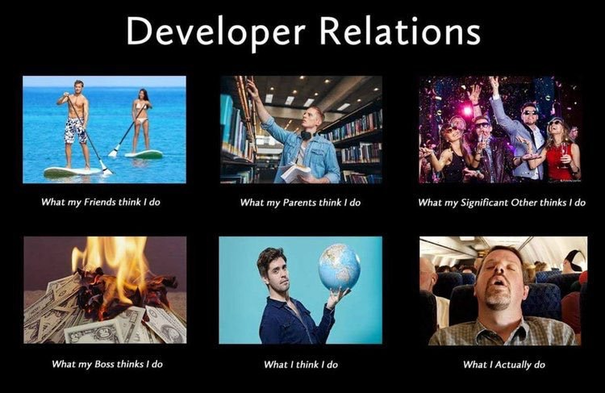
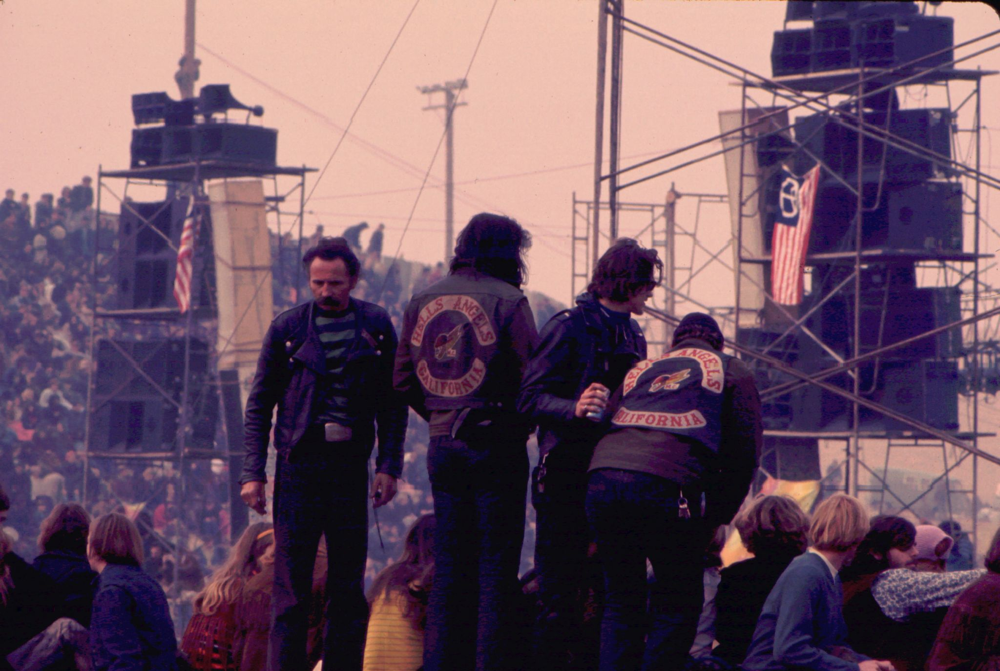

I've been interviewing a lot lately (and no, I don't want to talk about it). I'm asked almost all the time "How do you define Developer Relations?" and this post is the long-form answer to that question.

I'm writing it because almost every interviewer I've given this to has said some form of "that's a really good analogy! You should write that up as a blog post." So here we are.

## First, DevRel is _not_ a Party

DevRel is a lot of things, but a party isn't one of them. In fact, it's one of the hardest jobs in tech. It's like having 4 or 5 jobs all at once.
1. You're a developer
2. You're a marketer
3. You're a salesperson
4. You're a product manager
5. You're a teacher

And to top it all off, you have to be able to *influence* Marketing, Engineering, Sales, and Product Management all without having any *authority*. You can't tell anyone what to do directly, because none of them report to you, or often even report into your organizations. But you have to be able to keep them from doing dumb things that developers will hate, and cajole them into doing things that developers *want*.

Marketing wants to produce some swag for a conference that is ... ill advised, and you have to convince them not to. I have examples. It's better if you have established a relationship with them such that they come and *ask* what kinds of swag would be good. Or Marketing wants to re-write the CTO's blog post or CFP (Call for Papers) submission, and they turn it all into flowery marketing-speak and you have to undo it all so that the talk might actually get accepted.

Engineering is trying to prioritize bug fixes and features, and you have to influence those choices on behalf of the developer community. Engineering and Product Management want to move forward with their pet-features, but you know that developers are clamoring for a different set of features. You have to influence those choices.

I could go on and on, but you get the idea. And in general, you have to do all of that while writing technical content (blog posts, tutorials, etc.), speaking at conferences, and running meetups and other events. Often all of that is done from an airline seat, or an airport lounge. It's not a party. It's exhausting.

## But it is a party

And now I'm going to tell you why it *is* a party. Sort of.

First, let's look at what I consider the 3 pillars of DevRel: Developer Advocacy, Developer Experience, and Commmunity Management. Let's go through how each of those parts function in this party analogy.

### Developer Advocacy

The Developer Advocate (DA) is the front-line person interacting with developers on a daily basis. They are talking to developers, giving presentations at conferences, writing technical content, and generally trying to *attract* developers to your platform. They are out in the world trying to get developers to come to your party. They have to be personable, comdfortable with people, and technical enough to be able to talk credibly to developers about your platform.

Your Developer Advocates need to pe able to promote your platform, and your community, as a great place that has value to developers, is an inclusive and welcoming place, and that has resources to help them. They need to be able to do that in a way that is authentic and genuine, and that is not just marketing-speak.

### Developer Experience

The Developer Experience (DevEx) team is responsible for making sure that when developers come to your party, there are things to do. They are responsible for the onboarding experience, the documentation, the SDKs, the APIs, the CLI, and all the other tools that developers will use to interact with your platform. They are responsible for making sure that the party is fun, and that there are things to do.

DevEx creates, tests, and maintains the demos, tutorials, and other content that developers will use to learn about your platform. If DevEx fails, then all the people that Developer Advocacy convinces to come to the part are going to turn right around and leave. And they won't soon come back. The old saying "you never get a second chance to make a first impression" is never more true than in DevRel.

It it's only half-built, they will leave.

### Community Management

Last, but by all means not least, is Community Management. This is the group that's responsible for making sure that the party is fun, welcoming, safe, and that people feel valued and included. Is there a Code of Conduct? Is it enforced? Are theyre clear enforecement guidelines? A good Community Manager makes sure that these things are all in place, and that they are working.

The Community Manager is also responsible (generally) for a "champions" program. These are the people that are the life of the party. They are the ones that are always there, always helping, always making sure that everyone is having a good time. They answer questions, support other community members, and can generally be counted on to be the "pillars of the community."

But a good Community Manager *also* knows who the lurkers are, and can nurture them into becoming active members. They also know who the potential troublemakers are, and keep a keen watch to make sure that the community standards are upheld.

A party can go bad quickly, and once it does, it can be nearly impossible to get things back on track, or to live down the reputational damage.

There are so many, *many* examples.

## It's a Team Sport

DevRel is a team sport. It takes a lot of people, with a lot of different and diverse skills, to make it a success. It's not a party, but it is a party. It's a lot of hard work, but it's also a lot of fun. It's a lot of stress, but it's also a lot of joy.

And it's not something that you can pull together overnight. It takes time, and concerted effort over time to build the house, get all the parts in place, attract the right people, and then nurture them into a community. It's a lot of work, but it's worth it.

DevRel is also a cost center. It's not going to generate revenue directly. But it's also a force multiplier. It can make your product better, your community stronger, and your company more successful. It's a long-term investment, and it's worth it. You won't see success in 3 months. Or 6 months. Or even a year, most likely. Yes, you can expect to see progress, but it's going to take time to build the kind of community that will make your company successful.

All of that being said, DevRel absolutely *can* participate in generating significant revenue. Here are my suggestions for how:
- Make sure that you know who the account executives/sales people are. Offer to help them if they need it. Make sure they know who you are, and what you can offer
- Know what the overall company goals and objectives are for the year, and the quarter. Focus your efforts on things that will help the company achieve those goals
- Keep track of the things you do to impact company goals and objectives, and how you helped generate revenue
- Stay aware of the people in your community that have progressed with your software, and especially look for clues that they may be ready to speak with sales.
- When they *are* ready, make the introduction. And make it personal so that both the potential customer and the sales exec know that you have taken the time to understand their needs, and are communicating them to the right people.

## Conclusion

As I have said, DevRel is *like* a party in how it has to be planned, managed, and executed. No truly epic party ever "just happens". It takes work, and it takes an entire team to make it look effortless. DevRel is also not a party because it is an unholy amount of work. There is tremendous responsibility, and it's not something that you can just "wing". Those blog ideas and tutorial ideas don't just come out of thin air. They take time and research and effort.

So let's all throw a party for the DevRel folks in your company. Celebrate their accomplishments and make sure that, if Devrel has impacted your work, you make sure everyone knows.