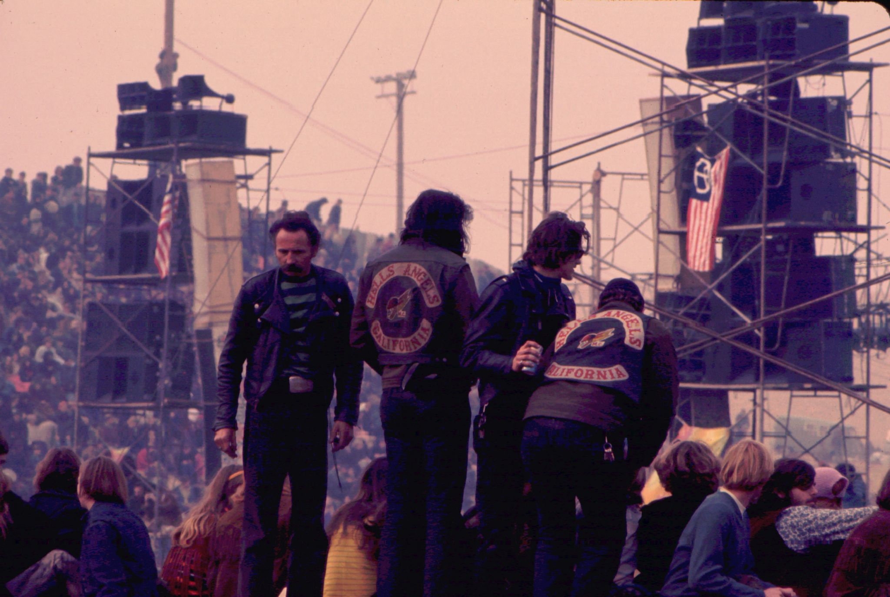

J'ai beaucoup interviewé ces derniers temps (et non, je ne veux pas en parler). On me demande presque tout le temps « Comment définissez-vous les relations avec les développeurs ? » et cet article est la réponse détaillée à cette question.

Je l'écris parce que presque tous les intervieweurs à qui j'ai donné cela ont dit une forme de "c'est une très bonne analogie ! Vous devriez écrire cela sous forme d'article de blog". Donc nous en sommes là.

## Premièrement, DevRel n'est _pas_ un parti

DevRel, c'est beaucoup de choses, mais une fête n'en fait pas partie. En fait, c’est l’un des métiers les plus difficiles de la technologie. C'est comme avoir 4 ou 5 emplois en même temps.
1. Vous êtes développeur
2. Vous êtes un spécialiste du marketing
3. Vous êtes vendeur
4. Vous êtes chef de produit
5. Vous êtes enseignant

Et pour couronner le tout, vous devez être capable d'*influencer* le marketing, l'ingénierie, les ventes et la gestion des produits sans avoir aucune *autorité*. Vous ne pouvez dire directement à personne quoi faire, car aucun d’entre eux ne relève de vous, ni même souvent de votre organisation. Mais vous devez être capable de les empêcher de faire des choses stupides que les développeurs détesteront, et de les cajoler pour qu'ils fassent des choses que les développeurs *veulent*.

Le marketing veut produire des cadeaux pour une conférence qui est… mal avisée, et vous devez les convaincre de ne pas le faire. J'ai des exemples. C'est mieux si vous avez établi une relation avec eux de telle sorte qu'ils viennent *demander* quels types de cadeaux seraient bons. Ou bien le marketing veut réécrire le billet de blog du CTO ou la soumission CFP (Call for Papers), et ils transforment tout cela en un discours marketing fleuri et vous devez tout défaire pour que le discours puisse réellement être accepté.

L'ingénierie essaie de donner la priorité aux corrections de bugs et aux fonctionnalités, et vous devez influencer ces choix au nom de la communauté des développeurs. L'ingénierie et la gestion de produits souhaitent aller de l'avant avec leurs fonctionnalités préférées, mais vous savez que les développeurs réclament un ensemble différent de fonctionnalités. Vous devez influencer ces choix.

Je pourrais continuer encore et encore, mais vous voyez l'idée. Et en général, vous devez faire tout cela en rédigeant du contenu technique (articles de blog, tutoriels, etc.), en prenant la parole lors de conférences et en organisant des rencontres et autres événements. Souvent, tout cela se fait depuis un siège d’avion ou un salon d’aéroport. Ce n'est pas une fête. C'est épuisant.

## Mais c'est une fête

Et maintenant je vais vous dire pourquoi c'est *c'est* une fête. Sorte de.

Tout d'abord, examinons ce que je considère comme les 3 piliers de DevRel : la défense des développeurs, l'expérience des développeurs et la gestion de la communauté. Voyons comment chacune de ces parties fonctionne dans cette analogie avec le parti.

### Plaidoyer des développeurs

Le Developer Advocate (DA) est la personne de première ligne qui interagit quotidiennement avec les développeurs. Ils parlent aux développeurs, font des présentations lors de conférences, rédigent du contenu technique et essaient généralement d'*attirer* les développeurs sur votre plateforme. Ils sont partout dans le monde pour essayer d'inciter les développeurs à venir à votre fête. Ils doivent être sympathiques, à l’aise avec les gens et suffisamment techniques pour pouvoir parler de manière crédible aux développeurs de votre plateforme.

Vos Developer Advocates doivent être capables de promouvoir votre plateforme et votre communauté, en tant que lieu formidable qui a de la valeur pour les développeurs, est un lieu inclusif et accueillant, et qui dispose de ressources pour les aider. Ils doivent être capables de le faire d’une manière authentique et sincère, et ce n’est pas seulement un discours marketing.

### Expérience du développeur

L'équipe Developer Experience (DevEx) est chargée de s'assurer que lorsque les développeurs viennent à votre fête, il y a des choses à faire. Ils sont responsables de l'expérience d'intégration, de la documentation, des SDK, des API, de la CLI et de tous les autres outils que les développeurs utiliseront pour interagir avec votre plateforme. Ils sont chargés de s’assurer que la fête est amusante et qu’il y a des choses à faire.

DevEx crée, teste et maintient les démos, didacticiels et autres contenus que les développeurs utiliseront pour en savoir plus sur votre plateforme. Si DevEx échoue, alors toutes les personnes que Developer Advocacy convainc de venir participer feront demi-tour et partiront. Et ils ne reviendront pas de sitôt. Le vieil adage « vous n’avez jamais une seconde chance de faire une première impression » n’est jamais plus vrai que dans DevRel.

Si ce n'est qu'à moitié construit, ils partiront.

### Gestionnaire de communauté

Dernier point, mais non le moindre, le Community Management. C'est le groupe qui est chargé de veiller à ce que la fête soit amusante, accueillante, sûre et que les gens se sentent valorisés et inclus. Existe-t-il un code de conduite ? Est-ce appliqué ? S'agit-il de directives d'application claires ? Un bon Community Manager s’assure que tout cela est en place et qu’il fonctionne.

Le Community Manager est également responsable (généralement) d'un programme "champions". Ce sont ces gens-là qui font la vie du parti. Ce sont eux qui sont toujours là, toujours aidants, toujours veillant à ce que tout le monde passe un bon moment. Ils répondent aux questions, soutiennent les autres membres de la communauté et on peut généralement compter sur eux pour être les « piliers de la communauté ».

Mais un bon Community Manager sait *aussi* qui sont les rôdeurs et peut les inciter à devenir des membres actifs. Ils savent également qui sont les fauteurs de troubles potentiels et veillent attentivement au respect des normes communautaires.

Un parti peut rapidement mal tourner, et une fois que c’est le cas, il peut être presque impossible de remettre les choses sur les rails ou d’atténuer les dommages causés à sa réputation.

Il y a tellement, *beaucoup* d’exemples.

## C'est un sport d'équipe

DevRel est un sport d'équipe. Il faut beaucoup de personnes, avec des compétences très différentes et diversifiées, pour en faire un succès. Ce n'est pas une fête, mais c'est une fête. C'est beaucoup de travail, mais c'est aussi très amusant. C'est beaucoup de stress, mais c'est aussi beaucoup de joie.

Et ce n’est pas quelque chose que l’on peut mettre en place du jour au lendemain. Il faut du temps et des efforts concertés au fil du temps pour construire la maison, mettre toutes les pièces en place, attirer les bonnes personnes, puis les intégrer dans une communauté. C'est beaucoup de travail, mais ça en vaut la peine.

DevRel est également un centre de coûts. Cela ne générera pas de revenus directement. Mais c'est aussi un multiplicateur de force. Cela peut rendre votre produit meilleur, votre communauté plus forte et votre entreprise plus prospère. C'est un investissement à long terme et ça vaut le coup. Vous ne verrez pas de succès dans 3 mois. Ou 6 mois. Ou même un an, très probablement. Oui, vous pouvez vous attendre à voir des progrès, mais il faudra du temps pour bâtir le type de communauté qui fera le succès de votre entreprise.

Tout cela étant dit, DevRel *peut* absolument participer à la génération de revenus importants. Voici mes suggestions sur la manière de :
- Assurez-vous de savoir qui sont les responsables de comptes/vendeurs. Proposez-leur de l’aide s’ils en ont besoin. Assurez-vous qu'ils savent qui vous êtes et ce que vous pouvez offrir
- Connaître les buts et objectifs globaux de l'entreprise pour l'année et le trimestre. Concentrez vos efforts sur les choses qui aideront l'entreprise à atteindre ces objectifs
- Gardez une trace de ce que vous faites pour avoir un impact sur les buts et objectifs de l'entreprise, et de la manière dont vous avez contribué à générer des revenus.
- Restez au courant des personnes de votre communauté qui ont progressé avec votre logiciel, et recherchez surtout des indices indiquant qu'elles pourraient être prêtes à parler avec les commerciaux.
- Quand ils *sont* prêts, faites l'introduction. Et personnalisez-le afin que le client potentiel et le responsable commercial sachent que vous avez pris le temps de comprendre leurs besoins et que vous les communiquez aux bonnes personnes.

## Conclusion

Comme je l'ai dit, DevRel est *comme* un parti dans la manière dont il doit être planifié, géré et exécuté. Aucune fête véritablement épique ne « se produit comme par hasard ». Cela demande du travail, et il faut toute une équipe pour que cela paraisse sans effort. DevRel n'est pas non plus une fête car c'est une quantité de travail impie. Il y a une énorme responsabilité, et ce n’est pas quelque chose que l’on peut simplement « piloter ». Ces idées de blog et de tutoriels ne viennent pas de nulle part. Cela demande du temps, des recherches et des efforts.

Alors organisons tous une fête pour les gens DevRel de votre entreprise. Célébrez leurs réalisations et assurez-vous que, si Devrel a eu un impact sur votre travail, assurez-vous que tout le monde le sache.
