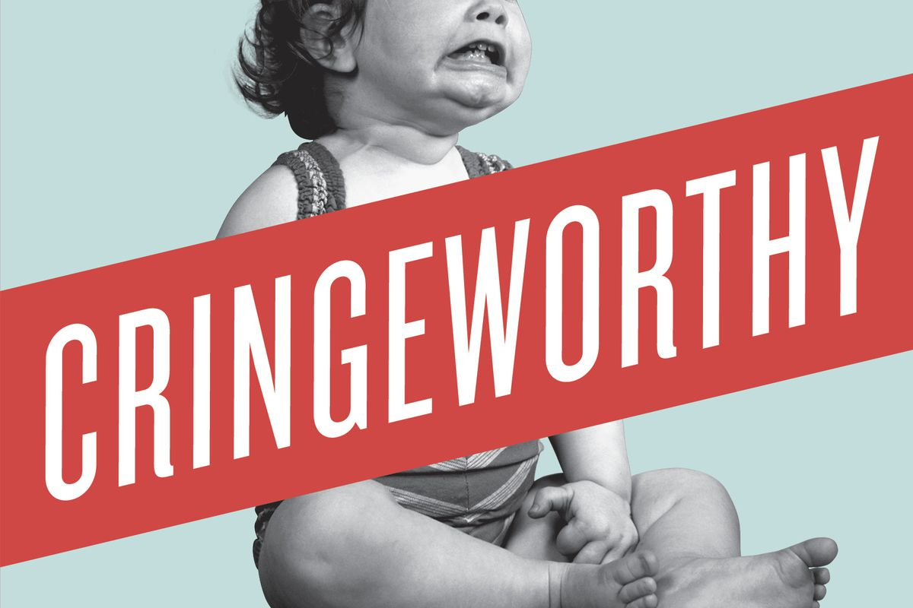

It's easy! Well, that's easy for *you* to say! But what's easy for me may not be easy for you, and it certainly won't be easy for everyone.

I recently did a complete redesign and redeployment of my entire website. It was time. I really wanted to get off of the Wordpress bloat train, so I decided to go with a static site generator. I initially started with Gatsby but, well, I just couldn't get things working so I ended up with [Hugo](https://gohugo.io). So far, I like it.

## How Is This Easy?

As part of this migration away from Wordpress, I had to export my entire site, and then convert everything to [Markdown](https://www.markdownguide.org) from HTML. It was, quite frankly, an enormous task. It has taken me the better part of 4 months to complete it in my `spare time`.

As part of that conversion process, I had to go through not just every page, but every blog post, and look for leftover formatting cruft left behind. I found lots of it. Plus I had to move all the images to the correct place in Hugo, etc.

This forced me to read all of my old blog posts over again.

You see, I used to write all these technical blogs, including code, etc. and say "it's as simple as ..." or "It was easy to ...".

I was under the misguided impression that by saying something was easy, people would think it was easy, and they'd be able to do it too. In looking back on many of these older posts, I remembered how these things werenb't even easy for _me_ to do. I remembered the hours and hours I spent researching, trying, failing, trying again, googling, re-googling, etc. before I got something to work.

And then I said it was easy.

## It's Not Easy

These things are **not** easy! In fact, they are hard. Everything is easy for someone. That same thing is hard for lots of other people.

What I've realized over time is that my original reasons for saying something was easy was not just misguided, but entirely wrong. Rather than helping people to think they could do it, what it mostly did, I believe, was make them feel bad/incompetent/etc. because it *wasn't* easy for them, even though *I* said it was!

That, of course, was never my intent. But good intentions can also cause harm, and if your good intentions cause harm, you should always re-evaluate and change how you do things. At least *I* think so.

## Just Change

I am not going to say things are easy anymore. In fact I have come to really dislike the word. Here are some other words I am trying to remove from my DevRel vocabulary:

- Easy
- Simple
- Just
- Simply

There are others, of course. One of the more insidious is 'Just'. You just have to ... yeah, just. You just have to do this incredibly difficult thing. But I said you 'just have to' which made it sound easy.

I just have to stop saying these things. And writing these things. Its just that easy.

## The Internet is Forever

I read them all, every one of those blog posts. But I didn't change them. Wait, what?! That's right, I left them just the way they were. Because the internet is forever and you can't re-write history.

I didn't try to erase my bad behavior, but I'm committed to changing it as I move ahead. That's how life works. You can't erase your past, but you can be better in the present, and in the future.

I did make *some* changes though. I corrected some glaring spelling mistakes. And I *think* I managed to get alt-text added to all the old images. I added the alt-text because it's the right thing to do. It helps people. rewriting all those old blog posts, well, it *might* help people, but I think it's a much more powerful example to leave them as they are, but make sure that this blog post is also available to explain, and to hold me accountable in the future.

You can also hold me accountable. Point out to me when I say those things again. I'm trying to 'just' change, but as we all know, change is hard.