# What a Year!

2025 has been, without a doubt, one helluva year! From the lowest lows to some pretty great highs, it's been a rollercoaster of emotions, growth, and changes. I'll recap as much as I can, but some details will, of course, be left out.

## Starting Low

The lowest of the lows of 2025 actually started at the tail end of 2024 when I discovered that my marriage was over. Yeah, that was not great. Then, on the first day back to work in 2025, I was informed that I was _also_ unemployed! And _then_ I found out that my Soon To Be Ex (STBX) had been planning to kick me out of the house on my birthday. I mean ... I guess it _could_ have gotten worse, but I'm glad I didn't have to find out how.

Not being one to simply give in or give up, I did what I always do, and threw myself into finding a new job, and attempting to fix/salvage my marriage.

By March I had found a new job at [Red Hat](https://redhat.com) which solved at least half of my problems. But I also discovered that I was the only one trying to salvage my marriage, which was another level of heartbreak.

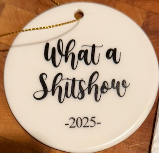

## Getting Better

I've wanted to work at Red Hat for over a decade, so finally landing something there has been a real treat. And I'm in the Open Source Program Office for AI (or OSAIPO as we're calling it now) which is right where I wanted to be. I landed in the best team I've been a part of since my days at Sun Labs (a moment of silence) and it's not another startup that doesn't know what it wants to be when it grows up. I feel like I'd landed in heaven.

I love what I do, and I _love_ the people I work with. Red Hat, being a large company, has already re-orged us twice since I've been here (well, to be fair, the first one was literally on the day I started!), but that's about par for the course I guess.

Starting into the world of AI means I've had a lot of learning to do!I do love to learn new technologies and the like, so the learning curve has been a lot of fun as well. I wouldn't say I'm an expert on AI, but I sure do know a lot more than I did a year ago. The AI landscape changes almost daily, so it's a constant challenge to stay up to date with everything all the time!

## Personally

Look, I'll be honest with you, the first half of the year was one of the hardest for me personally that I can remember. Moving, separating, losing a job, and starting a new job are among the most stressful things you can go through, and to go through them all at the same time? Seriously.

But pain is just an opportunity for growth (if you actually take it as such) so I've grown an immense amount in the past year.

## Moving on

So I'm leaving 2025, and all that it was, behind. When I moved out, I only took Bruno with me (he is my service dog after all) and he and I have had some adventures this year! He flew with me for the first time:

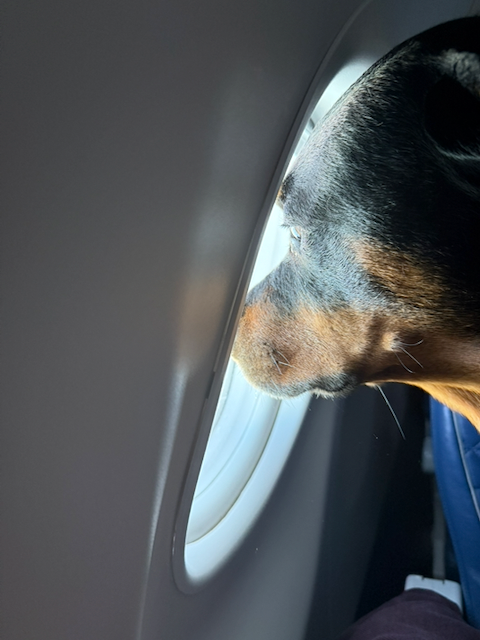

And then he went to a very large tech conference where they even made him his own badge!

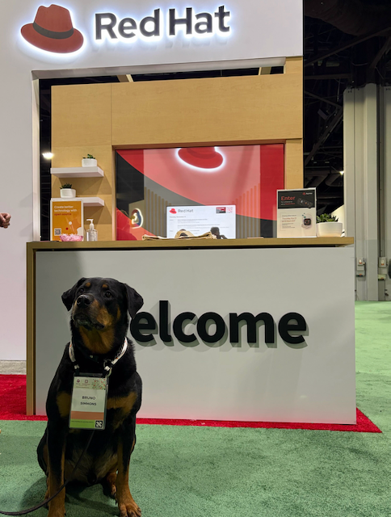

He was quite popular there and got a lot of attention!

Since Bruno was used to having a companion dog, I ended up with a second dog! I hadn't meant to, but a local Rottweiler rescue organization was in desperate need of an emergency foster home, and I just couldn't help myself. I had only intended to take her in as a short-term foster, but when I learned of her history, and realized that she was older than Bruno, I just didn't have the heart to make her go to yet _another_ new home. So she gets to live out her days here.

Her name is Heidi, and she's a tiny little Rottie (Bruno, at 100-pounds) can put his chin on the dining table. Heidi, at only 60-pounds, can put her head on the couch.

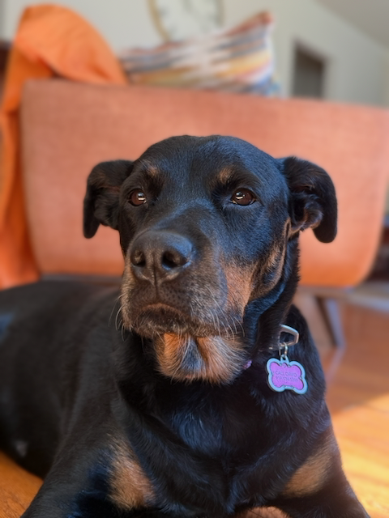

As judgemental as they come, she is also the sweetest, snuggliest little Rottie that ever was.

### Getting back out there

Yeah, it's a whole different world out there now and I'm not sure I was (or am?) entirely ready for it all the time. I've been on something like 20 first-dates, but only a small handful of second dates, and an even smaller number of subsequent dates.

I'm not in a hurry to find the person I'm looking for, and I'm not always sure that I _know_ what I'm looking for. But I damned sure know what I'm _not_ looking for!

### Happiness

What I can tell you is that I'm happier and more content with myself than I have been in recent memory. My life is amazing. It is full of truly wonderful people, great friends, and I'm busier socially than I've been in forever.

Life. Is. Good!

I've been catching up on my backlog of tattoos and boy are some of them good! (if you're interested in my tattoo artist, her name is Tara, at [Tarot Tattoos](https://www.instagram.com/tarotttattoos/)) and she is an amazing artist!

I'd been wanting to cover an old tattoo, but it was large, and I couldn't figure out what to do, but Tara came up with the perfect cover-up. She used this photo of Bruno:

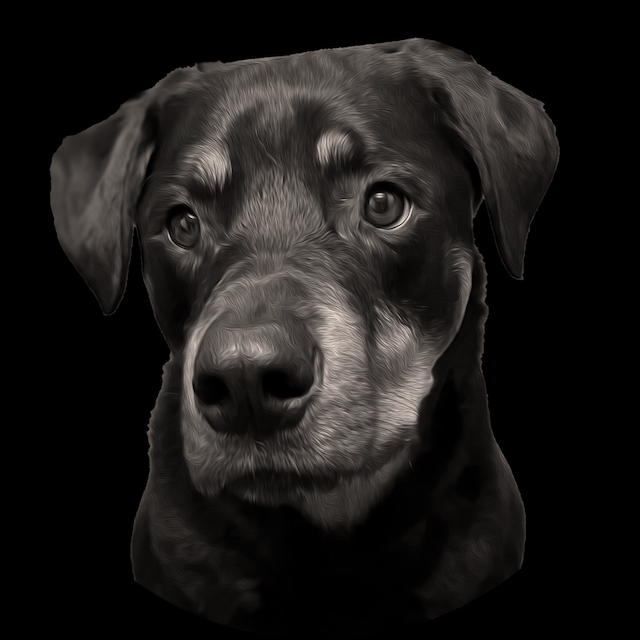

And turned it into this:

I think it's fantastic!

My friend Patrick had a tattoo of a sea monster that snaked around his lower leg and onto his foot. As a boat captain, it was meaningful to him. After he died, I wanted to honor him by getting a similar tattoo, but I didn't want an exact copy.

Tara did an amazing job re-interpreting it for me, and then putting it on. We're only half-way through, and I still have to go back for all the colors.

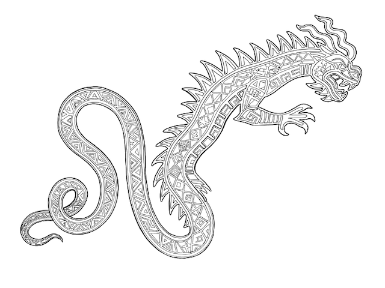

Then, with the color added

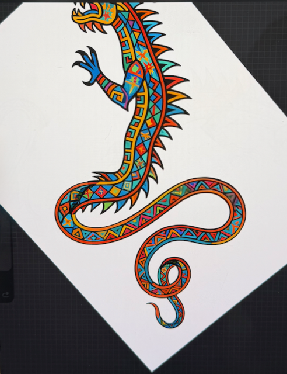

Here's where we are now:

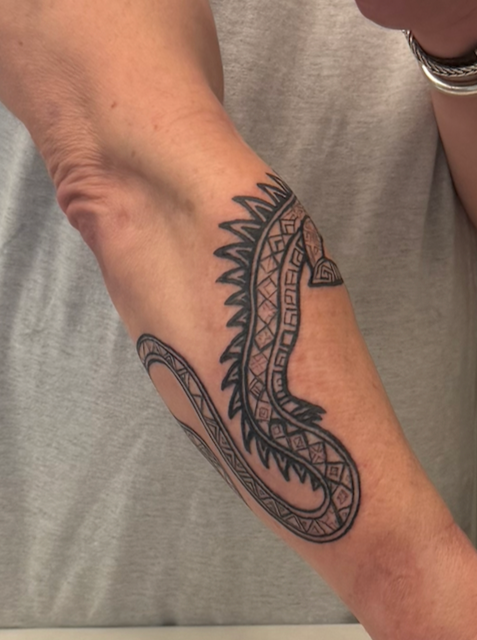

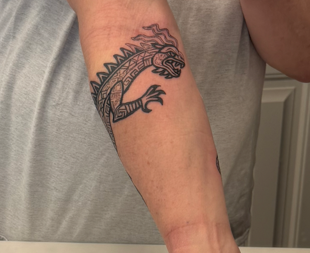

This next one I've wanted for years, but I just didn't know how I wanted it to look. It's for [https://project](https://projectsemicolon.com) which is a suicide prevention and mental health awareness project. Once again, Tara hit this one out of the park with her design!

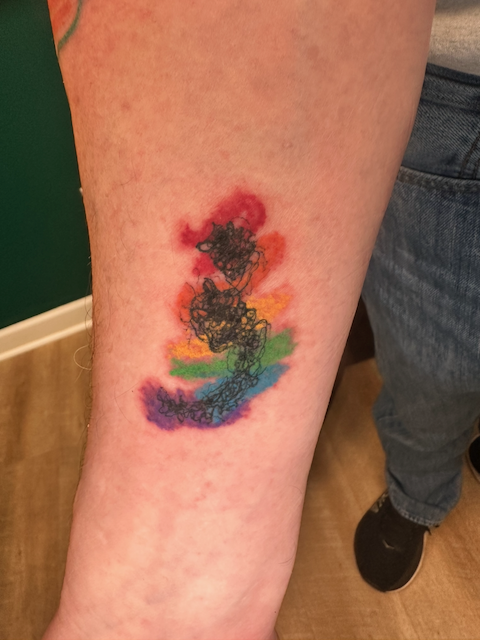

We are in the middle of one more, which is also a cover-up and a full sleeve on my right arm, but I'm going to wait until we are a little farther along before I share that one. It's going to be amazing though!

## That's a wrap!

And that is a wrap for 2025. Here's to a better 2026!

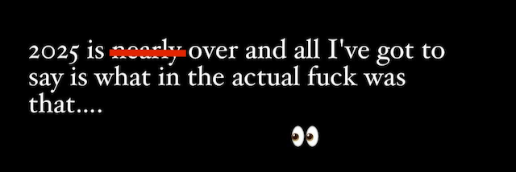