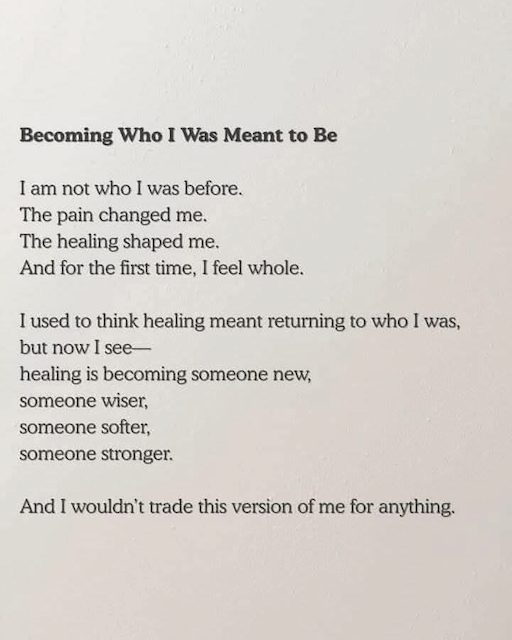
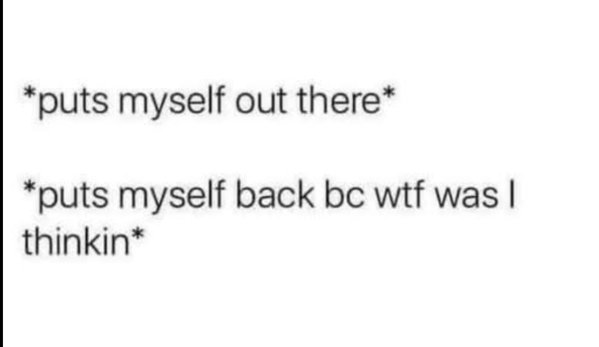
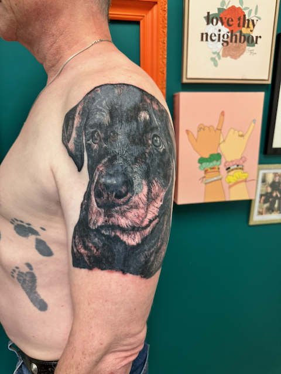
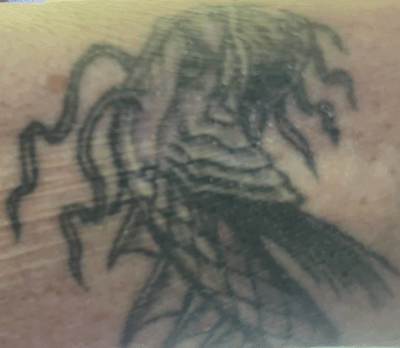

# ¡Qué año!

¡2025 ha sido, sin duda, un año increíble! Desde los peores momentos hasta algunos momentos realmente buenos, ha sido una montaña rusa de emociones, crecimiento y cambios. Haré un resumen lo más completo posible, pero, por supuesto, omitiré algunos detalles.

## Empezando desde abajo

Lo peor de 2025 empezó a finales de 2024, cuando descubrí que mi matrimonio había terminado. Sí, no fue nada bueno. Luego, el primer día de vuelta al trabajo en 2025, ¡me informaron que también estaba desempleada! Y luego descubrí que mi futuro ex (EX) había planeado echarme de casa el día de mi cumpleaños. Bueno... supongo que podría haber empeorado, pero me alegro de no haber tenido que descubrir cómo.

Como no soy alguien que se da por vencido, hice lo que siempre hago y me dediqué a buscar un nuevo trabajo y a intentar arreglar/salvar mi matrimonio.

Para marzo, encontré un nuevo trabajo en [Red Hat](https://redhat.com), lo que resolvió al menos la mitad de mis problemas. Pero también descubrí que era la única que intentaba salvar mi matrimonio, lo cual fue otro nivel de desilusión.

## Mejorando

Llevo más de una década queriendo trabajar en Red Hat, así que conseguir finalmente un puesto allí ha sido todo un placer. Y estoy en la Oficina del Programa de Código Abierto para IA (u OSAIPO, como la llamamos ahora), justo donde quería estar. Me uní al mejor equipo del que he formado parte desde mis días en Sun Labs (un momento de silencio) y no es otra startup que no sabe qué quiere ser cuando crezca. Me siento como si hubiera llegado al cielo.

