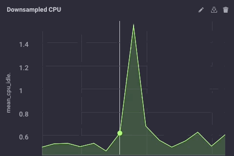
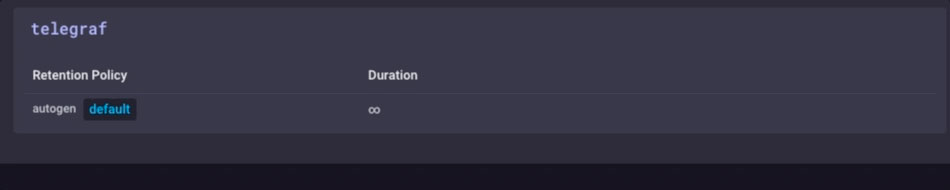

Es gibt viele Möglichkeiten, Ihre IoT-Datenbereitstellung zu gestalten, und was für ein Unternehmen richtig ist, muss nicht unbedingt für ein anderes richtig sein. Je nach Größe und Komplexität Ihres IoT-Projekts kann es natürlich viele Komponenten geben. Eine der universelleren Architekturen besteht darin, Sensor-Hubs oder IoT-Gateway-Geräte bereitzustellen, um Daten von einer Reihe von Sensorknoten zu sammeln und diese Daten dann an ein vorgelagertes Datenerfassungssystem für das Unternehmen weiterzuleiten. Diese Gateway- oder Hub-Geräte ermöglichen es einem ZWave-Gerät normalerweise, sich zum Hochladen von Daten mit dem Internet zu verbinden oder zwischen Bluetooth-Geräten eine Brücke zu einem WLAN oder einer anderen Netzwerkverbindung zu schlagen.

Außerdem neigen die meisten dieser Gateway- oder Hub-Vorrichtungen dazu, "dumme" Gateways zu sein. Sie tun nichts anderes, als Daten an einen Upstream-Collector weiterzuleiten. Aber was wäre, wenn das IoT Gateway ein intelligentes Gerät sein könnte? Was wäre, wenn Sie lokale Analysen und Datenverarbeitung auf dem Hub-Gerät durchführen könnten, bevor Sie die Daten weiterleiten? Wäre das nicht nützlich!

## Erstellen eines Gateways

Ich habe heute Morgen beschlossen, (ein weiteres) IoT Smart Gateway-Gerät zu bauen. Ich habe (sozusagen) schon einmal einen in Form eines ARTIK-520 mit InfluxDB gebaut. Aber ein ARTIK-520 ist nicht das billigste Gerät auf dem Markt, und wenn Sie IoT-Geräte bauen, ist billiger manchmal besser. Nicht immer, aber wenn Sie viele, viele Gateways bauen, möchten Sie lieber nicht die Bank dafür sprengen. Ich habe meine Pine-64-Box, die ich vor ein paar Jahren gekauft habe, ausgegraben und mich an die Arbeit gemacht. Warum Pine-64 und nicht Raspberry Pi? Nun, die Pine-64 kostet etwa die Hälfte. Ja, 1/2 der Kosten. Es kostet 15 Dollar statt 35 Dollar, also gibt es das. Es hat genau den gleichen ARM A53 Quad-Core-Prozessor mit 1,2 GHz – meiner hat 2 GB Speicher im Vergleich zu den 1 GB auf einem RPi – und es hat eine leistungsstärkere GPU, wenn Sie so etwas mögen. Es kam auch mit integriertem WiFi, also ohne Dongle, und ich habe das optionale ZWave-Board bekommen, damit ich mit Sub-GHz-IoT-Geräten sprechen kann.

Eines der netten Dinge beim Betrieb dieser Art von Geräten als IoT-Gateways ist, dass Ihr Speicherplatz nur durch die Größe der verwendeten microSD-Karte begrenzt ist. Ich verwende nur eine 16-GB-Karte, aber das Pine-64 kann bis zu einer 256-GB-Karte aufnehmen.

Was braucht es, um den TICK Stack auf einem Pine-64 zum Laufen zu bringen? Es überrascht nicht, dass die Time To Awesome™ wirklich kurz ist! Sobald Sie Ihre Pine-64-Box zum Laufen gebracht haben, schlage ich vor, das Xenial-Image zu verwenden, da es das „offizielle“ Pine-64-Image und Ubuntu ist, also ist es mit InfluxDB super einfach. Laufen nicht vergessen

```bash
% apt-get upgrade
```

Sobald Sie es in Betrieb genommen haben, stellen Sie sicher, dass Sie alles auf dem neuesten Stand haben.

Fügen Sie als Nächstes die Influx-Repositories zu apt-get hinzu:

```bash
% curl -sL https://repos.influxdata.com/influxdb.key | apt-key add - source /etc/lsb-release
% echo "deb https://repos.influxdata.com/${DISTRIB_ID,,} ${DISTRIB_CODENAME} stable" | tee -a /etc/apt/sources.listCopy
```
Sie müssen diese wahrscheinlich mit "sudo" ausführen, aber ich schummele und starte "sudo bash", um damit zu beginnen, und dann bin ich fertig.

Als Nächstes müssen Sie ein Paket hinzufügen, das fehlt – und erforderlich ist –, um auf die InfluxData-Repositories zuzugreifen:

```bash
% apt-get install apt-transport-httpsCopy
```

Dann geht es nur noch darum

```bash
apt-get install influxdb chronograf telegraf kapacitorCopy
```

und schon kann es losgehen!

## Belastungstest des Geräts

Ich entschied, dass es eine gute Idee wäre, dieses kleine Gerät zu belasten, nur um zu sehen, was es verarbeiten kann, also lud ich „influx-stress“ von GitHub herunter und ließ es gegen dieses Gerät laufen.

```bash
Using batch size of 10000 line(s)
Spreading writes across 100000 series
Throttling output to ~200000 points/sec
Using 20 concurrent writer(s)
Running until ~18446744073709551615 points sent or until ~2562047h47m16.854775807s has elapsedCopy
```

Wow!! Das sind 200.000 Punkte pro Sekunde! Das sollte meinen kleinen Pine-64 ernsthaft belasten! Und es stellt sich heraus, dass es irgendwie so war:


Wie Sie sehen können, wurden die 2 GB Speicher ziemlich schnell ausgeschöpft und die CPU auf 100 % festgesetzt. Aber als Gateway-Gerät ist es im wirklichen Leben unwahrscheinlich, eine solche Last zu sehen. Ich denke, in Bezug auf die reale Nutzung als Gateway wäre ich gut in meiner Reichweite, wenn ich nur ein paar Dutzend bis vielleicht hundert oder so Sensoren sammeln würde.

## Lokale Analysen

Wie Sie auf dem Dashboard oben sehen können, kann ich auf dem Pine-64 problemlos einige lokale Analysen durchführen. Es verfügt über eine integrierte HDMI-Schnittstelle und eine vollständige GPU, sodass der lokale Zugriff auf das Dashboard zur Überwachung kinderleicht ist. Aber wie gesagt, viel sinnvoller wäre es, wenn das Gerät noch mehr könnte. Es ist unwahrscheinlich, dass Sie in der realen Welt alle Ihre Daten auf einem Gateway-Gerät sammeln und dort alle Ihre Analysen usw. durchführen. Dafür sind Gateways/Hubs nicht da. Einige lokale Analysen, Warnungen usw. wären gut – verlagern Sie einen Teil der Verarbeitung nach Möglichkeit in Richtung Edge – aber Sie möchten die Daten trotzdem nach oben weiterleiten.

## Downsampling der IoT-Daten

Es ist ziemlich einfach, einfach ein Gateway-Gerät zu verwenden, um alle Ihre Daten stromaufwärts weiterzuleiten, aber wenn Sie mit Netzwerkverbindungsproblemen zu tun haben und versuchen, entweder Geld oder Bandbreite oder beides zu sparen, werden Sie einige Daten tun wollen Downsampling, bevor Sie Ihre Daten weiterleiten. Zum Glück ist dies auch wirklich einfach zu tun! Ein Gateway-Gerät, das lokale Analysen durchführen, einige lokale Warnungen verarbeiten und auch die Daten herunterskalieren kann, bevor sie an den Upstream weitergegeben werden, ist im IoT von großem Nutzen. Es ist auch ziemlich einfach zu tun!

Lassen Sie uns zunächst unser Gateway-Gerät so einrichten, dass es Daten stromaufwärts an eine andere Instanz von InfluxDB weiterleiten kann. Es gibt mehrere Möglichkeiten, dies zu tun, aber da wir ein Daten-Downsampling über Kapacitor durchführen werden, tun wir dies über die Datei kapacitor.conf. Die Datei kapacitor.conf hat bereits einen Abschnitt mit einem [[influxdb]]-Eintrag für „localhost“, also müssen wir nur einen neuen [[influxdb]]-Abschnitt für die Upstream-Instanz hinzufügen:

```toml
[[influxdb]]
 enabled = true
 name = "mycluster"
 default = false
 urls = ["http://192.168.1.121:8086"]
 username = ""
 password = ""
 ssl-ca = ""
 ssl-cert = ""
 ssl-key = ""
 insecure-skip-verify = false
 timeout = "0s"
 disable-subscriptions = false
 subscription-protocol = "http"
 subscription-mode = "cluster"
 kapacitor-hostname = ""
 http-port = 0
 udp-bind = ""
 udp-buffer = 1000
 udp-read-buffer = 0
 startup-timeout = "5m0s"
 subscriptions-sync-interval = "1m0s"
 [influxdb.excluded-subscriptions]
 _kapacitor = ["autogen"]
```

Das löst einen Teil des Problems. Jetzt müssen wir die Daten tatsächlich heruntersampeln und weiterleiten. Da ich Chronograf v1.3.10 verwende, habe ich einen integrierten TICKscript-Editor, also gehe ich in Chronograf auf die Registerkarte „Alerting“, erstelle ein neues TICK-Skript und wähle die telegraf.autoget-Datenbank als meine Quelle aus :


Ich sammle noch keine Sensordaten auf diesem Gerät, daher verwende ich die CPU-Auslastung als meine Daten und nehme sie in meinem TICKScript herunter. Ich habe ein sehr einfaches TICKScript geschrieben, um meine CPU-Daten herunterzurechnen und an den Upstream weiterzuleiten:

```javascript
stream
 |from()
 .database('telegraf')
 .measurement('cpu')
 .groupBy(*)
 |where(lambda: isPresent("usage_system"))
 |window()
 .period(1m)
 .every(1m)
 .align()
 |mean('usage_system')
 .as('mean_usage_system')
 |influxDBOut()
 .cluster('mycluster')
 .create()
 .database('downsample')
 .retentionPolicy('autogen')
 .measurement('mean_cpu_idle')
 .precision('s')
 ```

That script simply takes the ‘usage_system` field of the CPU measurement every minute, calculates the mean, and then writes that value upstream to my upstream InfluxDB instance. On the gateway device, the CPU data looks like this:


The downsampled data on my upstream instance looks like this:



It’s the same data, just much less granular. Finally, I’ll go set the data retention policy on my gateway device to be just 1 day, so I don’t fill the device but I can still maintain a bit of history locally:



I now have an IoT Gateway device that can collect local sensor data, present some analytics to a local user, do some local alerting (once I set up some Kapacitor alerts), and then downsample the local data and send it upstream to my enterprise InfluxDB instance for further analysis and processing. I can have the highly-granular millisecond data available on the gateway device, and the less-granular 1-minute data on my upstream device allowing me to still have insight into the local sensors without having to pay the bandwidth costs for sending all the data upstream.

I can also use this method to further chain the data storage by storing the 1-minute data on a regional InfluxDB instance, and forwarding further-downsampled data on to an InfluxDB instance where I can aggregate my sensor data from across my entire enterprise.

I could just send all data up the chain to my ultimate enterprise data aggregator, but if I’m aggregating tens of thousands of sensors and their data, the storage and bandwidth costs may begin to outweigh the usefulness of the highly-granular nature of the data.

## Conclusion

I repeat this so often I might have to have it tattooed on my forehead, but I’ll say it again: IoT Data is really only useful if it is timely, accurate, and ***actionable***. The older your data is, the less actionable it becomes. The less actionable it is, the less detail you need. Downsampling your data, and setting increasingly longer data retention policies as you go, can ensure that your highly immediate data has the specificity to be highly actionable and highly accurate, while preserving the long-term trends in your data for longer-term trend analysis.
