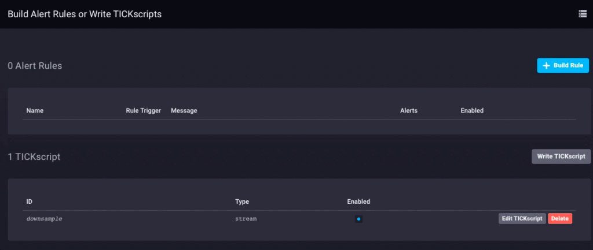
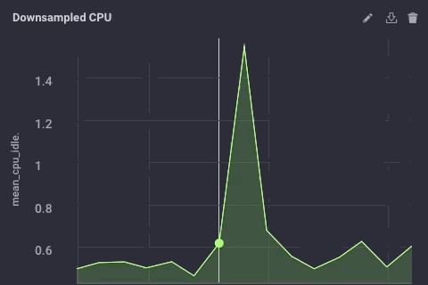

There are all sorts of ways to architect your IoT Data Deployment, and what’s right for one enterprise will not necessarily be right for another. Depending on the size and complexity of your IoT project , there can be, of course, a lot of components. One of the more universal architectures is to deploy sensor hubs or IoT gateway devices to collect data from a number of sensor nodes and then forward that data on to an upstream data collection system for the enterprise. These gateway or hub devices typically allow a ZWave device to connect to the internet for data upload, or to bridge between Bluetooth devices to a WiFi or other network connection.

In addition, most of these gateway or hub devices tend to be ‘dumb` gateways. They don’t do anything other than forward data on to an upstream collector. But what if the IoT Gateway could be a smart device? What if you could do local analytics and data processing on the hub device before sending the data on? Wouldn’t that be useful!

## Building a Gateway

I decided to build (another) IoT Smart Gateway device this morning. I’ve (sort of) built one before in the form of an ARTIK-520 running InfluxDB. But an ARTIK-520 isn’t the cheapest thing out there, and when you’re building IoT devices, sometimes cheaper is better. Not always, but when you’re building lots and lots of gateways, you’d rather not break the bank on them. I dug out my Pine-64 box that I bought a few years ago and got to work. Why Pine-64 and not Raspberry Pi? Well, the Pine-64 is about 1/2 the cost. Yes, 1/2 the cost. It’s $15 instead of $35, so there’s that. It has the exact same ARM A53 quad-core 1.2 GHz processor— mine has 2GB of memory, vs. the 1GB on a RPi—and it has a more powerful GPU, if you’re into that sort of thing. It also came with built-in WiFi, so no dongle, and I got the ZWave optional board so I can talk to sub-GHz IoT devices.

One of the nice things about running these kinds of devices as IoT Gateways is that you are only limited in your storage by the size of the microSD card you use. I’m only using a 16GB card, but the Pine-64 can take up to a 256GB card.

What does it take to get the TICK Stack up and running on a Pine-64? Not surprisingly, the Time To Awesome™ is really short! Once you have your Pine-64 box up and running—I suggest using the Xenial image as it’s the ‘official’ Pine-64 image and it’s Ubuntu, so it’s super easy with InfluxDB. Don’t forget to run

```bash
% apt-get upgrade
```

As soon as you have it up and running to make sure you have everything up to date.

Next, add the Influx repositories to apt-get:

```bash
% curl -sL https://repos.influxdata.com/influxdb.key | apt-key add - source /etc/lsb-release
% echo "deb https://repos.influxdata.com/${DISTRIB_ID,,} ${DISTRIB_CODENAME} stable" | tee -a /etc/apt/sources.listCopy
```
You will likely have to run those with `sudo`, but I cheat and run ‘sudo bash` to start with and then I’m all set.

Next, you’ll need to add a package that’s missing—and required — in order to access the InfluxData repositories:

```bash
% apt-get install apt-transport-httpsCopy
```

Then it’s just a matter of

```bash
apt-get install influxdb chronograf telegraf kapacitorCopy
```

and you are ready to go!

## Load Testing the Device

I decided it might be a good idea to put a load on this little device just to see what it was capable of handling, so I downloaded ‘influx-stress` from GitHub and ran it against this device.

```bash
Using batch size of 10000 line(s)
Spreading writes across 100000 series
Throttling output to ~200000 points/sec
Using 20 concurrent writer(s)
Running until ~18446744073709551615 points sent or until ~2562047h47m16.854775807s has elapsedCopy
```

Wow!! That’s 200,000 points per second! That should put some serious stress on my little Pine-64! And it turns out it sort of did:


As you can see, it fairly quickly topped out the 2GB of memory, and pegged the CPU at 100%. But as a gateway device, it’s unlikely, in real life, to see such a load. I think, in terms of real-life usage as a gateway, I’d be well within my range if I were only collecting from a few dozen to maybe a hundred or so sensors.

## Local Analytics

As you can see from the Dashboard above, I can easily do some local analytics on the Pine-64. It has an onboard HDMI interface, and a full GPU, so allowing local access to the dashboard for monitoring is dead simple. But as I said earlier, it would be much more useful if the device could do more than that. It’s unlikely that, in the real world, you’re going to collect all your data on a gateway device and do all your analytics, etc. there. That’s not what gateways/hubs are for. Some local analytics, alerting, etc. would be good—move some of the processing out towards the edge when you can—but you still want to forward data upstream.

## Downsampling the IoT Data

It’s pretty easy to simply use a gateway device to forward all your data upstream, but if you’re dealing with network connectivity issues, and you are trying to save either money or bandwidth, or both, you are going to want to do some data downsampling before you forward your data. Thankfully this also is really easy to do! A gateway device that can do local analytics, handle some local alerting, and can also downsample the data before passing it upstream is hugely useful in IoT. It’s also fairly simple to do!

First, let’s set up our gateway device to be able to forward data upstream to another instance of InfluxDB. There are several ways to do this, but since we’re going to be doing some data downsampling via Kapacitor, we’ll do it via the kapacitor.conf file. The kapacitor.conf file already has a section with an [[influxdb]] entry for ‘localhost’ so we just need to add a new [[influxdb]] section for the upstream instance:

```toml
[[influxdb]]
 enabled = true
 name = "mycluster"
 default = false
 urls = ["http://192.168.1.121:8086"]
 username = ""
 password = ""
 ssl-ca = ""
 ssl-cert = ""
 ssl-key = ""
 insecure-skip-verify = false
 timeout = "0s"
 disable-subscriptions = false
 subscription-protocol = "http"
 subscription-mode = "cluster"
 kapacitor-hostname = ""
 http-port = 0
 udp-bind = ""
 udp-buffer = 1000
 udp-read-buffer = 0
 startup-timeout = "5m0s"
 subscriptions-sync-interval = "1m0s"
 [influxdb.excluded-subscriptions]
 _kapacitor = ["autogen"]
```

That solves part of the problem. Now we need to actually downsample the data, and send it on. Since I’m using Chronograf v1.3.10, I have a built-in TICKscript editor, so I’ll go to the ‘Alerting` Tab in Chronograf, and create a new TICK Script, and select the telegraf.autoget database as my source:



I’m not actually collecting Sensor data on this device yet, so I’ll use the CPU usage as my data, and I’ll downsample it in my TICKScript. I’ve written a very basic TICKScript to downsample my CPU data and forward it upstream:

```javascript
stream
 |from()
 .database('telegraf')
 .measurement('cpu')
 .groupBy(*)
 |where(lambda: isPresent("usage_system"))
 |window()
 .period(1m)
 .every(1m)
 .align()
 |mean('usage_system')
 .as('mean_usage_system')
 |influxDBOut()
 .cluster('mycluster')
 .create()
 .database('downsample')
 .retentionPolicy('autogen')
 .measurement('mean_cpu_idle')
 .precision('s')
 ```

That script simply takes the ‘usage_system` field of the CPU measurement every minute, calculates the mean, and then writes that value upstream to my upstream InfluxDB instance. On the gateway device, the CPU data looks like this:


The downsampled data on my upstream instance looks like this:



It’s the same data, just much less granular. Finally, I’ll go set the data retention policy on my gateway device to be just 1 day, so I don’t fill the device but I can still maintain a bit of history locally:


I now have an IoT Gateway device that can collect local sensor data, present some analytics to a local user, do some local alerting (once I set up some Kapacitor alerts), and then downsample the local data and send it upstream to my enterprise InfluxDB instance for further analysis and processing. I can have the highly-granular millisecond data available on the gateway device, and the less-granular 1-minute data on my upstream device allowing me to still have insight into the local sensors without having to pay the bandwidth costs for sending all the data upstream.

I can also use this method to further chain the data storage by storing the 1-minute data on a regional InfluxDB instance, and forwarding further-downsampled data on to an InfluxDB instance where I can aggregate my sensor data from across my entire enterprise.

I could just send all data up the chain to my ultimate enterprise data aggregator, but if I’m aggregating tens of thousands of sensors and their data, the storage and bandwidth costs may begin to outweigh the usefulness of the highly-granular nature of the data.

## Conclusion

I repeat this so often I might have to have it tattooed on my forehead, but I’ll say it again: IoT Data is really only useful if it is timely, accurate, and ***actionable***. The older your data is, the less actionable it becomes. The less actionable it is, the less detail you need. Downsampling your data, and setting increasingly longer data retention policies as you go, can ensure that your highly immediate data has the specificity to be highly actionable and highly accurate, while preserving the long-term trends in your data for longer-term trend analysis.