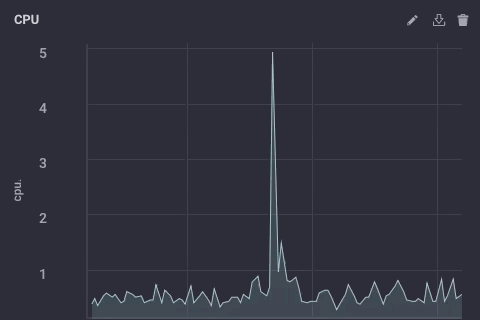

Hay todo tipo de formas de diseñar su implementación de datos de IoT, y lo que es correcto para una empresa no necesariamente lo es para otra. Según el tamaño y la complejidad de su proyecto IoT, puede haber, por supuesto, muchos componentes. Una de las arquitecturas más universales es implementar concentradores de sensores o dispositivos de puerta de enlace de IoT para recopilar datos de varios nodos de sensores y luego enviar esos datos a un sistema de recopilación de datos ascendente para la empresa. Estos dispositivos de puerta de enlace o concentrador generalmente permiten que un dispositivo ZWave se conecte a Internet para cargar datos o para conectar dispositivos Bluetooth a una conexión WiFi u otra red.

Además, la mayoría de estos dispositivos de puerta de enlace o concentrador tienden a ser puertas de enlace "tontas". No hacen nada más que reenviar datos a un colector ascendente. Pero, ¿y si IoT Gateway pudiera ser un dispositivo inteligente? ¿Qué pasaría si pudiera realizar análisis locales y procesamiento de datos en el dispositivo concentrador antes de enviar los datos? ¿No sería útil?

## Construyendo una puerta de enlace

Decidí construir (otro) dispositivo IoT Smart Gateway esta mañana. He (más o menos) construido uno antes en forma de ARTIK-520 con InfluxDB. Pero un ARTIK-520 no es lo más barato que existe, y cuando construyes dispositivos IoT, a veces lo más barato es mejor. No siempre, pero cuando está construyendo montones y montones de puertas de enlace, preferiría no romper el banco con ellas. Saqué mi caja Pine-64 que compré hace unos años y me puse a trabajar. ¿Por qué Pine-64 y no Raspberry Pi? Bueno, el Pine-64 cuesta aproximadamente la mitad del costo. Sí, la mitad del costo. Son $ 15 en lugar de $ 35, así que eso es todo. Tiene exactamente el mismo procesador ARM A53 de cuatro núcleos a 1,2 GHz (el mío tiene 2 GB de memoria, en comparación con 1 GB en un RPi) y tiene una GPU más potente, si te gusta ese tipo de cosas. También vino con Wi-Fi incorporado, por lo que no tengo dongle, y obtuve la placa opcional ZWave para poder hablar con dispositivos IoT de sub-GHz.

Una de las cosas buenas de ejecutar este tipo de dispositivos como IoT Gateways es que solo está limitado en su almacenamiento por el tamaño de la tarjeta microSD que usa. Solo estoy usando una tarjeta de 16GB, pero el Pine-64 puede tomar hasta una tarjeta de 256GB.

¿Qué se necesita para que TICK Stack funcione en un Pine-64? ¡No es sorprendente que Time To Awesome™ sea realmente corto! Una vez que tenga su cuadro Pine-64 en funcionamiento, sugiero usar la imagen Xenial ya que es la imagen 'oficial' de Pine-64 y es Ubuntu, por lo que es muy fácil con InfluxDB. no olvides correr

```bash
% apt-get upgrade
```

Tan pronto como lo tenga en funcionamiento para asegurarse de que tiene todo al día.

A continuación, agregue los repositorios de Influx a apt-get:

```bash
% curl -sL https://repos.influxdata.com/influxdb.key | apt-key add - source /etc/lsb-release
% echo "deb https://repos.influxdata.com/${DISTRIB_ID,,} ${DISTRIB_CODENAME} stable" | tee -a /etc/apt/sources.listCopy
```
Es probable que tengas que ejecutarlos con `sudo`, pero hago trampa y ejecuto 'sudo bash` para empezar y luego estoy listo.

A continuación, deberá agregar un paquete que falta, y es necesario, para acceder a los repositorios de InfluxData:

```bash
% apt-get install apt-transport-httpsCopy
```

entonces solo es cuestion de

```bash
apt-get install influxdb chronograf telegraf kapacitorCopy
```

y usted está listo para ir!

## Prueba de carga del dispositivo

Decidí que podría ser una buena idea poner una carga en este pequeño dispositivo solo para ver lo que era capaz de manejar, así que descargué 'influx-stress' de GitHub y lo ejecuté contra este dispositivo.

```bash
Using batch size of 10000 line(s)
Spreading writes across 100000 series
Throttling output to ~200000 points/sec
Using 20 concurrent writer(s)
Running until ~18446744073709551615 points sent or until ~2562047h47m16.854775807s has elapsedCopy
```

¡¡Guau!! ¡Eso es 200,000 puntos por segundo! ¡Eso debería poner un poco de estrés en mi pequeño Pine-64! Y resulta que de alguna manera lo hizo:


Como puede ver, superó con bastante rapidez los 2 GB de memoria y fijó la CPU al 100%. Pero como dispositivo de puerta de enlace, es poco probable, en la vida real, ver tal carga. Creo que, en términos de uso en la vida real como puerta de enlace, estaría bien dentro de mi rango si solo estuviera recolectando desde unas pocas docenas hasta quizás un centenar de sensores.

## Análisis locales

Como puede ver en el Tablero de arriba, puedo hacer fácilmente algunos análisis locales en el Pine-64. Tiene una interfaz HDMI integrada y una GPU completa, por lo que permitir el acceso local al tablero para monitorear es muy simple. Pero como dije antes, sería mucho más útil si el dispositivo pudiera hacer más que eso. Es poco probable que, en el mundo real, recopile todos sus datos en un dispositivo de puerta de enlace y haga todos sus análisis, etc. allí. Eso no es para lo que son las puertas de enlace/hubs. Algunos análisis locales, alertas, etc. serían buenos; mueva parte del procesamiento hacia el borde cuando pueda, pero aún desea reenviar datos en sentido ascendente.

## Reducción de muestreo de los datos de IoT

Es bastante fácil simplemente usar un dispositivo de puerta de enlace para reenviar todos sus datos en sentido ascendente, pero si está lidiando con problemas de conectividad de red y está tratando de ahorrar dinero o ancho de banda, o ambos, querrá hacer algunos datos. reducción de resolución antes de reenviar sus datos. ¡Afortunadamente, esto también es muy fácil de hacer! Un dispositivo de puerta de enlace que puede realizar análisis locales, manejar algunas alertas locales y también puede reducir la muestra de los datos antes de pasarlos aguas arriba es muy útil en IoT. ¡También es bastante simple de hacer!

Primero, configuremos nuestro dispositivo de puerta de enlace para poder reenviar datos a otra instancia de InfluxDB. Hay varias formas de hacer esto, pero dado que vamos a reducir la resolución de algunos datos a través de Kapacitor, lo haremos a través del archivo kapacitor.conf. El archivo kapacitor.conf ya tiene una sección con una entrada [[influxdb]] para 'localhost', por lo que solo necesitamos agregar una nueva sección [[influxdb]] para la instancia ascendente:

```toml
[[influxdb]]
 enabled = true
 name = "mycluster"
 default = false
 urls = ["http://192.168.1.121:8086"]
 username = ""
 password = ""
 ssl-ca = ""
 ssl-cert = ""
 ssl-key = ""
 insecure-skip-verify = false
 timeout = "0s"
 disable-subscriptions = false
 subscription-protocol = "http"
 subscription-mode = "cluster"
 kapacitor-hostname = ""
 http-port = 0
 udp-bind = ""
 udp-buffer = 1000
 udp-read-buffer = 0
 startup-timeout = "5m0s"
 subscriptions-sync-interval = "1m0s"
 [influxdb.excluded-subscriptions]
 _kapacitor = ["autogen"]
```

Eso resuelve parte del problema. Ahora necesitamos reducir la muestra de los datos y enviarlos. Como estoy usando Chronograf v1.3.10, tengo un editor TICKscript incorporado, así que iré a la pestaña 'Alertas' en Chronograf, crearé un nuevo TICK Script y seleccionaré la base de datos telegraf.autoget como mi fuente :


En realidad, todavía no estoy recopilando datos del sensor en este dispositivo, así que usaré el uso de la CPU como mis datos y lo reduciré en mi TICKScript. He escrito un TICKScript muy básico para reducir la muestra de los datos de mi CPU y reenviarlos hacia arriba:

```javascript
stream
 |from()
 .database('telegraf')
 .measurement('cpu')
 .groupBy(*)
 |where(lambda: isPresent("usage_system"))
 |window()
 .period(1m)
 .every(1m)
 .align()
 |mean('usage_system')
 .as('mean_usage_system')
 |influxDBOut()
 .cluster('mycluster')
 .create()
 .database('downsample')
 .retentionPolicy('autogen')
 .measurement('mean_cpu_idle')
 .precision('s')
 ```

That script simply takes the ‘usage_system` field of the CPU measurement every minute, calculates the mean, and then writes that value upstream to my upstream InfluxDB instance. On the gateway device, the CPU data looks like this:



The downsampled data on my upstream instance looks like this:


It’s the same data, just much less granular. Finally, I’ll go set the data retention policy on my gateway device to be just 1 day, so I don’t fill the device but I can still maintain a bit of history locally:


I now have an IoT Gateway device that can collect local sensor data, present some analytics to a local user, do some local alerting (once I set up some Kapacitor alerts), and then downsample the local data and send it upstream to my enterprise InfluxDB instance for further analysis and processing. I can have the highly-granular millisecond data available on the gateway device, and the less-granular 1-minute data on my upstream device allowing me to still have insight into the local sensors without having to pay the bandwidth costs for sending all the data upstream.

I can also use this method to further chain the data storage by storing the 1-minute data on a regional InfluxDB instance, and forwarding further-downsampled data on to an InfluxDB instance where I can aggregate my sensor data from across my entire enterprise.

I could just send all data up the chain to my ultimate enterprise data aggregator, but if I’m aggregating tens of thousands of sensors and their data, the storage and bandwidth costs may begin to outweigh the usefulness of the highly-granular nature of the data.

## Conclusion

I repeat this so often I might have to have it tattooed on my forehead, but I’ll say it again: IoT Data is really only useful if it is timely, accurate, and ***actionable***. The older your data is, the less actionable it becomes. The less actionable it is, the less detail you need. Downsampling your data, and setting increasingly longer data retention policies as you go, can ensure that your highly immediate data has the specificity to be highly actionable and highly accurate, while preserving the long-term trends in your data for longer-term trend analysis.
