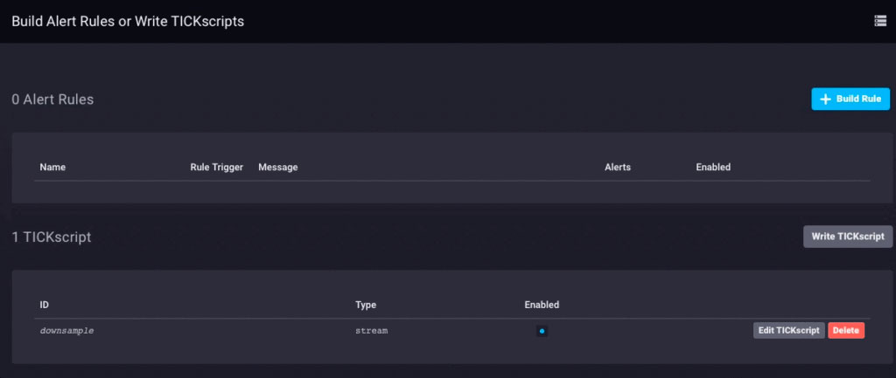

Il existe toutes sortes de façons d'architecturer votre déploiement de données IoT, et ce qui convient à une entreprise ne conviendra pas nécessairement à une autre. En fonction de la taille et de la complexité de votre projet IoT, il peut bien sûr y avoir beaucoup de composants. L'une des architectures les plus universelles consiste à déployer des concentrateurs de capteurs ou des dispositifs de passerelle IoT pour collecter des données à partir d'un certain nombre de nœuds de capteurs, puis transmettre ces données à un système de collecte de données en amont pour l'entreprise. Ces passerelles ou concentrateurs permettent généralement à un appareil ZWave de se connecter à Internet pour le téléchargement de données, ou de relier des appareils Bluetooth à une connexion Wi-Fi ou à une autre connexion réseau.

De plus, la plupart de ces dispositifs de passerelle ou de concentrateur ont tendance à être des passerelles « stupides ». Ils ne font rien d'autre que transmettre des données à un collecteur en amont. Et si la passerelle IoT pouvait être un appareil intelligent ? Et si vous pouviez effectuer des analyses et un traitement de données locaux sur l'appareil concentrateur avant d'envoyer les données ? Ne serait-ce pas utile !

## Construire une passerelle

J'ai décidé de construire (un autre) appareil IoT Smart Gateway ce matin. J'en ai (en quelque sorte) construit un auparavant sous la forme d'un ARTIK-520 exécutant InfluxDB. Mais un ARTIK-520 n'est pas la chose la moins chère, et lorsque vous construisez des appareils IoT, parfois moins cher, c'est mieux. Pas toujours, mais lorsque vous construisez de nombreuses passerelles, vous préférez ne pas vous ruiner. J'ai sorti ma boîte Pine-64 que j'avais achetée il y a quelques années et je me suis mis au travail. Pourquoi Pine-64 et pas Raspberry Pi ? Eh bien, le Pine-64 coûte environ la moitié du prix. Oui, 1/2 du prix. C'est 15 $ au lieu de 35 $, donc voilà. Il a exactement le même processeur ARM A53 quad-core 1,2 GHz - le mien a 2 Go de mémoire, contre 1 Go sur un RPi - et il a un GPU plus puissant, si vous aimez ce genre de choses. Il est également venu avec le WiFi intégré, donc pas de dongle, et j'ai obtenu la carte optionnelle ZWave pour pouvoir parler aux appareils IoT sous-GHz.

L'un des avantages de l'exécution de ces types d'appareils en tant que passerelles IoT est que vous n'êtes limité dans votre stockage que par la taille de la carte microSD que vous utilisez. Je n'utilise qu'une carte de 16 Go, mais le Pine-64 peut prendre jusqu'à une carte de 256 Go.

Que faut-il pour que la pile TICK soit opérationnelle sur un Pine-64 ? Sans surprise, le Time To Awesome™ est vraiment court ! Une fois que votre boîtier Pine-64 est opérationnel, je suggère d'utiliser l'image Xenial car il s'agit de l'image "officielle" Pine-64 et c'est Ubuntu, donc c'est super facile avec InfluxDB. N'oubliez pas de courir

```bash
% apt-get upgrade
```

Dès que vous l'avez mis en place et en cours d'exécution pour vous assurer que tout est à jour.

Ensuite, ajoutez les dépôts Influx à apt-get :

```bash
% curl -sL https://repos.influxdata.com/influxdb.key | apt-key add - source /etc/lsb-release
% echo "deb https://repos.influxdata.com/${DISTRIB_ID,,} ${DISTRIB_CODENAME} stable" | tee -a /etc/apt/sources.listCopy
```
Vous devrez probablement les exécuter avec `sudo`, mais je triche et lance 'sudo bash` pour commencer, puis je suis prêt.

Ensuite, vous devrez ajouter un package manquant et requis pour accéder aux référentiels InfluxData :

```bash
% apt-get install apt-transport-httpsCopy
```

Ensuite, c'est juste une question de

```bash
apt-get install influxdb chronograf telegraf kapacitorCopy
```

et vous êtes prêt à partir!

## Test de charge de l'appareil

J'ai décidé que ce serait peut-être une bonne idée de mettre une charge sur ce petit appareil juste pour voir ce qu'il était capable de gérer, alors j'ai téléchargé "influx-stress" de GitHub et je l'ai exécuté sur cet appareil.

```bash
Using batch size of 10000 line(s)
Spreading writes across 100000 series
Throttling output to ~200000 points/sec
Using 20 concurrent writer(s)
Running until ~18446744073709551615 points sent or until ~2562047h47m16.854775807s has elapsedCopy
```

Ouah!! C'est 200 000 points par seconde ! Cela devrait mettre un sérieux stress sur mon petit Pine-64 ! Et il s'avère que c'est en quelque sorte le cas :


Comme vous pouvez le constater, il a assez rapidement dépassé les 2 Go de mémoire et fixé le processeur à 100 %. Mais en tant que passerelle, il est peu probable, dans la vraie vie, de voir une telle charge. Je pense qu'en termes d'utilisation réelle en tant que passerelle, je serais bien dans ma gamme si je ne collectais que quelques dizaines à peut-être une centaine de capteurs.

## Analytique locale

Comme vous pouvez le voir sur le tableau de bord ci-dessus, je peux facilement effectuer des analyses locales sur le Pine-64. Il dispose d'une interface HDMI intégrée et d'un GPU complet, permettant ainsi un accès local au tableau de bord pour la surveillance est extrêmement simple. Mais comme je l'ai dit plus tôt, il serait beaucoup plus utile si l'appareil pouvait faire plus que cela. Il est peu probable que, dans le monde réel, vous collectiez toutes vos données sur un périphérique de passerelle et y effectuiez toutes vos analyses, etc. Ce n'est pas à cela que servent les passerelles/hubs. Certaines analyses locales, alertes, etc. seraient utiles (déplacez une partie du traitement vers la périphérie lorsque vous le pouvez), mais vous souhaitez toujours transférer les données en amont.

## Sous-échantillonnage des données IoT

Il est assez facile d'utiliser simplement un périphérique de passerelle pour transférer toutes vos données en amont, mais si vous rencontrez des problèmes de connectivité réseau et que vous essayez d'économiser de l'argent ou de la bande passante, ou les deux, vous allez vouloir faire quelques données sous-échantillonnage avant de transmettre vos données. Heureusement, c'est aussi très facile à faire ! Un dispositif de passerelle capable d'effectuer des analyses locales, de gérer certaines alertes locales et de sous-échantillonner les données avant de les transmettre en amont est extrêmement utile dans l'IoT. C'est aussi assez simple à faire !

Tout d'abord, configurons notre périphérique de passerelle pour pouvoir transférer des données en amont vers une autre instance d'InfluxDB. Il existe plusieurs façons de procéder, mais puisque nous allons effectuer un sous-échantillonnage des données via Kapacitor, nous le ferons via le fichier kapacitor.conf. Le fichier kapacitor.conf a déjà une section avec une entrée [[influxdb]] pour 'localhost' donc nous avons juste besoin d'ajouter une nouvelle section [[influxdb]] pour l'instance en amont :

```toml
[[influxdb]]
 enabled = true
 name = "mycluster"
 default = false
 urls = ["http://192.168.1.121:8086"]
 username = ""
 password = ""
 ssl-ca = ""
 ssl-cert = ""
 ssl-key = ""
 insecure-skip-verify = false
 timeout = "0s"
 disable-subscriptions = false
 subscription-protocol = "http"
 subscription-mode = "cluster"
 kapacitor-hostname = ""
 http-port = 0
 udp-bind = ""
 udp-buffer = 1000
 udp-read-buffer = 0
 startup-timeout = "5m0s"
 subscriptions-sync-interval = "1m0s"
 [influxdb.excluded-subscriptions]
 _kapacitor = ["autogen"]
```

Cela résout une partie du problème. Maintenant, nous devons réellement sous-échantillonner les données et les envoyer. Depuis que j'utilise Chronograf v1.3.10, j'ai un éditeur TICKscript intégré, donc je vais aller dans l'onglet "Alerte" dans Chronograf, et créer un nouveau TICK Script, et sélectionner la base de données telegraf.autoget comme ma source :



Je ne collecte pas encore de données de capteur sur cet appareil, donc j'utiliserai l'utilisation du processeur comme données et je le sous-échantillonnerai dans mon TICKScript. J'ai écrit un TICKScript très basique pour sous-échantillonner mes données CPU et les transmettre en amont :

```javascript
stream
 |from()
 .database('telegraf')
 .measurement('cpu')
 .groupBy(*)
 |where(lambda: isPresent("usage_system"))
 |window()
 .period(1m)
 .every(1m)
 .align()
 |mean('usage_system')
 .as('mean_usage_system')
 |influxDBOut()
 .cluster('mycluster')
 .create()
 .database('downsample')
 .retentionPolicy('autogen')
 .measurement('mean_cpu_idle')
 .precision('s')
 ```

That script simply takes the ‘usage_system` field of the CPU measurement every minute, calculates the mean, and then writes that value upstream to my upstream InfluxDB instance. On the gateway device, the CPU data looks like this:


The downsampled data on my upstream instance looks like this:


It’s the same data, just much less granular. Finally, I’ll go set the data retention policy on my gateway device to be just 1 day, so I don’t fill the device but I can still maintain a bit of history locally:


I now have an IoT Gateway device that can collect local sensor data, present some analytics to a local user, do some local alerting (once I set up some Kapacitor alerts), and then downsample the local data and send it upstream to my enterprise InfluxDB instance for further analysis and processing. I can have the highly-granular millisecond data available on the gateway device, and the less-granular 1-minute data on my upstream device allowing me to still have insight into the local sensors without having to pay the bandwidth costs for sending all the data upstream.

I can also use this method to further chain the data storage by storing the 1-minute data on a regional InfluxDB instance, and forwarding further-downsampled data on to an InfluxDB instance where I can aggregate my sensor data from across my entire enterprise.

I could just send all data up the chain to my ultimate enterprise data aggregator, but if I’m aggregating tens of thousands of sensors and their data, the storage and bandwidth costs may begin to outweigh the usefulness of the highly-granular nature of the data.

## Conclusion

I repeat this so often I might have to have it tattooed on my forehead, but I’ll say it again: IoT Data is really only useful if it is timely, accurate, and ***actionable***. The older your data is, the less actionable it becomes. The less actionable it is, the less detail you need. Downsampling your data, and setting increasingly longer data retention policies as you go, can ensure that your highly immediate data has the specificity to be highly actionable and highly accurate, while preserving the long-term trends in your data for longer-term trend analysis.
