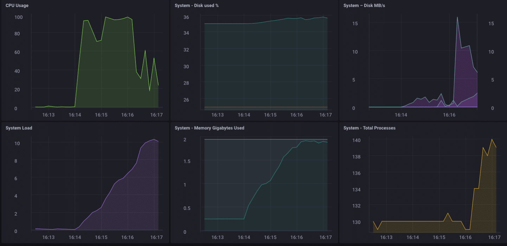
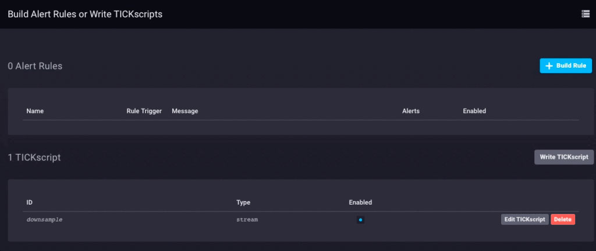
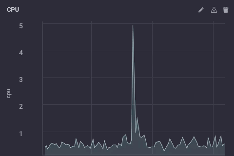
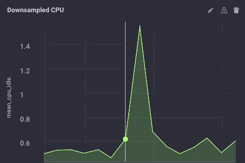
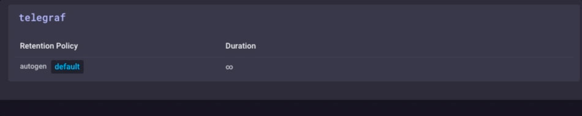

Er zijn allerlei manieren om uw IoT-gegevensimplementatie te ontwerpen, en wat goed is voor de ene onderneming, hoeft niet per se goed te zijn voor een andere. Afhankelijk van de grootte en complexiteit van uw IoT-project kunnen er natuurlijk heel wat onderdelen zijn. Een van de meer universele architecturen is om sensorhubs of IoT-gatewayapparaten in te zetten om gegevens van een aantal sensorknooppunten te verzamelen en die gegevens vervolgens door te sturen naar een stroomopwaarts gegevensverzamelingssysteem voor de onderneming. Met deze gateway- of hub-apparaten kan een ZWave-apparaat doorgaans verbinding maken met internet voor het uploaden van gegevens, of om een brug te slaan tussen Bluetooth-apparaten naar een wifi- of andere netwerkverbinding.

Bovendien zijn de meeste van deze gateway- of hub-apparaten vaak "domme" gateways. Ze doen niets anders dan gegevens doorsturen naar een stroomopwaartse verzamelaar. Maar wat als de IoT Gateway een slim apparaat zou kunnen zijn? Wat als u lokale analyses en gegevensverwerking op het hub-apparaat zou kunnen uitvoeren voordat u de gegevens doorstuurt? Zou dat niet handig zijn!

## Een gateway bouwen

Ik besloot vanmorgen om (nog een) IoT Smart Gateway-apparaat te bouwen. Ik heb er (soort van) eerder een gebouwd in de vorm van een ARTIK-520 met InfluxDB. Maar een ARTIK-520 is niet het goedkoopste dat er is, en als je IoT-apparaten bouwt, is goedkoper soms beter. Niet altijd, maar als je heel veel gateways bouwt, wil je er liever niet te veel voor betalen. Ik groef mijn Pine-64-doos uit die ik een paar jaar geleden had gekocht en ging aan de slag. Waarom Pine-64 en niet Raspberry Pi? Welnu, de Pine-64 is ongeveer de helft van de kosten. Ja, 1/2 van de kosten. Het is $ 15 in plaats van $ 35, dus daar is dat. Het heeft exact dezelfde ARM A53 quad-core 1,2 GHz-processor - de mijne heeft 2 GB geheugen, versus de 1 GB op een RPi - en het heeft een krachtigere GPU, als je van dat soort dingen houdt. Het kwam ook met ingebouwde wifi, dus geen dongle, en ik kreeg het optionele ZWave-bord zodat ik met sub-GHz IoT-apparaten kan praten.

Een van de leuke dingen van het draaien van dit soort apparaten als IoT Gateways is dat je alleen beperkt bent in je opslagruimte door de grootte van de microSD-kaart die je gebruikt. Ik gebruik alleen een kaart van 16 GB, maar de Pine-64 kan een kaart van 256 GB aan.

Wat is er nodig om de TICK Stack aan de praat te krijgen op een Pine-64? Het is niet verrassend dat de Time To Awesome™ erg kort is! Als je Pine-64-box eenmaal aan de gang is, raad ik aan om de Xenial-afbeelding te gebruiken, aangezien dit de 'officiële' Pine-64-afbeelding is en het Ubuntu is, dus het is supergemakkelijk met InfluxDB. Vergeet niet te rennen

```bash
% apt-get upgrade
```

Zodra je het up and running hebt om ervoor te zorgen dat je alles up-to-date hebt.

Voeg vervolgens de Influx-repository's toe aan apt-get:

```bash
% curl -sL https://repos.influxdata.com/influxdb.key | apt-key add - source /etc/lsb-release
% echo "deb https://repos.influxdata.com/${DISTRIB_ID,,} ${DISTRIB_CODENAME} stable" | tee -a /etc/apt/sources.listCopy
```
Je zult die waarschijnlijk met `sudo` moeten uitvoeren, maar ik speel vals en voer 'sudo bash` uit om mee te beginnen en dan ben ik helemaal klaar.

Vervolgens moet u een pakket toevoegen dat ontbreekt - en vereist is - om toegang te krijgen tot de InfluxData-repository's:

```bash
% apt-get install apt-transport-httpsCopy
```

Dan is het gewoon een kwestie van

```bash
apt-get install influxdb chronograf telegraf kapacitorCopy
```

en je bent klaar om te gaan!

## Laad het apparaat testen

Ik besloot dat het een goed idee zou zijn om dit kleine apparaatje te belasten om te zien wat het aankon, dus downloadde ik 'influx-stress' van GitHub en liet het op dit apparaat draaien.

```bash
Using batch size of 10000 line(s)
Spreading writes across 100000 series
Throttling output to ~200000 points/sec
Using 20 concurrent writer(s)
Running until ~18446744073709551615 points sent or until ~2562047h47m16.854775807s has elapsedCopy
```

Wauw!! Dat zijn 200.000 punten per seconde! Dat zou mijn kleine Pine-64 behoorlijk onder druk moeten zetten! En het blijkt dat het min of meer deed:



Zoals je kunt zien, overtrof het vrij snel de 2 GB geheugen en koppelde het de CPU aan 100%. Maar als gateway-apparaat is het in het echte leven onwaarschijnlijk om zo'n belasting te zien. Ik denk dat ik, in termen van real-life gebruik als gateway, ruimschoots binnen mijn bereik zou zijn als ik slechts enkele tientallen tot misschien wel honderd sensoren zou verzamelen.

## Lokale analyse

Zoals je op het bovenstaande dashboard kunt zien, kan ik gemakkelijk wat lokale analyses uitvoeren op de Pine-64. Het heeft een ingebouwde HDMI-interface en een volledige GPU, dus lokale toegang tot het dashboard voor monitoring is doodeenvoudig. Maar zoals ik al eerder zei, het zou veel handiger zijn als het apparaat meer zou kunnen dan dat. Het is onwaarschijnlijk dat u in de echte wereld al uw gegevens op een gateway-apparaat gaat verzamelen en al uw analyses, enz. Daar gaat doen. Daar zijn gateways/hubs niet voor. Sommige lokale analyses, waarschuwingen, enz. zouden goed zijn - verplaats een deel van de verwerking naar de rand wanneer dat mogelijk is - maar u wilt nog steeds gegevens stroomopwaarts doorsturen.

## Downsampling van de IoT-gegevens

Het is vrij eenvoudig om eenvoudigweg een gateway-apparaat te gebruiken om al uw gegevens stroomopwaarts door te sturen, maar als u te maken heeft met netwerkverbindingsproblemen en u probeert geld of bandbreedte te besparen, of beide, wilt u wat gegevens doen downsampling voordat u uw gegevens doorstuurt. Gelukkig is dit ook heel gemakkelijk om te doen! Een gateway-apparaat dat lokale analyses kan uitvoeren, lokale waarschuwingen kan afhandelen en ook de gegevens kan downsamplen voordat ze stroomopwaarts worden doorgegeven, is enorm handig in IoT. Het is ook vrij eenvoudig om te doen!

Laten we eerst ons gateway-apparaat instellen om gegevens stroomopwaarts door te sturen naar een ander exemplaar van InfluxDB. Er zijn verschillende manieren om dit te doen, maar aangezien we wat downsampling van gegevens gaan doen via Kapacitor, doen we dit via het bestand kapacitor.conf. Het bestand kapacitor.conf heeft al een sectie met een [[influxdb]]-item voor 'localhost', dus we hoeven alleen maar een nieuwe [[influxdb]]-sectie toe te voegen voor de upstream-instantie:

```toml
[[influxdb]]
 enabled = true
 name = "mycluster"
 default = false
 urls = ["http://192.168.1.121:8086"]
 username = ""
 password = ""
 ssl-ca = ""
 ssl-cert = ""
 ssl-key = ""
 insecure-skip-verify = false
 timeout = "0s"
 disable-subscriptions = false
 subscription-protocol = "http"
 subscription-mode = "cluster"
 kapacitor-hostname = ""
 http-port = 0
 udp-bind = ""
 udp-buffer = 1000
 udp-read-buffer = 0
 startup-timeout = "5m0s"
 subscriptions-sync-interval = "1m0s"
 [influxdb.excluded-subscriptions]
 _kapacitor = ["autogen"]
```

Dat lost een deel van het probleem op. Nu moeten we de gegevens daadwerkelijk downsamplen en doorsturen. Omdat ik Chronograf v1.3.10 gebruik, heb ik een ingebouwde TICKscript-editor, dus ik ga naar het tabblad 'Waarschuwingen' in Chronograf, maak een nieuw TICK-script en selecteer de telegraf.autoget-database als mijn bron :



Ik verzamel nog geen sensorgegevens op dit apparaat, dus ik gebruik het CPU-gebruik als mijn gegevens en ik zal het downsamplen in mijn TICKScript. Ik heb een heel eenvoudig TICKScript geschreven om mijn CPU-gegevens te downsamplen en stroomopwaarts door te sturen:

```javascript
stream
 |from()
 .database('telegraf')
 .measurement('cpu')
 .groupBy(*)
 |where(lambda: isPresent("usage_system"))
 |window()
 .period(1m)
 .every(1m)
 .align()
 |mean('usage_system')
 .as('mean_usage_system')
 |influxDBOut()
 .cluster('mycluster')
 .create()
 .database('downsample')
 .retentionPolicy('autogen')
 .measurement('mean_cpu_idle')
 .precision('s')
 ```

That script simply takes the ‘usage_system` field of the CPU measurement every minute, calculates the mean, and then writes that value upstream to my upstream InfluxDB instance. On the gateway device, the CPU data looks like this:



The downsampled data on my upstream instance looks like this:



It’s the same data, just much less granular. Finally, I’ll go set the data retention policy on my gateway device to be just 1 day, so I don’t fill the device but I can still maintain a bit of history locally:



I now have an IoT Gateway device that can collect local sensor data, present some analytics to a local user, do some local alerting (once I set up some Kapacitor alerts), and then downsample the local data and send it upstream to my enterprise InfluxDB instance for further analysis and processing. I can have the highly-granular millisecond data available on the gateway device, and the less-granular 1-minute data on my upstream device allowing me to still have insight into the local sensors without having to pay the bandwidth costs for sending all the data upstream.

I can also use this method to further chain the data storage by storing the 1-minute data on a regional InfluxDB instance, and forwarding further-downsampled data on to an InfluxDB instance where I can aggregate my sensor data from across my entire enterprise.

I could just send all data up the chain to my ultimate enterprise data aggregator, but if I’m aggregating tens of thousands of sensors and their data, the storage and bandwidth costs may begin to outweigh the usefulness of the highly-granular nature of the data.

## Conclusion

I repeat this so often I might have to have it tattooed on my forehead, but I’ll say it again: IoT Data is really only useful if it is timely, accurate, and ***actionable***. The older your data is, the less actionable it becomes. The less actionable it is, the less detail you need. Downsampling your data, and setting increasingly longer data retention policies as you go, can ensure that your highly immediate data has the specificity to be highly actionable and highly accurate, while preserving the long-term trends in your data for longer-term trend analysis.
