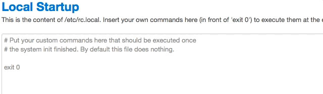
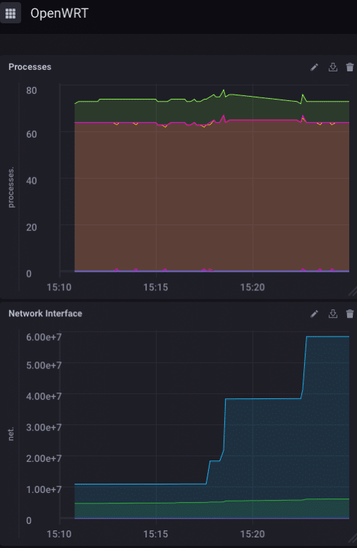

> Dieser Beitrag wurde ursprünglich auf [Blog von InfluxData](https://www.influxdata.com/blog/monitoring-openwrt-with-telegraf/) veröffentlicht.

Was ist die beliebteste Open-Source-Router-Software der Welt? OpenWRT natürlich! Es ist der ideale Firmware-Ersatz für eine [riesige Anzahl](https://wiki.openwrt.org/toh/start) von Routern sowohl für den privaten als auch für den geschäftlichen Gebrauch. Sie müssen es also natürlich überwachen! Nun, Router sind genau genommen ein IoT-Gerät, aber hey, es ist ein (relativ) kleines, eingebettetes Gerät, das allgegenwärtig ist und wirklich etwas Aufmerksamkeit verdient. Wie sich herausstellt, ist die Überwachung Ihres WRT-fähigen Routers mit InfluxDB so einfach, dass es beängstigend ist!

## Integrierte Überwachung

OpenWRT hat einige grundlegende integrierte Überwachungen, die Sie sich ansehen können, aber sie ist nur auf der vom Router bereitgestellten Webseite verfügbar, sie kann, soweit ich das beurteilen kann, nicht über mehrere Geräte hinweg aggregiert werden, und es ist, wie gesagt, ziemlich einfach.


Wenn Sie mit [Chronograf](https://w2.influxdata.com/time-series-platform/chronograf/) herumgespielt haben, werden Sie denken, dass das bestenfalls sehr rudimentär ist. Lassen Sie uns also eine detailliertere Überwachung aktivieren!

## Detailliertere Überwachung

Zunächst einmal habe ich nicht zufällig einen alten Linksys-Router herumliegen, also habe ich das alles auf einem [Raspberry Pi](https://wiki.openwrt.org/toh/raspberry_pi_foundation/raspberry_pi) aufgebaut, sondern das Konzept ist dasselbe, und Sie können genau dasselbe auf jedem WRT-unterstützten Router mit wenig bis gar keinen Schwierigkeiten tun.

Alles, was Sie tun müssen, ist das [WRT-Image](https://wiki.openwrt.org/toh/raspberry_pi_foundation/raspberry_pi) auf eine microSD-Karte zu brennen, diese in Ihren Raspberry Pi einzulegen und einzuschalten! Ihr Pi ist jetzt ein Router! Der nächste Schritt besteht darin, einen Teil (oder den gesamten, wenn Sie Platz haben) des TICK-Stacks auf Ihrem neuen Router zu installieren. Ich betreibe meinen Raspberry Pi auf einer 8 GB microSD, daher ist der Speicherplatz auf meinem Gerät stark begrenzt. Aus diesem Grund habe ich beschlossen, nur [Telegraf](https://w2.influxdata.com/time-series-platform/telegraf/) zu installieren und alle Daten an einen anderen InfluxDB-Server zu senden . Gehen Sie also zur [Download-Seite](https://wiki.openwrt.org/toh/raspberry_pi_foundation/raspberry_pi) und holen Sie sich die ARM-Version von Telegraf. Es ist eine gzip-komprimierte Tar-Datei, was in diesem Fall eigentlich gut ist. Sobald Sie es auf Ihrem lokalen Computer haben, müssen Sie scp verwenden, um es auf Ihren Router zu kopieren:

```bash
davidgs$ scp telegraf-1.5.0_linux_armhf.tar.gz root@192.168.2.3:telegraf-1.5.0_linux_armhf.tar.gzCopy
```

Sobald Sie das getan haben, ssh in Ihren Router und entpacken/installieren Sie Telegraf:

```bash
root@OpenWrt:~# tar xzvf telegraf-1.5.0_linux_armhf.tar.gz
root@OpenWrt:~# mv telegraf/usr//bin/telegraf /usr/bin
root@OpenWrt:~# mv telegraf/usr/lib/telegraf /usr/lib
root@OpenWrt:~# mv telegraf/var//log/* /var/log
root@OpenWrt:~# mv telegraf/etc/* /etcCopy
```

Dann ist es einfach, Telegraf auf Ihre InfluxDB-Instanz zu verweisen, indem Sie die Datei telegraf.conf bearbeiten:

```toml
[[outputs.influxdb]]
 ## The full HTTP or UDP URL for your InfluxDB instance.
 ##
 ## Multiple urls can be specified as part of the same cluster,
 ## this means that only ONE of the urls will be written to each interval.
 # urls = ["udp://127.0.0.1:8089"] # UDP endpoint example
 urls = ["http://192.168.2.1:8086"] # requiredCopy
```

Natürlich wird Ihre URL anders sein, aber Sie bekommen die Idee. Dann sollten Sie die Admin-Seite von Ihrem Router laden und die Seite System -> Startup auswählen


Fügen Sie dann einfach den Befehl hinzu, um Telegraf zu starten:



Jedes Mal, wenn Ihr Router zurückgesetzt wird, startet Telegraf automatisch neu und sendet weiterhin die Statistiken Ihres Routers an InfluxDB.

Schließlich ging ich in meine lokale InfluxDB-Instanz und baute ein Dashboard zur Überwachung des Routers:



Wenn ich mehrere WRT-Router bereitstellen würde – was in vielen Unternehmen üblich ist – würde ich sie so einrichten, dass sie alle an dieselbe InfluxDB-Instanz berichten, und mir selbst ein Dashboard erstellen, mit dem ich alle Router in meinem Unternehmen von einem einzigen aus überwachen könnte Glasscheibe.

## Weitergehen

Jetzt bist du dran! Wenn Sie einen alten Router herumliegen haben, warum bauen Sie nicht Ihren eigenen selbstüberwachenden Router! Wenn Sie Platz haben, installieren Sie auch InfluxDB und Kapacitor darauf und erstellen Sie einige Warnungen, die Sie darüber informieren, wenn mit Ihrem Router etwas schief geht. Oder erstellen Sie Dashboards, die direkt auf dem Router selbst laufen!
