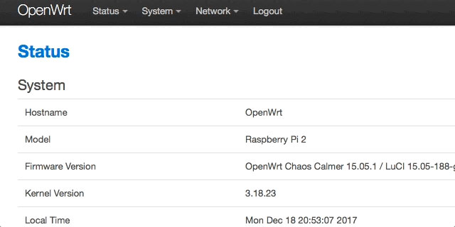

> Esta publicación se publicó originalmente en [el blog de InfluxData](https://www.influxdata.com/blog/monitoring-openwrt-with-telegraf/).

¿Cuál es el software de enrutador de código abierto más popular del mundo? ¡OpenWRT, por supuesto! Es el reemplazo de firmware para una [gran cantidad](https://wiki.openwrt.org/toh/start) de enrutadores tanto para uso doméstico como comercial. Así que, por supuesto, ¡necesitas monitorearlo! Ahora, los enrutadores son, estrictamente hablando, un dispositivo IoT, pero bueno, es un dispositivo integrado (relativamente) pequeño que es ubicuo y realmente merece atención. ¡Resulta que monitorear su enrutador habilitado para WRT con InfluxDB es tan simple que da miedo!

## Monitoreo incorporado

OpenWRT tiene un monitoreo básico incorporado que puede ver, pero solo está disponible en la página web atendida por el enrutador, no es, por lo que sé, capaz de agregarse a través de múltiples dispositivos, y es, Como dije, bastante básico.


Si has jugado con [Chronograf](https://w2.influxdata.com/time-series-platform/chronograf/), pensarás que es muy rudimentario en el mejor de los casos. ¡Así que habilitemos un monitoreo más detallado!

## Monitoreo más detallado

Para empezar, no tengo un enrutador Linksys antiguo, así que construí todo esto en un [Raspberry Pi](https://wiki.openwrt.org/toh/raspberry_pi_foundation/raspberry_pi), pero el concepto es lo mismo, y puede hacer exactamente lo mismo en cualquier enrutador compatible con WRT con poca o ninguna dificultad.

Realmente todo lo que tiene que hacer es grabar la [Imagen WRT](https://wiki.openwrt.org/toh/raspberry_pi_foundation/raspberry_pi) en una tarjeta microSD, insertarla en su Raspberry Pi y encenderla. ¡Tu Pi ahora es un enrutador! El siguiente paso es instalar parte (o todo, si tiene espacio) del TICK Stack en su nuevo enrutador. Estoy ejecutando mi Raspberry Pi en una microSD de 8 GB, por lo que el espacio en mi dispositivo es muy limitado. Siendo ese el caso, decidí que instalaría solo [Telegraf](https://w2.influxdata.com/time-series-platform/telegraf/), y enviaría todos sus datos a un servidor InfluxDB en otro lugar . Diríjase a la [Página de descargas](https://portal.influxdata.com/downloads) y obtenga la versión ARM de Telegraf. Es un archivo tar comprimido con gzip, que en realidad es bueno en este caso. Una vez que lo tenga en su máquina local, deberá usar scp para copiarlo en su enrutador:

```bash
davidgs$ scp telegraf-1.5.0_linux_armhf.tar.gz root@192.168.2.3:telegraf-1.5.0_linux_armhf.tar.gzCopy
```

Una vez que haya hecho eso, ingrese a su enrutador y descomprima/instale Telegraf:

```bash
root@OpenWrt:~# tar xzvf telegraf-1.5.0_linux_armhf.tar.gz
root@OpenWrt:~# mv telegraf/usr//bin/telegraf /usr/bin
root@OpenWrt:~# mv telegraf/usr/lib/telegraf /usr/lib
root@OpenWrt:~# mv telegraf/var//log/* /var/log
root@OpenWrt:~# mv telegraf/etc/* /etcCopy
```

Entonces es una simple cuestión de apuntar a Telegraf a su instancia de InfluxDB editando el archivo telegraf.conf:

```toml
[[outputs.influxdb]]
 ## The full HTTP or UDP URL for your InfluxDB instance.
 ##
 ## Multiple urls can be specified as part of the same cluster,
 ## this means that only ONE of the urls will be written to each interval.
 # urls = ["udp://127.0.0.1:8089"] # UDP endpoint example
 urls = ["http://192.168.2.1:8086"] # requiredCopy
```

Por supuesto, su URL será diferente, pero entiende la idea. Luego, deberá cargar la página de administración desde su enrutador y seleccionar la página Sistema—>Inicio



Luego simplemente agregue el comando para iniciar Telegraf:


Ahora, cada vez que reinicie su enrutador, Telegraf se reiniciará automáticamente y continuará enviando las estadísticas de su enrutador a InfluxDB.

Finalmente, entré en mi instancia local de InfluxDB y construí un panel para monitorear el enrutador:


Nuevamente, si estuviera implementando múltiples enrutadores WRT, algo común en muchas empresas, los configuraría para que todos reporten a la misma instancia de InfluxDB y crearía un tablero donde pudiera monitorear todos los enrutadores en mi empresa desde un solo Panel de vidrio.

## Ir más lejos

¡Ahora es tu turno! Si tiene un enrutador viejo, ¿por qué no construye su propio enrutador de autocontrol? Si tiene espacio, instale InfluxDB y Kapacitor en él también y cree algunas alertas para avisarle cuando las cosas van mal con su enrutador. ¡O cree paneles que se ejecuten directamente en el enrutador!
