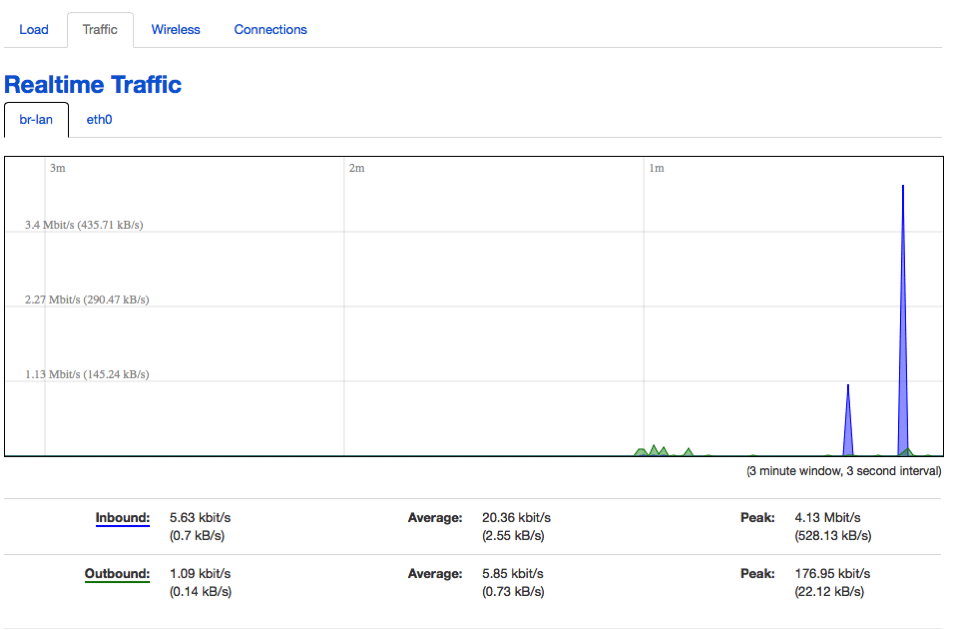
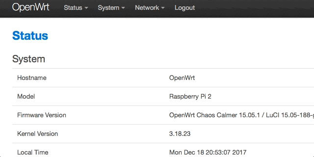
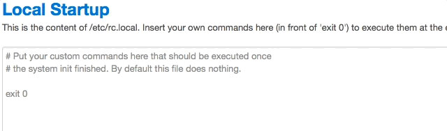
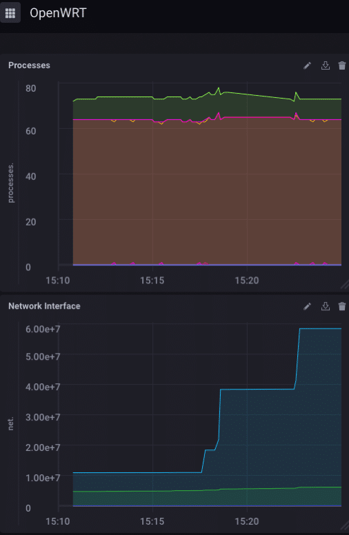

> Cet article a été initialement publié sur [le blog d'InfluxData](https://www.influxdata.com/blog/monitoring-openwrt-with-telegraf/).

Quel est le logiciel de routeur open source le plus populaire au monde ? OpenWRT, bien sûr ! Il s'agit du remplacement incontournable du micrologiciel pour un [grand nombre](https://wiki.openwrt.org/toh/start) de routeurs à la fois pour un usage domestique et professionnel. Alors bien sûr, il faut le surveiller ! Maintenant, les routeurs sont, à proprement parler, un appareil IoT, mais bon, c'est un (relativement) petit appareil embarqué qui est omniprésent et mérite vraiment une certaine attention. Il s'avère que la surveillance de votre routeur compatible WRT avec InfluxDB est si simple que c'en est effrayant !

## Surveillance intégrée

OpenWRT a une surveillance intégrée de base que vous pouvez consulter, mais elle n'est disponible que sur la page Web desservie par le routeur, elle n'est pas, pour autant que je sache, capable d'être agrégée sur plusieurs appareils, et c'est, comme je l'ai dit, assez basique.



Si vous avez joué avec [Chronograf](https://w2.influxdata.com/time-series-platform/chronograf/), vous penserez que c'est au mieux très rudimentaire. Activons donc une surveillance plus détaillée !

## Surveillance plus détaillée

Pour commencer, je n'ai pas d'ancien routeur Linksys qui traîne, j'ai donc tout construit sur un [Raspberry Pi](https://wiki.openwrt.org/toh/raspberry_pi_foundation/raspberry_pi), mais le concept est le même, et vous pouvez faire exactement la même chose sur n'importe quel routeur pris en charge par WRT avec peu ou pas de difficulté.

Tout ce que vous avez à faire est de graver l'[image WRT](https://wiki.openwrt.org/toh/raspberry_pi_foundation/raspberry_pi) sur une carte microSD, de l'insérer dans votre Raspberry Pi et de l'allumer ! Votre Pi est maintenant un routeur ! L'étape suivante consiste à installer une partie (ou la totalité, si vous avez de la place) de la pile TICK sur votre nouveau routeur. J'utilise mon Raspberry Pi sur une microSD de 8 Go, donc l'espace sur mon appareil est très limité. Cela étant, j'ai décidé d'installer uniquement [Telegraf](https://w2.influxdata.com/time-series-platform/telegraf/) et de lui faire envoyer toutes ses données à un serveur InfluxDB ailleurs . Rendez-vous donc sur la [page de téléchargements](https://portal.influxdata.com/downloads) et obtenez la version ARM de Telegraf. C'est un fichier tar compressé avec gzip, ce qui est vraiment bien dans ce cas. Une fois que vous l'avez sur votre machine locale, vous devrez utiliser scp pour le copier sur votre routeur :

```bash
davidgs$ scp telegraf-1.5.0_linux_armhf.tar.gz root@192.168.2.3:telegraf-1.5.0_linux_armhf.tar.gzCopy
```

Une fois que vous avez fait cela, connectez-vous en ssh à votre routeur et décompressez/installez Telegraf :

```bash
root@OpenWrt:~# tar xzvf telegraf-1.5.0_linux_armhf.tar.gz
root@OpenWrt:~# mv telegraf/usr//bin/telegraf /usr/bin
root@OpenWrt:~# mv telegraf/usr/lib/telegraf /usr/lib
root@OpenWrt:~# mv telegraf/var//log/* /var/log
root@OpenWrt:~# mv telegraf/etc/* /etcCopy
```

Ensuite, il suffit de pointer Telegraf vers votre instance InfluxDB en éditant le fichier telegraf.conf :

```toml
[[outputs.influxdb]]
 ## The full HTTP or UDP URL for your InfluxDB instance.
 ##
 ## Multiple urls can be specified as part of the same cluster,
 ## this means that only ONE of the urls will be written to each interval.
 # urls = ["udp://127.0.0.1:8089"] # UDP endpoint example
 urls = ["http://192.168.2.1:8086"] # requiredCopy
```

Bien sûr, votre URL sera différente, mais vous voyez l'idée. Ensuite, vous devrez charger la page d'administration de votre routeur et sélectionner la page Système—>Démarrage



Ensuite, ajoutez simplement la commande pour démarrer Telegraf :



Désormais, chaque fois que votre routeur est réinitialisé, Telegraf redémarre automatiquement et continue d'envoyer les statistiques de votre routeur à InfluxDB.

Enfin, je suis allé dans mon instance InfluxDB locale et j'ai créé un tableau de bord pour surveiller le routeur :



Encore une fois, si je déployais plusieurs routeurs WRT - une chose courante dans de nombreuses entreprises - je les configurerais pour qu'ils relèvent tous de la même instance InfluxDB et me créerais un tableau de bord où je pourrais surveiller tous les routeurs de mon entreprise à partir d'un seul une vitre.

## Aller plus loin

Maintenant c'est ton tour! Si vous avez un ancien routeur qui traîne, pourquoi ne pas construire votre propre routeur auto-surveillé ! Si vous avez de la place, installez également InfluxDB et Kapacitor dessus et créez des alertes pour vous avertir en cas de problème avec votre routeur. Ou créez des tableaux de bord qui s'exécutent directement sur le routeur lui-même !
