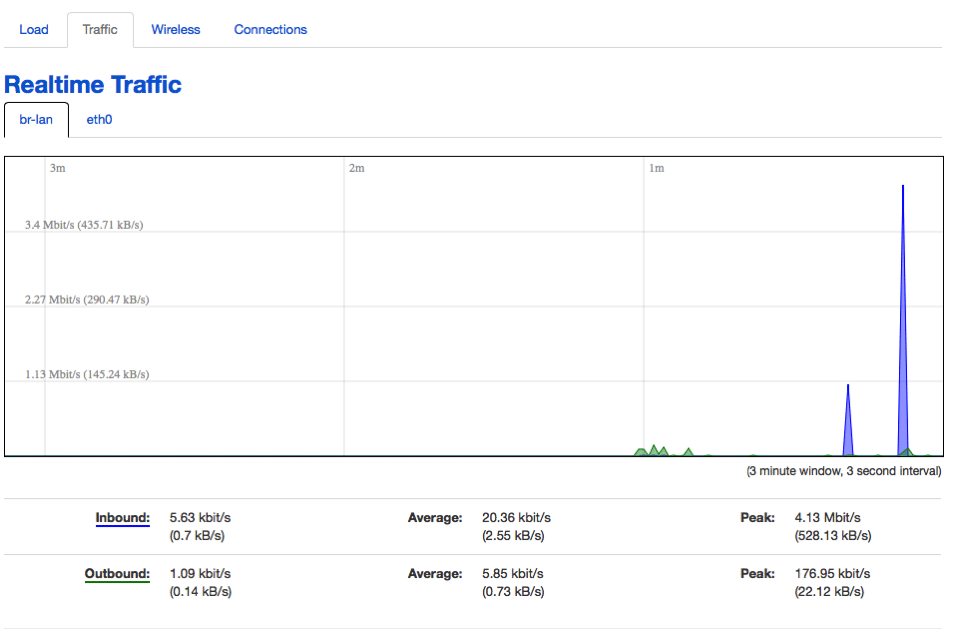

> Dit bericht is oorspronkelijk gepubliceerd op [InfluxData's blog](https://www.influxdata.com/blog/monitoring-openwrt-with-telegraf/).

Wat is de populairste open source routersoftware ter wereld? OpenWRT natuurlijk! Het is de beste firmwarevervanging voor een [enorm aantal](https://wiki.openwrt.org/toh/start) routers voor zowel thuis- als zakelijk gebruik. Dus je moet het natuurlijk wel in de gaten houden! Nu zijn routers strikt genomen een IoT-apparaat, maar hey, het is een (relatief) klein, ingebed apparaat dat alomtegenwoordig is en echt wat aandacht verdient. Het blijkt dat het bewaken van uw WRT-compatibele router met InfluxDB zo eenvoudig is dat het eng is!

## Ingebouwde bewaking

OpenWRT heeft wel wat standaard ingebouwde monitoring waar je naar kunt kijken, maar het is alleen beschikbaar op de webpagina die door de router wordt bediend, het kan, voor zover ik weet, niet worden geaggregeerd over meerdere apparaten, en het is, zoals ik al zei, vrij eenvoudig.



Als je ooit met [Chronograf](https://w2.influxdata.com/time-series-platform/chronograf/) hebt gespeeld, zul je denken dat dat op zijn best erg rudimentair is. Dus laten we wat meer gedetailleerde monitoring inschakelen!

## Meer gedetailleerde monitoring

Om te beginnen heb ik toevallig geen oude Linksys-router liggen, dus heb ik dit allemaal gebouwd op een [Raspberry Pi](https://wiki.openwrt.org/toh/raspberry_pi_foundation/raspberry_pi), maar het concept is hetzelfde, en je kunt met weinig tot geen moeite exact hetzelfde doen op elke WRT-ondersteunde router.

Eigenlijk hoef je alleen maar de [WRT-afbeelding](https://wiki.openwrt.org/toh/raspberry_pi_foundation/raspberry_pi) op een microSD-kaart te branden, die in je Raspberry Pi te steken en hem aan te zetten! Je Pi is nu een router! De volgende stap is om een deel (of alles, als je ruimte hebt) van de TICK Stack op je nieuwe router te installeren. Ik gebruik mijn Raspberry Pi op een microSD van 8 GB, dus de ruimte op mijn apparaat is ernstig beperkt. Daarom besloot ik dat ik alleen [Telegraf](https://wiki.openwrt.org/toh/raspberry_pi_foundation/raspberry_pi) zou installeren en al zijn gegevens ergens anders naar een InfluxDB-server zou sturen . Ga dus naar de [Downloads-pagina](https://portal.influxdata.com/downloads) en download de ARM-versie van Telegraf. Het is een gzip-gecomprimeerd tar-bestand, wat in dit geval eigenlijk goed is. Als je het eenmaal op je lokale computer hebt staan, moet je scp gebruiken om het naar je router te kopiëren:

```bash
davidgs$ scp telegraf-1.5.0_linux_armhf.tar.gz root@192.168.2.3:telegraf-1.5.0_linux_armhf.tar.gzCopy
```

Zodra je dat hebt gedaan, ssh je naar je router en pak je Telegraf uit/installeer je:

```bash
root@OpenWrt:~# tar xzvf telegraf-1.5.0_linux_armhf.tar.gz
root@OpenWrt:~# mv telegraf/usr//bin/telegraf /usr/bin
root@OpenWrt:~# mv telegraf/usr/lib/telegraf /usr/lib
root@OpenWrt:~# mv telegraf/var//log/* /var/log
root@OpenWrt:~# mv telegraf/etc/* /etcCopy
```

Dan is het een kwestie van Telegraf naar uw InfluxDB-instantie te wijzen door het telegraf.conf-bestand te bewerken:

```toml
[[outputs.influxdb]]
 ## The full HTTP or UDP URL for your InfluxDB instance.
 ##
 ## Multiple urls can be specified as part of the same cluster,
 ## this means that only ONE of the urls will be written to each interval.
 # urls = ["udp://127.0.0.1:8089"] # UDP endpoint example
 urls = ["http://192.168.2.1:8086"] # requiredCopy
```

Natuurlijk zal uw URL anders zijn, maar u begrijpt het wel. Vervolgens wilt u de beheerderspagina van uw router laden en de pagina Systeem -> Opstarten selecteren


Voeg dan gewoon de opdracht toe om Telegraf te starten:


Elke keer dat uw router wordt gereset, zal Telegraf automatisch opnieuw opstarten en de statistieken van uw router naar InfluxDB blijven sturen.

Ten slotte ging ik naar mijn lokale InfluxDB-instantie en bouwde een dashboard om de router te bewaken:


Nogmaals, als ik meerdere WRT-routers zou implementeren - iets wat bij veel bedrijven gebruikelijk is - zou ik ze zo instellen dat ze allemaal naar dezelfde InfluxDB-instantie rapporteren en een dashboard voor mezelf bouwen waar ik alle routers in mijn bedrijf vanaf één enkele ruit.

## Verder gaan

Nu is het jouw beurt! Als je nog een oude router hebt liggen, bouw dan je eigen zelfbewakende router! Als je ruimte hebt, installeer er dan ook InfluxDB en Kapacitor op en bouw enkele waarschuwingen om je te laten weten wanneer er iets misgaat met je router. Of bouw dashboards die rechtstreeks op de router zelf draaien!
