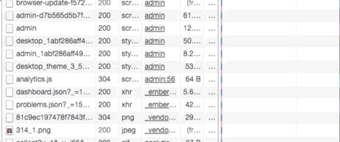

> This post was originally published on [InfluxData's Blog](https://www.influxdata.com/blog/use-influxdb-measure-community/)

## Monitoring Discourse

We here at InfluxData use Discourse for our Community (you’re a member of our Community, right? No? Well, go sign up!!) Part of my job here at InfluxData is to keep my eye on the community, answer questions, and work to grow the community. And part of that, of course, is metrics. It always comes down to what you can measure, doesn’t it? So my challenge was to find a way to measure the community.

There is, of course, a management interface that shows the number of new users, the number of posts created, etc. over the past day, week and month, so the stats are there. But the idea of going there every day and recording those numbers was, well, less than attractive.

Discourse provides some rudimentary monitoring, but the power is really using their APIs to get to see the data in a whole new way. After all, automating tasks like that is what computers were invented for, right? So I’ll show you how I managed to get all those management stats pulled out of Discourse, and then (of course) inserted into InfluxDB so that I could have them always at my fingertips and ready to show.

## Getting the Stats

The first challenge was finding a way to get at all the stats I was looking for. The first thing I did, of course, was head right for the Discourse API Docs in hopes that there would be a simple API call that would get me what I wanted. Or maybe, worst-case, a series of API calls to get the individual stats I wanted. Alas, things are never that simple, are they? There are some really handy APIs for doing a lot of things, but getting user- and activity-stats aren’t among them. Time to reverse-engineer it.

It’s fairly easy to get a bunch of information via the Google Chrome Developer tools. I then loaded the Admin interface to Discourse to see what was happening:



As you can see, I found a ‘dashboard.json’ that was being loaded, so I went and poked around in there and Bingo! Treasure-trove of data! In fact, it contains all the data that the Administration Dashboard has. I was almost home! Almost. That gets me a 3200-line JSON object that I have to wade through to find what I need. Some of the data is available via other means. For instance, the http_2xx_reqs stats are available from the nginx logs, but things like the number of topics with no response, on a daily basis, are not. And those are the things I’m really interested in. So I’m back to parsing JSON objects and inserting the results into InfluxDB. And you thought I had a glamorous life!

## Writing the Code

I’m not, however, doing this in Node-red this time. I decided, since I had some other Node.js processes doing various things on my server, that I’d just add one more. Node.js is pretty good at http get, and parsing JSON, so it seems like a good idea. The first thing you need is an API key for your Discourse installation, so go on over to the Discourse API Docs and get one of those for your Discourse setup. Then define your URL (which will, of course, be different than mine because you have your own Discourse setup, and you don’t have administrator access to mine).

```javascript
const url = "https://community.influxdata.com/admin/dashboard.json?api_username=foo&api_key=bar";
```

Again, looking at the JSON file, I decided on a number of `global reports` that I was interested in:

```json
{
  "global_reports": [
    { "type": "visits",
      "title": "User Visits",
      "xaxis": "Day",
      "yaxis": "Number of visits",
      "data": [
        { "x": "2017-09-26",
          "y": 68         },
          ...
      ],
      "total": 8404,
      "start_date": "2017-09-26T00:00:00.000Z",
      "end_date": "2017-10-26T23:59:59.999Z",
      "category_id": null,
      "group_id": null,
      "prev30Days": 1077
    },
    ...
```

Even better! I can get the totals and the totals for the previous 30 days! So now that I have the URL, and know what the JSON structure is, I can go get it, and parse it:

```javascript
  https.get(url, res => {
    res.setEncoding("utf8");
    let body = "";
    res.on("data", data => {
      body += data;    });
    res.on("end", () => {
      console.log("Influx setup");
      body = JSON.parse(body);
      var reports = body.global_reports;
      for (var x = 0; x < reports.length; x++) {
        const ty = reports[x].type;
        for (var y = 0; y < reports[x].data.length; y++) {
          var buffer = "stats,report=".concat(reports[x].type);
          buffer = buffer.concat(" ");
          buffer = buffer.concat("value=");
          buffer = buffer.concat(reports[x].data[y].y).concat(" ");
          buffer = buffer.concat(new Date(reports[x].data[y].x).getTime());
          writeData(buffer);
        }
        var buffer = "stats,cumulative=".concat(reports[x].type);
        buffer = buffer.concat(" ");
        buffer = buffer.concat("total=").concat(reports[x].total).concat(",");
        buffer = buffer.concat("prev30Days=").concat(reports[x].prev30Days).concat(" ");
        buffer = buffer.concat(new Date(reports[x].end_date).getTime());
        writeData(buffer);
      }
    });
  });
```

And that gets me all the individual data points I’m after, and then all the cumulative data points—-- remember, the total and the previous 30-day totals—that I want. And I just write that data to my InfluxDB instance:

```javascript
function writeData(buffer){
  var post_options = {
    host: 'my_instance.influxcloud.net',
    path: '/write?db=discourse&precision=ms&u=my_username&p=myPassword',
    method: 'POST',
    headers: {
      'Content-Length': Buffer.byteLength(buffer)
    }
  };
  req = https.request(post_options, function(result) {
    if(result.statusCode > 205){
      console.log('Status: ' + result.statusCode);
      console.log('Headers: ' + JSON.stringify(result.headers));
    }
    result.setEncoding('utf8');
    result.on('data', function(body) {
      console.log('Body: ' + body);
    });
  });
  req.on('error', function(e) {
    console.log('problem with request: ' + e.message);
  });
  req.write(buffer);
  req.end();
}
```

Clearly logging the result to the console isn’t needed, but I like to see what’s going on. And that’s all the code I wrote!

## Seeing the Results

Of course, no InfluxDB project would be complete without building a dashboard so that I can visualize the results—and so that management can see the health and activity of the community at a glance.


Really cool to see that we have zero topics with no response right now! The best part of this whole thing is that it has automated a bunch of the statistics-gathering that I used to have to do by hand, thus freeing me up to do other cool stuff!

## What's Next?

Well, I don’t think there’s anything next on this project, but I spent last week at EclipseCon Europe and I’ll be writing up some really cool stuff that went on there, so stay tuned for that! And don’t forget that if you have an idea for a project I should tackle or any questions, please let me know!