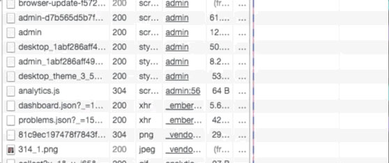
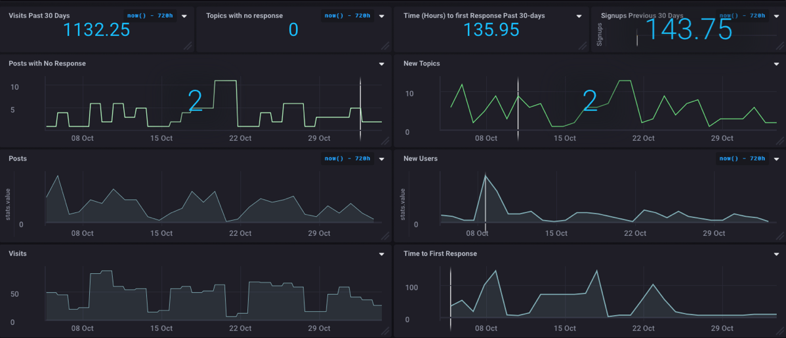

> Esta publicación se publicó originalmente en [Blog de InfluxData](https://www.influxdata.com/blog/use-influxdb-measure-community/)

## Seguimiento del discurso

Aquí en InfluxData usamos Discourse para nuestra comunidad (usted es miembro de nuestra comunidad, ¿verdad? ¿No? Bueno, regístrese!!) Parte de mi trabajo aquí en InfluxData es vigilar a la comunidad, responder preguntas, y trabajar para hacer crecer la comunidad. Y parte de eso, por supuesto, son las métricas. Siempre se reduce a lo que puedes medir, ¿no es así? Así que mi desafío fue encontrar una manera de medir la comunidad.

Hay, por supuesto, una interfaz de administración que muestra la cantidad de nuevos usuarios, la cantidad de publicaciones creadas, etc. durante el último día, semana y mes, por lo que las estadísticas están ahí. Pero la idea de ir allí todos los días y registrar esos números era, bueno, menos que atractiva.

Discourse proporciona un monitoreo rudimentario, pero el poder realmente está usando sus API para ver los datos de una manera completamente nueva. Después de todo, automatizar tareas como esa es para lo que se inventaron las computadoras, ¿verdad? Así que les mostraré cómo logré sacar todas esas estadísticas de gestión de Discourse y luego (por supuesto) insertarlas en InfluxDB para poder tenerlas siempre al alcance de la mano y listas para mostrar.

## Obtener las estadísticas

El primer desafío fue encontrar una manera de obtener todas las estadísticas que estaba buscando. Lo primero que hice, por supuesto, fue dirigirme directamente a Discourse API Docs con la esperanza de que hubiera una simple llamada a la API que me diera lo que quería. O tal vez, en el peor de los casos, una serie de llamadas a la API para obtener las estadísticas individuales que quería. Por desgracia, las cosas nunca son tan simples, ¿verdad? Hay algunas API realmente útiles para hacer muchas cosas, pero obtener estadísticas de usuarios y actividades no se encuentran entre ellas. Es hora de aplicar ingeniería inversa.

Es bastante fácil obtener un montón de información a través de las herramientas para desarrolladores de Google Chrome. Luego cargué la interfaz de administración en Discourse para ver qué estaba pasando:



Como puede ver, encontré un 'dashboard.json' que se estaba cargando, así que fui y hurgué allí y ¡Bingo! ¡Tesoro oculto de datos! De hecho, contiene todos los datos que tiene el Panel de Administración. ¡Ya casi estaba en casa! Casi. Eso me da un objeto JSON de 3200 líneas que tengo que recorrer para encontrar lo que necesito. Algunos de los datos están disponibles a través de otros medios. Por ejemplo, las estadísticas de http_2xx_reqs están disponibles en los registros de nginx, pero cosas como la cantidad de temas sin respuesta, a diario, no lo están. Y esas son las cosas que realmente me interesan. Así que volví a analizar objetos JSON e insertar los resultados en InfluxDB. ¡Y pensaste que tenía una vida glamorosa!

## Escribir el código

Sin embargo, no estoy haciendo esto en Node-red esta vez. Decidí, dado que tenía otros procesos de Node.js haciendo varias cosas en mi servidor, que solo agregaría uno más. Node.js es bastante bueno para obtener http y analizar JSON, por lo que parece una buena idea. Lo primero que necesita es una clave de API para su instalación de Discourse, así que vaya a los Documentos de API de Discourse y obtenga una de esas para su configuración de Discourse. Luego defina su URL (que, por supuesto, será diferente a la mía porque tiene su propia configuración de Discourse y no tiene acceso de administrador a la mía).

```javascript
const url = "https://community.influxdata.com/admin/dashboard.json?api_username=foo&api_key=bar";
```

Una vez más, mirando el archivo JSON, me decidí por una serie de "informes globales" que me interesaban:

```json
{
  "global_reports": [
    { "type": "visits",
      "title": "User Visits",
      "xaxis": "Day",
      "yaxis": "Number of visits",
      "data": [
        { "x": "2017-09-26",
          "y": 68         },
          ...
      ],
      "total": 8404,
      "start_date": "2017-09-26T00:00:00.000Z",
      "end_date": "2017-10-26T23:59:59.999Z",
      "category_id": null,
      "group_id": null,
      "prev30Days": 1077
    },
    ...
```

¡Aun mejor! ¡Puedo obtener los totales y los totales de los últimos 30 días! Entonces, ahora que tengo la URL y sé cuál es la estructura JSON, puedo ir a buscarla y analizarla:

```javascript
  https.get(url, res => {
    res.setEncoding("utf8");
    let body = "";
    res.on("data", data => {
      body += data;    });
    res.on("end", () => {
      console.log("Influx setup");
      body = JSON.parse(body);
      var reports = body.global_reports;
      for (var x = 0; x < reports.length; x++) {
        const ty = reports[x].type;
        for (var y = 0; y < reports[x].data.length; y++) {
          var buffer = "stats,report=".concat(reports[x].type);
          buffer = buffer.concat(" ");
          buffer = buffer.concat("value=");
          buffer = buffer.concat(reports[x].data[y].y).concat(" ");
          buffer = buffer.concat(new Date(reports[x].data[y].x).getTime());
          writeData(buffer);
        }
        var buffer = "stats,cumulative=".concat(reports[x].type);
        buffer = buffer.concat(" ");
        buffer = buffer.concat("total=").concat(reports[x].total).concat(",");
        buffer = buffer.concat("prev30Days=").concat(reports[x].prev30Days).concat(" ");
        buffer = buffer.concat(new Date(reports[x].end_date).getTime());
        writeData(buffer);
      }
    });
  });
```

Y eso me da todos los puntos de datos individuales que busco, y luego todos los puntos de datos acumulativos—recuerden, el total y los totales de los 30 días anteriores—que quiero. Y solo escribo esos datos en mi instancia de InfluxDB:

```javascript
function writeData(buffer){
  var post_options = {
    host: 'my_instance.influxcloud.net',
    path: '/write?db=discourse&precision=ms&u=my_username&p=myPassword',
    method: 'POST',
    headers: {
      'Content-Length': Buffer.byteLength(buffer)
    }
  };
  req = https.request(post_options, function(result) {
    if(result.statusCode > 205){
      console.log('Status: ' + result.statusCode);
      console.log('Headers: ' + JSON.stringify(result.headers));
    }
    result.setEncoding('utf8');
    result.on('data', function(body) {
      console.log('Body: ' + body);
    });
  });
  req.on('error', function(e) {
    console.log('problem with request: ' + e.message);
  });
  req.write(buffer);
  req.end();
}
```

Claramente, no es necesario registrar el resultado en la consola, pero me gusta ver qué está pasando. ¡Y ese es todo el código que escribí!

## Ver los resultados

Por supuesto, ningún proyecto de InfluxDB estaría completo sin crear un tablero para que pueda visualizar los resultados y para que la gerencia pueda ver la salud y la actividad de la comunidad de un vistazo.



¡Realmente genial ver que tenemos cero temas sin respuesta en este momento! La mejor parte de todo esto es que ha automatizado un montón de la recopilación de estadísticas que solía tener que hacer a mano, ¡lo que me deja libre para hacer otras cosas geniales!

## ¿Que sigue?

Bueno, no creo que haya nada más en este proyecto, pero pasé la semana pasada en EclipseCon Europe y estaré escribiendo algunas cosas realmente geniales que sucedieron allí, ¡así que estén atentos a eso! Y no olvides que si tienes una idea para un proyecto que debería abordar o cualquier pregunta, ¡házmelo saber!
