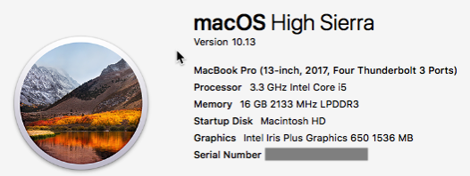

> Esta publicación se publicó originalmente en [el blog de InfluxData](https://www.influxdata.com/blog/zero-awesome-in-5-minutes/) el 20 de octubre de 2017.

Aquí en InfluxData tenemos algo con Time to Awesome™. Tanto es así que lo marcamos. No, en serio, lo hicimos. Y lo decimos en serio. ¡Así que pasemos de Cero a Impresionante!

> Nos enfocamos especialmente en reducir el tiempo para lo increíble, realmente nos preocupamos por ayudar a los desarrolladores y las empresas a obtener resultados más rápido con menos complejidad y menos código.

¡Eso es directamente de la sección Acerca de de nuestro sitio web y lo decimos en serio! Pero por si acaso, decidí probarlo (otra vez). De hecho, escribí una publicación de blog completa sobre lo fácil que fue configurar InfluxDB hace un tiempo, pero pensé que lo haría de nuevo, solo por diversión. ¡Esta vez, pensé en proporcionar una prueba de lo fácil que es y lo rápido!

## La puesta en marcha

Tengo mi fiel MacBook Pro en el que hago casi todo, así que lo voy a instalar. Esto es con lo que estoy trabajando:



Instalé y configuré InfluxDB, Chronograf, Telegraf y Kapacitor, y configuré un panel de monitoreo rápido del sistema para realizar un seguimiento de algunas estadísticas del sistema, todo en menos de 5 minutos.

## Aquí está la prueba

https://youtu.be/DsVRTI2IgMo

## Así es como lo hice

```bash
Davids-MacBook-Pro:~ davidgs$ brew install influxdb
 ==> Downloading https://homebrew.bintray.com/bottles/influxdb-1.3.6.high_sierra.bottle.tar.gz Already downloaded: /Users/davidgs/Library/Caches/Homebrew/influxdb-1.3.6.high_sierra.bottle.tar.gz
 ==> Pouring influxdb-1.3.6.high_sierra.bottle.tar.gz
 ==> Caveats To have launchd start influxdb now and restart at login: brew services start influxdb Or, if you don't want/need a background service you can just run: influxd -config /usr/local/etc/influxdb.conf
 ==> Summary ???? /usr/local/Cellar/influxdb/1.3.6: 9 files, 56.4MB
Davids-MacBook-Pro:~ davidgs$ brew install telegraf
 ==> Downloading https://homebrew.bintray.com/bottles/telegraf-1.4.2.high_sierra.bottle.tar.gz Already downloaded: /Users/davidgs/Library/Caches/Homebrew/telegraf-1.4.2.high_sierra.bottle.tar.gz
 ==> Pouring telegraf-1.4.2.high_sierra.bottle.tar.gz
 ==> Caveats To have launchd start telegraf now and restart at login: brew services start telegraf Or, if you don't want/need a background service you can just run: telegraf -config /usr/local/etc/telegraf.conf
 ==> Summary ???? /usr/local/Cellar/telegraf/1.4.2: 8 files, 43.2MB
Davids-MacBook-Pro:~ davidgs$ brew install chronograf
 ==> Installing dependencies for chronograf: kapacitor
 ==> Installing chronograf dependency: kapacitor
 ==> Downloading https://homebrew.bintray.com/bottles/kapacitor-1.3.3.high_sierra.bottle.1.tar.gz Already downloaded: /Users/davidgs/Library/Caches/Homebrew/kapacitor-1.3.3.high_sierra.bottle.1.tar.gz
 ==> Pouring kapacitor-1.3.3.high_sierra.bottle.1.tar.gz
 ==> Caveats To have launchd start kapacitor now and restart at login: brew services start kapacitor Or, if you don't want/need a background service you can just run: kapacitord -config /usr/local/etc/kapacitor.conf
 ==> Summary ???? /usr/local/Cellar/kapacitor/1.3.3: 6 files, 79.0MB
 ==> Installing chronograf
 ==> Downloading https://homebrew.bintray.com/bottles/chronograf-1.3.9.0.high_sierra.bottle.tar.gz Already downloaded: /Users/davidgs/Library/Caches/Homebrew/chronograf-1.3.9.0.high_sierra.bottle.tar.gz
 ==> Pouring chronograf-1.3.9.0.high_sierra.bottle.tar.gz
 ==> Caveats To have launchd start chronograf now and restart at login: brew services start chronograf Or, if you don't want/need a background service you can just run: chronograf
 ==> Summary ???? /usr/local/Cellar/chronograf/1.3.9.0: 4 files, 21.2MB
Davids-MacBook-Pro:~ davidgs$ brew services start influxdb
 ==> Successfully started `influxdb` (label: homebrew.mxcl.influxdb)
Davids-MacBook-Pro:~ davidgs$ brew services start telegraf
 ==> Successfully started `telegraf` (label: homebrew.mxcl.telegraf)
Davids-MacBook-Pro:~ davidgs$ brew services start kapacitor
 ==> Successfully started `kapacitor` (label: homebrew.mxcl.kapacitor)
Davids-MacBook-Pro:~ davidgs$ brew services start chronograf
 ==> Successfully started `chronograf` (label: homebrew.mxcl.chronograf)
Davids-MacBook-Pro:~ davidgs$
```

¡Eso es todo! Un total de 7 comandos. 3 para instalar toda la pila TICK (porque Chronograf depende de Kapacitor, por lo que se instala automáticamente) y 4 para iniciar todos los servicios y asegurarse de que se inicien en los reinicios.

¡Simplemente no hay nada más simple que eso! ¡Agregue la pequeña cantidad de clics para crear el tablero y tendrá un Time to Awesome™ increíblemente corto!
