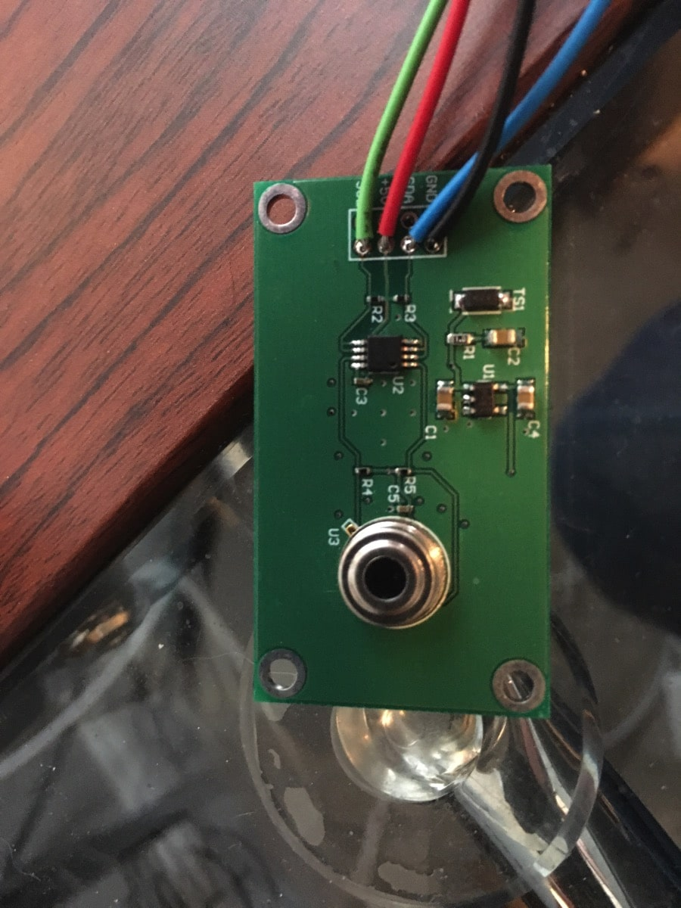
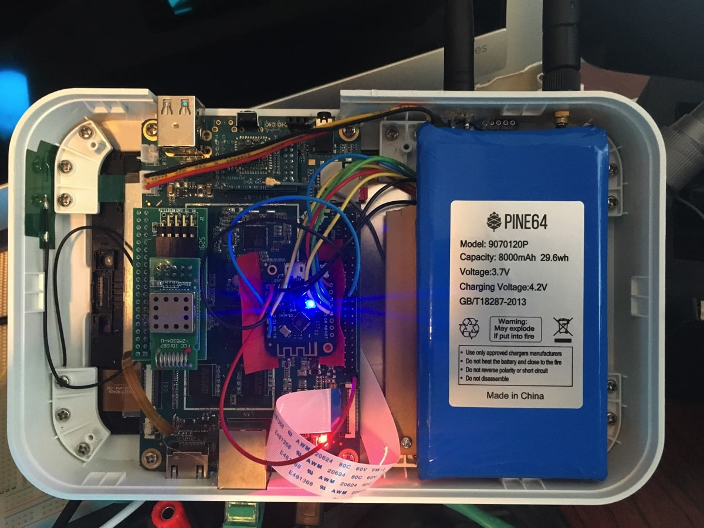
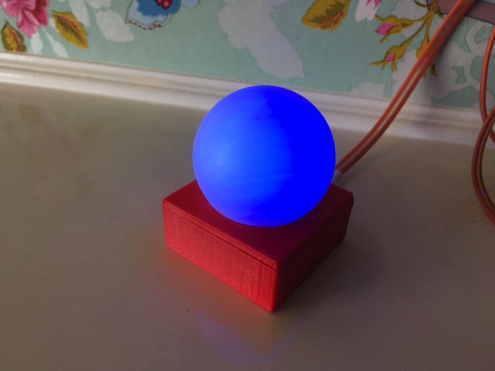
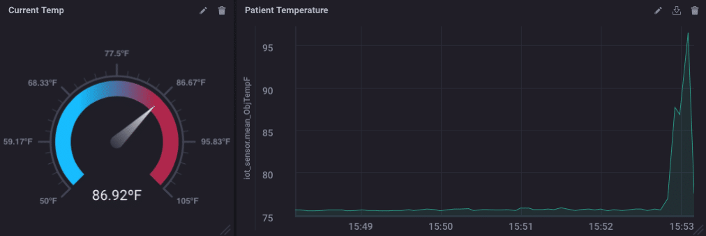
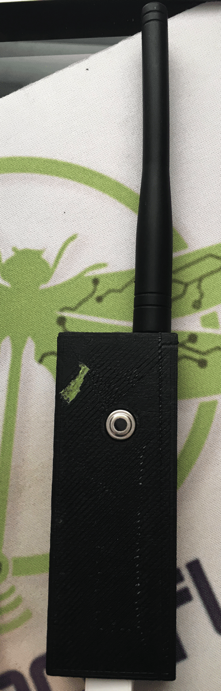

> **This is my first time using ChatGPT to do translations. Please let me know if they are better (or worse) than the Google Translate versions in other posts**

> This post was originally posted on the [InfluxData Blog](https://www.influxdata.com/blog/honey-i-instrumented-the-kids-with-influxdb/).

Parenting is hard. It’s even harder when your kids are sick. But kids are germ factories, and no matter what you do, they get sick. And then you have to touch them and get the germs on you. And then you get sick and then it all goes to hell. But what if you didn’t have to touch them when they got sick? Ahh, now that would be something!

I know, you’re wondering why I’m writing about this on the InfluxData blog, but stick with me here and follow along. It all connects. First, the background.

## Background Story

Our best friends live about 3 or 4 blocks away, and they have, among others, twin girls that are about the same age as my girl. Thankfully they are also best friends. But this past weekend first one, and then the other twin came down with the flu. The real flu. They got tested and everything. I had the flu earlier this year, and it’s really really not good.

One isn’t very sick, but the other one ended up with a temperature of 103ºF (which, for you metric-folks, is pretty darned high!). Their mom wanted to be able to keep close tabs on her temperature, but … well, she didn’t want to have to go in there and, you know, touch her.

## I'm Going to Science the $&^* Out of This

If you’ve been following along these past few months, see [here](https://w2.influxdata.com/blog/sending-alerts-from-kapacitor-via-mqtt/), and [here](https://w2.influxdata.com/blog/monitoring-wireless-interfaces/), for starters, you’ll know that I’ve been building out an IoT Demo with a bunch of sensors, and an IoT Gateway for data collection. Then, a month or so ago, I got invited to give a talk at the [Joint ICTP-IAEA School on LoRa Enabled Radiation and Environmental Monitoring Sensors](http://indico.ictp.it/event/8298/) at the Adbus Salam International Centre for Theoretical Physics in Trieste, Italy. Long story short, it’s all about using the LoRA network for remote monitoring, so I went out and bought a couple of LoRA boards. I got the [Adafruit RFM96W](https://www.adafruit.com/product/3073) boards because they looked easy to deal with. I had a couple of Wemos D1 Mini Pro boards sitting around (I’m not linking to them because they are really bad. The WiFi on them does not work, at all, but that made them perfect for this experiment).

These little boards sport a 433MHz Radio that gets pretty amazing range. I tested it over several miles and still got good reception. Some of you see where this is going already, I’m sure.

I also had some little boards lying around from way back in my Sun SPOT days. These are based on the Melexis MLX9016 remote temperature sensors. I think we made these in 2006 or 2007 maybe.

They are really very accurate with non-contact temperature reading, so I hooked it to a Wemos D1 Mini Pro, and hooked the LoRA board to the same Wemos device, and I had a long-range remote temperature sensor!

I then hooked the other LoRA radio to another Wemos D1, and crammed that whole mess into my Gateway box:

So now I have 2 antennas sticking out—one for LoRA and one for WiFi and BLE—- the box also has a ZWave receiver in it, so it’s a multi-protocol IoT data gathering box.

I have the internal Wemos device just printing out the readings it gets over the network to its serial port, and I’m using the Telegraf ‘exec’ plugin to just read that serial port and stuff the data into InfluxDB.

I then set up some Kapacitor Alerts to change the color on a GlowOrb.

The GlowOrb is a nifty little thing using a Wemos D1 mini -—NOT the mini pro!! -—and a try-color LED Shield so that I can send alerts to an MQTT broker and the color changes. I just calibrated it to temperature readings from the remote thermometer!

## Deploying the Hands-Off Parenting Solution

My friends are not low-tech, but they’re also not techno-nerds like me, so I had to keep things simple. I took over the remote temperature reader and the GlowOrb. That’s it. The GlowOrb connects to their home WiFi and the temperature monitor uses LoRA to send the reading back to me at my house, where InfluxDB records the data, and Kapacitor processes the alerts for the temperature.

I created a simple dashboard with the temperature plotted on a graph and a gauge showing the current temperature:

No, I’m not showing you actual patient data. That would be a HIPPA violation! What I discovered rather quickly was that the remote temp reader, if it wasn’t within about 6” of the kid, was off by about 10º. So I adjusted the alerts to compensate. And it worked perfectly.

Now my friend can see the kid’s temperature immediately and see the trend over time. She can also put the GlowOrb on her nightstand, or wherever, and have a constant visual cue as to the kid’s temperature.

And before I forget, here’s what the temperature-monitoring device looks like:

## Conclusions

I’m not sure it’s an altogether practical solution to monitoring your kids who have the flu, unless, like me, you’re a complete geek and just happen to have all the proper gear just lying around. I also don’t know anyone else that might just have all this gear ‘lying around’ but if you do, please get in touch. We may have been separated at birth. Plus my wife would love to know that I’m not the only person ‘like this’ on the planet.

What this experiment has shown me, however, is that there is literally no end to the number of things I can find to monitor using InfluxDB. I’d love to hear what you’re doing to monitor your world with InfluxDB! If you’re doing something cool, please tweet me about it [@davidgsIoT](https://twitter.com/davidgsIoT) and ~~we’ll send you some cool InfluxDB socks~~!