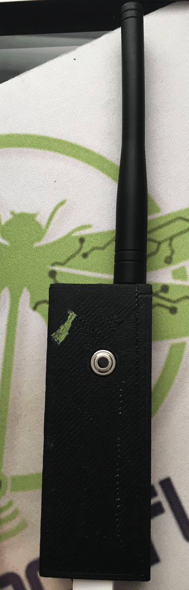

> **Esta es la primera vez que uso ChatGPT para hacer traducciones. Por favor, hágamelo saber si son mejores (o peores) que las versiones de Google Translate en otras publicaciones.**

> Esta publicación fue originalmente publicada en el [Blog de InfluxData](https://www.influxdata.com/blog/honey-i-instrumented-the-kids-with-influxdb/).

Ser padre es difícil. Es aún más difícil cuando tus hijos están enfermos. Pero los niños son fábricas de gérmenes, y no importa lo que hagas, se enferman. Y entonces tienes que tocarlos y te llenas de gérmenes. Y luego te enfermas y todo se va al diablo. Pero ¿qué tal si no tuvieras que tocarlos cuando se enferman? ¡Ah, eso sí sería algo!

Lo sé, te estás preguntando por qué estoy escribiendo sobre esto en el blog de InfluxData, pero sigue conmigo aquí y sigue el hilo. Todo se conecta. Primero, el trasfondo.

## Historia de fondo

Nuestros mejores amigos viven a unas 3 o 4 cuadras de distancia, y tienen, entre otros, dos gemelas que tienen la misma edad que mi hija. Afortunadamente, también son mejores amigas. Pero el pasado fin de semana, primero una y luego la otra gemela contrajeron la gripe. La verdadera gripe. Se hicieron pruebas y todo. Yo tuve la gripe a principios de este año, y es realmente, realmente mala.

Una de ellas no está muy enferma, pero la otra acabó con una temperatura de 103ºF (¡que para ustedes, los del sistema métrico, es bastante alta!). Su madre quería poder controlar de cerca su temperatura, pero... bueno, no quería tener que entrar en la habitación y, ya sabes, tocarla.

## Voy a ponerle Ciencia a esto

Si has estado siguiendo estas últimas semanas, verás [aquí](https://w2.influxdata.com/blog/sending-alerts-from-kapacitor-via-mqtt/), y [aquí](https://w2.influxdata.com/blog/monitoring-wireless-interfaces/), para empezar, sabrás que he estado construyendo una Demo de IoT con un montón de sensores, y un Gateway de IoT para la recogida de datos. Luego, hace un mes o así, me invitaron a dar una charla en la [Escuela conjunta ICTP-IAEA sobre sensores de radiación y monitorización ambiental habilitados para LoRa](http://indico.ictp.it/event/8298/) en el Centro Internacional Abdus Salam de Física Teórica en Trieste, Italia. En resumen, todo se trata de usar la red LoRA para la monitorización remota, así que salí y compré un par de placas LoRA. Conseguí las placas [Adafruit RFM96W](https://www.adafruit.com/product/3073) porque parecían fáciles de manejar. Tenía un par de placas Wemos D1 Mini Pro por ahí (no las voy a enlazar porque son realmente malas. El WiFi en ellas no funciona, en absoluto, pero eso las hizo perfectas para este experimento).

Estas pequeñas placas tienen un radio de 433MHz

 que tiene un alcance bastante impresionante. Lo probé a varias millas y todavía tenía buena recepción. Algunos de ustedes ya saben dónde va esto, estoy seguro.

También tenía unas pequeñas placas por ahí desde mis días de Sun SPOT. Estas están basadas en los sensores de temperatura remota Melexis MLX9016. Creo que las hicimos en 2006 o 2007, tal vez.

Son realmente muy precisas con la lectura de temperatura sin contacto, así que lo conecté a un Wemos D1 Mini Pro, y conecté la placa LoRA al mismo dispositivo Wemos, ¡y tenía un sensor de temperatura remoto de largo alcance!

Luego conecté el otro radio LoRA a otro Wemos D1, y metí todo ese lío en mi caja de Gateway:

Así que ahora tengo 2 antenas sobresaliendo, una para LoRA y una para WiFi y BLE, la caja también tiene un receptor ZWave en ella, así que es una caja de recopilación de datos IoT multi-protocolo.

Tengo el dispositivo interno Wemos simplemente imprimiendo las lecturas que recibe por la red en su puerto serie, y estoy usando el plugin 'exec' de Telegraf para simplemente leer ese puerto serie y meter los datos en InfluxDB.

Luego configuré algunas Alertas de Kapacitor para cambiar el color en un GlowOrb.

El GlowOrb es una pequeña cosa ingeniosa que utiliza un Wemos D1 mini, ¡NO el mini pro! - y un Escudo LED de tres colores para que pueda enviar alertas a un broker MQTT y cambiar de color. ¡Lo acabo de calibrar con las lecturas de temperatura del termómetro remoto!

## Implementando la Solución para Padres sin Contacto

Mis amigos no son de baja tecnología, pero tampoco son nerds tecnológicos como yo, así que tuve que mantener las cosas simples. Me llevé el lector de temperatura remota y el GlowOrb. Eso es todo. El GlowOrb se conecta a su WiFi doméstico y el monitor de temperatura usa LoRA para enviar la lectura de vuelta a mí en mi casa, donde InfluxDB registra los datos, y Kapacitor procesa las alertas de temperatura.

Creé un panel de control simple con la temperatura trazada en un gráfico y un medidor que muestra la temperatura actual:

No, no te voy a mostrar datos reales del paciente. ¡Eso sería una violación de la HIPAA! Lo que descubrí bastante rápido fue que el lector de temperatura remota, si no estaba a unos 15 centímetros del niño, estaba desviado en unos 10º. Así que ajusté las alertas para compensar. Y funcionó perfectamente.

Ahora mi amiga puede ver la temperatura del niño inmediatamente y ver la tendencia a lo largo del tiempo. También puede poner el GlowOrb en su mesita de noche, o donde sea, y tener una señal visual constante de la temperatura del niño.

Y antes de que me olvide, aquí está cómo se ve el dispositivo de monitoreo de temperatura:

## Conclusiones

No estoy seguro de que sea una sol

ución totalmente práctica para monitorear a tus hijos que tienen gripe, a menos que, como yo, seas un geek total y tengas todo el equipo apropiado tirado por ahí. Tampoco conozco a nadie más que pueda tener todo este equipo 'tirado por ahí', pero si lo tienes, por favor ponte en contacto. Es posible que hayamos sido separados al nacer. Además, a mi esposa le encantaría saber que no soy la única persona 'así' en el planeta.

Lo que este experimento me ha demostrado, sin embargo, es que literalmente no hay fin para la cantidad de cosas que puedo encontrar para monitorear usando InfluxDB. ¡Me encantaría saber lo que estás haciendo para monitorear tu mundo con InfluxDB! Si estás haciendo algo genial, por favor tuiteame al respecto [@davidgsIoT](https://twitter.com/davidgsIoT) y ~~¡te enviaremos unos geniales calcetines de InfluxDB~~!