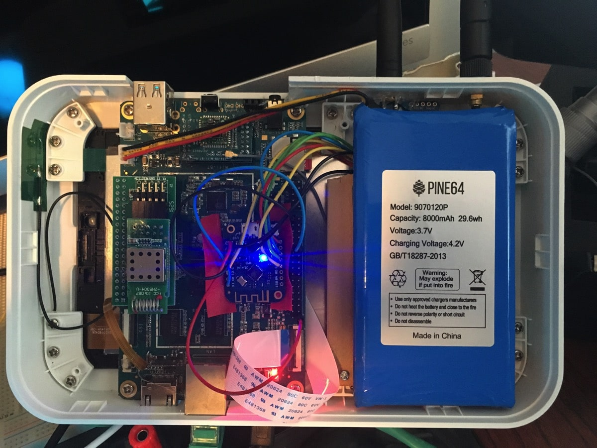

> **C'est la première fois que j'utilise ChatGPT pour faire des traductions. Veuillez me dire si elles sont meilleures (ou pires) que les versions de Google Translate dans d'autres publications.**

> Cet article a été initialement posté sur le [Blog InfluxData](https://www.influxdata.com/blog/honey-i-instrumented-the-kids-with-influxdb/).

Être parent est difficile. C'est encore plus difficile quand vos enfants sont malades. Mais les enfants sont des fabriques à germes, et quoi que vous fassiez, ils tombent malades. Ensuite, vous devez les toucher et les germes se déposent sur vous. Et puis vous tombez malade et tout va à vau-l'eau. Mais et si vous n'aviez pas à les toucher quand ils sont malades ? Ah, ce serait quelque chose !

Je sais, vous vous demandez pourquoi j'écris à ce sujet sur le blog d'InfluxData, mais suivez-moi ici et vous comprendrez. Tout d'abord, le contexte.

## Histoire de fond

Nos meilleurs amis vivent à environ 3 ou 4 pâtés de maisons de chez nous, et ils ont, entre autres, des jumelles qui ont à peu près le même âge que ma fille. Heureusement, elles sont aussi les meilleures amies. Mais ce dernier week-end, la première, puis l'autre jumelle sont tombées malades avec la grippe. La vraie grippe. Elles ont été testées et tout. J'ai eu la grippe plus tôt cette année, et c'est vraiment, vraiment pas bon.

L'une n'est pas très malade, mais l'autre a eu une température de 103ºF (ce qui, pour vous les utilisateurs du système métrique, est assez élevé !). Leur mère voulait pouvoir surveiller de près sa température, mais... elle ne voulait pas avoir à aller là-bas et, vous savez, la toucher.

## Je vais faire de la science à fond

Si vous avez suivi ces derniers mois, voyez [ici](https://w2.influxdata.com/blog/sending-alerts-from-kapacitor-via-mqtt/), et [ici](https://w2.influxdata.com/blog/monitoring-wireless-interfaces/), pour commencer, vous saurez que j'ai construit une démo IoT avec une multitude de capteurs, et une passerelle IoT pour la collecte de données. Puis, il y a un mois ou deux, j'ai été invité à donner une conférence à la [Joint ICTP-IAEA School on LoRa Enabled Radiation and Environmental Monitoring Sensors](http://indico.ictp.it/event/8298/) à l'Adbus Salam International Centre for Theoretical Physics à Trieste, en Italie. Pour faire court, il s'agit d'utiliser le réseau LoRA pour une surveillance à distance, alors j'ai acheté quelques cartes LoRA. J'ai pris les cartes [Adafruit RFM96W](https://www.adafruit.com/product/3073) parce qu'elles me semblaient faciles à gérer. J'avais quelques cartes Wemos D1 Mini Pro qui traînaient (je ne vais pas vous donner le lien parce qu'elles sont vraiment mauvaises. Le WiFi sur ces appareils ne fonctionne pas du tout, mais cela les

 rendait parfaites pour cette expérience).

Ces petites cartes sont équipées d'une radio de 433MHz qui a une portée assez impressionnante. Je l'ai testée sur plusieurs miles et j'ai toujours eu une bonne réception. Certains d'entre vous voient déjà où cela va, j'en suis sûr.

J'avais aussi quelques petites cartes qui traînaient depuis mes jours de Sun SPOT. Ces dernières sont basées sur les capteurs de température à distance Melexis MLX9016. Je pense que nous les avons fabriquées en 2006 ou 2007 peut-être.

Elles sont vraiment très précises pour la lecture de la température sans contact, alors je l'ai connectée à un Wemos D1 Mini Pro, et j'ai connecté la carte LoRA au même appareil Wemos, et j'avais un capteur de température à distance à longue portée !

J'ai ensuite connecté l'autre radio LoRA à un autre Wemos D1, et j'ai entassé tout ce bazar dans ma boîte de passerelle :

J'ai maintenant 2 antennes qui dépassent, une pour LoRA et une pour le WiFi et le BLE. La boîte a aussi un récepteur ZWave dedans, donc c'est une boîte de collecte de données IoT multi-protocole.

J'ai l'appareil Wemos interne qui imprime simplement les lectures qu'il reçoit sur le réseau sur son port série, et j'utilise le plugin 'exec' de Telegraf pour lire ce port série et insérer les données dans InfluxDB.

J'ai ensuite configuré quelques alertes Kapacitor pour changer la couleur d'une GlowOrb.

La GlowOrb est un petit gadget sympa qui utilise un Wemos D1 mini - PAS le mini pro ! - et un bouclier LED tri-couleur afin que je puisse envoyer des alertes à un courtier MQTT et que la couleur change. Je viens de le calibrer aux lectures de température du thermomètre à distance !

## Déploiement de la solution parentale sans contact

Mes amis ne sont pas des technophobes, mais ils ne sont pas non plus des techno-nerds comme moi, donc j'ai dû simplifier les choses. J'ai pris en charge le lecteur de température à distance et la GlowOrb. C'est tout. La GlowOrb se connecte à leur WiFi à domicile et le moniteur de température utilise LoRA pour envoyer la lecture à mon domicile, où InfluxDB enregistre les données, et Kapacitor traite les alertes pour la température.

J'ai créé un tableau de bord simple avec la température tracée sur un graphique et un indicateur montrant la température actuelle :

Non, je ne vous montre pas de vraies données de patient. Ce serait une violation de la HIPPA ! Ce que j'ai découvert assez rapidement, c'est que le lecteur de température à distance, s'il n'était pas à environ 6” de l'enfant, était décalé d'environ 10º. J'ai donc ajusté les alertes pour compenser. Et ça a fonctionné parfaitement.

Maintenant, mon amie peut voir immédi

atement la température de l'enfant et observer la tendance au fil du temps. Elle peut aussi mettre la GlowOrb sur sa table de nuit, ou ailleurs, et avoir un signal visuel constant de la température de l'enfant.

Et avant que j'oublie, voici à quoi ressemble le dispositif de surveillance de la température :

## Conclusions

Je ne suis pas sûr que ce soit une solution tout à fait pratique pour surveiller vos enfants qui ont la grippe, à moins, comme moi, que vous soyez un geek complet et que vous ayez tout l'équipement nécessaire juste sous la main. Je ne connais personne d'autre qui pourrait juste avoir tout cet équipement 'traînant autour' mais si vous le faites, veuillez me contacter. Nous avons peut-être été séparés à la naissance. De plus, ma femme aimerait savoir que je ne suis pas la seule personne 'comme ça' sur la planète.

Cependant, cette expérience m'a montré qu'il n'y a littéralement aucune fin au nombre de choses que je peux trouver à surveiller avec InfluxDB. J'adorerais savoir ce que vous faites pour surveiller votre monde avec InfluxDB ! Si vous faites quelque chose de cool, veuillez m'envoyer un tweet à ce sujet [@davidgsIoT](https://twitter.com/davidgsIoT) et ~~nous vous enverrons des chaussettes InfluxDB cool~~ !