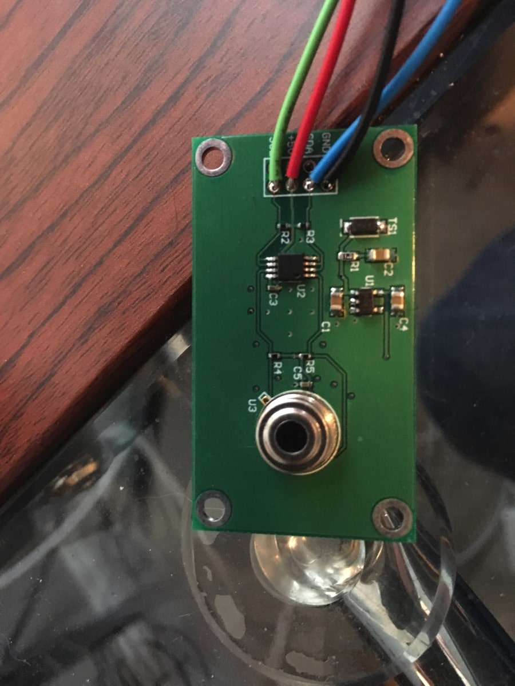
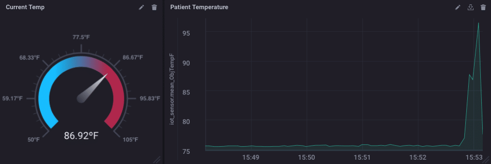

> **Dit is de eerste keer dat ik ChatGPT gebruik om vertalingen te doen. Laat het me weten als ze beter (of slechter) zijn dan de Google Translate versies in andere berichten.**

> Deze post is oorspronkelijk gepost op de [InfluxData Blog](https://www.influxdata.com/blog/honey-i-instrumented-the-kids-with-influxdb/).

Ouderschap is moeilijk. Het is nog moeilijker als je kinderen ziek zijn. Maar kinderen zijn kiemenfabrieken, en wat je ook doet, ze worden ziek. En dan moet je ze aanraken en de kiemen op je krijgen. En dan word je ziek en dan gaat het allemaal naar de hel. Maar wat als je ze niet hoefde aan te raken als ze ziek werden? Ah, dat zou iets zijn!

Ik weet het, je vraagt je af waarom ik hierover schrijf op de InfluxData blog, maar blijf bij me en volg mee. Het hangt allemaal samen. Eerst de achtergrond.

## Achtergrondverhaal

Onze beste vrienden wonen ongeveer 3 of 4 blokken verderop, en ze hebben, onder anderen, tweelingmeisjes die ongeveer dezelfde leeftijd hebben als mijn meisje. Gelukkig zijn zij ook beste vrienden. Maar afgelopen weekend kreeg eerst de ene, en toen de andere tweeling griep. De echte griep. Ze werden getest en alles. Ik had eerder dit jaar griep, en het is echt echt niet goed.

Eén is niet erg ziek, maar de andere kreeg een temperatuur van 103ºF (wat, voor jullie metriek-volk, behoorlijk hoog is!). Hun moeder wilde haar temperatuur nauwlettend in de gaten houden, maar ... nou ja, ze wilde niet naar binnen gaan en, je weet wel, haar aanraken.

## Ik Ga Hieruit Wetenschap Halen

Als je de afgelopen maanden hebt gevolgd, zie [hier](https://w2.influxdata.com/blog/sending-alerts-from-kapacitor-via-mqtt/), en [hier](https://w2.influxdata.com/blog/monitoring-wireless-interfaces/), voor starters, dan weet je dat ik een IoT Demo heb gebouwd met een heleboel sensoren, en een IoT Gateway voor datacollectie. Een maand of zo geleden werd ik uitgenodigd om een presentatie te geven op de [Joint ICTP-IAEA School on LoRa Enabled Radiation and Environmental Monitoring Sensors](http://indico.ictp.it/event/8298/) in het Adbus Salam International Centre for Theoretical Physics in Triëst, Italië. Het komt erop neer dat het allemaal draait om het gebruik van het LoRA-netwerk voor remote monitoring, dus ik ging eropuit en kocht een paar LoRA-borden. Ik heb de [Adafruit RFM96W](https://www.adafruit.com/product/3073) borden gekozen omdat ze er makkelijk uit zagen om mee om te gaan. Ik had een paar Wemos D1 Mini Pro borden liggen (ik link er niet naar omdat ze echt slecht zijn.

 De WiFi op hen werkt helemaal niet, maar dat maakte hen perfect voor dit experiment).

Deze kleine bordjes hebben een 433MHz Radio die een behoorlijk indrukwekkend bereik heeft. Ik heb het getest over enkele mijlen en kreeg nog steeds een goede ontvangst. Sommigen van jullie zien al waar dit naartoe gaat, denk ik.

Ik had ook wat kleine bordjes liggen van lang geleden in mijn Sun SPOT dagen. Deze zijn gebaseerd op de Melexis MLX9016 remote temperatuursensoren. Ik denk dat we deze in 2006 of 2007 misschien hebben gemaakt.

Ze zijn echt heel nauwkeurig met het meten van de temperatuur zonder contact, dus ik koppelde het aan een Wemos D1 Mini Pro, en koppelde het LoRA-bord aan hetzelfde Wemos-apparaat, en ik had een langeafstands remote temperatuursensor!

Ik koppelde de andere LoRA-radio vervolgens aan een andere Wemos D1, en propte die hele zooi in mijn Gateway box:

Dus nu heb ik 2 antennes uitsteken - één voor LoRA en één voor WiFi en BLE - de box heeft ook een ZWave-ontvanger erin, dus het is een multi-protocol IoT data gathering box.

Ik heb het interne Wemos-apparaat gewoon de metingen die het over het netwerk krijgt naar zijn seriële poort laten printen, en ik gebruik de Telegraf 'exec' plugin om die seriële poort te lezen en de data in InfluxDB te stoppen.

Ik heb vervolgens wat Kapacitor Alerts ingesteld om de kleur op een GlowOrb te veranderen.

De GlowOrb is een handig klein ding dat een Wemos D1 mini gebruikt - NIET de mini pro!! - en een try-color LED Shield zodat ik alerts naar een MQTT broker kan sturen en de kleur verandert. Ik heb het gewoon gekalibreerd naar temperatuurmetingen van de remote thermometer!

## Implementatie van de Hands-Off Ouderschapsoplossing

Mijn vrienden zijn niet low-tech, maar ze zijn ook geen techno-nerds zoals ik, dus ik moest het simpel houden. Ik nam de remote temperatuurmeter en de GlowOrb over. Dat is het. De GlowOrb maakt verbinding met hun thuis WiFi en de temperatuurmonitor gebruikt LoRA om de meting terug naar mij te sturen bij mijn huis, waar InfluxDB de data registreert, en Kapacitor de alerts voor de temperatuur verwerkt.

Ik heb een eenvoudig dashboard gemaakt met de temperatuur uitgezet op een grafiek en een meter die de huidige temperatuur laat zien:

Nee, ik laat je geen echte patiëntgegevens zien. Dat zou een schending van de HIPPA zijn! Wat ik vrij snel ontdekte was dat de remote temp reader, als hij niet binnen ongeveer 6" van het kind was, ongeveer 10º afweek. Dus ik heb de alerts aangepast om te compenseren. En het werkte perfect.

Nu kan mijn vriend de temper

atuur van het kind onmiddellijk zien en de trend over de tijd zien. Ze kan ook de GlowOrb op haar nachtkastje zetten, of waar dan ook, en een constante visuele aanwijzing hebben van de temperatuur van het kind.

En voordat ik het vergeet, zo ziet het temperatuurmonitorapparaat eruit:

## Conclusies

Ik ben er niet zeker van dat het een volledig praktische oplossing is om je kinderen te monitoren die de griep hebben, tenzij, zoals ik, je een complete geek bent en toevallig al het juiste materiaal gewoon hebt liggen. Ik ken ook niemand anders die misschien al dit materiaal 'rondslingert' maar als dat zo is, neem dan alsjeblieft contact met me op. We kunnen bij de geboorte gescheiden zijn. Plus mijn vrouw zou graag willen weten dat ik niet de enige persoon 'zoals dit' op de planeet ben.

Wat dit experiment mij echter heeft laten zien, is dat er letterlijk geen einde is aan het aantal dingen dat ik kan vinden om te monitoren met InfluxDB. Ik hoor graag wat jij doet om jouw wereld te monitoren met InfluxDB! Als je iets cools doet, tweet me erover [@davidgsIoT](https://twitter.com/davidgsIoT) en ~~we sturen je wat coole InfluxDB-sokken~~!