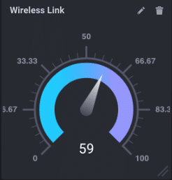
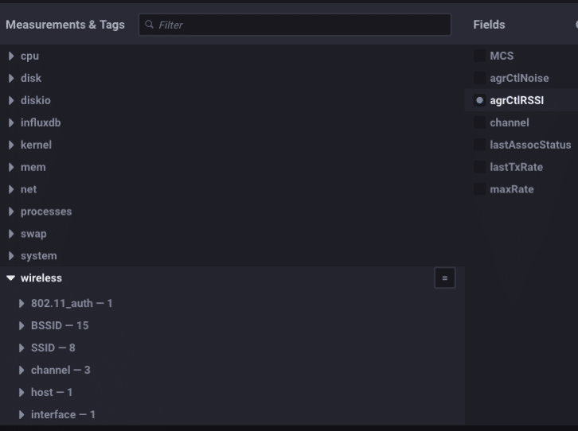
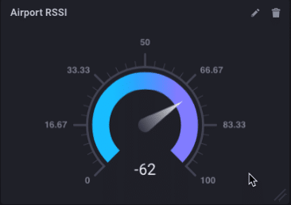

> Dieser Beitrag wurde ursprünglich im [InfluxData Blog](https://www.influxdata.com/blog/monitoring-wireless-interfaces/) veröffentlicht.

Wenn Sie meine letzten Posts verfolgt haben, werden Sie sehen, dass ich mich hüfttief mit Routern und drahtlosen Sachen beschäftigt habe. Ich baue mit InfluxDB eine größere, kompliziertere „Referenzarchitektur“ für das IoT-Monitoring auf und verwende dazu alle möglichen Boxen. Ich verwende meine Pine-64-Box wieder (siehe hier) und wollte die Statistiken der drahtlosen Schnittstelle überwachen können. Es stellte sich heraus, dass es dafür kein Telegraf-Plugin gab! WAS??!?! Also habe ich einen geschrieben.

Wenn Sie jemals ein `cat /proc/net/wireless` gemacht haben, werden Sie wissen, dass, obwohl die Ausgabe unkompliziert und hilfreich ist, jemand entschieden hat, dass ein zweizeiliger Header eine großartige Idee sei. Es war nicht.

```bash
ubuntu@pine64:~$ cat /proc/net/wireless
Inter-| sta-| Quality | Discarded packets | Missed | WE
 face | tus | link level noise | nwid crypt frag retry misc | beacon | 22
 wlan0: 0000 0. -256. -256. 0 0 0 0 0 0
 wlan1: 0000 42. -73. -256. 0 0 0 0 0 0
ubuntu@pine64:~$
```

Ich meine, es sieht gut aus und so, aber es war wirklich nicht dazu gedacht, einfach in etwas Bedeutungsvolles zerlegt zu werden. Wie auch immer, da ich damit begann, ein weiteres Telegraf-Plugin zu schreiben, war das Analysieren genau das, was ich tun musste. Dies sind die Spaghetti, die ich schreiben musste, um diesen Header zu analysieren und zu etwas zusammenzufügen, das sinnvoll in InfluxDB:x gespeichert werden könnte

```go
func loadWirelessTable(table []byte, dumpZeros bool) (map[string]interface{}, map[string]string, error) {
	metrics := map[string]interface{}{}
	tags := map[string]string{}
	myLines := strings.Split(string(table), "\n")
	for x := 0; x < len(myLines)-1; x++ {
		f := strings.SplitN(myLines[x], ":", 2)
		f[0] = strings.Trim(f[0], " ")
		f[1] = strings.Trim(f[1], " ")
		if f[0] == "BSSID" {
			tags[strings.Replace(strings.Trim(f[0], " "), " ", "_", -1)] = strings.Replace(strings.Trim(string(f[1]), " "), " ", "_", -1)
			continue
		}
		n, err := strconv.ParseInt(strings.Trim(f[1], " "), 10, 64)
		if err != nil {
			tags[strings.Replace(strings.Trim(f[0], " "), " ", "_", -1)] = strings.Replace(strings.Trim(f[1], " "), " ", "_", -1)
			continue
		}
		if n == 0 {
			if dumpZeros {
				continue
			}
		}
		metrics[strings.Trim(f[0], " ")] = n

	}
	tags["interface"] = "airport"
	return metrics, tags, nil

}
```

All das, damit wir das sehen können:


im Chronografen! Hübsch! Beachten Sie, wie ich den mehrzeiligen Header in unterschiedliche Werte für „quality_level“ usw. umgewandelt und sie InfluxDB-freundlich gemacht habe, indem ich Leerzeichen durch Unterstriche usw. ersetzt habe. Wir können jetzt alle verschiedenen Aspekte unserer drahtlosen Schnittstelle(n) überwachen! Also, da ich die neueste Version von Chronograf verwende:


Google ChromeScreenSnapz001

Ich habe ein handliches Messgerät mit dem RSSI meiner aktiven WLAN-Schnittstelle! Da dieses neue Plugin (das irgendwann zu einer Version von Telegraf kommt!) auf /proc/net/wireless angewiesen ist, funktioniert es natürlich nur unter Linux.

Aber warten Sie, ich habe Sie alle Mac-Benutzer da draußen nicht vergessen. Nach ziemlich viel Google-Fu fand ich einen ungefähr ähnlichen Weg, um drahtlose Informationen von Mac OS zu erhalten. Es ist vergraben und nicht leicht zugänglich, aber ich habe es für dich ausgegraben. Es formatiert die Ausgabe viel vernünftiger und macht es super einfach, in InfluxDB zu gelangen:

```bash
$ /System/Library/PrivateFrameworks/Apple80211.framework/Versions/Current/Resources/airport -I
     agrCtlRSSI: -63
     agrExtRSSI: 0
    agrCtlNoise: -95
    agrExtNoise: 0
          state: running
        op mode: station
     lastTxRate: 65
        maxRate: 72
lastAssocStatus: 0
    802.11 auth: open
      link auth: wpa2-psk
          BSSID: 36:c3:d2:e3:ed:8e
           SSID: Influx-IoT2
            MCS: 7
        channel: 3
$
```

was den Code erheblich verkürzt, um das nützlich zu machen:

```go
func loadWirelessTable(table []byte, dumpZeros bool) (map[string]interface{}, map[string]string, error) {
	metrics := map[string]interface{}{}
	tags := map[string]string{}
	myLines := strings.Split(string(table), "\n")
	for x := 0; x < len(myLines)-1; x++ {
		f := strings.SplitN(myLines[x], ":", 2)
		f[0] = strings.Trim(f[0], " ")
		f[1] = strings.Trim(f[1], " ")
		if f[0] == "BSSID" {
			tags[strings.Replace(strings.Trim(f[0], " "), " ", "_", -1)] = strings.Replace(strings.Trim(string(f[1]), " "), " ", "_", -1)
			continue
		}
		n, err := strconv.ParseInt(strings.Trim(f[1], " "), 10, 64)
		if err != nil {
			tags[strings.Replace(strings.Trim(f[0], " "), " ", "_", -1)] = strings.Replace(strings.Trim(f[1], " "), " ", "_", -1)
			continue
		}
		if n == 0 {
			if dumpZeros {
				continue
			}
		}
		metrics[strings.Trim(f[0], " ")] = n

	}
	tags["interface"] = "airport"
	return metrics, tags, nil

}
```

viel vernünftiger, meinst du nicht? Es verwandelt all diese Messwerte in nette Tags und Felder:



Und gibt mir ein ähnliches Messgerät auf meinem Mac:



Ziemlich schick!

Jetzt fragen Sie sich wahrscheinlich, warum ich mir all diese Mühe gemacht habe, nur um den RSSI einer drahtlosen Schnittstelle überwachen zu können. Und das ist eine großartige Frage! Sie sehen, in der Welt des IoT werden Sie Gateway-Geräte haben, die Daten über drahtlose Schnittstellen sammeln – Sie wissen schon, um sich mit drahtlosen Sensoren zu verbinden. Daher ist es wichtig, den Zustand und die Aktivität dieser drahtlosen Schnittstellen überwachen zu können. Ich habe den Mac hinzugefügt, nur weil es einfach war und ich es wollte.

Also bleibt gespannt. Ich werde eine Reihe von Blog-Beiträgen zu den Sensoren hinzufügen, die ich mit diesem drahtlosen Gateway-Datensammler verbinde. Es ist eigentlich Teil eines größeren Projekts zum Aufbau einer größeren, stärker auf die Industrie ausgerichteten IoT-Demoplattform.

> **Hinweis:** Während mein Pull-Request darauf wartete, ausgewertet zu werden, beschloss jemand, meinen Code für das Plug-in für drahtlose Linux-Überwachung zu stehlen und diesen als separaten PR einzureichen. Diese PR wurde akzeptiert und mit Telegraf verschmolzen. Wenn Sie also Telegraf 1.3.0 oder höher verwenden, können Sie das Plug-in "Wireless" verwenden, um Ihre drahtlosen Schnittstellen zu überwachen. Sie müssen nur wissen, wie es dorthin gelangt ist.

> **Anmerkung 2:** Ich wurde nach dem Code für das Plug-in für die drahtlose Mac-Überwachung gefragt. Es schmachtete *4 Jahre* lang als PR für Telegraf, ohne auch nur angeschaut zu werden. Im Frühjahr 2022 kamen sie endlich dazu, es auszuwerten. Ich habe etwa 2 Monate mit den Betreuern zusammengearbeitet, während sie um kleinere Änderungen baten, dann um größere Änderungen und dann wiederholt ihre Meinung zu den großen Änderungen änderten, bis ich schließlich aufgab. Wenn meine Geduld mit ihnen zurückkehrt, werde ich es vielleicht noch einmal versuchen.
