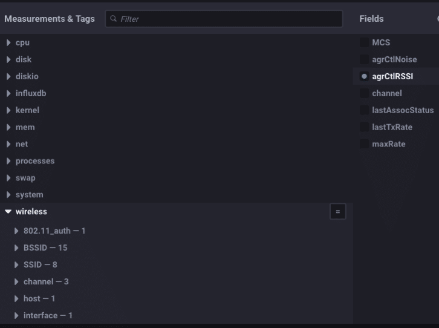

> This post was originally posted on the [InfluxData Blog](https://www.influxdata.com/blog/monitoring-wireless-interfaces/).

If you’ve followed my last few posts, you’ll see that I’ve been waist-deep in routers and wireless stuff. I’m building a larger, more complicated ‘reference architecture’ for IoT monitoring with InfluxDB, and to do that, I’m using all sorts of different boxes. I’m re-using my Pine-64 box (see here) and I wanted to be able to monitor the stats of the Wireless interface. Turns out, there was no Telegraf Plugin for that! WHAT??!?! So I wrote one.

If you’ve ever done a `cat /proc/net/wireless` you’ll know that, while the output is straightforward and helpful, someone decided that a 2-line header was a great idea. It wasn’t.

```bash
ubuntu@pine64:~$ cat /proc/net/wireless
Inter-| sta-| Quality | Discarded packets | Missed | WE
 face | tus | link level noise | nwid crypt frag retry misc | beacon | 22
 wlan0: 0000 0. -256. -256. 0 0 0 0 0 0
 wlan1: 0000 42. -73. -256. 0 0 0 0 0 0
ubuntu@pine64:~$
```

I mean, it looks nice and all that, but it really wasn’t meant to be easily parsed into something meaningful. Anyway, since I was embarking on writing another Telegraf plugin, parsing it was exactly what I was going to need to do. This is the spaghetti I had to write to parse that header and put it together into something that would be meaningful to store in InfluxDB:x

```go
func loadWirelessTable(table []byte, dumpZeros bool) (map[string]interface{}, map[string]string, error) {
	metrics := map[string]interface{}{}
	tags := map[string]string{}
	myLines := strings.Split(string(table), "\n")
	for x := 0; x < len(myLines)-1; x++ {
		f := strings.SplitN(myLines[x], ":", 2)
		f[0] = strings.Trim(f[0], " ")
		f[1] = strings.Trim(f[1], " ")
		if f[0] == "BSSID" {
			tags[strings.Replace(strings.Trim(f[0], " "), " ", "_", -1)] = strings.Replace(strings.Trim(string(f[1]), " "), " ", "_", -1)
			continue
		}
		n, err := strconv.ParseInt(strings.Trim(f[1], " "), 10, 64)
		if err != nil {
			tags[strings.Replace(strings.Trim(f[0], " "), " ", "_", -1)] = strings.Replace(strings.Trim(f[1], " "), " ", "_", -1)
			continue
		}
		if n == 0 {
			if dumpZeros {
				continue
			}
		}
		metrics[strings.Trim(f[0], " ")] = n

	}
	tags["interface"] = "airport"
	return metrics, tags, nil

}
```

All of that so that we can see this:


in Chronograf! Nice! Notice how I turned the multi-line header into distinct values for ‘quality_level’ etc. and made them InfluxDB-friendly by replacing spaces with underscores, etc. We can now monitor all the various aspects of our Wireless interface(s)! So, since I’m running the latest version of Chronograf:


Google ChromeScreenSnapz001

I have a handy gauge with the RSSI of my active wireless interface! Of course, since this new plugin (coming at some point to a version of Telegraf!) relies on /proc/net/wireless, it will only work for Linux.

But wait, I didn’t forget about all of you Mac users out there. After a fair amount of google-fu, I found a roughly similar way to get wireless info from Mac OS. It’s buried and not easily accessible but I dug it out for you. It formats the output in a much more reasonable way, making it super easy to get into InfluxDB:

```bash
$ /System/Library/PrivateFrameworks/Apple80211.framework/Versions/Current/Resources/airport -I
     agrCtlRSSI: -63
     agrExtRSSI: 0
    agrCtlNoise: -95
    agrExtNoise: 0
          state: running
        op mode: station
     lastTxRate: 65
        maxRate: 72
lastAssocStatus: 0
    802.11 auth: open
      link auth: wpa2-psk
          BSSID: 36:c3:d2:e3:ed:8e
           SSID: Influx-IoT2
            MCS: 7
        channel: 3
$
```

which cuts the code to make that useful down considerably:

```go
func loadWirelessTable(table []byte, dumpZeros bool) (map[string]interface{}, map[string]string, error) {
	metrics := map[string]interface{}{}
	tags := map[string]string{}
	myLines := strings.Split(string(table), "\n")
	for x := 0; x < len(myLines)-1; x++ {
		f := strings.SplitN(myLines[x], ":", 2)
		f[0] = strings.Trim(f[0], " ")
		f[1] = strings.Trim(f[1], " ")
		if f[0] == "BSSID" {
			tags[strings.Replace(strings.Trim(f[0], " "), " ", "_", -1)] = strings.Replace(strings.Trim(string(f[1]), " "), " ", "_", -1)
			continue
		}
		n, err := strconv.ParseInt(strings.Trim(f[1], " "), 10, 64)
		if err != nil {
			tags[strings.Replace(strings.Trim(f[0], " "), " ", "_", -1)] = strings.Replace(strings.Trim(f[1], " "), " ", "_", -1)
			continue
		}
		if n == 0 {
			if dumpZeros {
				continue
			}
		}
		metrics[strings.Trim(f[0], " ")] = n

	}
	tags["interface"] = "airport"
	return metrics, tags, nil

}
```

much more reasonable, don’t you think? It turns all those readings into nice tags and fields:



And gives me a similar gauge on my Mac:


Pretty nifty!

Now, you’re probably wondering why I went to all this trouble just to be able to monitor the RSSI of a wireless interface. And that’s a great question! You see, in the world of IoT, you are going to have gateway devices out there that will be gathering data via wireless interfaces— you know, to connect with wireless sensors. So it’s important to be able to monitor the health and activity of those wireless interfaces. I added the Mac one just because it was easy and I wanted it.

So, stay tuned. I’ll be adding a number of blog posts on the sensors I’m connecting to this wireless gateway data collector. It’s actually part of a bigger project of building out a larger, more industrial-focused IoT demo platform.

> **Note:** While my Pull Request was waiting to be evaluated, someone decided to steal my code for the Linux wireless monitoring plugin and submit that as a separate PR. That PR was accepted and merged into Telegraf. So, if you’re running Telegraf 1.3.0 or later, you can use the `wireless` plugin to monitor your wireless interfaces, just know how it got there.

> **Note 2:** I’ve been asked about the code for the Mac wireless monitoring plugin. It languished as a PR to Telegraf for *4 years* without being even looked at. In the spring of 2022 they finally got around to evaluating it. I worked with the maintainers for about 2 months while they asked for minor changes, then major changes, then changed their minds repeatedly on the major changes until I finally gave up. When my patience with them returns, I may try again.