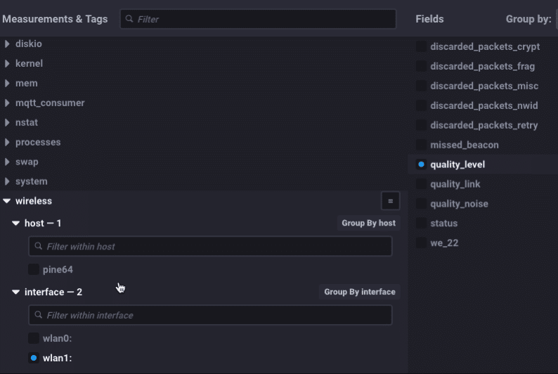

> Esta publicación se publicó originalmente en el [Blog de InfluxData](https://www.influxdata.com/blog/monitoring-wireless-interfaces/).

Si ha seguido mis últimas publicaciones, verá que he estado hasta la cintura en enrutadores y cosas inalámbricas. Estoy construyendo una "arquitectura de referencia" más grande y complicada para el monitoreo de IoT con InfluxDB, y para hacer eso, estoy usando todo tipo de cajas diferentes. Estoy reutilizando mi caja Pine-64 (ver aquí) y quería poder monitorear las estadísticas de la interfaz inalámbrica. ¡Resulta que no había ningún Telegraf Plugin para eso! ¡¿¡¿¿QUÉ??!?! Así que escribí uno.

Si alguna vez ha hecho un `cat /proc/net/wireless` sabrá que, si bien el resultado es directo y útil, alguien decidió que un encabezado de 2 líneas era una gran idea. no lo fue

```bash
ubuntu@pine64:~$ cat /proc/net/wireless
Inter-| sta-| Quality | Discarded packets | Missed | WE
 face | tus | link level noise | nwid crypt frag retry misc | beacon | 22
 wlan0: 0000 0. -256. -256. 0 0 0 0 0 0
 wlan1: 0000 42. -73. -256. 0 0 0 0 0 0
ubuntu@pine64:~$
```

Quiero decir, se ve bien y todo eso, pero realmente no estaba destinado a ser fácilmente analizado en algo significativo. De todos modos, dado que me estaba embarcando en escribir otro complemento de Telegraf, analizarlo era exactamente lo que iba a necesitar hacer. Este es el espagueti que tuve que escribir para analizar ese encabezado y unirlo en algo que sería significativo almacenar en InfluxDB:x

```go
func loadWirelessTable(table []byte, dumpZeros bool) (map[string]interface{}, map[string]string, error) {
	metrics := map[string]interface{}{}
	tags := map[string]string{}
	myLines := strings.Split(string(table), "\n")
	for x := 0; x < len(myLines)-1; x++ {
		f := strings.SplitN(myLines[x], ":", 2)
		f[0] = strings.Trim(f[0], " ")
		f[1] = strings.Trim(f[1], " ")
		if f[0] == "BSSID" {
			tags[strings.Replace(strings.Trim(f[0], " "), " ", "_", -1)] = strings.Replace(strings.Trim(string(f[1]), " "), " ", "_", -1)
			continue
		}
		n, err := strconv.ParseInt(strings.Trim(f[1], " "), 10, 64)
		if err != nil {
			tags[strings.Replace(strings.Trim(f[0], " "), " ", "_", -1)] = strings.Replace(strings.Trim(f[1], " "), " ", "_", -1)
			continue
		}
		if n == 0 {
			if dumpZeros {
				continue
			}
		}
		metrics[strings.Trim(f[0], " ")] = n

	}
	tags["interface"] = "airport"
	return metrics, tags, nil

}
```

Todo eso para que podamos ver esto:



en Cronografo! ¡Lindo! Observe cómo convertí el encabezado de varias líneas en valores distintos para 'quality_level', etc. y los hice compatibles con InfluxDB al reemplazar los espacios con guiones bajos, etc. ¡Ahora podemos monitorear todos los diversos aspectos de nuestra(s) interfaz(es) inalámbrica(s)! Entonces, dado que estoy ejecutando la última versión de Chronograf:


Google ChromeScreenSnapz001

¡Tengo un indicador útil con el RSSI de mi interfaz inalámbrica activa! Por supuesto, dado que este nuevo complemento (que llegará en algún momento a una versión de Telegraf) se basa en /proc/net/wireless, solo funcionará para Linux.

Pero espere, no me olvidé de todos ustedes, usuarios de Mac. Después de una buena cantidad de google-fu, encontré una forma más o menos similar de obtener información inalámbrica de Mac OS. Está enterrado y no es de fácil acceso, pero lo desenterré para ti. Formatea la salida de una manera mucho más razonable, lo que hace que sea muy fácil ingresar a InfluxDB:

```bash
$ /System/Library/PrivateFrameworks/Apple80211.framework/Versions/Current/Resources/airport -I
     agrCtlRSSI: -63
     agrExtRSSI: 0
    agrCtlNoise: -95
    agrExtNoise: 0
          state: running
        op mode: station
     lastTxRate: 65
        maxRate: 72
lastAssocStatus: 0
    802.11 auth: open
      link auth: wpa2-psk
          BSSID: 36:c3:d2:e3:ed:8e
           SSID: Influx-IoT2
            MCS: 7
        channel: 3
$
```

que corta el código para que sea útil considerablemente:

```go
func loadWirelessTable(table []byte, dumpZeros bool) (map[string]interface{}, map[string]string, error) {
	metrics := map[string]interface{}{}
	tags := map[string]string{}
	myLines := strings.Split(string(table), "\n")
	for x := 0; x < len(myLines)-1; x++ {
		f := strings.SplitN(myLines[x], ":", 2)
		f[0] = strings.Trim(f[0], " ")
		f[1] = strings.Trim(f[1], " ")
		if f[0] == "BSSID" {
			tags[strings.Replace(strings.Trim(f[0], " "), " ", "_", -1)] = strings.Replace(strings.Trim(string(f[1]), " "), " ", "_", -1)
			continue
		}
		n, err := strconv.ParseInt(strings.Trim(f[1], " "), 10, 64)
		if err != nil {
			tags[strings.Replace(strings.Trim(f[0], " "), " ", "_", -1)] = strings.Replace(strings.Trim(f[1], " "), " ", "_", -1)
			continue
		}
		if n == 0 {
			if dumpZeros {
				continue
			}
		}
		metrics[strings.Trim(f[0], " ")] = n

	}
	tags["interface"] = "airport"
	return metrics, tags, nil

}
```

mucho más razonable, ¿no crees? Convierte todas esas lecturas en bonitas etiquetas y campos:


Y me da un indicador similar en mi Mac:


¡Bastante ingenioso!

Ahora, probablemente se esté preguntando por qué me tomé tantas molestias solo para poder monitorear el RSSI de una interfaz inalámbrica. ¡Y esa es una gran pregunta! Verá, en el mundo de IoT, habrá dispositivos de puerta de enlace que recopilarán datos a través de interfaces inalámbricas, ya sabe, para conectarse con sensores inalámbricos. Por lo tanto, es importante poder monitorear la salud y la actividad de esas interfaces inalámbricas. Agregué el de Mac solo porque era fácil y lo quería.

Así que estad atentos. Agregaré una serie de publicaciones de blog sobre los sensores que estoy conectando a este colector de datos de puerta de enlace inalámbrica. En realidad, es parte de un proyecto más grande de construir una plataforma de demostración de IoT más grande y más enfocada en la industria.

> **Nota:** Mientras mi solicitud de extracción esperaba ser evaluada, alguien decidió robar mi código para el complemento de monitoreo inalámbrico de Linux y enviarlo como un PR separado. Ese PR fue aceptado y fusionado con Telegraf. Entonces, si está ejecutando Telegraf 1.3.0 o posterior, puede usar el complemento "inalámbrico" para monitorear sus interfaces inalámbricas, solo sepa cómo llegó allí.

> **Nota 2:** Me han preguntado sobre el código para el complemento de monitoreo inalámbrico de Mac. Languideció como relaciones públicas para Telegraf durante *4 años* sin siquiera ser mirado. En la primavera de 2022 finalmente se pusieron a evaluarlo. Trabajé con los mantenedores durante aproximadamente 2 meses mientras pedían cambios menores, luego cambios importantes, luego cambiaron de opinión repetidamente sobre los cambios importantes hasta que finalmente me di por vencido. Cuando vuelva mi paciencia con ellos, puedo intentarlo de nuevo.
