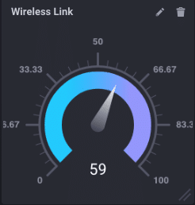
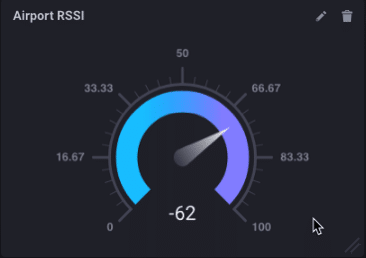

> Dit bericht is oorspronkelijk gepost op de [InfluxData Blog](https://www.influxdata.com/blog/monitoring-wireless-interfaces/).

Als je mijn laatste paar berichten hebt gevolgd, zul je zien dat ik tot mijn middel in routers en draadloze dingen zit. Ik bouw een grotere, meer gecompliceerde 'referentiearchitectuur' voor IoT-monitoring met InfluxDB, en daarvoor gebruik ik allerlei verschillende boxen. Ik hergebruik mijn Pine-64-box (zie hier) en ik wilde de statistieken van de draadloze interface kunnen controleren. Blijkt dat daar geen Telegraf-plug-in voor was! WAT??!?! Dus schreef ik er een.

Als je ooit een `cat /proc/net/wireless` hebt gedaan, weet je dat, hoewel de uitvoer eenvoudig en nuttig is, iemand besloot dat een koptekst met twee regels een geweldig idee was. Dat was het niet.

```bash
ubuntu@pine64:~$ cat /proc/net/wireless
Inter-| sta-| Quality | Discarded packets | Missed | WE
 face | tus | link level noise | nwid crypt frag retry misc | beacon | 22
 wlan0: 0000 0. -256. -256. 0 0 0 0 0 0
 wlan1: 0000 42. -73. -256. 0 0 0 0 0 0
ubuntu@pine64:~$
```

Ik bedoel, het ziet er mooi uit en zo, maar het was echt niet de bedoeling dat het gemakkelijk in iets zinvols zou worden ontleed. Hoe dan ook, aangezien ik bezig was met het schrijven van een andere Telegraf-plug-in, was het ontleden precies wat ik moest doen. Dit is de spaghetti die ik moest schrijven om die header te ontleden en samen te voegen tot iets dat zinvol zou zijn om op te slaan in InfluxDB:x

```go
func loadWirelessTable(table []byte, dumpZeros bool) (map[string]interface{}, map[string]string, error) {
	metrics := map[string]interface{}{}
	tags := map[string]string{}
	myLines := strings.Split(string(table), "\n")
	for x := 0; x < len(myLines)-1; x++ {
		f := strings.SplitN(myLines[x], ":", 2)
		f[0] = strings.Trim(f[0], " ")
		f[1] = strings.Trim(f[1], " ")
		if f[0] == "BSSID" {
			tags[strings.Replace(strings.Trim(f[0], " "), " ", "_", -1)] = strings.Replace(strings.Trim(string(f[1]), " "), " ", "_", -1)
			continue
		}
		n, err := strconv.ParseInt(strings.Trim(f[1], " "), 10, 64)
		if err != nil {
			tags[strings.Replace(strings.Trim(f[0], " "), " ", "_", -1)] = strings.Replace(strings.Trim(f[1], " "), " ", "_", -1)
			continue
		}
		if n == 0 {
			if dumpZeros {
				continue
			}
		}
		metrics[strings.Trim(f[0], " ")] = n

	}
	tags["interface"] = "airport"
	return metrics, tags, nil

}
```

Dat allemaal zodat we dit kunnen zien:


in chronograaf! Leuk! Merk op hoe ik de koptekst met meerdere regels heb omgezet in afzonderlijke waarden voor 'quality_level' enz. en ze InfluxDB-vriendelijk heb gemaakt door spaties te vervangen door onderstrepingstekens, enz. We kunnen nu alle verschillende aspecten van onze draadloze interface(s) controleren! Dus aangezien ik de nieuwste versie van Chronograf gebruik:


Google ChromeScreenSnapz001

Ik heb een handige meter met de RSSI van mijn actieve draadloze interface! Omdat deze nieuwe plug-in (ooit een versie van Telegraf!) afhankelijk is van /proc/net/wireless, werkt hij natuurlijk alleen voor Linux.

Maar wacht even, ik ben jullie Mac-gebruikers niet vergeten. Na een behoorlijke hoeveelheid google-fu vond ik een ongeveer vergelijkbare manier om draadloze informatie van Mac OS te krijgen. Het is begraven en niet gemakkelijk toegankelijk, maar ik heb het voor je uitgegraven. Het formatteert de uitvoer op een veel redelijkere manier, waardoor het supergemakkelijk is om in InfluxDB te komen:

```bash
$ /System/Library/PrivateFrameworks/Apple80211.framework/Versions/Current/Resources/airport -I
     agrCtlRSSI: -63
     agrExtRSSI: 0
    agrCtlNoise: -95
    agrExtNoise: 0
          state: running
        op mode: station
     lastTxRate: 65
        maxRate: 72
lastAssocStatus: 0
    802.11 auth: open
      link auth: wpa2-psk
          BSSID: 36:c3:d2:e3:ed:8e
           SSID: Influx-IoT2
            MCS: 7
        channel: 3
$
```

wat de code verkort om dat aanzienlijk nuttiger te maken:

```go
func loadWirelessTable(table []byte, dumpZeros bool) (map[string]interface{}, map[string]string, error) {
	metrics := map[string]interface{}{}
	tags := map[string]string{}
	myLines := strings.Split(string(table), "\n")
	for x := 0; x < len(myLines)-1; x++ {
		f := strings.SplitN(myLines[x], ":", 2)
		f[0] = strings.Trim(f[0], " ")
		f[1] = strings.Trim(f[1], " ")
		if f[0] == "BSSID" {
			tags[strings.Replace(strings.Trim(f[0], " "), " ", "_", -1)] = strings.Replace(strings.Trim(string(f[1]), " "), " ", "_", -1)
			continue
		}
		n, err := strconv.ParseInt(strings.Trim(f[1], " "), 10, 64)
		if err != nil {
			tags[strings.Replace(strings.Trim(f[0], " "), " ", "_", -1)] = strings.Replace(strings.Trim(f[1], " "), " ", "_", -1)
			continue
		}
		if n == 0 {
			if dumpZeros {
				continue
			}
		}
		metrics[strings.Trim(f[0], " ")] = n

	}
	tags["interface"] = "airport"
	return metrics, tags, nil

}
```

veel redelijker, vind je niet? Het verandert al die metingen in mooie tags en velden:


En geeft me een vergelijkbare meter op mijn Mac:



Best handig!

Nu vraag je je waarschijnlijk af waarom ik al deze moeite heb gedaan om de RSSI van een draadloze interface te kunnen monitoren. En dat is een goede vraag! Zie je, in de wereld van IoT zul je gateway-apparaten hebben die gegevens verzamelen via draadloze interfaces - je weet wel, om verbinding te maken met draadloze sensoren. Het is dus belangrijk om de gezondheid en activiteit van die draadloze interfaces te kunnen bewaken. Ik heb de Mac toegevoegd, gewoon omdat het gemakkelijk was en ik het wilde.

Dus blijf op de hoogte. Ik zal een aantal blogposts toevoegen over de sensoren die ik op deze draadloze gateway-gegevensverzamelaar aansluit. Het maakt eigenlijk deel uit van een groter project om een groter, meer industrieel gericht IoT-demoplatform uit te bouwen.

> **Opmerking:** Terwijl mijn Pull Request wachtte om geëvalueerd te worden, besloot iemand mijn code voor de Linux plug-in voor draadloze monitoring te stelen en die als een aparte PR in te dienen. Die PR werd geaccepteerd en samengevoegd in Telegraf. Dus als je Telegraf 1.3.0 of hoger gebruikt, kun je de `draadloze` plug-in gebruiken om je draadloze interfaces te controleren, je hoeft alleen maar te weten hoe het daar terecht is gekomen.

> **Opmerking 2:** Er is mij gevraagd naar de code voor de plug-in voor draadloos toezicht op de Mac. Het kwijnde *4 jaar* weg als PR voor Telegraf zonder dat er zelfs maar naar gekeken werd. In het voorjaar van 2022 kwamen ze er eindelijk toe om het te evalueren. Ik werkte ongeveer 2 maanden met de beheerders terwijl ze vroegen om kleine veranderingen, daarna grote veranderingen, en vervolgens herhaaldelijk van gedachten veranderden over de grote veranderingen totdat ik het uiteindelijk opgaf. Als mijn geduld met hen terugkeert, probeer ik het misschien opnieuw.
