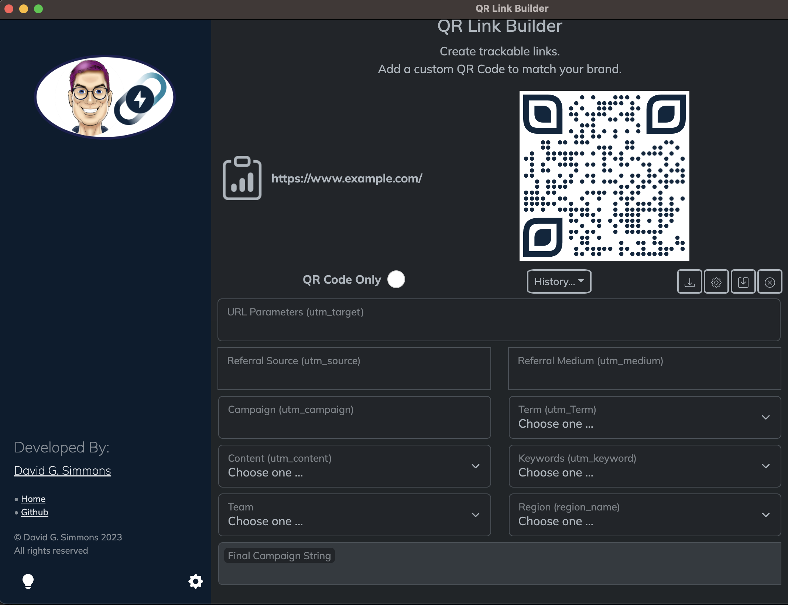

## ¿Qué es esta hechicería?

Hace aproximadamente un año comencé a jugar con React.js como ejercicio de aprendizaje; en realidad, estaba trabajando tanto con [React.js](https://reactjs.org) como con [Electron](https://electronjs. org) para crear aplicaciones independientes.

Al mismo tiempo, la empresa para la que trabajaba buscaba una forma de crear enlaces codificados en utm fácilmente para todos los miembros de la empresa. Si no sabe qué son los "enlaces codificados en UTM", puede obtener más información al respecto [aquí](https://funnel.io/resources/google-analytics-utm-tagging), pero es algo bastante geek. Digamos que si desea poder responder preguntas como "¿más personas hacen clic en mis enlaces en Twitter o LinkedIn?" entonces los enlaces UTM son lo que necesitas.

Pero yo divago. Mientras pensaba en una forma de crear una herramienta así, tuve un momento "¡*Eureka!*". Pensé: ¡Puedo crear una pequeña aplicación que haga eso!

Así que lo hice. Creé una pequeña aplicación que tomaría una URL y le permitiría agregarle parámetros utm predefinidos para que el marketing pueda realizar un seguimiento de la efectividad de sus enlaces. Era una aplicación sencilla, pero funcionó. Y fue divertido construirlo.

Ese trabajo decidió no usarlo (si crees que el síndrome "no inventado aquí" está muerto, ¡tengo algunas historias que contar!), pero decidí seguir trabajando en ello en mi propio tiempo para mejorar mis habilidades en React.js.

Aquí uso la frase "habilidades de reacción" de manera muy vaga. No soy un desarrollador de React y nunca me confundirían con uno. Pero aprendo haciendo, así que seguí haciéndolo.

## ¡Agreguemos más funciones!

Una aplicación que hace poco más que crear enlaces codificados en utm no es realmente el principio y el fin de todo. Luego, alguien a quien sigo en Twitter (y por mi vida no puedo encontrar sus tweets al respecto, así que si reconoces esto, ¡házmelo saber para poder dar el crédito correspondiente!) publicó sobre la creación de códigos QR en JavaScript y yo Pensé: "¡Oye, esa sería una gran característica para mi aplicación!".

Permítanme decir que todo el "¡oye, puedo hacer eso!" y "¿Qué tan difícil puede ser?" La actitud es lo que me mete en problemas. Pero estoy divagando, otra vez.

De todos modos, la aplicación evolucionó hasta convertirse en algo bastante útil y en mi trabajo actual decidí adoptarla en toda la empresa para crear enlaces codificados y códigos QR. Una de las cosas que hice para ellos fue diseñar un código QR personalizado que incorporara el logotipo de la empresa, los colores corporativos y "ojos" personalizados en el código QR.

Código QR bastante bonito, ¿verdad?

## ¡Hagamos códigos QR personalizados!

Entonces tuve la idea de crear una aplicación que te permitiera diseñar tus propios códigos QR y personalizarlos como quisieras. Intenté crear una aplicación completamente separada para eso, y tuve cierto éxito, pero me pareció un gran esfuerzo diseñar un código QR y luego tener que agregarlo de alguna manera a la *otra* aplicación para usarlo al crear Enlaces.

Qué hacer. ¿Qué hacer?

## Y también ...

Al mismo tiempo que hacía todo esto, le mostré a algunas personas lo que estaba haciendo y, bueno, digamos que había algo de entusiasmo por ello. Pero todavía tenía un problema. La única versión real y funcional que tenía estaba muy personalizada para mi empleador y no sería muy útil para muchas otras empresas.

## Es hora de rediseñar

Para que esta aplicación fuera realmente útil para la mayor audiencia posible, tenía que ser personalizable para cada usuario. Algunas personas podrían querer un parámetro UTM particular, mientras que otras no querrían ese. Algunas personas pueden querer que un parámetro UTM particular provenga de una lista predefinida, mientras que otras pueden querer que sea un campo de texto simple.

Esto requerirá *mucha* personalización. Y va a requerir mucho trabajo lograrlo. O tal vez no.

## Terriblemente personalizable

Decidí personalizar prácticamente todos los aspectos de la aplicación. Creé un panel de personalización que permitiría al usuario cambiar casi todos los aspectos de la aplicación.

Comencemos con cómo se ve la aplicación cuando la abres por primera vez:

Al ver eso, lo primero que probablemente querrás cambiar es ese logotipo. ¿Quien pensó que era una buena idea? Bueno, lo hice. Pero puede que no sea así. Así que cambiémoslo.

