##TL;DR

De eerbiedwaardige Raspberry Pi bestaat al meer dan een decennium (officieel gecreëerd in 2009) en is een standaard geworden in veel robotica, domotica en andere soorten toepassingen. Vooral voor "makers" en andere knutselaars. Maar het heeft ook serieuze doorbraken gemaakt in de professionele en zakelijke wereld - alleen stiller.

Het is een capabele, betrouwbare en krachtige Single Board Computer (SBC) met een robuuste gebruikerscommunity. Ondanks alle sterke punten heeft het ook een paar opvallende zwakke punten. De grootste is de beveiliging. Niet omdat de SBC zelf onveilig is, en niet omdat het besturingssysteem (OS) onveilig is (het draait Linux, wat heel goed beveiligd kan worden). Het meest kwetsbare onderdeel van de Raspberry Pi is het feit dat het opstart en draait vanaf een micro SD-kaart.

Hoewel dat micro SD-kaart opstartmechanisme zeker handig is, maakt het de Pi extreem kwetsbaar voor fysieke manipulatie. Iemand kan immers gewoon naar de Pi lopen, de SD-kaart eruit halen en heeft toegang tot alle programma's en gegevens die draaiden. Ze kunnen die kaart in hun eigen Pi stoppen en hebben volledige toegang tot alles. Nou ja, met een beetje wachtwoordhacking, etc.

Het absoluut beveiligen van de Pi tegen fysieke manipulatie en elektronische manipulatie is een belangrijke stap om van de Raspberry Pi een veilig apparaat te maken voor het implementeren van applicaties in het veld.

Naadloze updates van je Pi zijn vaak ook een gedoe. Vooral als je er meer dan een handvol hebt. Je moet op elk inloggen, de updates uitvoeren en dan hopen dat er niets misgaat.

Wat mij brengt bij herstelbaarheid. Wat gebeurt er als een van die updates om een of andere reden mislukt? Vooral als het op een afgelegen locatie is. Hoe zorg je ervoor dat het apparaat herstelbaar is en hoe kun je het zo snel mogelijk weer online krijgen?

Ik ga uiteraard veel onderwerpen behandelen, maar uiteindelijk laat ik je zien hoe je je Raspberry Pi kunt beveiligen tegen fysieke manipulatie, waardoor het vrijwel onmogelijk wordt om je programma's en gegevens te stelen. Ook laat ik je zien hoe je updates veilig op afstand kunt uitvoeren en hoe je ervoor kunt zorgen dat die updates hersteld kunnen worden in geval van een storing.

## Laten we een nieuwe Pi bouwen

Laten we om te beginnen een Raspberry Pi vanaf nul bouwen. Als je hier niet in geïnteresseerd bent en gewoon een bestaande Pi wilt beveiligen, scroll dan naar beneden naar sectie [Securing your Pi](#securing-your-pi)

Hier zijn alle dingen die je nodig hebt om dit te voltooien. Ik zal links toevoegen naar degene waar ik directe, persoonlijke ervaring mee heb.

- Raspberry Pi (ik gebruik een [Raspberry Pi 4](https://amzn.to/3Y2BBgn), maar je kunt ook een [Raspberry Pi 5](https://amzn.to/4dAKfZ3) gebruiken als je dat liever hebt)
- [Voeding](https://amzn.to/4eWmYSr) voor je Pi. Het is belangrijk om een goede voeding te gebruiken die voldoende vermogen levert voor de Pi4 of Pi5. De officiële voeding van de Pi foundation wordt aanbevolen.
- Hoge kwaliteit [Micro SD-kaart](https://amzn.to/3U2Twm1) Ik raad een 32GB-kaart aan.
- [SD-kaartlezer/-schrijver](https://amzn.to/4dEs2Kc) (als er geen ingebouwd apparaat in uw computer zit)
- USB-stick van hoge kwaliteit (let op: deze moet 2x zo groot zijn als uw SD-kaart). Ik vind [deze](https://amzn.to/3NrH4Iz) van PNY erg leuk.
- Zymkey, HSM4 of HSM6 (ik gebruik hier een [Zymkey](https://amzn.to/4eRcIvn), maar een HSM6 werkt ook prima als je Hardware Signing wilt)
- [CR1025-batterij](https://amzn.to/4eJG1Qt) (een batterij is niet strikt noodzakelijk, maar ik neem hem hier op voor de volledigheid. De Zymkey gebruikt hem om de Real Time Clock (RTC) te onderhouden))

### Formatteer en maak een image van uw Micro SD

Nu je alle onderdelen hebt gemonteerd, kunnen we beginnen. Ik gebruik de [Raspberry Pi Imager](https://www.raspberrypi.com/software/) tool, maar je kunt ook [Balena Etcher](https://etcher.balena.io) of een andere SD Card imaging tool gebruiken die je verkiest.

Wanneer u de Pi Imager voor het eerst opstart, zult u zien dat u een aantal keuzes moet maken:

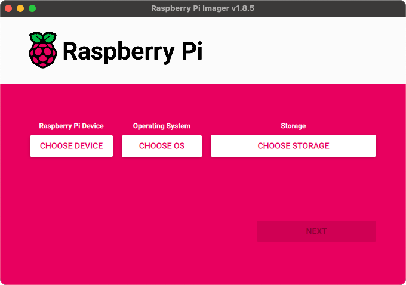

Eerst moet je kiezen welk Pi-model je hebt. Ik gebruik een Pi 4

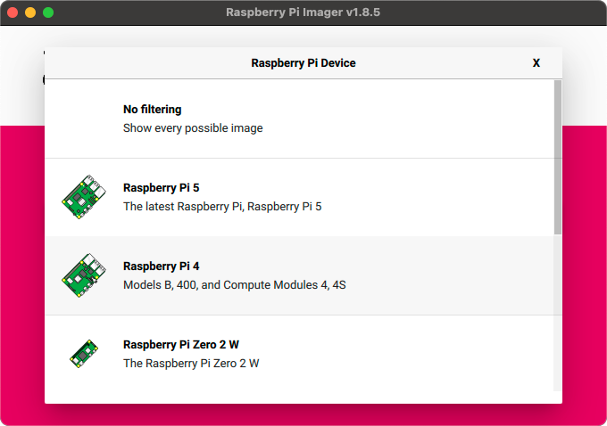

Kies de hardware die je hebt, natuurlijk. Vervolgens kies je het besturingssysteem. We gaan de meest recente versie gebruiken (Bookworm, 64-bit), maar we hebben niet de volledige desktopomgeving nodig, dus ik kies de 'Lite'-versie.

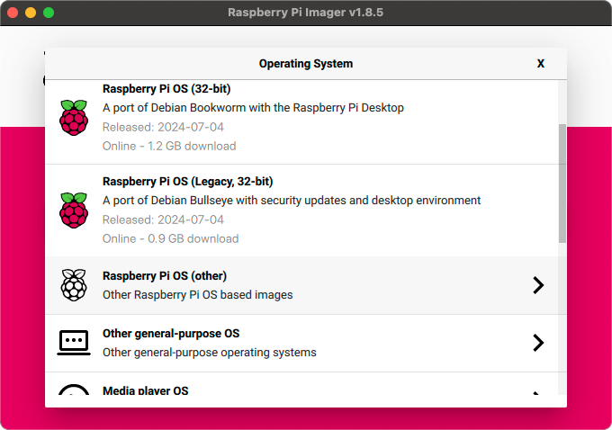

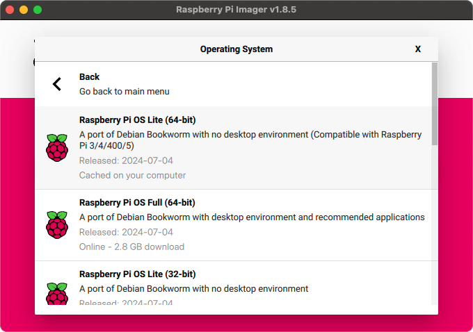

Vervolgens identificeert u de Micro SD-kaart waarnaar u wilt schrijven. Als u dat nog niet hebt gedaan, plaatst u de Micro SD-kaart in de SD-kaartschrijver en sluit u deze aan op uw computer.

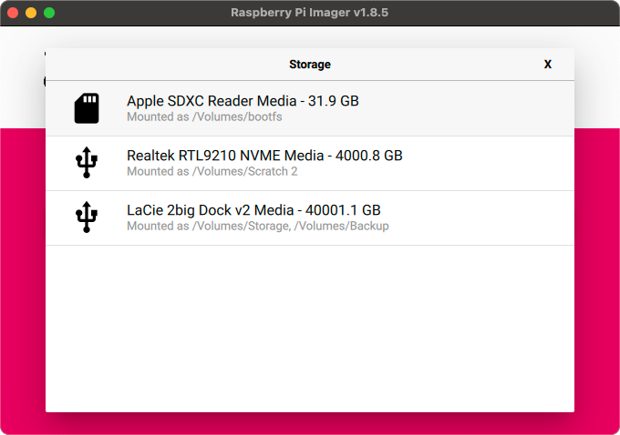

De laatste stap voordat u het besturingssysteem daadwerkelijk naar de schijf schrijft, is het instellen van eventuele aanvullende instellingen die u voor de Pi wilt. Ik raad aan om in ieder geval een hostnaam en gebruikersnaam/wachtwoord in te stellen, en als u uw lokale wifi wilt gebruiken, de wifi-referenties.

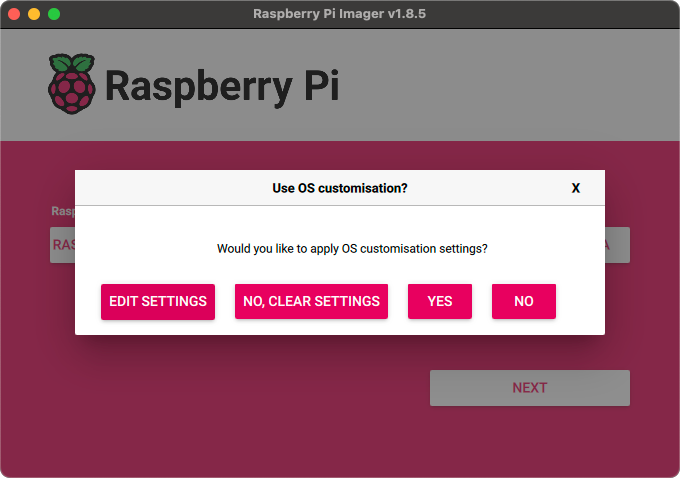

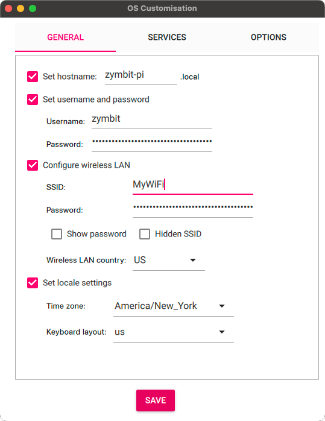

Zodra je alle instellingen goed hebt, is het tijd om alles naar de kaart te schrijven. Let op: hiermee worden alle bestaande gegevens op de SD-kaart volledig gewist, dus wees voorzichtig.

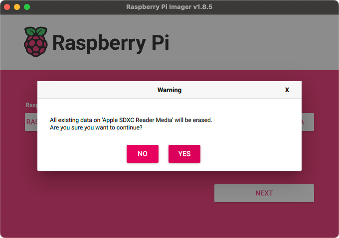

Daarna kunt u achterover leunen en genieten van een kop koffie terwijl uw OS naar de kaart wordt geschreven. Zodra het klaar is, kunnen we doorgaan met het configureren van de hardware.

### Stel de hardware in

Dit is altijd mijn favoriete onderdeel! Laten we eerst eens kijken wat we nodig hebben:

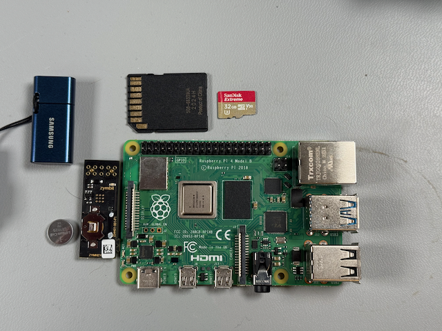

Voordat we de Pi inpluggen, zetten we eerst de Zymkey in elkaar en installeren. Het enige wat u hoeft te doen, is de CR1025-batterij in de batterijhouder te plaatsen.

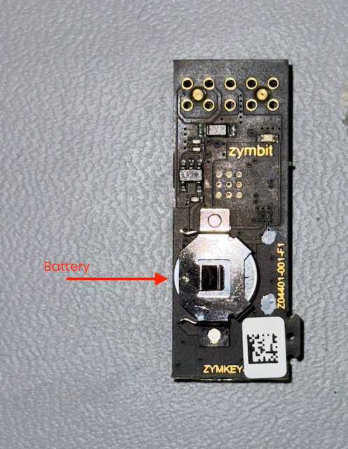

Zorg ervoor dat de Zymkey goed op de header-pinnen zit.

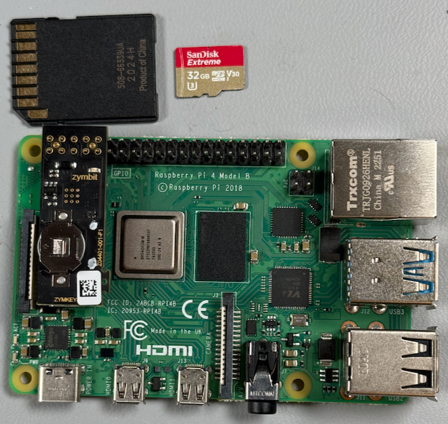

Zodra alle hardware is gemonteerd, plaatst u de SD-kaart in de sleuf aan de onderkant van de Pi.

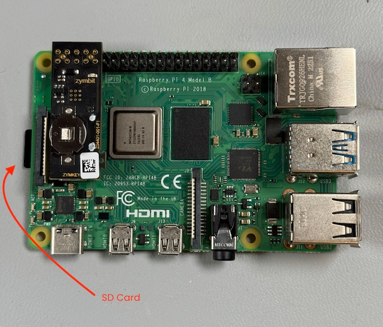

Nu is het tijd om de Pi aan te sluiten op de voeding, te wachten tot hij is opgestart en te beginnen met het instellen van de beveiliging!

## Uw Pi beveiligen

Nu we een Pi hebben die lekker draait, gaan we aan de slag met de belangrijke taak om ervoor te zorgen dat hij veilig, updatebaar en herstelbaar is. In die volgorde.

### Configureer uw Zymkey

Voordat we de Zymkey kunnen configureren, moeten we ervoor zorgen dat de Pi ermee kan communiceren. De Zymkey-software communiceert met het apparaat via I2C, dus we moeten ervoor zorgen dat de I2C-interface van de Pi is ingeschakeld.

```bash
$ sudo raspi-config
```
Hiermee gaat u naar het configuratiehulpprogramma.

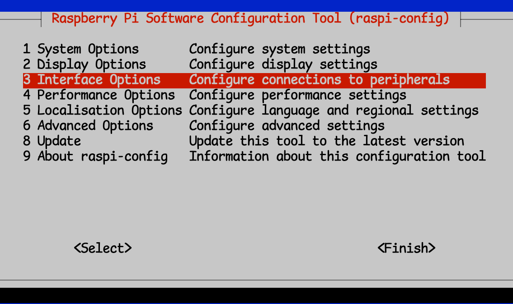

Vervolgens selecteert u 'Interfaceopties' en vervolgens 'I2C'


U kunt dan afsluiten en raspi-config opslaan

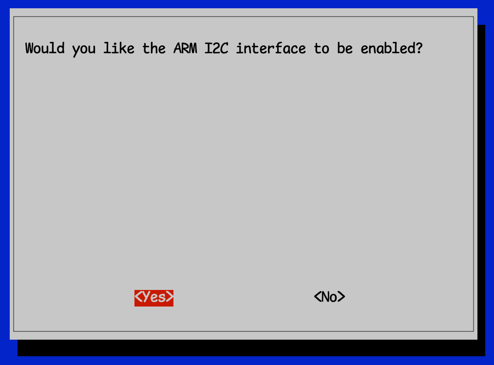

Al deze stappen worden uitgebreider behandeld in de [documentatie](https://docs.zymbit.com/getting-started/zymkey/quickstart/), dus als er iets verwarrend is, kunt u dat daar altijd nog even controleren.

Vervolgens moeten we de vereiste Zymkey-software installeren.

```bash
$ curl -G https://s3.amazonaws.com/zk-sw-repo/install_zk_sw.sh | sudo bash
```
Installeer eventuele updates en download en installeer vervolgens de vereiste Zymbit-software.

**Let op**: Als u deze software installeert, wordt de Pi automatisch opnieuw opgestart. Doe dus niets anders met de Pi terwijl de software wordt geïnstalleerd.

Nadat het opnieuw opstarten is voltooid, zou u moeten opmerken dat het blauwe lampje niet langer snel knippert, maar elke 3 seconden. Dit is uw indicatie dat de Zymbit-software correct is geïnstalleerd en kan communiceren met de Zymkey.

Als u wilt testen of Zymkey is geïnstalleerd en goed functioneert, kunt u de testscripts downloaden en installeren:

```bash
wget https://community.zymbit.com/uploads/short-url/eUkHVwo7nawfhESQ3XwMvf28mBb.zip
unzip eUkHVwo7nawfhESQ3XwMvf28mBb.zip
sudo mkdir -p /usr/local/share/zymkey/examples/
sudo mv *.py /usr/local/share/zymkey/examples/
python3 /usr/local/share/zymkey/examples/zk_app_utils_test.py
```
```bash
Testing data lock...
Original Data
01 02 03 04
Encrypted Data
8B B8 06 67 00 00 35 80 82 75 AA BE 89 8C A8 D5
6D 7B 71 48 83 47 B9 9A B7 3A 09 58 41 E6 33 BC
4E 48 7A 32 3A B0 26 D8 59 4F 8C 58 59 97 03 20
3C 99 CF AF 2D CC 47 E5 1B AB 83 FC 6A 3D DE D8
F3 24 9F 73 B5 72 B7 0D 77 8E C6 A8 A3 B3 22 D6
94 8F BD 6A 6C 96 38 EE
Testing data unlock...
Decryped Data
01 02 03 04
Turning LED on...
Testing get_random() with 512 bytes...
B7 B6 BD 78 C6 62 7A CC 80 E0 BD 04 C7 43 29 AC
7A 48 2D 3F E5 43 33 AA 7C 37 F6 BA 7D 3F F2 D3
A9 4B B3 A9 16 4C FD AD 48 61 72 9E 7F B9 09 AE
A7 4A 4F 54 0D CE 6E 85 E6 87 F5 8C D6 58 4B 0E
12 03 4C 71 BD 3A F0 34 79 06 66 5E 65 DC 6E CF
AF 12 72 C1 F1 5D 24 79 A8 D0 F9 40 3E 8E 59 D7
5C ED C5 1E 0E FF 4A 04 69 22 54 F5 13 A1 2E A7
3C B4 CD 30 E7 61 10 B7 E5 07 AD DC E0 FF E9 6E
58 32 50 DA 9F 33 51 F5 8C 16 B5 0C 0F 57 08 E6
E8 00 89 79 DF 16 2A BD FC 27 E0 E4 6C 1B 05 28
EB DE 5B 63 2E F0 E0 21 E8 C5 39 31 26 2A E5 64
79 31 04 7A 60 ED D7 32 6A 8B 4A 29 DD 79 EC D9
2B 72 AC 2E 9A 08 FF 56 06 DB 1C 91 FF D9 3F 10
3E 57 9C 5E B4 32 FD 2E 09 BF 8D 04 6A C8 12 88
06 7C C1 93 FD F7 61 47 90 DD 0D 50 78 78 6C 83
0A 94 DD 5E 9D 83 3F FD 0B 1E 73 23 72 0D 4D D1
82 1F 42 DB EE 1E 7F 85 B9 F1 94 24 54 1B 28 2E
47 24 05 8B 17 0B AE 90 6A DF 0B BC E1 53 B2 96
1C 87 D4 FD A0 EC FC 85 E4 9F 04 F6 B8 E0 37 B2
40 17 33 3A FA 96 01 0C B2 4C 4D FE E7 64 0E 87
4E 4B A8 D0 97 C6 A5 42 F4 02 E4 CC 7C 2B 3A A8
C7 33 22 3C 76 1C 40 42 1F 5A 78 7B 23 FB 0B 39
BD 9F 38 13 6B FE D9 54 C9 D2 F3 97 C6 39 F3 09
9C 6B DC 82 C1 25 99 70 8B 2B 46 FD CD 51 C9 09
20 16 DA 4C D3 58 B6 BB D7 C3 E4 A9 34 F0 5C 85
D7 19 6D A8 F7 26 D6 41 6F 27 04 2C A0 C4 50 9D
28 43 0D DC E2 7E D4 9E 29 FE 45 B2 BF 14 77 A7
AD F4 43 4B 51 85 85 06 7F 02 BF 21 DA C4 BD A4
9B 94 71 FA 21 8B 9E B6 07 48 7F 50 A7 CF 32 2F
8F 98 A1 E1 FE 1B 2E 24 B5 BF 69 E7 DE 3D 11 6C
48 5B 56 5C BF 96 FB 30 BB 86 13 C4 53 61 AD 6E
09 0C A9 4B C1 2F 12 3F BF 34 FB 01 D7 62 13 7A
Turning LED off...
Flashing LED off, 500ms on, 100ms off...
Testing zkCreateRandDataFile with 1MB...
Turning LED off...
Testing get_ecdsa_public_key()...
20 AD 20 7A 0E D9 A5 81 BF 44 80 54 C6 DC A7 8C
D1 D5 7B EE 6D C5 E3 B4 92 8C 0E BF 42 6E D9 9E
AA 04 29 CD 4C D9 3A BC 58 5B DD 47 43 39 30 C8
2E FD C6 D9 C9 82 60 06 A4 A0 7F EA F9 C0 76 E9
Testing create_ecdsa_public_key_file()...
$ python3 /usr/local/share/zymkey/examples/zk_crypto_test.py
Signing data...OK
Verifying data...OK
Verifying tainted data...FAIL, yay!
Generating random block from Zymkey (131072 bytes)...
Encrypting random block...
Decrypting encrypted block...
PASS: Decrypted data matches original random data
Done!
```

Gefeliciteerd!

## Ten slotte, het veilig maken

Nu we een goed beveiligingsapparaat hebben geïnstalleerd, getest en gereed, gaan we dit ding beveiligen. Laten we er tegelijkertijd voor zorgen dat we het apparaat veilig kunnen updaten als de tijd daar is, en dat het is gebouwd om te herstellen als een update mislukt.

Normaal gesproken zou dit een hoop werk zijn, maar we gaan alles vereenvoudigen en het in één keer doen.

### Een plek om de back-upimage te plaatsen

Omdat we Bootware(r) gaan gebruiken om ons apparaat te beveiligen, hebben we een plek nodig waar het systeem de hele SD-kaart kan kopiëren terwijl het deze versleutelt. Hiervoor gaan we een USB-stick gebruiken.

We moeten ervoor zorgen dat we onze USB-stick goed kunnen gebruiken. Ik hergebruik ze vaak voor andere taken, dus dit is hoe ik graag begin. Nadat ik de USB-stick heb aangesloten, zorg ik ervoor dat ik de drive "op nul zet" en maak ik er een gloednieuwe partitiemap en bestandssysteem op.

```bash
sudo dd if=/dev/zero of=/dev/sda bs=512 count=1 conv=notrunc
```
```bash
1+0 records in
1+0 records out
512 bytes copied, 0.0197125 s, 26.0 kB/s
```

Hiermee wordt het vorige bestandssysteem gewist, indien aanwezig.

```bash
sudo fdisk -W always /dev/sda
```
```bash
Welcome to fdisk (util-linux 2.38.1).
Changes will remain in memory only, until you decide to write them.
Be careful before using the write command.

Device does not contain a recognized partition table.
Created a new DOS (MBR) disklabel with disk identifier 0x27b0681a.

Command (m for help): n
Partition type
   p   primary (0 primary, 0 extended, 4 free)
   e   extended (container for logical partitions)
Select (default p): p
Partition number (1-4, default 1):
First sector (2048-125313282, default 2048):
Last sector, +/-sectors or +/-size{K,M,G,T,P} (2048-125313282, default 125313282):

Created a new partition 1 of type 'Linux' and of size 59.8 GiB.
Partition #1 contains a ext4 signature.

The signature will be removed by a write command.

Command (m for help): w
The partition table has been altered.
Calling ioctl() to re-read partition table.
Syncing disks.
```

De belangrijke onderdelen zijn dat als je eenmaal `sudo fdisk -W always /dev/sda` hebt ingevoerd, je `n` invoert om een nieuwe partitiemap te maken. Dan `p` om er een primaire partitie van te maken en ten slotte `w` om de partitiemap naar de schijf te schrijven. Voor al het andere accepteer ik gewoon de standaardinstellingen zoals gepresenteerd.

Nu we een gepartitioneerde USB-stick hebben, moeten we er een passend bestandssysteem op aanmaken.

```bash
sudo mkfs.ext4 -j /dev/sda1 -F
```
```bash
mke2fs 1.47.0 (5-Feb-2023)
Creating filesystem with 15663904 4k blocks and 3916304 inodes
Filesystem UUID: 4a3af5d0-bac4-4903-965f-aa6caa8532cf
Superblock backups stored on blocks:
  32768, 98304, 163840, 229376, 294912, 819200, 884736, 1605632, 2654208,
  4096000, 7962624, 11239424

Allocating group tables: done
Writing inode tables: done
Creating journal (65536 blocks): done
Writing superblocks and filesystem accounting information: done
```

> **Tip**: Als je, net als ik, het zat bent om steeds `sudo` te typen, kun je `sudo -i` één keer uitvoeren en een root-prompt krijgen van waaruit je al je commando's kunt uitvoeren. Maar vergeet niet, met grote macht komt grote verantwoordelijkheid!

### Bootware(r) installeren

Bootware is de Zymbit-tool voor het beveiligen en updaten van uw Raspberry Pi. Het is een krachtige tool waarmee u één of een hele vloot Pi's in uw hele onderneming kunt updaten. En het stelt u in staat om dit veilig, beveiligd en op een manier te doen die herstelbaar is als er iets misgaat.

Eerst moeten we het installatieprogramma uitvoeren

```bash
$ curl -sSf https://raw.githubusercontent.com/zymbit-applications/zb-bin/main/install.sh | sudo bash
```

Deze installer zal u een paar simpele vragen stellen, dus laten we de antwoorden doornemen. De eerste is of u Hardware Signing wilt opnemen. Als u een HSM6- of SCM-gebaseerd product hebt, kunt u ja antwoorden op deze vraag. Als u een Zymkey of HSM4 hebt, wordt Hardware Signing niet ondersteund, dus hoeft u het niet te installeren. Zelfs met software signing worden uw uiteindelijke LUKS-gecodeerde partities beschermd door de Zymbit HSM-sleutels.

Vervolgens wordt u gevraagd welke versie van Bootware u wilt installeren. Kies de meest recente versie.

```bash
zb-install.sh: bootstrapping the zbcli installer
  ---------
  Pi Module:         Raspberry Pi 4/Compute Module 4
  Operating System:  Rpi-Bookworm
  Zymbit module:     Zymkey
  Kernel:            kernel8.img
  ---------

✔ 'zbcli' comes with software signing by default. Include hardware key signing? (Requires SCM or HSM6) · No
✔ Select version · zbcli-1.2.0-rc.26
Installing zbcli
Installed zbcli. Run 'zbcli install' to install Bootware onto your system or 'zbcli --help' for more options.
zb-install.sh: cleaning up
```

Nu het installatieprogramma klaar is, is het tijd om Bootware zelf te installeren:

```bash
sudo zbcli install
```

Zodra het installatieprogramma klaar is, wordt u gevraagd of u klaar bent om opnieuw op te starten:

```bash
  ---------
  Pi Module:         Raspberry Pi 4
  Operating System:  Rpi-Bookworm
  Zymbit module:     Zymkey
  Kernel:            kernel8.img
  ---------
       Found kernel '/boot/firmware/kernel8.img'
     Created '/etc/zymbit/zboot/mnt'
     Created '/etc/zymbit/zboot/scripts'
     Created '/etc/zymbit/zboot/zboot_backup'
     Created '/boot/firmware/zboot_bkup'
   Installed 'u-boot-tools'
     Created '/etc/fw_env.config'
     Created '/usr/bin/zbconfig'
       Found OpenSSL 3
     Created '/boot/firmware/zb_config.enc'
    Modified zbconfig 'kernel_filename'
   Installed zboot
    Modified '/etc/rc.local'
     Created '/lib/cryptsetup/scripts/zk_get_shared_key'
    Modified '/boot/firmware/config.txt'
     Created '/etc/update-motd.d/01-zymbit-fallback-message'
    Modified /etc/update-motd.d/01-zymbit-fallback-message
✔ A reboot into zboot is required. Reboot now? · yes
    Finished in 29.1s
```

### Bootware configureren

Hier begint het echte plezier! Als je ooit LUKS hebt gebruikt om een Pi-bestandssysteem te versleutelen, weet je dat, hoewel het een geweldige stap is in het beveiligen van je Pi, je die versleutelingssleutel nog steeds ergens moet opslaan die toegankelijk is tijdens het opstarten.

Met Bootware en een Zymbit HSM wordt de LUKS-encryptiesleutel vergrendeld door de Zymbit HSM, waardoor deze veel veiliger is. Bootware verwacht dat de bootimage in een specifiek, gecodeerd formaat is, een z-image genaamd. De Bootware CLI-tool helpt u bij het maken en beheren van deze images voor implementatie in uw hele onderneming.

Laten we ons eerste z-beeld maken en het huidige systeem als basis gebruiken.

Eerst moeten we de USB-stick koppelen, zodat we een plek hebben om onze z-image op te slaan:

```bash
$ sudo mount /dev/sda1 /mnt
```

Vervolgens voeren we de imagingtool uit om een gecodeerde z-image van ons huidige systeem te maken:

```bash
sudo zbcli imager
```
```bash
   Validated bootware installation
  ---------
  Pi Module:         Raspberry Pi 4
  Operating System:  Rpi-Bookworm
  Zymbit module:     Zymkey
  Kernel:            kernel8.img
  ---------
     Created '/etc/zymbit/zboot/update_artifacts/tmp'
✔ Enter output directory · /mnt
✔ Enter image name · z-image-1
✔ Select image type · Full image of live system
✔ (Optional) enter image version · 1.0
✔ Select key · Create new software key
```

Let op dat ik het koppelpunt voor de USB-drive als onze uitvoerdirectory heb gebruikt. Vervolgens heb ik een naam en versienummer voor de image gekozen en ervoor gekozen om een softwaresleutel te gebruiken, aangezien ik een Zymkey gebruik.

Wees niet verbaasd als deze stap even duurt. Wat het doet is een complete kopie maken van de bestanden op de draaiende schijf, en deze ondertekenen met de hardwaresleutel die het heeft gegenereerd


```bash
     Created signing key
     Created '/etc/zymbit/zboot/update_artifacts/file_manifest'
     Created '/etc/zymbit/zboot/update_artifacts/file_deletions'
    Verified path unmounted '/etc/zymbit/zboot/mnt'
     Cleaned '/etc/zymbit/zboot/mnt'
     Deleted '/etc/crypttab'
    Verified disk size (required: 2.33 GiB, free: 26.39 GiB)
     Created initramfs
     Created snapshot of boot (/etc/zymbit/zboot/update_artifacts/tmp/.tmpBgEBJk/z-image-1_boot.tar)
     Created snapshot of root (/etc/zymbit/zboot/update_artifacts/tmp/.tmpBgEBJk/z-image-1_rfs.tar)
     Created '/mnt/tmp'
     Cleaned '/mnt/tmp'
     Created staging directory (/mnt/tmp/.tmpEhjNN7)
     Created '/mnt/tmp/.tmpEhjNN7/header.txt'
     Created tarball (/mnt/tmp/.tmpEhjNN7/update_artifact.tar)
     Created header signature
     Created update artifact signature
     Created file manifest signature
     Created file deletions signature
     Created '/mnt/tmp/.tmpEhjNN7/signatures'
     Created signatures (/mnt/tmp/.tmpEhjNN7/signatures)
      Copied file (/etc/zymbit/zboot/update_artifacts/file_manifest) to (/mnt/tmp/.tmpEhjNN7/file_manifest)
      Copied file (/etc/zymbit/zboot/update_artifacts/file_deletions) to (/mnt/tmp/.tmpEhjNN7/file_deletions)
     Created tarball (/mnt/z-image-1.zi)
     Created '/mnt/z-image-1_private_key.pem'
       Saved private key '/mnt/z-image-1_private_key.pem'
     Created '/mnt/z-image-1_pub_key.pem'
       Saved public key '/mnt/z-image-1_pub_key.pem'
     Cleaned '/mnt/tmp'
       Saved image '/mnt/z-image-1.zi' (2.33 GiB)
    Finished in 384.8s
```

Het openbare/privé-sleutelpaar wordt op de USB-stick opgeslagen. We hebben het later nodig.

### A/B-partitionering

Een beetje achtergrondinformatie is hier waarschijnlijk wel op zijn plaats. Het idee van A/B-partitionering is een belangrijk concept voor herstelbaarheid. Als u een enkele schijfpartitie hebt waar uw apparaten vanaf opstarten, en u werkt kritieke items in die partitie bij die op de een of andere manier beschadigd zijn, kan uw apparaat in een staat achterblijven waarin het onmogelijk is om op te starten of te herstellen. Het is geblokkeerd. De enige manier om zo'n apparaat te herstellen is doorgaans om fysiek toegang te krijgen tot het apparaat en rechtstreeks wijzigingen aan te brengen op de SD-kaart. Dit is niet altijd praktisch, of zelfs maar mogelijk.

Met A/B-partitionering maakt u dual boot-partities en voert u deze alleen uit vanaf één partitie. Dat is de bekende goede of primaire partitie. Vervolgens hebt u een secundaire partitie waarop u updates kunt toepassen. Zodra een update is toegepast op de secundaire partitie, start het apparaat opnieuw op vanaf die nieuw bijgewerkte partitie. Als de update succesvol is, is uw systeem weer up and running en wordt die partitie gemarkeerd als de primaire partitie en start het vanaf nu opnieuw op vanaf die bekende goede partitie.

Als de update om een of andere reden mislukt en het apparaat niet goed kan opstarten vanaf de bijgewerkte partitie, start het systeem opnieuw op vanaf de eerder gebruikte primaire partitie. Het apparaat kan dan blijven werken totdat er een verbeterde update kan worden geïmplementeerd.

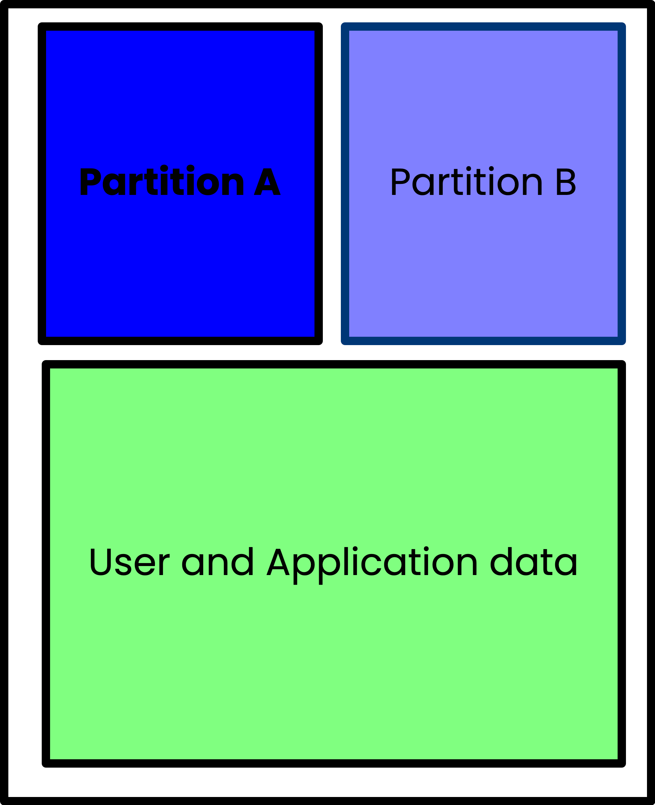

Met dit partitieschema is de kans veel kleiner dat uw Pi vastloopt, omdat u altijd een partitie kunt gebruiken waarvan u weet dat deze goed werkt en waarvan u kunt opstarten.

Bootware versleutelt de A-, B- en DATA-partities. De A- en B-partitie zijn vergrendeld met unieke LUKS-sleutels, wat betekent dat u de Backup-partitie niet kunt benaderen vanaf de Active-partitie. De versleutelde DATA-partitie is toegankelijk vanaf de A- of B-partitie.

Het instellen van dit A/B-partitioneringsschema is meestal vrij omslachtig en moeilijk te implementeren. Zymbit's Bootware heeft dat proces overgenomen en vereenvoudigd, zodat het een relatief eenvoudig proces is. Laten we dat proces nu eens doorlopen en uw Pi zowel veilig als veerkrachtig maken.

### A/B-partities maken

Omdat we nog geen backup B-partitie hebben gehad, maken we er een aan en plaatsen we de huidige image (waarvan we weten dat die goed is, omdat we die momenteel draaien) in die partitie. Om dat te doen, updaten we de configuratie (maken we hem echt) met de `zbcli`-tool.

```bash
$ sudo zbcli update-config
```
```
   Validated bootware installation
  ---------
  Pi Module:         Raspberry Pi 4
  Operating System:  Rpi-Bookworm
  Zymbit module:     Zymkey
  Kernel:            kernel8.img
  ---------
        Info the root file system will be re-partitioned with your chosen configuration.
```

Dit proces zal u enkele vragen stellen om te bepalen hoe u uw partities moet indelen. De eerste is welke apparaatpartitie-indeling u wilt gebruiken. Kies de aanbevolen optie:
```bash
? Select device partition layout after an update ›
❯   [RECOMMENDED] A/B: This will take the remaining disk space available after the boot partition and create two encrypted partitions, each taking up half of the remaining space. Most useful for rollback and reco
       Using partition layout (A/B)
        Info the root file system will be re-partitioned with your chosen configuration.
```
Vervolgens selecteert u het updatebeleid. Kies wederom gewoon de aanbevolen.

```bash
? Select update policy ›
❯   [RECOMMENDED] BACKUP: Applies new updates to current backup filesystem and swap to booting the new updated backup partition as the active partition now. If the new update is bad, it will rollback into the pre
     Running [========================================] 2/1 (00:00:17):                                                                                                                                             WARNING! Detected active partition (28.71GB) is larger than 14.86GB needed for two filesystems.
 Active partition won't be saved!!!
 Changing update mode to UPDATE_BOTH!!!
       Using update mode (UPDATE_BOTH)
        Data partition size currently set to: 512 MB
        Info bootware will create a shared data partition after A/B in size MB specified
```

Vervolgens kunt u de grootte van de datapartitie selecteren. Standaard is dit 512 MB, maar ik raad aan om dit te verhogen naar 1024 MB.

```bash
✔ Enter size of data partition in MB · 1024
       Using Data Partition Size 1024MB
  Defaulting to configured endpoint '/dev/sda1'
        Info update endpoints can be either an HTTPS URL or an external mass storage device like a USB stick.
       Found update name 'z-image-1'
       Saved update name 'z-image-1'
       Using update endpoint '/dev/sda1'
Configuration settings saved
    Finished in 42.1s
```

We hebben nu een systeem dat is geconfigureerd voor A/B-partitionering en dat updates op de back-uppartitie toepast zodra ze beschikbaar zijn.

Om het proces te voltooien, zullen we de update daadwerkelijk toepassen (wat eigenlijk gewoon een kopie is van het momenteel draaiende systeem). Dit zal het opnieuw partitioneren en opnieuw opstarten activeren.

Maar eerst moeten we de publieke sleutel (eerder aangemaakt en opgeslagen op de USB-stick) ophalen, zodat we de image kunnen decoderen. Om dat te doen, kopiëren we deze naar de lokale directory:

```bash
sudo mount /dev/sda1 /mnt
cp /mnt/z-image-1_pub_key.pem .
```

```bash
$ sudo zbcli update
```
```bash
   Validated bootware installation
  ---------
  Pi Module:         Raspberry Pi 4
  Operating System:  Rpi-Bookworm
  Zymbit module:     Zymkey
  Kernel:            kernel8.img
  ---------
     Cleaned '/etc/zymbit/zboot/update_artifacts/tmp'
       Found update configs
? Proceed with current configs? These can be modified through 'zbcli update-config'
  ---------
  Update endpoint   /dev/sda1
  Update name       z-image-1
  Endpoint type     LOCAL
  Partition layout  A/B
  Update policy     UPDATE_BOTH
  ------reading_time: 24 minutes
---
     Created temporary directory (/etc/zymbit/zboot/update_artifacts/tmp/.tmpCfhm6c)
✔ Enter public key file (Pem format) · ./z-image-1_pub_key.pem
     Mounted '/dev/sda1' to '/etc/zymbit/zboot/update_artifacts/tmp/.tmpyKYgR3'
       Found image tarball (/etc/zymbit/zboot/update_artifacts/tmp/.tmpyKYgR3/z-image-1.zi)
    Unpacked '/etc/zymbit/zboot/update_artifacts/tmp/.tmpCfhm6c/update_artifact.tar'
    Unpacked '/etc/zymbit/zboot/update_artifacts/tmp/.tmpCfhm6c/signatures'
    Unpacked '/etc/zymbit/zboot/update_artifacts/tmp/.tmpCfhm6c/header.txt'
    Unpacked '/etc/zymbit/zboot/update_artifacts/tmp/.tmpCfhm6c/file_manifest'
    Unpacked '/etc/zymbit/zboot/update_artifacts/tmp/.tmpCfhm6c/file_deletions'
     Decoded header signature
     Decoded image signature
     Decoded manifest signature
     Decoded deletions signature
       Found header data
       Found image data
       Found manifest data
       Found file deletions data
    Verified header signature
    Verified image signature
    Verified manifest signature
    Verified file deletions signature
    Modified zbconfig 'public_key'
    Modified zbconfig 'new_update_needed'
    Modified zbconfig 'root_a'
    Modified zbconfig 'root_b'
    Modified zbconfig 'root_dev'
      Copied file (/boot/firmware/usr-kernel.enc) to (/boot/firmware/zboot_bkup/usr-kernel-A.enc)
      Copied file (/boot/firmware/kernel8.img) to (/boot/firmware/zboot_bkup/kernel8.img)
    Modified zbconfig 'update_with_new_image'
    Modified zbconfig 'kernel_filename'
? Scheduled update for the next reboot. Reboot now? (y/n) › yes
```

Wanneer u gevraagd wordt om opnieuw op te starten, zegt u ja en wacht u vervolgens.

Nadat uw Pi opnieuw is opgestart, logt u in en controleert u of alles correct is.

```bash
$ lsblk
NAME              MAJ:MIN RM  SIZE RO TYPE  MOUNTPOINTS
sda                 8:0    1 59.8G  0 disk
└─sda1              8:1    1 59.8G  0 part
mmcblk0           179:0    0 29.7G  0 disk
├─mmcblk0p1       179:1    0  512M  0 part  /boot/firmware
├─mmcblk0p2       179:2    0 14.1G  0 part
│ └─cryptrfs_A    254:0    0 14.1G  0 crypt /
├─mmcblk0p3       179:3    0 14.1G  0 part
└─mmcblk0p4       179:4    0    1G  0 part
  └─cryptrfs_DATA 254:1    0 1008M  0 crypt
```

Merk op dat we nu twee `cryptfs`-apparaten hebben. Dit zijn volledig ondertekende en gecodeerde bestandssystemen.

Wat als de update mislukt was? Dit is het mooie van A/B-partitionering met Bootware: als het systeem niet opstart (het bereikt een `systemd init`-doel 3 keer achter elkaar niet), zal Bootware teruggaan naar de bekende goede partitie, waardoor uw apparaat weer online komt.

### Bonusoefening

Hier hebben we gewoon de USB-stick gebruikt als bron voor de update. Maar er zijn andere opties! We kunnen die z-image kopiëren naar een Amazon S3-bucket of een van onze eigen servers en vervolgens bootware configureren om de update van die locatie te halen. U moet dan `zbcli update-config` opnieuw uitvoeren en voor het eindpunt de locatie op internet gebruiken waar u de image hebt opgeslagen.

## Conclusies

We hebben nu een complete, veilige Raspberry Pi vanaf nul gebouwd. En net zo belangrijk, we hebben nu de Pi veilig en beveiligd geüpdatet *en* we kunnen er zeker van zijn dat een mislukte update de Pi niet zal bricken.

Zijn al deze dingen mogelijk zonder een Zymkey en Bootware? Ja, meestal wel. U kunt uw bestandssysteem versleutelen met LUK's, maar dan moet u handmatig beheren waar de sleutel wordt opgeslagen en ervoor zorgen dat u deze veilig bewaart. U kunt ook updates op afstand uitvoeren, maar (en dit is een zeer groot voorbehoud), u hebt geen garanties dat de update zal slagen en dat de update uw apparaat niet zal bricken, of dat de update op geen enkele manier kan worden gemanipuleerd.

Met het apparaat dat we zojuist hebben gebouwd, kunnen we er zeker van zijn dat de bestandssystemen veilig zijn ondertekend en versleuteld, dat we ons geen zorgen hoeven te maken over het beheer van de encryptiesleutels, dat de sleutels zelf veilig zijn opgeslagen en dat we het apparaat betrouwbaar kunnen updaten zonder dat we ons zorgen hoeven te maken dat het apparaat na een update niet meer opstart.

Als u nog vragen hebt, of meer wilt praten over Bootware, Zymkey, of een van de onderwerpen die hier worden behandeld, sluit u dan aan bij onze [community](https://community.zymbit.com)! We horen graag uw feedback en beantwoorden al uw vragen.
