## TL;DR

Den ehrwürdigen Raspberry Pi gibt es seit über einem Jahrzehnt (offiziell 2009 entwickelt) und er ist in vielen Bereichen der Robotik, der Heimautomatisierung und anderen Anwendungen zum Standard geworden. Besonders für „Macher“ und andere Bastler. Aber er hat auch ernsthafte Fortschritte in der Berufs- und Unternehmenswelt gemacht – nur eben leiser.

Es handelt sich um einen leistungsfähigen, zuverlässigen und leistungsstarken Single Board Computer (SBC) mit einer starken Benutzercommunity. Trotz all seiner Stärken weist er jedoch auch einige nennenswerte Schwächen auf. Die größte davon ist die Sicherheit. Nicht, weil der SBC selbst unsicher ist, und auch nicht, weil das Betriebssystem (OS) unsicher ist (es läuft Linux, das sehr gut gesichert werden kann). Die größte Schwachstelle des Raspberry Pi ist die Tatsache, dass er von einer Micro-SD-Karte bootet und läuft.

Dieser Startmechanismus über die Micro-SD-Karte ist zwar praktisch, macht den Pi aber extrem anfällig für physische Manipulationen. Schließlich kann jemand einfach zum Pi gehen, die SD-Karte entfernen und hat Zugriff auf alle laufenden Programme und Daten. Er kann die Karte in seinen eigenen Pi stecken und hat vollen Zugriff auf alles. Nun ja, mit ein bisschen Passwort-Hacking usw.

Um aus einem Raspberry Pi ein sicheres Gerät für den Einsatz von Anwendungen im Feld zu machen, ist es entscheidend, den Pi absolut sicher gegen physische und elektronische Manipulationen zu machen.

Nahtlose Updates Ihres Pi sind außerdem oft mühsam. Besonders, wenn Sie mehr als eine Handvoll davon haben. Sie müssen sich bei jedem anmelden, die Updates ausführen und dann hoffen, dass nichts schief geht.

Das führt mich zur Wiederherstellbarkeit. Was passiert, wenn eines dieser Updates aus irgendeinem Grund fehlschlägt? Insbesondere, wenn es sich an einem entfernten Standort befindet. Wie stellen Sie sicher, dass das Gerät wiederherstellbar ist, und wie können Sie es so schnell wie möglich wieder online bringen?

Natürlich werde ich sehr viel Stoff abdecken, aber am Ende werde ich Ihnen zeigen, wie Sie Ihren Raspberry Pi vor physischen Manipulationen schützen können, sodass es praktisch unmöglich wird, Ihre Programme und Daten zu stehlen, wie Sie sichere Remote-Updates durchführen und wie Sie sicherstellen, dass diese Updates im Fehlerfall wiederherstellbar sind.

## Lass uns einen neuen Pi bauen

Lassen Sie uns zunächst einen Raspberry Pi von Grund auf neu bauen. Wenn Sie an diesem Teil nicht interessiert sind und nur einen vorhandenen Pi sichern möchten, scrollen Sie nach unten zum Abschnitt [Sichern Ihres Pi](#securing-your-pi)

Hier sind alle Dinge, die Sie benötigen, um dies abzuschließen. Ich werde Links zu den Dingen einfügen, mit denen ich direkte, persönliche Erfahrung habe.

- Raspberry Pi (ich verwende einen [Raspberry Pi 4](https://amzn.to/3Y2BBgn), aber Sie können auch einen [Raspberry Pi 5](https://amzn.to/4dAKfZ3) verwenden, wenn Sie das bevorzugen)
- [Netzteil](https://amzn.to/4eWmYSr) für Ihren Pi. Es ist wichtig, ein gutes Netzteil zu verwenden, das genügend Strom für den Pi4 oder Pi5 liefert. Das offizielle Netzteil der Pi Foundation wird empfohlen.
- Hochwertige [Micro-SD-Karte](https://amzn.to/3U2Twm1). Ich empfehle eine 32 GB-Karte.
- [SD-Kartenleser/-schreiber](https://amzn.to/4dEs2Kc) (falls in Ihrem Computer keiner eingebaut ist)
- Hochwertiger USB-Stick (Hinweis: Er sollte doppelt so groß sein wie Ihre SD-Karte). Mir gefällt [dieser](https://amzn.to/3NrH4Iz) von PNY.
- Zymkey, HSM4 oder HSM6 (ich verwende hier einen [Zymkey](https://amzn.to/4eRcIvn), aber ein HSM6 funktioniert genauso gut, wenn Sie eine Hardware-Signierung wünschen)
- [CR1025-Batterie](https://amzn.to/4eJG1Qt) (eine Batterie ist nicht unbedingt erforderlich, ich füge sie hier jedoch der Vollständigkeit halber hinzu. Der Zymkey verwendet sie, um die Echtzeituhr (RTC) aufrechtzuerhalten.)

### Formatieren und erstellen Sie ein Image Ihrer Micro SD

Nachdem Sie nun alle Teile zusammengebaut haben, können wir loslegen. Ich verwende das Tool [Raspberry Pi Imager](https://www.raspberrypi.com/software/), aber Sie können auch [Balena Etcher](https://etcher.balena.io) oder ein anderes SD-Karten-Imaging-Tool Ihrer Wahl verwenden.

Wenn Sie den Pi Imager zum ersten Mal starten, werden Sie feststellen, dass Sie einige Entscheidungen treffen müssen:


Zuerst müssen Sie auswählen, welches Pi-Modell Sie haben. Ich verwende einen Pi 4

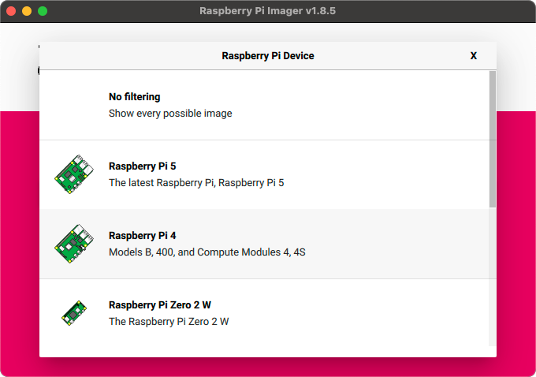

Wählen Sie natürlich die Hardware aus, die Sie haben. Als Nächstes wählen Sie das Betriebssystem. Wir werden die neueste Version verwenden (Bookworm, 64-Bit), aber wir werden nicht die vollständige Desktop-Umgebung benötigen, also wähle ich die „Lite“-Version.

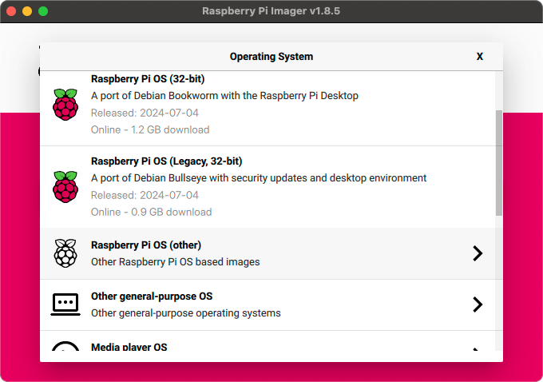

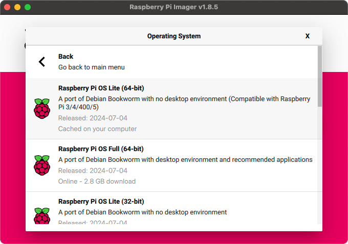

Als Nächstes identifizieren Sie die Micro-SD-Karte, auf die Sie schreiben möchten. Wenn Sie dies noch nicht getan haben, legen Sie die Micro-SD-Karte in den SD-Kartenschreiber ein und schließen Sie ihn an Ihren Computer an.

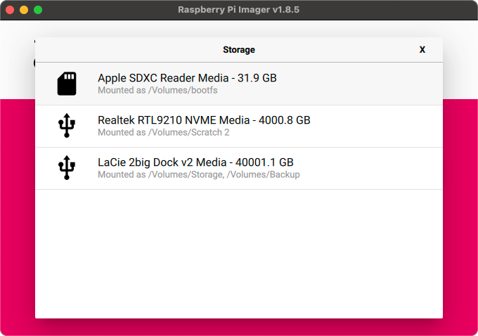

Der letzte Schritt vor dem eigentlichen Schreiben des Betriebssystems auf die Festplatte besteht darin, alle weiteren Einstellungen vorzunehmen, die Sie für den Pi wünschen. Ich empfehle zumindest, einen Hostnamen und einen Benutzernamen/ein Passwort einzurichten, und wenn Sie Ihr lokales WLAN verwenden möchten, die WLAN-Anmeldeinformationen.

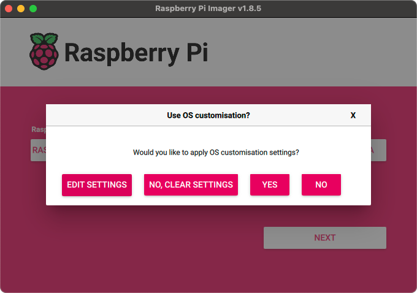

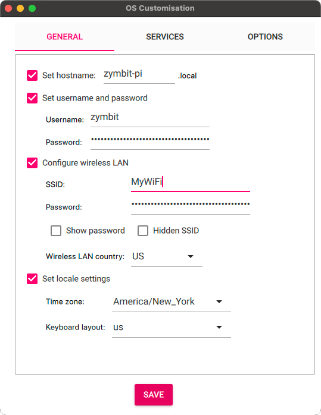

Sobald Sie alle Einstellungen richtig vorgenommen haben, ist es an der Zeit, alles auf die Karte zu schreiben. Beachten Sie, dass dabei alle vorhandenen Daten auf der SD-Karte vollständig gelöscht werden. Seien Sie also vorsichtig.

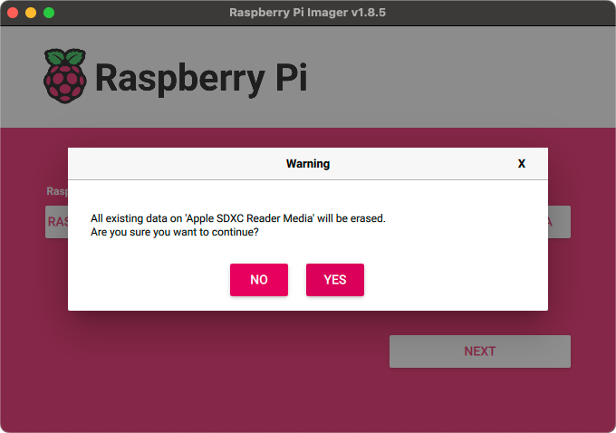

Danach können Sie sich entspannt zurücklehnen und eine Tasse Kaffee genießen, während Ihr Betriebssystem auf die Karte geschrieben wird. Sobald dies erledigt ist, können wir mit der Konfiguration der Hardware fortfahren.

### Richten Sie die Hardware ein

Das ist immer mein Lieblingsteil! Sehen wir uns zunächst an, was wir brauchen:

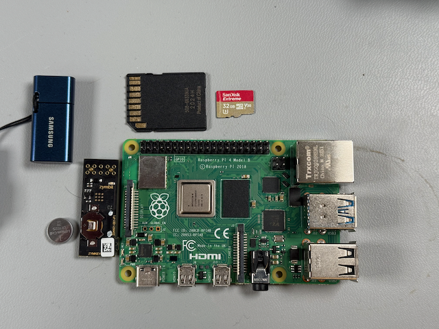

Bevor wir den Pi anschließen, bauen wir den Zymkey zusammen und installieren ihn. Sie müssen lediglich die CR1025-Batterie in den Batteriehalter einsetzen.

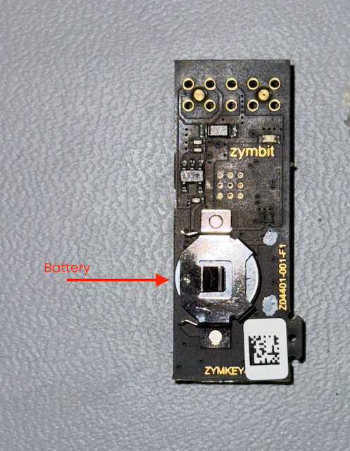

Stellen Sie sicher, dass der Zymkey richtig auf den Stiftleisten sitzt.

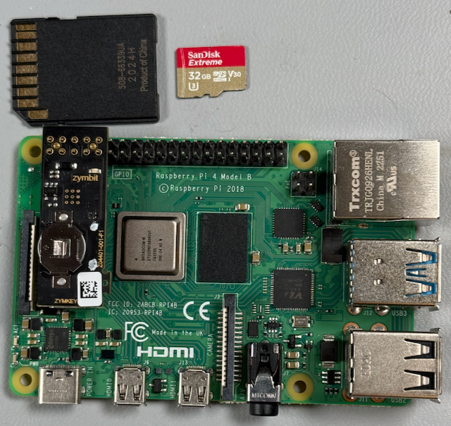

Sobald die Hardware vollständig zusammengebaut ist, stecken Sie die SD-Karte in den Steckplatz auf der Unterseite des Pi.

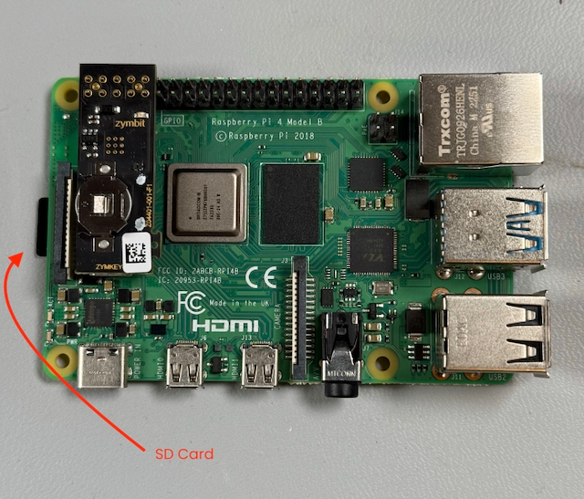

Jetzt ist es an der Zeit, den Pi an die Stromversorgung anzuschließen, auf den Bootvorgang zu warten und mit der Einrichtung unserer Sicherheit zu beginnen!

## Sichern Sie Ihren Pi

Jetzt, da unser Pi reibungslos läuft, können wir uns der wichtigen Aufgabe widmen, sicherzustellen, dass er sicher, aktualisierbar und wiederherstellbar ist. In dieser Reihenfolge.

### Konfigurieren Sie Ihren Zymkey

Bevor wir den Zymkey konfigurieren können, müssen wir sicherstellen, dass der Pi mit ihm kommunizieren kann. Die Zymkey-Software kommuniziert über I2C mit dem Gerät, daher müssen wir sicherstellen, dass die I2C-Schnittstelle des Pi aktiviert ist.

```bash
$ sudo raspi-config
```
Bringt Sie zum Konfigurationsprogramm.

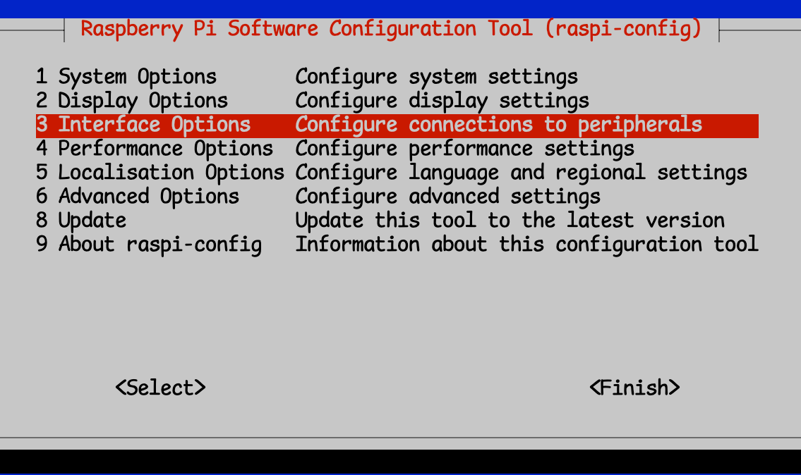

Wählen Sie dann „Schnittstellenoptionen“ und dann „I2C“

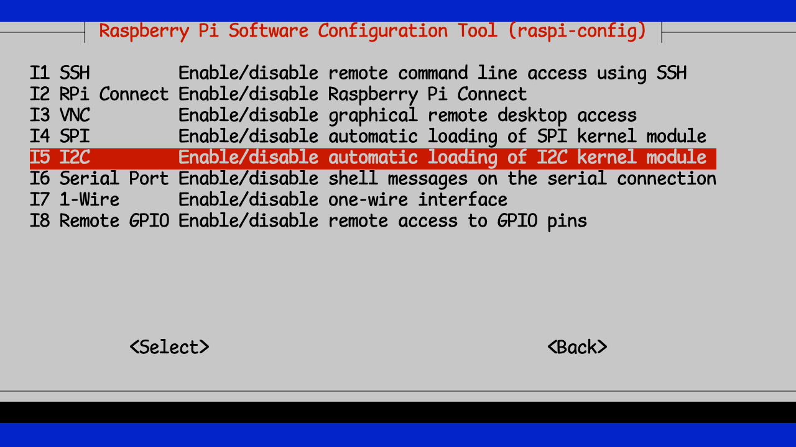

Sie können dann raspi-config beenden und speichern

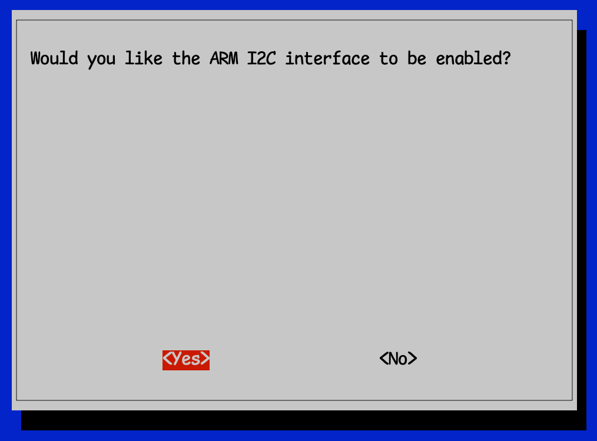

Alle diese Schritte werden in der [Dokumentation](https://docs.zymbit.com/getting-started/zymkey/quickstart/) ausführlicher behandelt. Wenn hier also etwas unklar ist, können Sie es dort immer noch einmal überprüfen.

Als nächstes müssen wir die erforderliche Zymkey-Software installieren.

```bash
$ curl -G https://s3.amazonaws.com/zk-sw-repo/install_zk_sw.sh | sudo bash
```
Installiert alle Updates und lädt anschließend die erforderliche Zymbit-Software herunter und installiert sie.

> **Hinweis**: Die Installation dieser Software löst einen automatischen Neustart des Pi aus, Sie sollten daher während der Installation der Software nichts anderes damit tun.

Nach Abschluss des Neustarts sollten Sie feststellen, dass das blaue Licht nicht mehr schnell blinkt, sondern alle 3 Sekunden einmal. Dies ist Ihr Hinweis darauf, dass die Zymbit-Software ordnungsgemäß installiert ist und mit dem Zymkey kommunizieren kann.

Wenn Sie testen möchten, ob Zymkey installiert ist und ordnungsgemäß funktioniert, können Sie die Testskripte herunterladen und installieren:

```bash
wget https://community.zymbit.com/uploads/short-url/eUkHVwo7nawfhESQ3XwMvf28mBb.zip
unzip eUkHVwo7nawfhESQ3XwMvf28mBb.zip
sudo mkdir -p /usr/local/share/zymkey/examples/
sudo mv *.py /usr/local/share/zymkey/examples/
python3 /usr/local/share/zymkey/examples/zk_app_utils_test.py
```
```bash
Testing data lock...
Original Data
01 02 03 04
Encrypted Data
8B B8 06 67 00 00 35 80 82 75 AA BE 89 8C A8 D5
6D 7B 71 48 83 47 B9 9A B7 3A 09 58 41 E6 33 BC
4E 48 7A 32 3A B0 26 D8 59 4F 8C 58 59 97 03 20
3C 99 CF AF 2D CC 47 E5 1B AB 83 FC 6A 3D DE D8
F3 24 9F 73 B5 72 B7 0D 77 8E C6 A8 A3 B3 22 D6
94 8F BD 6A 6C 96 38 EE
Testing data unlock...
Decryped Data
01 02 03 04
Turning LED on...
Testing get_random() with 512 bytes...
B7 B6 BD 78 C6 62 7A CC 80 E0 BD 04 C7 43 29 AC
7A 48 2D 3F E5 43 33 AA 7C 37 F6 BA 7D 3F F2 D3
A9 4B B3 A9 16 4C FD AD 48 61 72 9E 7F B9 09 AE
A7 4A 4F 54 0D CE 6E 85 E6 87 F5 8C D6 58 4B 0E
12 03 4C 71 BD 3A F0 34 79 06 66 5E 65 DC 6E CF
AF 12 72 C1 F1 5D 24 79 A8 D0 F9 40 3E 8E 59 D7
5C ED C5 1E 0E FF 4A 04 69 22 54 F5 13 A1 2E A7
3C B4 CD 30 E7 61 10 B7 E5 07 AD DC E0 FF E9 6E
58 32 50 DA 9F 33 51 F5 8C 16 B5 0C 0F 57 08 E6
E8 00 89 79 DF 16 2A BD FC 27 E0 E4 6C 1B 05 28
EB DE 5B 63 2E F0 E0 21 E8 C5 39 31 26 2A E5 64
79 31 04 7A 60 ED D7 32 6A 8B 4A 29 DD 79 EC D9
2B 72 AC 2E 9A 08 FF 56 06 DB 1C 91 FF D9 3F 10
3E 57 9C 5E B4 32 FD 2E 09 BF 8D 04 6A C8 12 88
06 7C C1 93 FD F7 61 47 90 DD 0D 50 78 78 6C 83
0A 94 DD 5E 9D 83 3F FD 0B 1E 73 23 72 0D 4D D1
82 1F 42 DB EE 1E 7F 85 B9 F1 94 24 54 1B 28 2E
47 24 05 8B 17 0B AE 90 6A DF 0B BC E1 53 B2 96
1C 87 D4 FD A0 EC FC 85 E4 9F 04 F6 B8 E0 37 B2
40 17 33 3A FA 96 01 0C B2 4C 4D FE E7 64 0E 87
4E 4B A8 D0 97 C6 A5 42 F4 02 E4 CC 7C 2B 3A A8
C7 33 22 3C 76 1C 40 42 1F 5A 78 7B 23 FB 0B 39
BD 9F 38 13 6B FE D9 54 C9 D2 F3 97 C6 39 F3 09
9C 6B DC 82 C1 25 99 70 8B 2B 46 FD CD 51 C9 09
20 16 DA 4C D3 58 B6 BB D7 C3 E4 A9 34 F0 5C 85
D7 19 6D A8 F7 26 D6 41 6F 27 04 2C A0 C4 50 9D
28 43 0D DC E2 7E D4 9E 29 FE 45 B2 BF 14 77 A7
AD F4 43 4B 51 85 85 06 7F 02 BF 21 DA C4 BD A4
9B 94 71 FA 21 8B 9E B6 07 48 7F 50 A7 CF 32 2F
8F 98 A1 E1 FE 1B 2E 24 B5 BF 69 E7 DE 3D 11 6C
48 5B 56 5C BF 96 FB 30 BB 86 13 C4 53 61 AD 6E
09 0C A9 4B C1 2F 12 3F BF 34 FB 01 D7 62 13 7A
Turning LED off...
Flashing LED off, 500ms on, 100ms off...
Testing zkCreateRandDataFile with 1MB...
Turning LED off...
Testing get_ecdsa_public_key()...
20 AD 20 7A 0E D9 A5 81 BF 44 80 54 C6 DC A7 8C
D1 D5 7B EE 6D C5 E3 B4 92 8C 0E BF 42 6E D9 9E
AA 04 29 CD 4C D9 3A BC 58 5B DD 47 43 39 30 C8
2E FD C6 D9 C9 82 60 06 A4 A0 7F EA F9 C0 76 E9
Testing create_ecdsa_public_key_file()...
$ python3 /usr/local/share/zymkey/examples/zk_crypto_test.py
Signing data...OK
Verifying data...OK
Verifying tainted data...FAIL, yay!
Generating random block from Zymkey (131072 bytes)...
Encrypting random block...
Decrypting encrypted block...
PASS: Decrypted data matches original random data
Done!
```

Glückwunsch!

## Endlich Sicherheit

Nachdem wir nun ein geeignetes Sicherheitsgerät installiert, getestet und einsatzbereit haben, sichern wir es. Stellen wir gleichzeitig sicher, dass wir das Gerät bei Bedarf sicher aktualisieren können und dass es so konstruiert ist, dass es im Falle eines fehlgeschlagenen Updates wiederherstellbar ist.

Normalerweise wäre das eine Menge Arbeit, aber wir vereinfachen alles und erledigen praktisch alles auf einmal.

### Ein Ort zum Ablegen des Sicherungsimages

Da wir Bootware(r) verwenden, um unser Gerät zu sichern, benötigen wir einen Ort, an den das System die gesamte SD-Karte kopieren kann, während es sie verschlüsselt. Hierfür verwenden wir ein USB-Laufwerk.

Wir müssen sicherstellen, dass wir unser USB-Laufwerk richtig verwenden können. Ich verwende es oft für andere Aufgaben wieder, also beginne ich gerne wie folgt. Nachdem ich das USB-Laufwerk angeschlossen habe, stelle ich sicher, dass ich das Laufwerk „auf Null“ setze und dann eine brandneue Partitionszuordnung und ein neues Dateisystem darauf erstelle.

```bash
sudo dd if=/dev/zero of=/dev/sda bs=512 count=1 conv=notrunc
```
```bash
1+0 records in
1+0 records out
512 bytes copied, 0.0197125 s, 26.0 kB/s
```

Dadurch wird das vorherige Dateisystem (sofern vorhanden) gelöscht.

```bash
sudo fdisk -W always /dev/sda
```
```bash
Welcome to fdisk (util-linux 2.38.1).
Changes will remain in memory only, until you decide to write them.
Be careful before using the write command.

Device does not contain a recognized partition table.
Created a new DOS (MBR) disklabel with disk identifier 0x27b0681a.

Command (m for help): n
Partition type
   p   primary (0 primary, 0 extended, 4 free)
   e   extended (container for logical partitions)
Select (default p): p
Partition number (1-4, default 1):
First sector (2048-125313282, default 2048):
Last sector, +/-sectors or +/-size{K,M,G,T,P} (2048-125313282, default 125313282):

Created a new partition 1 of type 'Linux' and of size 59.8 GiB.
Partition #1 contains a ext4 signature.

The signature will be removed by a write command.

Command (m for help): w
The partition table has been altered.
Calling ioctl() to re-read partition table.
Syncing disks.
```

Die wichtigen Teile sind: Nachdem Sie `sudo fdisk -W always /dev/sda` eingegeben haben, geben Sie `n` ein, um eine neue Partitionszuordnung zu erstellen. Dann `p`, um sie zu einer primären Partition zu machen, und schließlich `w`, um die Partitionszuordnung auf die Festplatte zu schreiben. Für alles andere akzeptiere ich einfach die angezeigten Standardeinstellungen.

Da wir nun ein partitioniertes USB-Laufwerk haben, müssen wir darauf schließlich ein richtiges Dateisystem erstellen.

```bash
sudo mkfs.ext4 -j /dev/sda1 -F
```
```bash
mke2fs 1.47.0 (5-Feb-2023)
Creating filesystem with 15663904 4k blocks and 3916304 inodes
Filesystem UUID: 4a3af5d0-bac4-4903-965f-aa6caa8532cf
Superblock backups stored on blocks:
  32768, 98304, 163840, 229376, 294912, 819200, 884736, 1605632, 2654208,
  4096000, 7962624, 11239424

Allocating group tables: done
Writing inode tables: done
Creating journal (65536 blocks): done
Writing superblocks and filesystem accounting information: done
```

> **Tipp**: Wenn Sie es wie ich leid sind, ständig `sudo` einzugeben, können Sie `sudo -i` einmal ausführen und erhalten eine Root-Eingabeaufforderung, von der aus Sie alle Ihre Befehle ausführen können. Aber denken Sie daran: Mit viel Macht geht auch viel Verantwortung einher!

### Bootware(r) installieren

Bootware ist das Zymbit-Tool zum Sichern und Aktualisieren Ihres Raspberry Pi. Es ist ein leistungsstarkes Tool, mit dem Sie einen oder eine ganze Pi-Flotte in Ihrem Unternehmen aktualisieren können. Und Sie können dies sicher und zuverlässig tun und auf eine Weise, die wiederherstellbar ist, wenn etwas schief geht.

Zuerst müssen wir das Installationsprogramm ausführen

```bash
$ curl -sSf https://raw.githubusercontent.com/zymbit-applications/zb-bin/main/install.sh | sudo bash
```

Dieses Installationsprogramm wird Ihnen ein paar einfache Fragen stellen, also gehen wir die Antworten durch. Die erste ist, ob Sie Hardware Signing einschließen möchten oder nicht. Wenn Sie ein HSM6- oder SCM-basiertes Produkt haben, können Sie diese Frage mit „Ja“ beantworten. Wenn Sie einen Zymkey oder HSM4 haben, wird Hardware Signing nicht unterstützt, Sie müssen es also nicht installieren. Selbst mit Software Signing werden Ihre endgültigen LUKS-verschlüsselten Partitionen durch die Zymbit-HSM-Schlüssel geschützt.

Als nächstes werden Sie gefragt, welche Bootware-Version installiert werden soll. Wählen Sie die aktuellste Version.

```bash
zb-install.sh: bootstrapping the zbcli installer
  ---------
  Pi Module:         Raspberry Pi 4/Compute Module 4
  Operating System:  Rpi-Bookworm
  Zymbit module:     Zymkey
  Kernel:            kernel8.img
  ---------

✔ 'zbcli' comes with software signing by default. Include hardware key signing? (Requires SCM or HSM6) · No
✔ Select version · zbcli-1.2.0-rc.26
Installing zbcli
Installed zbcli. Run 'zbcli install' to install Bootware onto your system or 'zbcli --help' for more options.
zb-install.sh: cleaning up
```

Nachdem das Installationsprogramm nun bereit ist, ist es Zeit, die Bootware selbst zu installieren:

```bash
sudo zbcli install
```

Wenn das Installationsprogramm abgeschlossen ist, werden Sie gefragt, ob Sie zum Neustart bereit sind:

```bash
  ---------
  Pi Module:         Raspberry Pi 4
  Operating System:  Rpi-Bookworm
  Zymbit module:     Zymkey
  Kernel:            kernel8.img
  ---------
       Found kernel '/boot/firmware/kernel8.img'
     Created '/etc/zymbit/zboot/mnt'
     Created '/etc/zymbit/zboot/scripts'
     Created '/etc/zymbit/zboot/zboot_backup'
     Created '/boot/firmware/zboot_bkup'
   Installed 'u-boot-tools'
     Created '/etc/fw_env.config'
     Created '/usr/bin/zbconfig'
       Found OpenSSL 3
     Created '/boot/firmware/zb_config.enc'
    Modified zbconfig 'kernel_filename'
   Installed zboot
    Modified '/etc/rc.local'
     Created '/lib/cryptsetup/scripts/zk_get_shared_key'
    Modified '/boot/firmware/config.txt'
     Created '/etc/update-motd.d/01-zymbit-fallback-message'
    Modified /etc/update-motd.d/01-zymbit-fallback-message
✔ A reboot into zboot is required. Reboot now? · yes
    Finished in 29.1s
```

### Bootware konfigurieren

Hier beginnt der wahre Spaß! Wenn Sie schon einmal LUKS zum Verschlüsseln eines Pi-Dateisystems verwendet haben, wissen Sie, dass dies zwar ein großer Schritt zur Sicherung Ihres Pi ist, Sie den Verschlüsselungsschlüssel jedoch trotzdem irgendwo speichern müssen, wo er beim Booten zugänglich ist.

Mit Bootware und einem Zymbit-HSM wird der LUKS-Verschlüsselungsschlüssel durch das Zymbit-HSM gesperrt, was ihn wesentlich sicherer macht. Bootware erwartet, dass das Boot-Image in einem bestimmten, verschlüsselten Format vorliegt, das als Z-Image bezeichnet wird. Das Bootware-CLI-Tool unterstützt Sie beim Erstellen und Verwalten dieser Images für die Bereitstellung in Ihrem Unternehmen.

Erstellen wir also unser erstes Z-Image und verwenden das aktuelle System als Grundlage dafür.

Zuerst müssen wir das USB-Laufwerk mounten, damit wir einen Platz für unser Z-Image haben:

```bash
$ sudo mount /dev/sda1 /mnt
```

Als Nächstes führen wir das Imaging-Tool aus, um ein verschlüsseltes Z-Image unseres aktuellen Systems zu erstellen:

```bash
sudo zbcli imager
```
```bash
   Validated bootware installation
  ---------
  Pi Module:         Raspberry Pi 4
  Operating System:  Rpi-Bookworm
  Zymbit module:     Zymkey
  Kernel:            kernel8.img
  ---------
     Created '/etc/zymbit/zboot/update_artifacts/tmp'
✔ Enter output directory · /mnt
✔ Enter image name · z-image-1
✔ Select image type · Full image of live system
✔ (Optional) enter image version · 1.0
✔ Select key · Create new software key
```

Beachten Sie, dass ich den Einhängepunkt für das USB-Laufwerk als Ausgabeverzeichnis verwendet habe. Anschließend habe ich einen Namen und eine Versionsnummer für das Image ausgewählt und mich für die Verwendung eines Softwareschlüssels entschieden, da ich einen Zymkey verwende.

Seien Sie nicht überrascht, wenn dieser Schritt eine Weile dauert. Dabei wird eine vollständige Kopie der Dateien auf der laufenden Festplatte erstellt und mit dem generierten Hardwareschlüssel signiert.


```bash
     Created signing key
     Created '/etc/zymbit/zboot/update_artifacts/file_manifest'
     Created '/etc/zymbit/zboot/update_artifacts/file_deletions'
    Verified path unmounted '/etc/zymbit/zboot/mnt'
     Cleaned '/etc/zymbit/zboot/mnt'
     Deleted '/etc/crypttab'
    Verified disk size (required: 2.33 GiB, free: 26.39 GiB)
     Created initramfs
     Created snapshot of boot (/etc/zymbit/zboot/update_artifacts/tmp/.tmpBgEBJk/z-image-1_boot.tar)
     Created snapshot of root (/etc/zymbit/zboot/update_artifacts/tmp/.tmpBgEBJk/z-image-1_rfs.tar)
     Created '/mnt/tmp'
     Cleaned '/mnt/tmp'
     Created staging directory (/mnt/tmp/.tmpEhjNN7)
     Created '/mnt/tmp/.tmpEhjNN7/header.txt'
     Created tarball (/mnt/tmp/.tmpEhjNN7/update_artifact.tar)
     Created header signature
     Created update artifact signature
     Created file manifest signature
     Created file deletions signature
     Created '/mnt/tmp/.tmpEhjNN7/signatures'
     Created signatures (/mnt/tmp/.tmpEhjNN7/signatures)
      Copied file (/etc/zymbit/zboot/update_artifacts/file_manifest) to (/mnt/tmp/.tmpEhjNN7/file_manifest)
      Copied file (/etc/zymbit/zboot/update_artifacts/file_deletions) to (/mnt/tmp/.tmpEhjNN7/file_deletions)
     Created tarball (/mnt/z-image-1.zi)
     Created '/mnt/z-image-1_private_key.pem'
       Saved private key '/mnt/z-image-1_private_key.pem'
     Created '/mnt/z-image-1_pub_key.pem'
       Saved public key '/mnt/z-image-1_pub_key.pem'
     Cleaned '/mnt/tmp'
       Saved image '/mnt/z-image-1.zi' (2.33 GiB)
    Finished in 384.8s
```

Das öffentliche/private Schlüsselpaar ist auf dem USB-Laufwerk gespeichert und wir werden es später brauchen.

### A/B-Partitionierung

Hier sind einige Hintergrundinformationen wahrscheinlich angebracht. Die Idee der A/B-Partitionierung ist ein wichtiges Konzept für die Wiederherstellbarkeit. Wenn Sie eine einzelne Festplattenpartition haben, von der Ihre Geräte booten, und Sie kritische Elemente in dieser Partition aktualisieren, die irgendwie beschädigt sind, kann Ihr Gerät in einem Zustand zurückbleiben, in dem es unmöglich ist, es zu booten oder wiederherzustellen. Es ist blockiert. Die einzige Möglichkeit, ein solches Gerät wiederherzustellen, besteht normalerweise darin, physisch auf das Gerät zuzugreifen und direkte Änderungen an der SD-Karte vorzunehmen. Dies ist nicht immer praktisch oder sogar möglich.

Mit der A/B-Partitionierung erstellen Sie Dual-Boot-Partitionen und führen nur von einer aus. Das ist die bekanntermaßen funktionierende oder primäre Partition. Sie haben dann eine sekundäre Partition, auf die Sie Updates anwenden können. Sobald ein Update auf die sekundäre Partition angewendet wurde, startet das Gerät von dieser neu aktualisierten Partition neu. Wenn das Update erfolgreich ist, ist Ihr System wieder einsatzbereit und diese Partition wird dann als primäre Partition markiert und wird von nun an von dieser bekanntermaßen funktionierenden Partition neu gestartet.

Wenn die Aktualisierung aus irgendeinem Grund fehlschlägt und das Gerät nicht ordnungsgemäß von der aktualisierten Partition booten kann, wird das System von der zuvor verwendeten primären Partition neu gestartet und kann weiter ausgeführt werden, bis eine korrigierte Aktualisierung bereitgestellt werden kann.

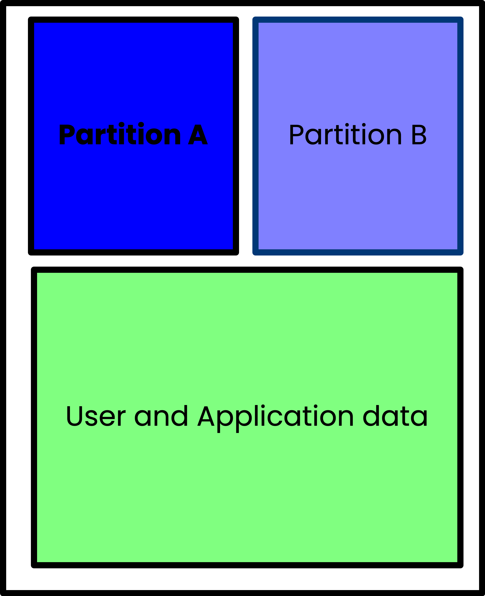

Mit diesem Partitionierungsschema ist die Wahrscheinlichkeit, dass Ihr Pi blockiert wird, wesentlich geringer, da Sie jederzeit eine bekanntermaßen funktionierende Partition zum Booten aufrechterhalten können.

Bootware verschlüsselt die Partitionen A, B und DATA. Die Partitionen A und B sind mit einzigartigen LUKS-Schlüsseln gesperrt, was bedeutet, dass Sie von der aktiven Partition aus nicht auf die Backup-Partition zugreifen können. Auf die verschlüsselte DATA-Partition kann entweder von der Partition A oder B aus zugegriffen werden.

Das Einrichten dieses A/B-Partitionierungsschemas ist normalerweise recht umständlich und schwierig umzusetzen. Die Bootware von Zymbit hat diesen Prozess übernommen und so vereinfacht, dass er relativ einfach ist. Lassen Sie uns diesen Prozess jetzt durchgehen und Ihren Pi sowohl sicher als auch widerstandsfähig machen.

### Erstellen Sie A/B-Partitionen

Da wir bisher keine Backup-Partition B hatten, erstellen wir eine und platzieren das aktuelle Image (von dem wir wissen, dass es gut ist, da wir es gerade ausführen) in dieser Partition. Dazu aktualisieren wir die Konfiguration (erstellen sie wirklich) mit dem Tool `zbcli`.

```bash
$ sudo zbcli update-config
```
```
   Validated bootware installation
  ---------
  Pi Module:         Raspberry Pi 4
  Operating System:  Rpi-Bookworm
  Zymbit module:     Zymkey
  Kernel:            kernel8.img
  ---------
        Info the root file system will be re-partitioned with your chosen configuration.
```

Bei diesem Vorgang werden Ihnen einige Fragen gestellt, um zu bestimmen, wie Sie Ihre Partitionen anordnen möchten. Die erste ist, welches Gerätepartitionslayout Sie verwenden möchten. Wählen Sie die empfohlene Option:
```bash
? Select device partition layout after an update ›
❯   [RECOMMENDED] A/B: This will take the remaining disk space available after the boot partition and create two encrypted partitions, each taking up half of the remaining space. Most useful for rollback and reco
       Using partition layout (A/B)
        Info the root file system will be re-partitioned with your chosen configuration.
```
Als Nächstes wählen Sie die Update-Richtlinie aus. Wählen Sie auch hier einfach die empfohlene Richtlinie aus.

```bash
? Select update policy ›
❯   [RECOMMENDED] BACKUP: Applies new updates to current backup filesystem and swap to booting the new updated backup partition as the active partition now. If the new update is bad, it will rollback into the pre
     Running [========================================] 2/1 (00:00:17):                                                                                                                                             WARNING! Detected active partition (28.71GB) is larger than 14.86GB needed for two filesystems.
 Active partition won't be saved!!!
 Changing update mode to UPDATE_BOTH!!!
       Using update mode (UPDATE_BOTH)
        Data partition size currently set to: 512 MB
        Info bootware will create a shared data partition after A/B in size MB specified
```

Als Nächstes können Sie die Größe der Datenpartition auswählen. Der Standardwert beträgt 512 MB, ich schlage jedoch vor, diesen Wert auf 1024 MB zu erhöhen.

```bash
✔ Enter size of data partition in MB · 1024
       Using Data Partition Size 1024MB
  Defaulting to configured endpoint '/dev/sda1'
        Info update endpoints can be either an HTTPS URL or an external mass storage device like a USB stick.
       Found update name 'z-image-1'
       Saved update name 'z-image-1'
       Using update endpoint '/dev/sda1'
Configuration settings saved
    Finished in 42.1s
```

Wir verfügen jetzt über ein System, das für die A/B-Partitionierung konfiguriert ist und Updates auf die Sicherungspartition anwendet, sobald diese verfügbar sind.

Um den Vorgang abzuschließen, wenden wir das Update an (das eigentlich nur eine Kopie des aktuell laufenden Systems ist). Dies löst die Neupartitionierung und einen Neustart aus.

Zuerst müssen wir jedoch den öffentlichen Schlüssel abrufen (der zuvor erstellt und auf dem USB-Laufwerk gespeichert wurde), damit wir das Image entschlüsseln können. Kopieren wir ihn dazu in das lokale Verzeichnis:

```bash
sudo mount /dev/sda1 /mnt
cp /mnt/z-image-1_pub_key.pem .
```

```bash
$ sudo zbcli update
```
```bash
   Validated bootware installation
  ---------
  Pi Module:         Raspberry Pi 4
  Operating System:  Rpi-Bookworm
  Zymbit module:     Zymkey
  Kernel:            kernel8.img
  ---------
     Cleaned '/etc/zymbit/zboot/update_artifacts/tmp'
       Found update configs
? Proceed with current configs? These can be modified through 'zbcli update-config'
  ---------
  Update endpoint   /dev/sda1
  Update name       z-image-1
  Endpoint type     LOCAL
  Partition layout  A/B
  Update policy     UPDATE_BOTH
  ------reading_time: 24 minutes
---
     Created temporary directory (/etc/zymbit/zboot/update_artifacts/tmp/.tmpCfhm6c)
✔ Enter public key file (Pem format) · ./z-image-1_pub_key.pem
     Mounted '/dev/sda1' to '/etc/zymbit/zboot/update_artifacts/tmp/.tmpyKYgR3'
       Found image tarball (/etc/zymbit/zboot/update_artifacts/tmp/.tmpyKYgR3/z-image-1.zi)
    Unpacked '/etc/zymbit/zboot/update_artifacts/tmp/.tmpCfhm6c/update_artifact.tar'
    Unpacked '/etc/zymbit/zboot/update_artifacts/tmp/.tmpCfhm6c/signatures'
    Unpacked '/etc/zymbit/zboot/update_artifacts/tmp/.tmpCfhm6c/header.txt'
    Unpacked '/etc/zymbit/zboot/update_artifacts/tmp/.tmpCfhm6c/file_manifest'
    Unpacked '/etc/zymbit/zboot/update_artifacts/tmp/.tmpCfhm6c/file_deletions'
     Decoded header signature
     Decoded image signature
     Decoded manifest signature
     Decoded deletions signature
       Found header data
       Found image data
       Found manifest data
       Found file deletions data
    Verified header signature
    Verified image signature
    Verified manifest signature
    Verified file deletions signature
    Modified zbconfig 'public_key'
    Modified zbconfig 'new_update_needed'
    Modified zbconfig 'root_a'
    Modified zbconfig 'root_b'
    Modified zbconfig 'root_dev'
      Copied file (/boot/firmware/usr-kernel.enc) to (/boot/firmware/zboot_bkup/usr-kernel-A.enc)
      Copied file (/boot/firmware/kernel8.img) to (/boot/firmware/zboot_bkup/kernel8.img)
    Modified zbconfig 'update_with_new_image'
    Modified zbconfig 'kernel_filename'
? Scheduled update for the next reboot. Reboot now? (y/n) › yes
```

Wenn Sie zum Neustart aufgefordert werden, sagen Sie „Ja“ und warten Sie.

Sobald Ihr Pi neu gestartet ist, melden Sie sich an und überprüfen Sie, ob alles korrekt ist.

```bash
$ lsblk
NAME              MAJ:MIN RM  SIZE RO TYPE  MOUNTPOINTS
sda                 8:0    1 59.8G  0 disk
└─sda1              8:1    1 59.8G  0 part
mmcblk0           179:0    0 29.7G  0 disk
├─mmcblk0p1       179:1    0  512M  0 part  /boot/firmware
├─mmcblk0p2       179:2    0 14.1G  0 part
│ └─cryptrfs_A    254:0    0 14.1G  0 crypt /
├─mmcblk0p3       179:3    0 14.1G  0 part
└─mmcblk0p4       179:4    0    1G  0 part
  └─cryptrfs_DATA 254:1    0 1008M  0 crypt
```

Beachten Sie, dass wir jetzt zwei `cryptfs`-Geräte haben. Dies sind vollständig signierte und verschlüsselte Dateisysteme.

Was wäre, wenn das Update fehlgeschlagen wäre? Das ist das Schöne an der A/B-Partitionierung mit Bootware: Wenn das System nicht bootet (es erreicht dreimal hintereinander kein „systemd init“-Ziel), kehrt Bootware zur bekanntermaßen funktionierenden Partition zurück und bringt Ihr Gerät wieder online.

### Bonus-Übung

Hier haben wir einfach das USB-Laufwerk als Quelle für das Update verwendet. Aber es gibt noch andere Möglichkeiten! Wir könnten dieses Z-Image in einen Amazon S3-Bucket oder einen unserer eigenen Server kopieren und dann die Bootware so konfigurieren, dass das Update von diesem Ort abgerufen wird. Sie müssten „zbcli update-config“ erneut ausführen und als Endpunkt den Ort im Internet verwenden, an dem Sie das Image gespeichert haben.

## Schlussfolgerungen

Wir haben jetzt einen vollständigen, sicheren Raspberry Pi von Grund auf gebaut. Was ebenso wichtig ist: Wir haben jetzt eine sichere Aktualisierung des Pi ermöglicht *und* wir können sicher sein, dass ein fehlgeschlagenes Update den Pi nicht unbrauchbar macht.

Sind all diese Dinge ohne Zymkey und Bootware möglich? Ja, größtenteils. Sie können Ihr Dateisystem mit LUKs verschlüsseln, müssen dann aber manuell verwalten, wo der Schlüssel gespeichert ist, und sicherstellen, dass Sie ihn sicher aufbewahren. Sie können auch Remote-Updates durchführen, aber (und das ist ein sehr großer Vorbehalt) Sie haben keine Garantie, dass das Update erfolgreich sein wird und dass das Update Ihr Gerät nicht blockiert oder dass das Update nicht auf irgendeine Weise manipuliert werden kann.

Mit dem Gerät, das wir gerade gebaut haben, können wir sicher sein, dass die Dateisysteme sicher signiert und verschlüsselt sind, dass wir uns nicht um die Verwaltung der Verschlüsselungsschlüssel kümmern müssen, dass die Schlüssel selbst sicher gespeichert sind und dass wir das Gerät zuverlässig aktualisieren können und uns keine Sorgen machen müssen, dass es nach einer Aktualisierung nicht mehr bootet.

Wenn Sie weitere Fragen haben oder mehr über Bootware, Zymkey oder eines der hier behandelten Themen sprechen möchten, treten Sie bitte unserer [Community](https://community.zymbit.com) bei! Wir freuen uns über Ihr Feedback und beantworten gerne alle Ihre Fragen.
