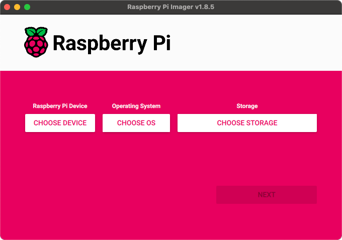
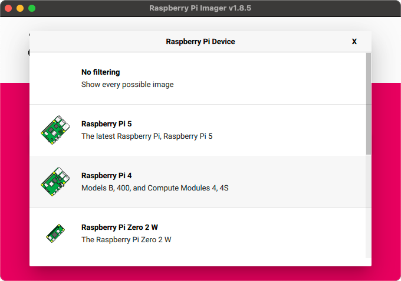
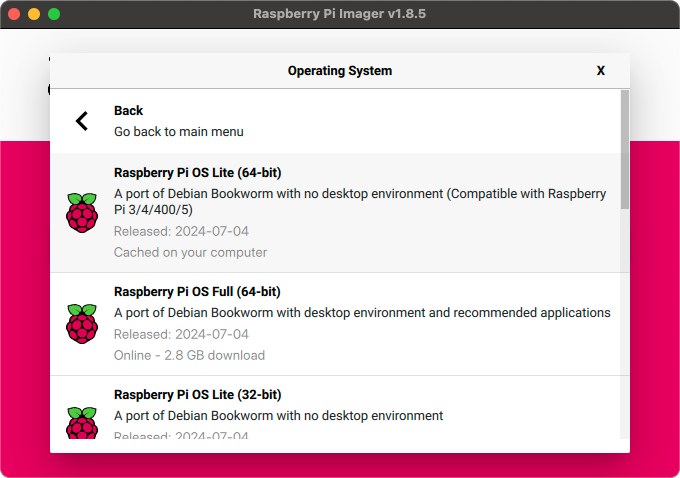
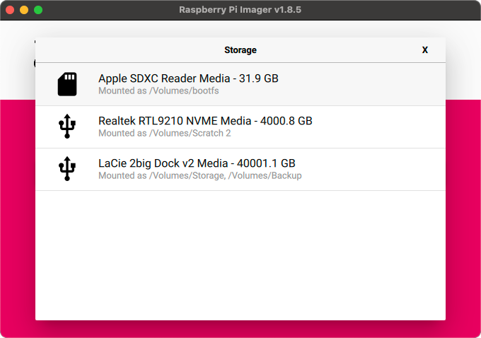
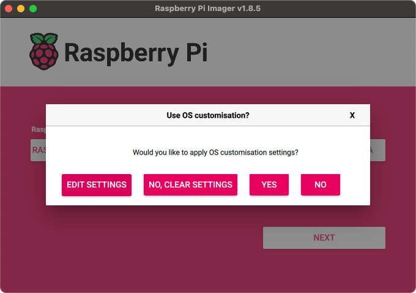
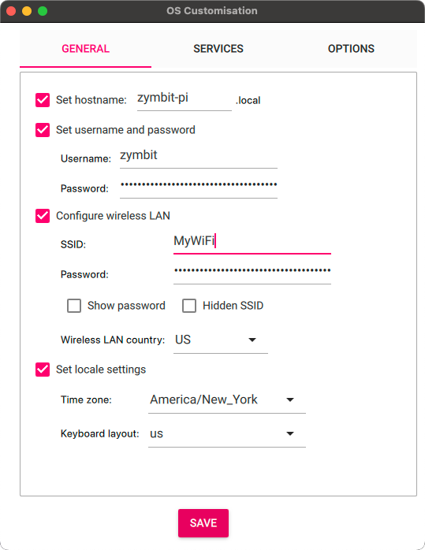
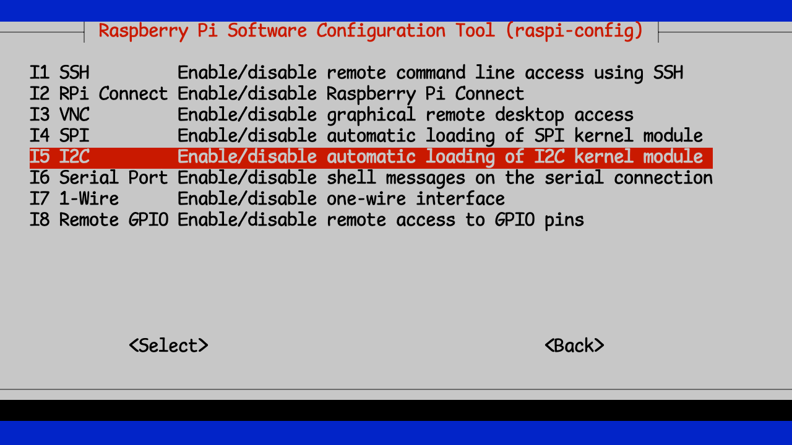
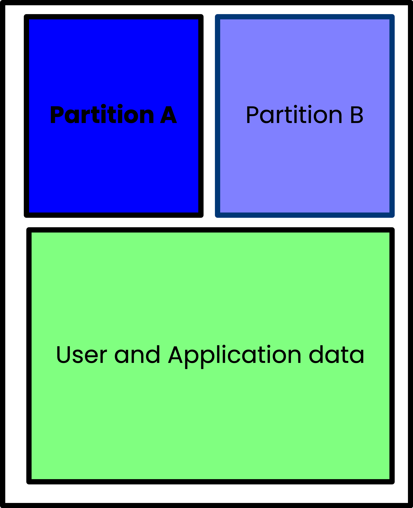

## TL;RD

La venerable Raspberry Pi existe desde hace más de una década (se creó oficialmente en 2009) y se ha convertido en un estándar en muchos ámbitos de la robótica, la automatización del hogar y otros tipos de usos, especialmente para los “creadores” y otros aficionados a la experimentación. Pero también ha hecho importantes incursiones en el mundo profesional y empresarial, aunque de forma más discreta.

Es una computadora de placa única (SBC) capaz, confiable y potente con una comunidad de usuarios sólida. A pesar de todas sus fortalezas, tiene algunas debilidades notables. La más importante es la seguridad. No porque la SBC en sí sea insegura, ni porque el sistema operativo (OS) sea inseguro (ejecuta Linux, que puede protegerse muy bien). La parte más vulnerable de Raspberry Pi es el hecho de que arranca y funciona desde una tarjeta micro SD.

Si bien ese mecanismo de arranque con tarjeta micro SD es ciertamente conveniente, deja al Pi extremadamente vulnerable a la manipulación física. Después de todo, alguien puede simplemente acercarse al Pi, quitar la tarjeta SD y tener acceso a todos los programas y datos que se estaban ejecutando. Puede colocar esa tarjeta en su propio Pi y tener acceso total a todo. Bueno, con un poco de pirateo de contraseñas, etc.

Hacer que el Pi sea absolutamente seguro contra manipulaciones físicas y electrónicas es un paso fundamental para convertir a Raspberry Pi en un dispositivo seguro para implementar aplicaciones en el campo.

Las actualizaciones sin problemas de tu Pi también suelen ser un problema, especialmente si tienes más de unas cuantas. Tienes que iniciar sesión en cada una, ejecutar las actualizaciones y luego esperar que nada salga mal.

Esto me lleva a la posibilidad de recuperación. ¿Qué sucede si una de esas actualizaciones falla por algún motivo? Especialmente si se encuentra en una ubicación remota. ¿Cómo se garantiza que el dispositivo se pueda recuperar y cómo se puede volver a poner en línea lo más rápido posible?

Obviamente voy a cubrir mucho terreno, pero al final te mostraré cómo puedes proteger tu Raspberry Pi de manipulaciones físicas haciendo que sea prácticamente imposible robar tus programas y datos, cómo hacer actualizaciones remotas seguras y cómo garantizar que esas actualizaciones sean recuperables en caso de falla.

## Vamos a construir un nuevo Pi

Para comenzar, construyamos una Raspberry Pi desde cero. Si no te interesa esta parte y solo quieres proteger una Pi existente, desplázate hacia abajo hasta la sección [Cómo proteger tu Pi](#securing-your-pi)

Aquí tienes todo lo que necesitas para completarlo. Incluiré enlaces a los que he utilizado personalmente y de forma directa.

- Raspberry Pi (estoy usando una [Raspberry Pi 4](https://amzn.to/3Y2BBgn), pero también puedes usar una [Raspberry Pi 5](https://amzn.to/4dAKfZ3) si lo prefieres)
- [Fuente de alimentación](https://amzn.to/4eWmYSr) para tu Pi. Es importante utilizar una buena fuente de alimentación que suministre suficiente energía para la Pi4 o Pi5. Se recomienda la fuente de alimentación oficial de la Fundación Pi.
- Tarjeta Micro SD de alta calidad (https://amzn.to/3U2Twm1). Recomiendo una tarjeta de 32 GB.
- [Lector/escritor de tarjetas SD](https://amzn.to/4dEs2Kc) (si no hay uno integrado en su computadora)
- Unidad flash USB de alta calidad (Nota: debe tener el doble del tamaño de su tarjeta SD) Me gusta [esta](https://amzn.to/3NrH4Iz) de PNY.
- Zymkey, HSM4 o HSM6 (estoy usando una [Zymkey](https://amzn.to/4eRcIvn) aquí, pero una HSM6 funcionará bien si desea firma de hardware)
- [Batería CR1025](https://amzn.to/4eJG1Qt) (no es estrictamente necesaria una batería, pero la incluyo aquí para completar. La Zymkey la usa para mantener el reloj de tiempo real (RTC))

### Formatea y crea una imagen de tu Micro SD

Ahora que tienes todas las piezas ensambladas, comencemos. Estoy usando la herramienta [Raspberry Pi Imager](https://www.raspberrypi.com/software/), pero puedes usar [Balena Etcher](https://etcher.balena.io) o cualquier otra herramienta de creación de imágenes de tarjetas SD que prefieras.

Cuando inicies Pi Imager por primera vez, verás que debes tomar algunas decisiones:



Primero, deberás elegir qué modelo de Pi tienes. Estoy usando un Pi 4.



Por supuesto, elige el hardware que tienes. A continuación, elegirás el sistema operativo. Vamos a utilizar la versión más reciente (Bookworm, 64 bits), pero no necesitaremos el entorno de escritorio completo, así que elijo la versión "Lite".




A continuación, deberá identificar la tarjeta Micro SD en la que desea escribir. Si aún no lo ha hecho, inserte la tarjeta Micro SD en el dispositivo de escritura de tarjetas SD y conéctelo a su computadora.



El último paso antes de escribir el sistema operativo en el disco es configurar cualquier configuración adicional que desees para el Pi. Te recomiendo que configures al menos un nombre de host y un nombre de usuario/contraseña y, si deseas utilizar tu red WiFi local, las credenciales de la red WiFi.





Una vez que hayas realizado todos los ajustes correctamente, es momento de escribirlos en la tarjeta. Ten en cuenta que esto borrará por completo todos los datos existentes en la tarjeta SD, así que ten cuidado.


Después de eso, puedes sentarte y disfrutar de una taza de café mientras se escribe el sistema operativo en la tarjeta. Una vez que esté listo, podemos pasar a configurar el hardware.

### Configurar el hardware

¡Esta es siempre mi parte favorita! Primero, veamos qué necesitamos:


Antes de conectar el Pi, vamos a armar e instalar el Zymkey. Lo único que tienes que hacer es insertar la batería CR1025 en el soporte.


Asegúrese de que la Zymkey esté bien colocada en los pines del cabezal.


Una vez que todo el hardware esté ensamblado, inserte la tarjeta SD en la ranura en la parte inferior del Pi.


¡Ahora es el momento de conectar el Pi a la fuente de alimentación, esperar a que arranque y comenzar a configurar nuestra seguridad!

## Cómo proteger su Pi

Ahora que tenemos una Pi funcionando correctamente, vamos a realizar la importante tarea de asegurarnos de que sea segura, actualizable y recuperable. En ese orden.

### Configura tu Zymkey

Antes de poder configurar el Zymkey, debemos asegurarnos de que el Pi pueda comunicarse con él. El software del Zymkey se comunica con el dispositivo a través de I2C, por lo que debemos asegurarnos de que la interfaz I2C del Pi esté habilitada.

```bash
$ sudo raspi-config
```
Le lleva a la utilidad de configuración.


Luego seleccionarás "Opciones de interfaz" y luego "I2C".



Luego puedes salir y guardar raspi-config


Todos estos pasos se cubren con mayor detalle en la [documentación](https://docs.zymbit.com/getting-started/zymkey/quickstart/), por lo que si algo aquí es confuso, siempre puedes volver a verificar allí.

A continuación, necesitamos instalar el software Zymkey requerido.

```bash
$ curl -G https://s3.amazonaws.com/zk-sw-repo/install_zk_sw.sh | sudo bash
```
Instalará todas las actualizaciones y luego descargará e instalará el software Zymbit requerido.

> **Nota**: La instalación de este software provocará un reinicio automático del Pi, por lo que no debe realizar ninguna otra acción con él mientras se instala el software.

Una vez que se haya completado el reinicio, deberías notar que la luz azul ya no parpadea rápidamente, sino que parpadea una vez cada 3 segundos. Esto es una indicación de que el software Zymbit está instalado correctamente y puede comunicarse con Zymkey.

Si desea realizar una prueba para asegurarse de que Zymkey esté instalado y funcione correctamente, puede descargar e instalar los scripts de prueba:

```bash
wget https://community.zymbit.com/uploads/short-url/eUkHVwo7nawfhESQ3XwMvf28mBb.zip
unzip eUkHVwo7nawfhESQ3XwMvf28mBb.zip
sudo mkdir -p /usr/local/share/zymkey/examples/
sudo mv *.py /usr/local/share/zymkey/examples/
python3 /usr/local/share/zymkey/examples/zk_app_utils_test.py
```
```bash
Testing data lock...
Original Data
01 02 03 04
Encrypted Data
8B B8 06 67 00 00 35 80 82 75 AA BE 89 8C A8 D5
6D 7B 71 48 83 47 B9 9A B7 3A 09 58 41 E6 33 BC
4E 48 7A 32 3A B0 26 D8 59 4F 8C 58 59 97 03 20
3C 99 CF AF 2D CC 47 E5 1B AB 83 FC 6A 3D DE D8
F3 24 9F 73 B5 72 B7 0D 77 8E C6 A8 A3 B3 22 D6
94 8F BD 6A 6C 96 38 EE
Testing data unlock...
Decryped Data
01 02 03 04
Turning LED on...
Testing get_random() with 512 bytes...
B7 B6 BD 78 C6 62 7A CC 80 E0 BD 04 C7 43 29 AC
7A 48 2D 3F E5 43 33 AA 7C 37 F6 BA 7D 3F F2 D3
A9 4B B3 A9 16 4C FD AD 48 61 72 9E 7F B9 09 AE
A7 4A 4F 54 0D CE 6E 85 E6 87 F5 8C D6 58 4B 0E
12 03 4C 71 BD 3A F0 34 79 06 66 5E 65 DC 6E CF
AF 12 72 C1 F1 5D 24 79 A8 D0 F9 40 3E 8E 59 D7
5C ED C5 1E 0E FF 4A 04 69 22 54 F5 13 A1 2E A7
3C B4 CD 30 E7 61 10 B7 E5 07 AD DC E0 FF E9 6E
58 32 50 DA 9F 33 51 F5 8C 16 B5 0C 0F 57 08 E6
E8 00 89 79 DF 16 2A BD FC 27 E0 E4 6C 1B 05 28
EB DE 5B 63 2E F0 E0 21 E8 C5 39 31 26 2A E5 64
79 31 04 7A 60 ED D7 32 6A 8B 4A 29 DD 79 EC D9
2B 72 AC 2E 9A 08 FF 56 06 DB 1C 91 FF D9 3F 10
3E 57 9C 5E B4 32 FD 2E 09 BF 8D 04 6A C8 12 88
06 7C C1 93 FD F7 61 47 90 DD 0D 50 78 78 6C 83
0A 94 DD 5E 9D 83 3F FD 0B 1E 73 23 72 0D 4D D1
82 1F 42 DB EE 1E 7F 85 B9 F1 94 24 54 1B 28 2E
47 24 05 8B 17 0B AE 90 6A DF 0B BC E1 53 B2 96
1C 87 D4 FD A0 EC FC 85 E4 9F 04 F6 B8 E0 37 B2
40 17 33 3A FA 96 01 0C B2 4C 4D FE E7 64 0E 87
4E 4B A8 D0 97 C6 A5 42 F4 02 E4 CC 7C 2B 3A A8
C7 33 22 3C 76 1C 40 42 1F 5A 78 7B 23 FB 0B 39
BD 9F 38 13 6B FE D9 54 C9 D2 F3 97 C6 39 F3 09
9C 6B DC 82 C1 25 99 70 8B 2B 46 FD CD 51 C9 09
20 16 DA 4C D3 58 B6 BB D7 C3 E4 A9 34 F0 5C 85
D7 19 6D A8 F7 26 D6 41 6F 27 04 2C A0 C4 50 9D
28 43 0D DC E2 7E D4 9E 29 FE 45 B2 BF 14 77 A7
AD F4 43 4B 51 85 85 06 7F 02 BF 21 DA C4 BD A4
9B 94 71 FA 21 8B 9E B6 07 48 7F 50 A7 CF 32 2F
8F 98 A1 E1 FE 1B 2E 24 B5 BF 69 E7 DE 3D 11 6C
48 5B 56 5C BF 96 FB 30 BB 86 13 C4 53 61 AD 6E
09 0C A9 4B C1 2F 12 3F BF 34 FB 01 D7 62 13 7A
Turning LED off...
Flashing LED off, 500ms on, 100ms off...
Testing zkCreateRandDataFile with 1MB...
Turning LED off...
Testing get_ecdsa_public_key()...
20 AD 20 7A 0E D9 A5 81 BF 44 80 54 C6 DC A7 8C
D1 D5 7B EE 6D C5 E3 B4 92 8C 0E BF 42 6E D9 9E
AA 04 29 CD 4C D9 3A BC 58 5B DD 47 43 39 30 C8
2E FD C6 D9 C9 82 60 06 A4 A0 7F EA F9 C0 76 E9
Testing create_ecdsa_public_key_file()...
$ python3 /usr/local/share/zymkey/examples/zk_crypto_test.py
Signing data...OK
Verifying data...OK
Verifying tainted data...FAIL, yay!
Generating random block from Zymkey (131072 bytes)...
Encrypting random block...
Decrypting encrypted block...
PASS: Decrypted data matches original random data
Done!
```

¡Felicidades!

## Finalmente, haciéndolo seguro

Ahora que tenemos un dispositivo de seguridad adecuado instalado, probado y listo, vamos a protegerlo. Al mismo tiempo, asegurémonos de que podamos actualizar el dispositivo de forma segura cuando llegue el momento y de que esté diseñado para poder recuperarse en caso de que falle una actualización.

Normalmente esto sería muchísimo trabajo, pero vamos a simplificar todo y hacerlo prácticamente todo de una vez.

### Un lugar para colocar la imagen de respaldo

Dado que utilizaremos Bootware(r) para proteger nuestro dispositivo, necesitaremos un lugar donde el sistema pueda copiar toda la tarjeta SD mientras la encripta. Para ello, utilizaremos una unidad USB.

Necesitamos asegurarnos de que podemos usar nuestra unidad USB correctamente. A menudo las reutilizo para otras tareas, así que así es como me gusta empezar. Después de conectar la unidad USB, me aseguro de "poner a cero" la unidad y luego creo un nuevo mapa de partición y sistema de archivos en ella.

```bash
sudo dd if=/dev/zero of=/dev/sda bs=512 count=1 conv=notrunc
```
```bash
1+0 records in
1+0 records out
512 bytes copied, 0.0197125 s, 26.0 kB/s
```

Esto borra el sistema de archivos anterior, si lo hubiera.

```bash
sudo fdisk -W always /dev/sda
```
```bash
Welcome to fdisk (util-linux 2.38.1).
Changes will remain in memory only, until you decide to write them.
Be careful before using the write command.

Device does not contain a recognized partition table.
Created a new DOS (MBR) disklabel with disk identifier 0x27b0681a.

Command (m for help): n
Partition type
   p   primary (0 primary, 0 extended, 4 free)
   e   extended (container for logical partitions)
Select (default p): p
Partition number (1-4, default 1):
First sector (2048-125313282, default 2048):
Last sector, +/-sectors or +/-size{K,M,G,T,P} (2048-125313282, default 125313282):

Created a new partition 1 of type 'Linux' and of size 59.8 GiB.
Partition #1 contains a ext4 signature.

The signature will be removed by a write command.

Command (m for help): w
The partition table has been altered.
Calling ioctl() to re-read partition table.
Syncing disks.
```

Las partes importantes son las siguientes: una vez que haya ingresado `sudo fdisk -W always /dev/sda`, ingresará `n` para crear un nuevo mapa de particiones. Luego, `p` para convertirlo en una partición primaria y, finalmente, `w` para escribir el mapa de particiones en el disco. Para todo lo demás, simplemente acepto los valores predeterminados tal como se presentan.

Finalmente, ahora que tenemos una unidad USB particionada, tenemos que crear un sistema de archivos adecuado en ella.

```bash
sudo mkfs.ext4 -j /dev/sda1 -F
```
```bash
mke2fs 1.47.0 (5-Feb-2023)
Creating filesystem with 15663904 4k blocks and 3916304 inodes
Filesystem UUID: 4a3af5d0-bac4-4903-965f-aa6caa8532cf
Superblock backups stored on blocks:
  32768, 98304, 163840, 229376, 294912, 819200, 884736, 1605632, 2654208,
  4096000, 7962624, 11239424

Allocating group tables: done
Writing inode tables: done
Creating journal (65536 blocks): done
Writing superblocks and filesystem accounting information: done
```

> **Consejo**: Si, como yo, te cansas de escribir `sudo` todo el tiempo, puedes ejecutar `sudo -i` una vez y obtener un símbolo del sistema desde el que ejecutar todos tus comandos. Pero recuerda, ¡un gran poder conlleva una gran responsabilidad!

### Instalación de Bootware(r)

Bootware es la herramienta de Zymbit para proteger y actualizar su Raspberry Pi. Es una herramienta poderosa que le permite actualizar una o varias Pi de su empresa. Además, le permite hacerlo de manera segura y recuperable si algo sale mal.

Primero, tenemos que ejecutar el instalador.

```bash
$ curl -sSf https://raw.githubusercontent.com/zymbit-applications/zb-bin/main/install.sh | sudo bash
```

Este instalador le hará un par de preguntas sencillas, así que veamos las respuestas. La primera es si desea o no incluir Firma de hardware. Si tiene un producto basado en HSM6 o SCM, puede responder que sí a esta pregunta. Si tiene una Zymkey o HSM4, no se admite la Firma de hardware, por lo que no necesita instalarla. Incluso con la firma de software, sus particiones cifradas LUKS finales estarán protegidas por las claves HSM de Zymbit.

A continuación, te preguntará qué versión de Bootware quieres instalar. Elige la versión más reciente.

```bash
zb-install.sh: bootstrapping the zbcli installer
  ---------
  Pi Module:         Raspberry Pi 4/Compute Module 4
  Operating System:  Rpi-Bookworm
  Zymbit module:     Zymkey
  Kernel:            kernel8.img
  ---------

✔ 'zbcli' comes with software signing by default. Include hardware key signing? (Requires SCM or HSM6) · No
✔ Select version · zbcli-1.2.0-rc.26
Installing zbcli
Installed zbcli. Run 'zbcli install' to install Bootware onto your system or 'zbcli --help' for more options.
zb-install.sh: cleaning up
```

Ahora que el instalador está listo, es hora de instalar Bootware:

```bash
sudo zbcli install
```

El instalador le preguntará si está listo para reiniciar cuando haya terminado:

```bash
  ---------
  Pi Module:         Raspberry Pi 4
  Operating System:  Rpi-Bookworm
  Zymbit module:     Zymkey
  Kernel:            kernel8.img
  ---------
       Found kernel '/boot/firmware/kernel8.img'
     Created '/etc/zymbit/zboot/mnt'
     Created '/etc/zymbit/zboot/scripts'
     Created '/etc/zymbit/zboot/zboot_backup'
     Created '/boot/firmware/zboot_bkup'
   Installed 'u-boot-tools'
     Created '/etc/fw_env.config'
     Created '/usr/bin/zbconfig'
       Found OpenSSL 3
     Created '/boot/firmware/zb_config.enc'
    Modified zbconfig 'kernel_filename'
   Installed zboot
    Modified '/etc/rc.local'
     Created '/lib/cryptsetup/scripts/zk_get_shared_key'
    Modified '/boot/firmware/config.txt'
     Created '/etc/update-motd.d/01-zymbit-fallback-message'
    Modified /etc/update-motd.d/01-zymbit-fallback-message
✔ A reboot into zboot is required. Reboot now? · yes
    Finished in 29.1s
```

### Configuración del software de arranque

¡Aquí es donde comienza la verdadera diversión! Si alguna vez ha utilizado LUKS para cifrar un sistema de archivos de Pi, sabrá que, si bien es un gran paso para proteger su Pi, aún debe almacenar esa clave de cifrado en algún lugar al que se pueda acceder en el momento del arranque.

Con Bootware y un HSM Zymbit, la clave de cifrado LUKS está bloqueada por el HSM Zymbit, lo que la hace mucho más segura. Bootware espera que la imagen de arranque esté en un formato específico y cifrado llamado z-image. La herramienta CLI de Bootware le ayuda a crear y administrar estas imágenes para su implementación en toda la empresa.

Así que vamos a crear nuestra primera imagen z y utilizaremos el sistema actual como base para ella.

Primero, necesitamos montar la unidad USB para que tengamos un lugar donde colocar nuestra imagen z:

```bash
$ sudo mount /dev/sda1 /mnt
```

A continuación, ejecutaremos la herramienta de imágenes para crear una imagen z encriptada de nuestro sistema actual:

```bash
sudo zbcli imager
```
```bash
   Validated bootware installation
  ---------
  Pi Module:         Raspberry Pi 4
  Operating System:  Rpi-Bookworm
  Zymbit module:     Zymkey
  Kernel:            kernel8.img
  ---------
     Created '/etc/zymbit/zboot/update_artifacts/tmp'
✔ Enter output directory · /mnt
✔ Enter image name · z-image-1
✔ Select image type · Full image of live system
✔ (Optional) enter image version · 1.0
✔ Select key · Create new software key
```

Tenga en cuenta que utilicé el punto de montaje de la unidad USB como directorio de salida. Luego, elegí un nombre y un número de versión para la imagen y opté por utilizar una clave de software, ya que estoy utilizando una Zymkey.

No te sorprendas si este paso tarda un poco. Lo que hace es realizar una copia completa de los archivos del disco en ejecución y firmarla con la clave de hardware que ha generado.


```bash
     Created signing key
     Created '/etc/zymbit/zboot/update_artifacts/file_manifest'
     Created '/etc/zymbit/zboot/update_artifacts/file_deletions'
    Verified path unmounted '/etc/zymbit/zboot/mnt'
     Cleaned '/etc/zymbit/zboot/mnt'
     Deleted '/etc/crypttab'
    Verified disk size (required: 2.33 GiB, free: 26.39 GiB)
     Created initramfs
     Created snapshot of boot (/etc/zymbit/zboot/update_artifacts/tmp/.tmpBgEBJk/z-image-1_boot.tar)
     Created snapshot of root (/etc/zymbit/zboot/update_artifacts/tmp/.tmpBgEBJk/z-image-1_rfs.tar)
     Created '/mnt/tmp'
     Cleaned '/mnt/tmp'
     Created staging directory (/mnt/tmp/.tmpEhjNN7)
     Created '/mnt/tmp/.tmpEhjNN7/header.txt'
     Created tarball (/mnt/tmp/.tmpEhjNN7/update_artifact.tar)
     Created header signature
     Created update artifact signature
     Created file manifest signature
     Created file deletions signature
     Created '/mnt/tmp/.tmpEhjNN7/signatures'
     Created signatures (/mnt/tmp/.tmpEhjNN7/signatures)
      Copied file (/etc/zymbit/zboot/update_artifacts/file_manifest) to (/mnt/tmp/.tmpEhjNN7/file_manifest)
      Copied file (/etc/zymbit/zboot/update_artifacts/file_deletions) to (/mnt/tmp/.tmpEhjNN7/file_deletions)
     Created tarball (/mnt/z-image-1.zi)
     Created '/mnt/z-image-1_private_key.pem'
       Saved private key '/mnt/z-image-1_private_key.pem'
     Created '/mnt/z-image-1_pub_key.pem'
       Saved public key '/mnt/z-image-1_pub_key.pem'
     Cleaned '/mnt/tmp'
       Saved image '/mnt/z-image-1.zi' (2.33 GiB)
    Finished in 384.8s
```

El par de claves pública/privada se guarda en la unidad USB y lo necesitaremos más adelante.

### Particionado A/B

Probablemente sea apropiado dar algunos antecedentes al respecto. La idea de la partición A/B es un concepto importante para la capacidad de recuperación. Si tiene una única partición de disco desde la que se inician sus dispositivos y actualiza elementos críticos en esa partición que de alguna manera están dañados, su dispositivo puede quedar en un estado en el que sea imposible iniciarlo o recuperarlo. Está bloqueado. La única forma de recuperar un dispositivo de este tipo normalmente es acceder físicamente al dispositivo y realizar cambios directos en la tarjeta SD. Esto no siempre es práctico o incluso posible.

Con la partición A/B, crea particiones de arranque duales y solo ejecuta desde una. Esa es la partición que se sabe que funciona bien o la partición primaria. Luego, tiene una partición secundaria donde puede aplicar actualizaciones. Una vez que se aplica una actualización a la partición secundaria, el dispositivo se reinicia desde esa partición recién actualizada. Si la actualización se realiza correctamente, su sistema vuelve a funcionar y esa partición se marca como la partición primaria y se reiniciará desde esa partición que se sabe que funciona bien a partir de ahora.

Si la actualización falla por algún motivo y el dispositivo no puede iniciarse correctamente desde la partición actualizada, el sistema se reinicia desde la partición primaria utilizada anteriormente y puede continuar ejecutándose hasta que se pueda implementar una actualización reparada.



Con este esquema de partición implementado, es mucho menos probable que su Pi termine bloqueado ya que puede mantener una partición en buen estado en todo momento desde la cual arrancar.

El software de arranque cifra las particiones A, B y DATA. Las particiones A y B están bloqueadas con claves LUKS únicas, lo que significa que no se puede acceder a la partición de respaldo desde la partición activa. Se puede acceder a la partición DATA cifrada desde la partición A o B.

Configurar este esquema de particionamiento A/B suele ser bastante complicado y difícil de implementar. El software de arranque de Zymbit ha tomado ese proceso y lo ha simplificado de manera que es un proceso relativamente fácil. Así que repasemos ese proceso ahora y hagamos que su Pi sea seguro y resistente.

### Crear particiones A/B

Como no teníamos una partición B de respaldo anteriormente, crearemos una y colocaremos la imagen actual (que sabemos que es buena, ya que la estamos ejecutando actualmente) en esa partición. Para ello, actualizaremos la configuración (en realidad, la crearemos) con la herramienta `zbcli`.

```bash
$ sudo zbcli update-config
```
```
   Validated bootware installation
  ---------
  Pi Module:         Raspberry Pi 4
  Operating System:  Rpi-Bookworm
  Zymbit module:     Zymkey
  Kernel:            kernel8.img
  ---------
        Info the root file system will be re-partitioned with your chosen configuration.
```

Este proceso le hará algunas preguntas para determinar cómo distribuir sus particiones. La primera es qué distribución de partición de dispositivo desea utilizar. Elija la opción recomendada:
```bash
? Select device partition layout after an update ›
❯   [RECOMMENDED] A/B: This will take the remaining disk space available after the boot partition and create two encrypted partitions, each taking up half of the remaining space. Most useful for rollback and reco
       Using partition layout (A/B)
        Info the root file system will be re-partitioned with your chosen configuration.
```
A continuación, seleccionará la política de actualización. Nuevamente, elija la recomendada.

```bash
? Select update policy ›
❯   [RECOMMENDED] BACKUP: Applies new updates to current backup filesystem and swap to booting the new updated backup partition as the active partition now. If the new update is bad, it will rollback into the pre
     Running [========================================] 2/1 (00:00:17):                                                                                                                                             WARNING! Detected active partition (28.71GB) is larger than 14.86GB needed for two filesystems.
 Active partition won't be saved!!!
 Changing update mode to UPDATE_BOTH!!!
       Using update mode (UPDATE_BOTH)
        Data partition size currently set to: 512 MB
        Info bootware will create a shared data partition after A/B in size MB specified
```

A continuación, puede seleccionar el tamaño de la partición de datos. El valor predeterminado es 512 MB, pero le sugiero que lo aumente a 1024 MB.

```bash
✔ Enter size of data partition in MB · 1024
       Using Data Partition Size 1024MB
  Defaulting to configured endpoint '/dev/sda1'
        Info update endpoints can be either an HTTPS URL or an external mass storage device like a USB stick.
       Found update name 'z-image-1'
       Saved update name 'z-image-1'
       Using update endpoint '/dev/sda1'
Configuration settings saved
    Finished in 42.1s
```

Ahora tenemos un sistema que está configurado para tener particiones A/B y para aplicar actualizaciones a la partición de respaldo cuando estén disponibles.

Para completar el proceso, aplicaremos la actualización (que en realidad es solo una copia del sistema que se está ejecutando actualmente). Esto activará la nueva creación de particiones y el reinicio.

Primero, necesitamos obtener la clave pública (creada previamente y almacenada en la unidad USB) para poder descifrar la imagen. Para ello, copiémosla en el directorio local:

```bash
sudo mount /dev/sda1 /mnt
cp /mnt/z-image-1_pub_key.pem .
```

```bash
$ sudo zbcli update
```
```bash
   Validated bootware installation
  ---------
  Pi Module:         Raspberry Pi 4
  Operating System:  Rpi-Bookworm
  Zymbit module:     Zymkey
  Kernel:            kernel8.img
  ---------
     Cleaned '/etc/zymbit/zboot/update_artifacts/tmp'
       Found update configs
? Proceed with current configs? These can be modified through 'zbcli update-config'
  ---------
  Update endpoint   /dev/sda1
  Update name       z-image-1
  Endpoint type     LOCAL
  Partition layout  A/B
  Update policy     UPDATE_BOTH
  ------reading_time: 24 minutes
---
     Created temporary directory (/etc/zymbit/zboot/update_artifacts/tmp/.tmpCfhm6c)
✔ Enter public key file (Pem format) · ./z-image-1_pub_key.pem
     Mounted '/dev/sda1' to '/etc/zymbit/zboot/update_artifacts/tmp/.tmpyKYgR3'
       Found image tarball (/etc/zymbit/zboot/update_artifacts/tmp/.tmpyKYgR3/z-image-1.zi)
    Unpacked '/etc/zymbit/zboot/update_artifacts/tmp/.tmpCfhm6c/update_artifact.tar'
    Unpacked '/etc/zymbit/zboot/update_artifacts/tmp/.tmpCfhm6c/signatures'
    Unpacked '/etc/zymbit/zboot/update_artifacts/tmp/.tmpCfhm6c/header.txt'
    Unpacked '/etc/zymbit/zboot/update_artifacts/tmp/.tmpCfhm6c/file_manifest'
    Unpacked '/etc/zymbit/zboot/update_artifacts/tmp/.tmpCfhm6c/file_deletions'
     Decoded header signature
     Decoded image signature
     Decoded manifest signature
     Decoded deletions signature
       Found header data
       Found image data
       Found manifest data
       Found file deletions data
    Verified header signature
    Verified image signature
    Verified manifest signature
    Verified file deletions signature
    Modified zbconfig 'public_key'
    Modified zbconfig 'new_update_needed'
    Modified zbconfig 'root_a'
    Modified zbconfig 'root_b'
    Modified zbconfig 'root_dev'
      Copied file (/boot/firmware/usr-kernel.enc) to (/boot/firmware/zboot_bkup/usr-kernel-A.enc)
      Copied file (/boot/firmware/kernel8.img) to (/boot/firmware/zboot_bkup/kernel8.img)
    Modified zbconfig 'update_with_new_image'
    Modified zbconfig 'kernel_filename'
? Scheduled update for the next reboot. Reboot now? (y/n) › yes
```

Cuando le pida reiniciar, diga que sí y luego espere.

Una vez que su Pi se haya reiniciado, inicie sesión y verifique que todo esté correcto.

```bash
$ lsblk
NAME              MAJ:MIN RM  SIZE RO TYPE  MOUNTPOINTS
sda                 8:0    1 59.8G  0 disk
└─sda1              8:1    1 59.8G  0 part
mmcblk0           179:0    0 29.7G  0 disk
├─mmcblk0p1       179:1    0  512M  0 part  /boot/firmware
├─mmcblk0p2       179:2    0 14.1G  0 part
│ └─cryptrfs_A    254:0    0 14.1G  0 crypt /
├─mmcblk0p3       179:3    0 14.1G  0 part
└─mmcblk0p4       179:4    0    1G  0 part
  └─cryptrfs_DATA 254:1    0 1008M  0 crypt
```

Observe que ahora tenemos dos dispositivos `cryptfs`. Estos son sistemas de archivos completamente firmados y cifrados.

¿Qué sucede si la actualización falla? Esta es la ventaja de la partición A/B con Bootware: si el sistema no arranca (no logra alcanzar un objetivo `systemd init` tres veces seguidas), Bootware volverá a la partición que funciona correctamente y hará que su dispositivo vuelva a estar en línea.

### Ejercicio extra

Aquí, simplemente hemos utilizado la unidad USB como fuente para la actualización. ¡Pero hay otras opciones! Podríamos copiar esa imagen z a un depósito de Amazon S3 o a uno de nuestros propios servidores y luego configurar el software de arranque para obtener la actualización desde esa ubicación. Tendría que volver a ejecutar `zbcli update-config` y, para el punto final, utilizar la ubicación en Internet donde almacenó la imagen.

## Conclusiones

Hemos creado una Raspberry Pi completa y segura desde cero. Y lo que es más importante, hemos habilitado la actualización de la Pi de forma segura *y* podemos estar seguros de que una actualización fallida no dejará inutilizable la Pi.

¿Es posible hacer todas estas cosas sin una clave Zymkey y un software de arranque? Sí, en su mayoría. Puedes cifrar tu sistema de archivos con claves LUK, pero luego tienes que gestionar manualmente dónde se almacena la clave y asegurarte de mantenerla segura. También puedes hacer actualizaciones remotas, pero (y esta es una advertencia muy importante), no tienes garantías de que la actualización se realice correctamente, de que la actualización no bloquee tu dispositivo o de que la actualización no pueda ser manipulada de alguna manera.

Con el dispositivo que acabamos de construir, podemos estar seguros de que los sistemas de archivos están firmados y encriptados de forma segura, que no tenemos que preocuparnos por administrar las claves de encriptación, que las claves en sí se almacenan de forma segura y que podemos actualizar el dispositivo de manera confiable y no tener que preocuparnos de que falle al iniciarse después de una actualización.

Si tienes más preguntas o te gustaría hablar más sobre Bootware, Zymkey o cualquiera de los temas tratados aquí, ¡únete a nuestra [comunidad](https://community.zymbit.com)! Nos encantaría conocer tus comentarios y responder cualquier pregunta que puedas tener.
