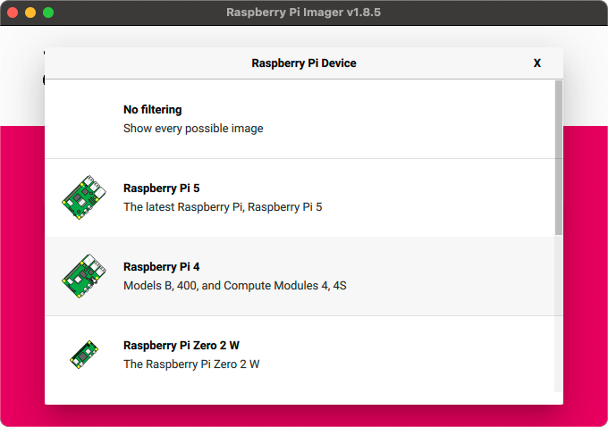
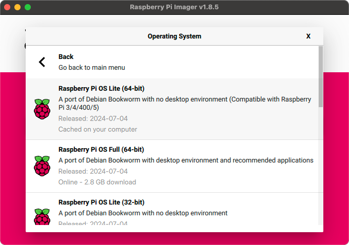
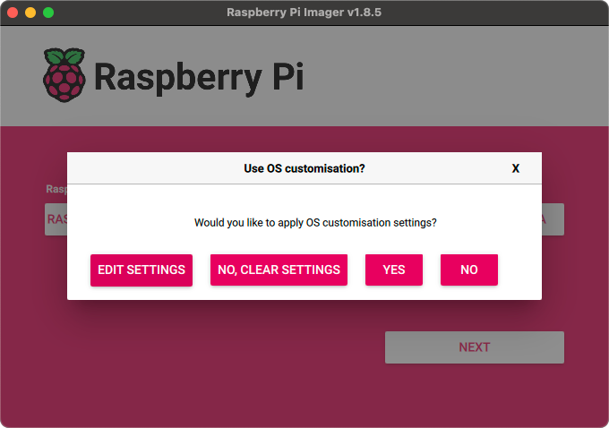
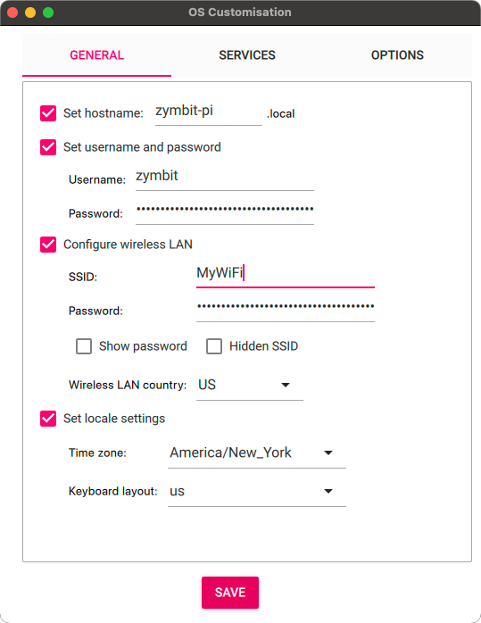
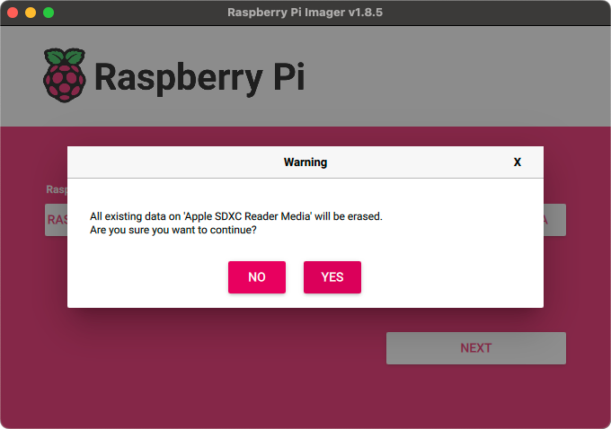
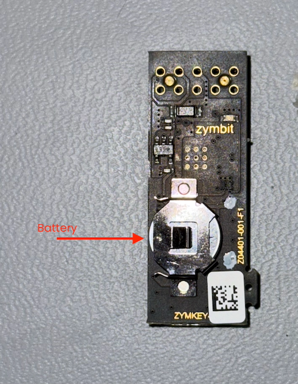
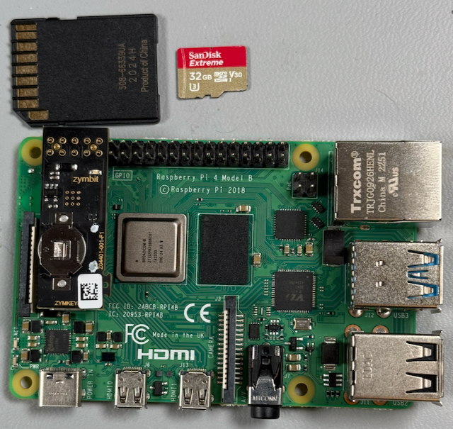
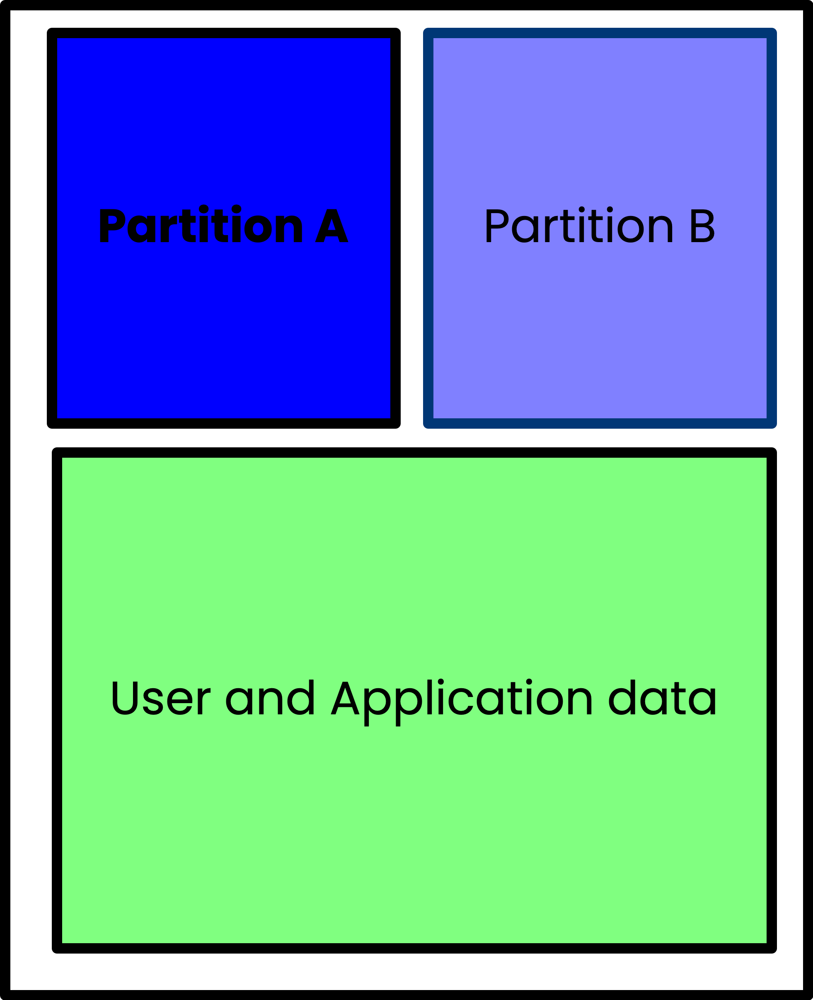

## TL;DR

Le vénérable Raspberry Pi existe depuis plus d’une décennie (créé officiellement en 2009) et est devenu un standard dans de nombreux domaines de la robotique, de la domotique et d’autres types d’utilisation. Notamment pour les « makers » et autres bricoleurs. Mais il a également fait une percée sérieuse dans le monde professionnel et de l’entreprise – mais plus discrètement.

C'est un ordinateur monocarte (SBC) performant, fiable et puissant, avec une communauté d'utilisateurs solide. Malgré tous ses atouts, il présente quelques faiblesses notables. La plus importante est la sécurité. Non pas parce que le SBC lui-même n'est pas sécurisé, ni parce que le système d'exploitation (OS) n'est pas sécurisé (il exécute Linux, qui peut être très bien sécurisé). La partie la plus vulnérable du Raspberry Pi est le fait qu'il démarre et fonctionne à partir d'une carte micro SD.

Bien que ce mécanisme de démarrage par carte micro SD soit certainement pratique, il rend le Pi extrêmement vulnérable aux altérations physiques. Après tout, quelqu'un peut simplement s'approcher du Pi, retirer la carte SD et avoir accès à tous les programmes et données en cours d'exécution. Il peut insérer cette carte dans son propre Pi et avoir un accès complet à tout. Enfin, avec un peu de piratage de mot de passe, etc.

Rendre ce Pi absolument sécurisé contre toute altération physique ainsi qu’électronique est une étape cruciale pour faire d’un Raspberry Pi un appareil sécurisé pour le déploiement d’applications sur le terrain.

Les mises à jour fluides de votre Pi sont également souvent un problème. Surtout si vous en possédez plusieurs. Vous devez vous connecter à chacun d'eux, exécuter les mises à jour, puis espérer que tout se passe bien.

Ce qui m'amène à la récupérabilité. Que se passe-t-il si l'une de ces mises à jour échoue pour une raison quelconque ? Surtout si elle se trouve dans un endroit éloigné. Comment vous assurez-vous que l'appareil est récupérable et comment pouvez-vous le remettre en ligne le plus rapidement possible ?

Évidemment, je vais couvrir beaucoup de terrain, mais à la fin, je vais vous montrer comment vous pouvez sécuriser votre Raspberry Pi contre toute altération physique, rendant ainsi pratiquement impossible le vol de vos programmes et de vos données, comment effectuer des mises à jour sécurisées à distance et comment garantir que ces mises à jour sont récupérables en cas d'échec.

## Construisons un nouveau Pi

Pour commencer, construisons un Raspberry Pi à partir de zéro. Si cette partie ne vous intéresse pas et que vous souhaitez simplement sécuriser un Pi existant, faites défiler la page jusqu'à la section [Sécuriser votre Pi](#securing-your-pi)

Voici tout ce dont vous aurez besoin pour réaliser cette tâche. J'inclurai des liens vers ceux que j'utilise personnellement et directement.

- Raspberry Pi (j'utilise un [Raspberry Pi 4](https://amzn.to/3Y2BBgn), mais vous pouvez également utiliser un [Raspberry Pi 5](https://amzn.to/4dAKfZ3) si vous préférez)
- [Alimentation](https://amzn.to/4eWmYSr) pour votre Pi. Il est important d'utiliser une bonne alimentation qui fournit suffisamment de puissance pour le Pi4 ou le Pi5. L'alimentation officielle de la fondation Pi est recommandée.
- Carte Micro SD de haute qualité [https://amzn.to/3U2Twm1) Je recommande une carte de 32 Go.
- [Lecteur/graveur de carte SD](https://amzn.to/4dEs2Kc) (s'il n'y en a pas un intégré à votre ordinateur)
- Clé USB de haute qualité (Remarque : elle doit être deux fois plus grande que votre carte SD). J'aime [celle-ci](https://amzn.to/3NrH4Iz) de PNY.
- Zymkey, HSM4 ou HSM6 (j'utilise ici un [Zymkey](https://amzn.to/4eRcIvn), mais un HSM6 fonctionnera très bien si vous souhaitez une signature matérielle)
- [Pile CR1025](https://amzn.to/4eJG1Qt) (une pile n'est pas strictement nécessaire, mais je l'inclus ici pour être complet. Le Zymkey l'utilise pour maintenir l'horloge en temps réel (RTC))

### Formatez et créez une image de votre Micro SD

Maintenant que vous avez assemblé toutes les pièces, commençons. J'utilise l'outil [Raspberry Pi Imager](https://www.raspberrypi.com/software/), mais vous pouvez utiliser [Balena Etcher](https://etcher.balena.io) ou tout autre outil d'imagerie de carte SD que vous préférez.

Lorsque vous démarrez le Pi Imager pour la première fois, vous verrez que vous devez faire certains choix :


Tout d'abord, vous devez choisir le modèle de Pi que vous possédez. J'utilise un Pi 4



Choisissez bien sûr le matériel dont vous disposez. Ensuite, vous choisirez le système d'exploitation. Nous allons utiliser la version la plus récente (Bookworm, 64 bits), mais nous n'aurons pas besoin de l'environnement de bureau complet, je choisis donc la version « Lite ».




Ensuite, vous devez identifier la carte Micro SD sur laquelle vous souhaitez écrire. Si vous ne l'avez pas déjà fait, insérez la carte Micro SD dans le graveur de carte SD et branchez-le sur votre ordinateur.


La dernière étape avant d'écrire réellement le système d'exploitation sur le disque consiste à définir les paramètres supplémentaires que vous souhaitez pour le Pi. Je recommande au moins de configurer un nom d'hôte et un nom d'utilisateur/mot de passe, et si vous souhaitez utiliser votre WiFi local, les informations d'identification WiFi.





Une fois tous les paramètres définis, il est temps d'écrire le tout sur la carte. Notez que cette opération effacera complètement toutes les données existantes sur la carte SD, alors soyez prudent.



Après cela, vous pouvez vous asseoir et savourer une tasse de café pendant que votre système d'exploitation est écrit sur la carte. Une fois cela fait, nous pouvons passer à la configuration du matériel.

### Configurer le matériel

C'est toujours ma partie préférée ! Tout d'abord, voyons ce dont nous avons besoin :


Avant de brancher le Pi, assemblons et installons le Zymkey. La seule chose que vous devez faire est d'insérer la pile CR1025 dans le support de pile.



Assurez-vous que le Zymkey est bien placé sur les broches de l'en-tête.



Une fois le matériel assemblé, insérez la carte SD dans la fente située sous le Pi.


Il est maintenant temps de brancher le Pi à l'alimentation, d'attendre qu'il démarre et de commencer à configurer notre sécurité !

## Sécuriser votre Pi

Maintenant que nous avons un Pi qui fonctionne parfaitement, passons à la tâche importante qui consiste à nous assurer qu'il est sécurisé, actualisable et récupérable. Dans cet ordre.

### Configurez votre Zymkey

Avant de pouvoir configurer le Zymkey, nous devons nous assurer que le Pi peut lui communiquer. Le logiciel Zymkey communique avec l'appareil via I2C, nous devons donc nous assurer que l'interface I2C du Pi est activée.

```bash
$ sudo raspi-config
```
Vous amène à l'utilitaire de configuration.


Vous sélectionnerez ensuite « Options d'interface » puis « I2C »


Vous pouvez ensuite quitter et enregistrer raspi-config


Toutes ces étapes sont décrites plus en détail dans la [documentation](https://docs.zymbit.com/getting-started/zymkey/quickstart/), donc si quelque chose ici est confus, vous pouvez toujours vérifier ici.

Ensuite, nous devons installer le logiciel Zymkey requis.

```bash
$ curl -G https://s3.amazonaws.com/zk-sw-repo/install_zk_sw.sh | sudo bash
```
Installera toutes les mises à jour, puis téléchargera et installera le logiciel Zymbit requis.

> **Remarque ** : l’installation de ce logiciel déclenchera un redémarrage automatique du Pi, vous ne devez donc rien faire d’autre avec celui-ci pendant l’installation du logiciel.

Une fois le redémarrage terminé, vous devriez remarquer que le voyant bleu ne clignote plus rapidement, mais une fois toutes les 3 secondes. Cela indique que le logiciel Zymbit est correctement installé et qu'il est capable de communiquer avec la Zymkey.

Si vous souhaitez tester pour vous assurer que Zymkey est installé et fonctionne correctement, vous pouvez télécharger et installer les scripts de test :

```bash
wget https://community.zymbit.com/uploads/short-url/eUkHVwo7nawfhESQ3XwMvf28mBb.zip
unzip eUkHVwo7nawfhESQ3XwMvf28mBb.zip
sudo mkdir -p /usr/local/share/zymkey/examples/
sudo mv *.py /usr/local/share/zymkey/examples/
python3 /usr/local/share/zymkey/examples/zk_app_utils_test.py
```
```bash
Testing data lock...
Original Data
01 02 03 04
Encrypted Data
8B B8 06 67 00 00 35 80 82 75 AA BE 89 8C A8 D5
6D 7B 71 48 83 47 B9 9A B7 3A 09 58 41 E6 33 BC
4E 48 7A 32 3A B0 26 D8 59 4F 8C 58 59 97 03 20
3C 99 CF AF 2D CC 47 E5 1B AB 83 FC 6A 3D DE D8
F3 24 9F 73 B5 72 B7 0D 77 8E C6 A8 A3 B3 22 D6
94 8F BD 6A 6C 96 38 EE
Testing data unlock...
Decryped Data
01 02 03 04
Turning LED on...
Testing get_random() with 512 bytes...
B7 B6 BD 78 C6 62 7A CC 80 E0 BD 04 C7 43 29 AC
7A 48 2D 3F E5 43 33 AA 7C 37 F6 BA 7D 3F F2 D3
A9 4B B3 A9 16 4C FD AD 48 61 72 9E 7F B9 09 AE
A7 4A 4F 54 0D CE 6E 85 E6 87 F5 8C D6 58 4B 0E
12 03 4C 71 BD 3A F0 34 79 06 66 5E 65 DC 6E CF
AF 12 72 C1 F1 5D 24 79 A8 D0 F9 40 3E 8E 59 D7
5C ED C5 1E 0E FF 4A 04 69 22 54 F5 13 A1 2E A7
3C B4 CD 30 E7 61 10 B7 E5 07 AD DC E0 FF E9 6E
58 32 50 DA 9F 33 51 F5 8C 16 B5 0C 0F 57 08 E6
E8 00 89 79 DF 16 2A BD FC 27 E0 E4 6C 1B 05 28
EB DE 5B 63 2E F0 E0 21 E8 C5 39 31 26 2A E5 64
79 31 04 7A 60 ED D7 32 6A 8B 4A 29 DD 79 EC D9
2B 72 AC 2E 9A 08 FF 56 06 DB 1C 91 FF D9 3F 10
3E 57 9C 5E B4 32 FD 2E 09 BF 8D 04 6A C8 12 88
06 7C C1 93 FD F7 61 47 90 DD 0D 50 78 78 6C 83
0A 94 DD 5E 9D 83 3F FD 0B 1E 73 23 72 0D 4D D1
82 1F 42 DB EE 1E 7F 85 B9 F1 94 24 54 1B 28 2E
47 24 05 8B 17 0B AE 90 6A DF 0B BC E1 53 B2 96
1C 87 D4 FD A0 EC FC 85 E4 9F 04 F6 B8 E0 37 B2
40 17 33 3A FA 96 01 0C B2 4C 4D FE E7 64 0E 87
4E 4B A8 D0 97 C6 A5 42 F4 02 E4 CC 7C 2B 3A A8
C7 33 22 3C 76 1C 40 42 1F 5A 78 7B 23 FB 0B 39
BD 9F 38 13 6B FE D9 54 C9 D2 F3 97 C6 39 F3 09
9C 6B DC 82 C1 25 99 70 8B 2B 46 FD CD 51 C9 09
20 16 DA 4C D3 58 B6 BB D7 C3 E4 A9 34 F0 5C 85
D7 19 6D A8 F7 26 D6 41 6F 27 04 2C A0 C4 50 9D
28 43 0D DC E2 7E D4 9E 29 FE 45 B2 BF 14 77 A7
AD F4 43 4B 51 85 85 06 7F 02 BF 21 DA C4 BD A4
9B 94 71 FA 21 8B 9E B6 07 48 7F 50 A7 CF 32 2F
8F 98 A1 E1 FE 1B 2E 24 B5 BF 69 E7 DE 3D 11 6C
48 5B 56 5C BF 96 FB 30 BB 86 13 C4 53 61 AD 6E
09 0C A9 4B C1 2F 12 3F BF 34 FB 01 D7 62 13 7A
Turning LED off...
Flashing LED off, 500ms on, 100ms off...
Testing zkCreateRandDataFile with 1MB...
Turning LED off...
Testing get_ecdsa_public_key()...
20 AD 20 7A 0E D9 A5 81 BF 44 80 54 C6 DC A7 8C
D1 D5 7B EE 6D C5 E3 B4 92 8C 0E BF 42 6E D9 9E
AA 04 29 CD 4C D9 3A BC 58 5B DD 47 43 39 30 C8
2E FD C6 D9 C9 82 60 06 A4 A0 7F EA F9 C0 76 E9
Testing create_ecdsa_public_key_file()...
$ python3 /usr/local/share/zymkey/examples/zk_crypto_test.py
Signing data...OK
Verifying data...OK
Verifying tainted data...FAIL, yay!
Generating random block from Zymkey (131072 bytes)...
Encrypting random block...
Decrypting encrypted block...
PASS: Decrypted data matches original random data
Done!
```

Félicitations!

## Enfin, le sécuriser

Maintenant que nous avons installé, testé et préparé un dispositif de sécurité adéquat, sécurisons-le. En même temps, assurons-nous que nous pouvons mettre à jour le dispositif en toute sécurité le moment venu et qu'il est conçu pour être récupérable en cas d'échec d'une mise à jour.

Normalement, cela représenterait énormément de travail, mais nous allons tout simplifier et tout faire presque en même temps.

### Un endroit où placer l'image de sauvegarde

Comme nous allons utiliser Bootware(r) pour sécuriser notre appareil, nous aurons besoin d'un emplacement pour que le système copie l'intégralité de la carte SD pendant qu'il la crypte. Pour cela, nous allons utiliser une clé USB.

Nous devons nous assurer que nous pouvons utiliser correctement notre clé USB. Je les réutilise souvent pour d'autres tâches, alors voici comment j'aime commencer. Après avoir branché la clé USB, je m'assure de la « mettre à zéro », puis de créer une toute nouvelle carte de partition et un nouveau système de fichiers dessus.

```bash
sudo dd if=/dev/zero of=/dev/sda bs=512 count=1 conv=notrunc
```
```bash
1+0 records in
1+0 records out
512 bytes copied, 0.0197125 s, 26.0 kB/s
```

Cela efface le système de fichiers précédent, le cas échéant.

```bash
sudo fdisk -W always /dev/sda
```
```bash
Welcome to fdisk (util-linux 2.38.1).
Changes will remain in memory only, until you decide to write them.
Be careful before using the write command.

Device does not contain a recognized partition table.
Created a new DOS (MBR) disklabel with disk identifier 0x27b0681a.

Command (m for help): n
Partition type
   p   primary (0 primary, 0 extended, 4 free)
   e   extended (container for logical partitions)
Select (default p): p
Partition number (1-4, default 1):
First sector (2048-125313282, default 2048):
Last sector, +/-sectors or +/-size{K,M,G,T,P} (2048-125313282, default 125313282):

Created a new partition 1 of type 'Linux' and of size 59.8 GiB.
Partition #1 contains a ext4 signature.

The signature will be removed by a write command.

Command (m for help): w
The partition table has been altered.
Calling ioctl() to re-read partition table.
Syncing disks.
```

Les parties importantes sont les suivantes : une fois que vous avez entré la commande « sudo fdisk -W always /dev/sda », vous devez entrer « n » pour créer une nouvelle table de partition. Ensuite, « p » pour en faire une partition primaire et enfin « w » pour écrire la table de partition sur le disque. Pour tout le reste, j'accepte simplement les valeurs par défaut telles qu'elles sont présentées.

Enfin, maintenant que nous avons une clé USB partitionnée, nous devons créer un système de fichiers approprié dessus.

```bash
sudo mkfs.ext4 -j /dev/sda1 -F
```
```bash
mke2fs 1.47.0 (5-Feb-2023)
Creating filesystem with 15663904 4k blocks and 3916304 inodes
Filesystem UUID: 4a3af5d0-bac4-4903-965f-aa6caa8532cf
Superblock backups stored on blocks:
  32768, 98304, 163840, 229376, 294912, 819200, 884736, 1605632, 2654208,
  4096000, 7962624, 11239424

Allocating group tables: done
Writing inode tables: done
Creating journal (65536 blocks): done
Writing superblocks and filesystem accounting information: done
```

> **Astuce** : Si, comme moi, vous en avez assez de taper « sudo » à chaque fois, vous pouvez exécuter « sudo -i » une fois et obtenir une invite root à partir de laquelle exécuter toutes vos commandes. Mais n'oubliez pas qu'un grand pouvoir implique de grandes responsabilités !

### Installation de Bootware(r)

Bootware est l'outil Zymbit pour sécuriser et mettre à jour votre Raspberry Pi. C'est un outil puissant qui vous permet de mettre à jour un ou plusieurs Pis dans toute votre entreprise. Et il vous permet de le faire en toute sécurité, de manière sécurisée et de manière récupérable en cas de problème.

Tout d’abord, nous devons exécuter le programme d’installation

```bash
$ curl -sSf https://raw.githubusercontent.com/zymbit-applications/zb-bin/main/install.sh | sudo bash
```

Ce programme d'installation vous posera quelques questions simples. Voyons donc les réponses. La première consiste à savoir si vous souhaitez ou non inclure la signature matérielle. Si vous possédez un produit basé sur HSM6 ou SCM, vous pouvez répondre oui à cette question. Si vous possédez une clé Zymkey ou HSM4, la signature matérielle n'est pas prise en charge, vous n'avez donc pas besoin de l'installer. Même avec la signature logicielle, vos partitions chiffrées LUKS finales seront protégées par les clés HSM Zymbit.

Ensuite, il vous sera demandé quelle version de Bootware installer. Choisissez la version la plus récente.

```bash
zb-install.sh: bootstrapping the zbcli installer
  ---------
  Pi Module:         Raspberry Pi 4/Compute Module 4
  Operating System:  Rpi-Bookworm
  Zymbit module:     Zymkey
  Kernel:            kernel8.img
  ---------

✔ 'zbcli' comes with software signing by default. Include hardware key signing? (Requires SCM or HSM6) · No
✔ Select version · zbcli-1.2.0-rc.26
Installing zbcli
Installed zbcli. Run 'zbcli install' to install Bootware onto your system or 'zbcli --help' for more options.
zb-install.sh: cleaning up
```

Maintenant que le programme d'installation est prêt, il est temps d'installer Bootware lui-même :

```bash
sudo zbcli install
```

Une fois l'installation terminée, le programme d'installation vous demandera si vous êtes prêt à redémarrer :

```bash
  ---------
  Pi Module:         Raspberry Pi 4
  Operating System:  Rpi-Bookworm
  Zymbit module:     Zymkey
  Kernel:            kernel8.img
  ---------
       Found kernel '/boot/firmware/kernel8.img'
     Created '/etc/zymbit/zboot/mnt'
     Created '/etc/zymbit/zboot/scripts'
     Created '/etc/zymbit/zboot/zboot_backup'
     Created '/boot/firmware/zboot_bkup'
   Installed 'u-boot-tools'
     Created '/etc/fw_env.config'
     Created '/usr/bin/zbconfig'
       Found OpenSSL 3
     Created '/boot/firmware/zb_config.enc'
    Modified zbconfig 'kernel_filename'
   Installed zboot
    Modified '/etc/rc.local'
     Created '/lib/cryptsetup/scripts/zk_get_shared_key'
    Modified '/boot/firmware/config.txt'
     Created '/etc/update-motd.d/01-zymbit-fallback-message'
    Modified /etc/update-motd.d/01-zymbit-fallback-message
✔ A reboot into zboot is required. Reboot now? · yes
    Finished in 29.1s
```

### Configuration du Bootware

C'est ici que le vrai plaisir commence ! Si vous avez déjà utilisé LUKS pour crypter un système de fichiers Pi, vous savez que, même s'il s'agit d'une excellente étape pour sécuriser votre Pi, vous devez toujours stocker cette clé de cryptage dans un endroit accessible au démarrage.

Avec Bootware et un HSM Zymbit, la clé de chiffrement LUKS est verrouillée par le HSM Zymbit, ce qui la rend beaucoup plus sécurisée. Bootware s'attend à ce que l'image de démarrage soit dans un format chiffré spécifique appelé image z. L'outil CLI Bootware vous aide à créer et à gérer ces images pour les déployer dans toute votre entreprise.

Créons donc notre première image z et nous utiliserons le système actuel comme base.

Tout d’abord, nous devons monter la clé USB afin d’avoir un endroit où placer notre image z :

```bash
$ sudo mount /dev/sda1 /mnt
```

Ensuite, nous allons exécuter l’outil d’imagerie pour créer une image z chiffrée de notre système actuel :

```bash
sudo zbcli imager
```
```bash
   Validated bootware installation
  ---------
  Pi Module:         Raspberry Pi 4
  Operating System:  Rpi-Bookworm
  Zymbit module:     Zymkey
  Kernel:            kernel8.img
  ---------
     Created '/etc/zymbit/zboot/update_artifacts/tmp'
✔ Enter output directory · /mnt
✔ Enter image name · z-image-1
✔ Select image type · Full image of live system
✔ (Optional) enter image version · 1.0
✔ Select key · Create new software key
```

Notez que j'ai utilisé le point de montage de la clé USB comme répertoire de sortie. J'ai ensuite choisi un nom et un numéro de version pour l'image et j'ai choisi d'utiliser une clé logicielle, puisque j'utilise une clé Zymkey.

Ne soyez pas surpris si cette étape prend un certain temps. Elle consiste à effectuer une copie complète des fichiers sur le disque en cours d'exécution et à la signer avec la clé matérielle qu'elle a générée.


```bash
     Created signing key
     Created '/etc/zymbit/zboot/update_artifacts/file_manifest'
     Created '/etc/zymbit/zboot/update_artifacts/file_deletions'
    Verified path unmounted '/etc/zymbit/zboot/mnt'
     Cleaned '/etc/zymbit/zboot/mnt'
     Deleted '/etc/crypttab'
    Verified disk size (required: 2.33 GiB, free: 26.39 GiB)
     Created initramfs
     Created snapshot of boot (/etc/zymbit/zboot/update_artifacts/tmp/.tmpBgEBJk/z-image-1_boot.tar)
     Created snapshot of root (/etc/zymbit/zboot/update_artifacts/tmp/.tmpBgEBJk/z-image-1_rfs.tar)
     Created '/mnt/tmp'
     Cleaned '/mnt/tmp'
     Created staging directory (/mnt/tmp/.tmpEhjNN7)
     Created '/mnt/tmp/.tmpEhjNN7/header.txt'
     Created tarball (/mnt/tmp/.tmpEhjNN7/update_artifact.tar)
     Created header signature
     Created update artifact signature
     Created file manifest signature
     Created file deletions signature
     Created '/mnt/tmp/.tmpEhjNN7/signatures'
     Created signatures (/mnt/tmp/.tmpEhjNN7/signatures)
      Copied file (/etc/zymbit/zboot/update_artifacts/file_manifest) to (/mnt/tmp/.tmpEhjNN7/file_manifest)
      Copied file (/etc/zymbit/zboot/update_artifacts/file_deletions) to (/mnt/tmp/.tmpEhjNN7/file_deletions)
     Created tarball (/mnt/z-image-1.zi)
     Created '/mnt/z-image-1_private_key.pem'
       Saved private key '/mnt/z-image-1_private_key.pem'
     Created '/mnt/z-image-1_pub_key.pem'
       Saved public key '/mnt/z-image-1_pub_key.pem'
     Cleaned '/mnt/tmp'
       Saved image '/mnt/z-image-1.zi' (2.33 GiB)
    Finished in 384.8s
```

La paire de clés publique/privée est enregistrée sur la clé USB et nous en aurons besoin plus tard.

### Partitionnement A/B

Il est probablement approprié de donner un peu de contexte ici. L'idée du partitionnement A/B est un concept important pour la récupérabilité. Si vous avez une seule partition de disque à partir de laquelle vos appareils démarrent et que vous mettez à jour des éléments critiques de cette partition qui sont en quelque sorte corrompus, votre appareil peut être laissé dans un état où il est impossible de démarrer ou de récupérer. Il est bloqué. La seule façon de récupérer un tel appareil est généralement d'accéder physiquement à l'appareil et d'apporter des modifications directes à la carte SD. Ce n'est pas toujours pratique, ni même possible.

Avec le partitionnement A/B, vous créez des partitions à double démarrage et vous n'exécutez qu'à partir d'une seule. Il s'agit de la partition connue ou principale. Vous disposez ensuite d'une partition secondaire sur laquelle vous pouvez appliquer des mises à jour. Une fois qu'une mise à jour est appliquée à la partition secondaire, l'appareil redémarre à partir de cette partition nouvellement mise à jour. Si la mise à jour réussit, votre système est de nouveau opérationnel et cette partition est alors marquée comme principale. Il redémarrera désormais à partir de cette partition connue comme bonne.

Si la mise à jour échoue pour une raison quelconque et que l'appareil ne peut pas démarrer correctement à partir de la partition mise à jour, le système redémarre à partir de la partition principale précédemment utilisée et peut continuer à fonctionner jusqu'à ce qu'une mise à jour fixe puisse être déployée.



Avec ce schéma de partitionnement en place, votre Pi est beaucoup moins susceptible de finir bloqué, car vous pouvez conserver à tout moment une partition connue comme étant en bon état à partir de laquelle démarrer.

Bootware chiffre les partitions A, B et DATA. Les partitions A et B sont verrouillées avec des clés LUKS uniques, ce qui signifie que vous ne pouvez pas accéder à la partition de sauvegarde à partir de la partition active. La partition DATA chiffrée est accessible à partir de la partition A ou B.

La configuration de ce schéma de partitionnement A/B est généralement assez lourde et difficile à mettre en œuvre. Bootware de Zymbit a repris ce processus et l'a simplifié de telle sorte qu'il soit relativement simple. Examinons donc ce processus maintenant et rendons votre Pi à la fois sûr et résilient.

### Créer des partitions A/B

Comme nous n'avons pas encore de partition B de sauvegarde, nous allons en créer une et y placer l'image actuelle (dont nous savons qu'elle est correcte, puisque nous l'exécutons actuellement). Pour ce faire, nous mettrons à jour la configuration (en fait, nous la créerons) avec l'outil `zbcli`.

```bash
$ sudo zbcli update-config
```
```
   Validated bootware installation
  ---------
  Pi Module:         Raspberry Pi 4
  Operating System:  Rpi-Bookworm
  Zymbit module:     Zymkey
  Kernel:            kernel8.img
  ---------
        Info the root file system will be re-partitioned with your chosen configuration.
```

Ce processus vous posera quelques questions pour déterminer comment organiser vos partitions. La première concerne la disposition des partitions de périphériques que vous souhaitez utiliser. Choisissez l'option recommandée :
```bash
? Select device partition layout after an update ›
❯   [RECOMMENDED] A/B: This will take the remaining disk space available after the boot partition and create two encrypted partitions, each taking up half of the remaining space. Most useful for rollback and reco
       Using partition layout (A/B)
        Info the root file system will be re-partitioned with your chosen configuration.
```
Ensuite, vous devez sélectionner la politique de mise à jour. Là encore, choisissez simplement celle qui est recommandée.

```bash
? Select update policy ›
❯   [RECOMMENDED] BACKUP: Applies new updates to current backup filesystem and swap to booting the new updated backup partition as the active partition now. If the new update is bad, it will rollback into the pre
     Running [========================================] 2/1 (00:00:17):                                                                                                                                             WARNING! Detected active partition (28.71GB) is larger than 14.86GB needed for two filesystems.
 Active partition won't be saved!!!
 Changing update mode to UPDATE_BOTH!!!
       Using update mode (UPDATE_BOTH)
        Data partition size currently set to: 512 MB
        Info bootware will create a shared data partition after A/B in size MB specified
```

Ensuite, vous pouvez sélectionner la taille de la partition de données. La valeur par défaut est de 512 Mo, mais je suggère de l'augmenter à 1 024 Mo.

```bash
✔ Enter size of data partition in MB · 1024
       Using Data Partition Size 1024MB
  Defaulting to configured endpoint '/dev/sda1'
        Info update endpoints can be either an HTTPS URL or an external mass storage device like a USB stick.
       Found update name 'z-image-1'
       Saved update name 'z-image-1'
       Using update endpoint '/dev/sda1'
Configuration settings saved
    Finished in 42.1s
```

Nous avons maintenant un système configuré pour avoir un partitionnement A/B et pour appliquer les mises à jour à la partition de sauvegarde lorsqu'elles sont disponibles.

Pour terminer le processus, nous allons appliquer la mise à jour (qui n'est en fait qu'une copie du système en cours d'exécution). Cela déclenchera le repartitionnement et un redémarrage.

Mais avant tout, nous devons obtenir la clé publique (créée précédemment et stockée sur la clé USB) afin de pouvoir décrypter l'image. Pour ce faire, copions-la dans le répertoire local :

```bash
sudo mount /dev/sda1 /mnt
cp /mnt/z-image-1_pub_key.pem .
```

```bash
$ sudo zbcli update
```
```bash
   Validated bootware installation
  ---------
  Pi Module:         Raspberry Pi 4
  Operating System:  Rpi-Bookworm
  Zymbit module:     Zymkey
  Kernel:            kernel8.img
  ---------
     Cleaned '/etc/zymbit/zboot/update_artifacts/tmp'
       Found update configs
? Proceed with current configs? These can be modified through 'zbcli update-config'
  ---------
  Update endpoint   /dev/sda1
  Update name       z-image-1
  Endpoint type     LOCAL
  Partition layout  A/B
  Update policy     UPDATE_BOTH
  ------reading_time: 24 minutes
---
     Created temporary directory (/etc/zymbit/zboot/update_artifacts/tmp/.tmpCfhm6c)
✔ Enter public key file (Pem format) · ./z-image-1_pub_key.pem
     Mounted '/dev/sda1' to '/etc/zymbit/zboot/update_artifacts/tmp/.tmpyKYgR3'
       Found image tarball (/etc/zymbit/zboot/update_artifacts/tmp/.tmpyKYgR3/z-image-1.zi)
    Unpacked '/etc/zymbit/zboot/update_artifacts/tmp/.tmpCfhm6c/update_artifact.tar'
    Unpacked '/etc/zymbit/zboot/update_artifacts/tmp/.tmpCfhm6c/signatures'
    Unpacked '/etc/zymbit/zboot/update_artifacts/tmp/.tmpCfhm6c/header.txt'
    Unpacked '/etc/zymbit/zboot/update_artifacts/tmp/.tmpCfhm6c/file_manifest'
    Unpacked '/etc/zymbit/zboot/update_artifacts/tmp/.tmpCfhm6c/file_deletions'
     Decoded header signature
     Decoded image signature
     Decoded manifest signature
     Decoded deletions signature
       Found header data
       Found image data
       Found manifest data
       Found file deletions data
    Verified header signature
    Verified image signature
    Verified manifest signature
    Verified file deletions signature
    Modified zbconfig 'public_key'
    Modified zbconfig 'new_update_needed'
    Modified zbconfig 'root_a'
    Modified zbconfig 'root_b'
    Modified zbconfig 'root_dev'
      Copied file (/boot/firmware/usr-kernel.enc) to (/boot/firmware/zboot_bkup/usr-kernel-A.enc)
      Copied file (/boot/firmware/kernel8.img) to (/boot/firmware/zboot_bkup/kernel8.img)
    Modified zbconfig 'update_with_new_image'
    Modified zbconfig 'kernel_filename'
? Scheduled update for the next reboot. Reboot now? (y/n) › yes
```

Lorsqu'il vous demande de redémarrer, répondez oui, puis attendez.

Une fois votre Pi redémarré, connectez-vous et vérifiez que tout est correct.

```bash
$ lsblk
NAME              MAJ:MIN RM  SIZE RO TYPE  MOUNTPOINTS
sda                 8:0    1 59.8G  0 disk
└─sda1              8:1    1 59.8G  0 part
mmcblk0           179:0    0 29.7G  0 disk
├─mmcblk0p1       179:1    0  512M  0 part  /boot/firmware
├─mmcblk0p2       179:2    0 14.1G  0 part
│ └─cryptrfs_A    254:0    0 14.1G  0 crypt /
├─mmcblk0p3       179:3    0 14.1G  0 part
└─mmcblk0p4       179:4    0    1G  0 part
  └─cryptrfs_DATA 254:1    0 1008M  0 crypt
```

Notez que nous avons maintenant deux périphériques « cryptfs ». Il s'agit de systèmes de fichiers entièrement signés et chiffrés.

Que se passerait-il si la mise à jour avait échoué ? Voici la beauté du partitionnement A/B avec Bootware : si le système ne parvient pas à démarrer (il ne parvient pas à atteindre une cible « systemd init » 3 fois de suite), Bootware reviendra à la partition connue comme étant correcte, remettant votre appareil en ligne.

### Exercice bonus

Ici, nous avons simplement utilisé la clé USB comme source pour la mise à jour. Mais il existe d'autres options ! Nous pourrions copier cette image z dans un bucket Amazon S3 ou sur l'un de nos propres serveurs, puis configurer le logiciel de démarrage pour extraire la mise à jour à partir de cet emplacement. Vous devrez réexécuter `zbcli update-config` et, pour le point de terminaison, utiliser l'emplacement sur Internet où vous avez stocké l'image.

## Conclusions

Nous avons maintenant construit un Raspberry Pi complet et sécurisé à partir de zéro. Tout aussi important, nous avons maintenant permis à ce Pi d'être mis à jour en toute sécurité *et* nous pouvons être assurés qu'une mise à jour ratée ne bloquera pas le Pi.

Toutes ces choses sont-elles possibles sans Zymkey et Bootware ? Oui, la plupart du temps. Vous pouvez crypter votre système de fichiers avec des LUK, mais vous devez ensuite gérer manuellement l'emplacement de stockage de la clé et vous assurer de la conserver en toute sécurité. Vous pouvez également effectuer des mises à jour à distance, mais (et c'est un très gros avertissement), vous n'avez aucune garantie que la mise à jour réussira, qu'elle ne bloquera pas votre appareil ou qu'elle ne pourra pas être altérée d'une manière ou d'une autre.

Avec l'appareil que nous venons de construire, nous pouvons être assurés que les systèmes de fichiers sont signés et cryptés de manière sécurisée, que nous n'avons pas à nous soucier de la gestion des clés de cryptage, que les clés elles-mêmes sont stockées de manière sécurisée et que nous pouvons mettre à jour l'appareil de manière fiable et ne pas avoir à nous soucier de son échec de démarrage après une mise à jour.

Si vous avez d'autres questions ou si vous souhaitez discuter davantage de Bootware, de Zymkey ou de l'un des sujets abordés ici, rejoignez notre [communauté](https://community.zymbit.com) ! Nous aimerions connaître votre avis et répondre à toutes vos questions.
