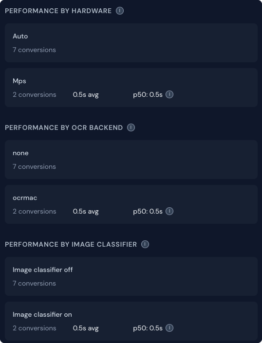
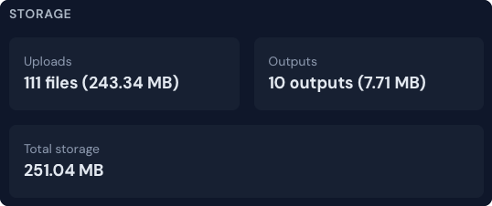
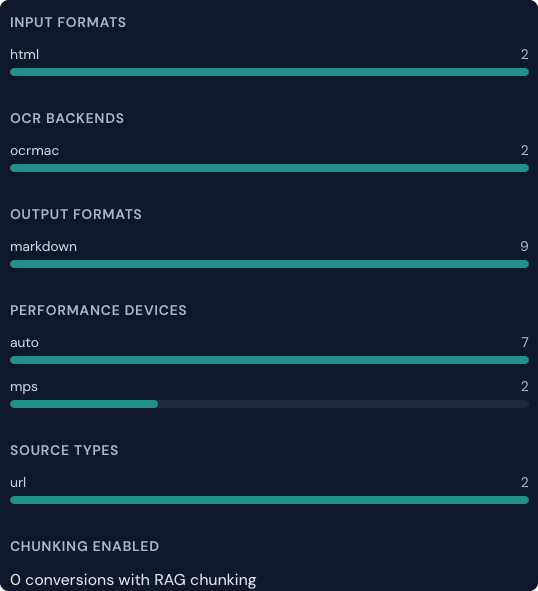
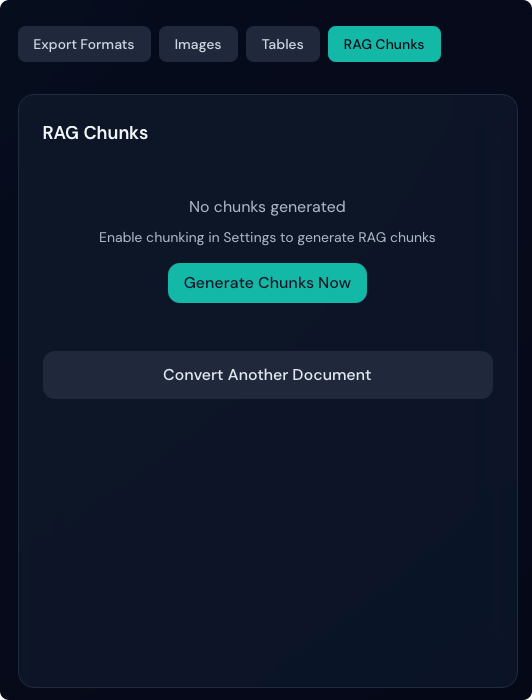
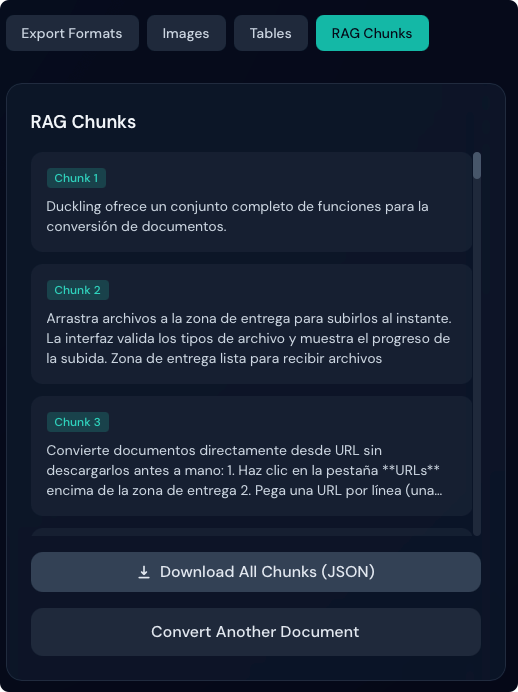

It's been a few months since I [last wrote about Duckling](https://davidgs.com/posts/category/open-source/a-fresh-ui-for-docling/), and in that time, I've made some significant updates to the project. If you haven't heard of Duckling before, it's a web interface for IBM's [Docling](https://docling.ai/) library, which provides powerful document conversion capabilities. With Duckling, you can easily convert PDFs to text, Word documents to Markdown, and even perform OCR on scanned images.

## What's New?

### Accessibility Improvements

Well, first of all I made a bunch of Accessibility changes to make the app more usable for everyone. There were some issues with contrasts, and some of the interactive elements were not keyboard accessible. I also added some ARIA labels to improve screen reader support. Hopefully this addresses some of the accessibility issues that were present in the initial release.

### Bulk vs. Single File Processing

One thing that always bothered me about this interface was the requirement to switch from "single file" to "Batch" processing mode in order to process more than one file. To simplify the process, I removed the "Batch" toggle in the header, and just made the drag-and-drop area able to handle dropping multiple files at once. I also added the ability to drop an entire folder (or select a folder if you're using the file chooser) and have all the files in that folder processed. Oh, and it simply ignores files that are not supported, instead of throwing an error.

### Performance Metrics

I added a new "Performance" tab to the sidebar that shows some basic performance metrics for the most recent conversion. This includes the time taken for each step of the conversion process, as well as the total time taken. This is useful for understanding how long different types of conversions take, and can help with debugging performance issues.

First we have some basic numbers of overall usage, etc.

Next, we we have some details on the performance of the hardware that docling is running on, which is useful for understanding how the performance of the conversion process might vary based on the hardware being used.

Next we have some overall numbers of the storage used by all the processed documents.

Finally, we have a breakdown of the different types of conversions that have been performed, which can be useful for understanding which types of conversions are most common.

At the bottom of that last image you may notice the **Chunking Enabled** section showing that 0 conversions were done with chunking enabled. Here is where the strength of the history comes in handy.

### Chunking History

There is a setting which you can turn on that will generate "chunks" of the document being processed. But what if you've processed a bunch of files without that setting turned on? And now you want to go back and generate those chunks for input into an AI model?

Thanks to having the history of all the conversions you've done stored, you can now select a previously processed document and click a button to generate the chunks for that document.

A simple click of that button will generate the chunks for that document, and then you can view the chunks in the "Chunks" tab of the sidebar. You can also then save those chunks to a file, or copy them to your clipboard for pasting into an AI model.

### Documentation

Though I still have a long way to go, I have been slowly adding images to the documentation (in the various supported languages) to make it easier to understand how to use the different features of the app.

## Conclusion

These are just a few of the updates I've made to Duckling in the past few months. I'm really excited about the direction this project is going, and I have a lot of ideas for new features and improvements that I want to make in the future. If you haven't tried out Duckling yet, I encourage you to give it a try and let me know what you think! You can find the project on GitHub at [duckling-ui/duckling](https://github.com/duckling-ui/duckling). And yes, I have moved the project out of my own personal GitHub account and into a new organization called "duckling-ui" to make it easier for others to contribute and collaborate on the project. So if you're interested in contributing, please feel free to fork the repo and submit a pull request!