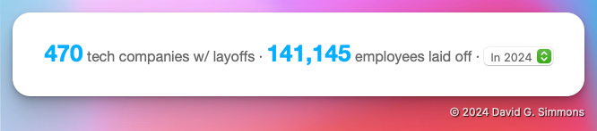
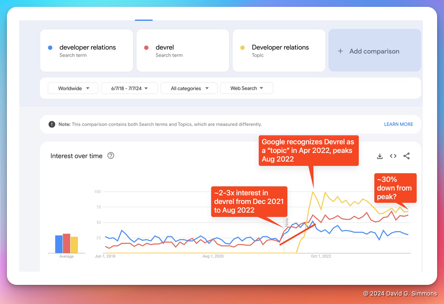

# Warte, was?!?
Ich weiß, ich weiß, es scheint, als hätte ich in letzter Zeit oft den Job gewechselt. So oft, dass ich über manche davon noch nicht einmal Beiträge geschrieben habe.

> **Hinweis:** Dies war schon immer einer meiner Lieblingscartoons [New Yorker](https://newyorker.com) aus der Zeit, als ich in NYC lebte. In den 1980er Jahren war dies ein echtes Phänomen in der Upper West Side.

Es war eine sehr schwierige Zeit für die Branche, für DevRel im Besonderen und für mich persönlich. Und glauben Sie mir, wenn ich sage, dass, wenn es für mich im Beschäftigungsbereich instabil ist, es für mich auch in vielen anderen Bereichen instabil ist. Die letzten drei Jahre oder so waren keine vergnügliche Zeit.

Einige grundlegende Zahlen für Sie, allein für dieses Jahr (2024):

Das sind eine Menge Leute, die ihren Job verloren haben. Wenn man die Situation über einen längeren Zeitraum betrachtet, ist es nicht wirklich besser:

Sind Sie schon deprimiert? Dank [diesem Beitrag](https://dx.tips/zirp) sind wir bei DevRel noch deprimierter:

Es war *keine* schöne Zeit.

## Abflachen

Abgesehen davon scheint es, als würden sich die Dinge langsam etwas beruhigen. Ja, Technologieunternehmen entlassen immer noch massenhaft Leute oder [treiben sie dazu, zu kündigen](https://www.linkedin.com/posts/anthony-b-carr_pretty-much-everyone-i-know-who-works-at-activity-7249767966215475200-IOVI), aber es scheint Licht am Ende des Tunnels zu geben.

Ich bin sehr froh, dass ich während all dieser Zeit keine Probleme hatte, eine neue Stelle zu finden, da alte Stellen wegfielen. Das gilt nicht für alle, und ich bin traurig, dass andere es so schwer haben. Da ich vor nicht allzu langer Zeit etwa 22 Monate lang arbeitslos war, kann ich Ihre Notlage gut nachvollziehen. Wie ich schon oft gesagt habe: Wenn ich Ihnen irgendwie helfen kann, zögern Sie bitte nicht, sich zu melden. Auch wenn Sie nur reden möchten, nehmen Sie sich etwas Zeit in meinem [Kalender](https://dgs.st/mycal) und lassen Sie uns chatten!

## Wo ich gelandet bin

Abgesehen davon (und nein, ich werde nicht auf die Einzelheiten aller Jobs eingehen, die gekommen und gegangen sind, zumindest nicht öffentlich), bin ich wieder in der Welt des IoT gelandet und könnte nicht glücklicher sein! Ich arbeite bei einer kleinen Firma namens [Zymbit](https://zymbit.com), die Hochsicherheit für Raspberry Pi-Geräte bietet. Und mit „Hochsicherheit“ meine ich praktisch undurchdringlich.

Wir stellen unsere eigene Hardware her (basierend auf dem Raspberry Pi-Rechnermodul), die wir in ein extrem sicheres Gehäuse einschließen. Bei richtiger Einrichtung bedeutet dies, dass das Gerät im Inneren unbrauchbar wird, wenn es jemandem gelingt, das Gehäuse zu öffnen. Alle Daten, Programme usw. sind nicht wiederherstellbar.

Wir stellen auch Hardware-Sicherheitsmodule (HSMs) für den Pi her, mit denen Sie Ihren handelsüblichen Raspberry Pi sichern können. Nach der Einrichtung sind der Pi, die SD-Karte und das HSM untrennbar miteinander verbunden, sodass Sie die SD-Karte nicht entfernen, in einen anderen Pi stecken und auf alles, was darauf gespeichert ist, zugreifen können.

Wenn Sie mir schon länger folgen, wissen Sie, dass ich mich sehr lautstark zur Sicherheit im IoT (oder dem Fehlen derselben, je nach Fall) äußere. Meiner Meinung nach ist dies einer der Hauptfaktoren, die eine breitere Verbreitung der IoT-Technologie verhindern.

Ich freue mich riesig, wieder im IoT-Bereich zu sein und an einer Lösung zu arbeiten, die IoT-Edge-Geräte unglaublich sicher macht. Schauen Sie immer wieder vorbei, denn ich werde noch viel mehr über Zymbit und die Absicherung Ihrer IoT-Bereitstellungen veröffentlichen.

**Bonus:** Ich habe vor kurzem einen neuen 3D-Drucker bekommen und beschlossen, ein Schild mit dem Zymbit-Logo zu machen. Ich finde, das Ergebnis ist ziemlich cool!

