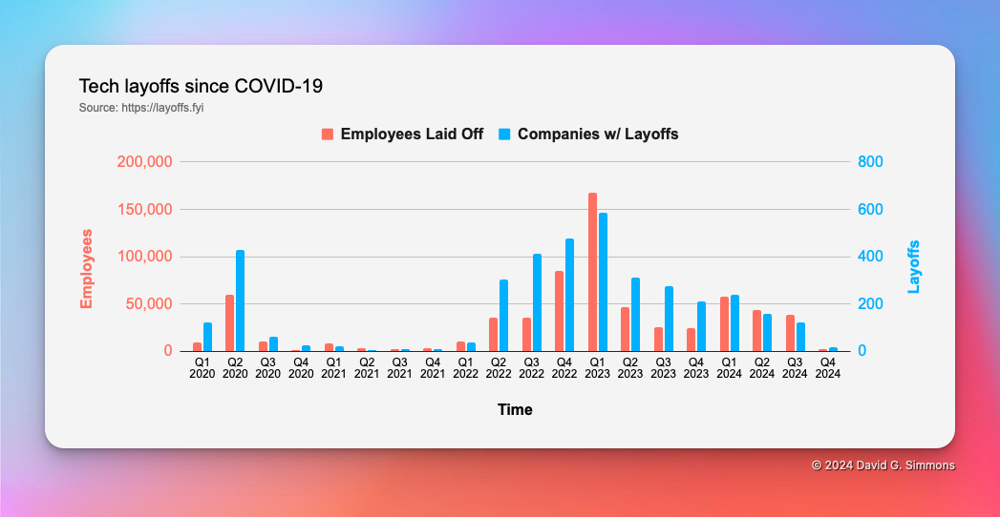

# ¡¿Espera, qué?!?
Lo sé, lo sé, parece que últimamente he estado cambiando mucho de trabajo. Tanto que ni siquiera he escrito entradas sobre algunos de ellos.

> **Nota:** Esta siempre ha sido una de mis caricaturas favoritas de [The New Yorker](https://newyorker.com) desde que vivía en Nueva York. En los años 80, era un verdadero fenómeno en el Upper West Side.

Ha sido un momento muy difícil para la industria, para DevRel en particular, y para mí en lo personal. Y créanme cuando les digo que cuando las cosas son inestables en el área laboral para mí, las cosas son inestables en *muchas* otras áreas para mí. No ha sido un viaje divertido estos últimos 3 años aproximadamente.

Algunos números básicos para ti, solo este año (2024):

Eso significa que mucha gente se ha quedado sin trabajo. Si lo analizamos a lo largo del tiempo, la situación no ha mejorado:

¿Ya estás deprimido? Gracias a [esta publicación](https://dx.tips/zirp), los que trabajamos en DevRel estamos aún más deprimidos:

No ha sido *un buen* momento.

## Nivelación

Dicho todo esto, parece que las cosas están empezando a estabilizarse un poco. Sí, las empresas tecnológicas siguen despidiendo a sus empleados en masa o [obligándolos a renunciar](https://www.linkedin.com/posts/anthony-b-carr_pretty-much-everyone-i-know-who-works-at-activity-7249767966215475200-IOVI), pero parece haber algo de luz al final del túnel.

Me siento muy afortunada de que, durante todo este proceso, no haya tenido problemas para encontrar un nuevo trabajo, ya que los anteriores desaparecieron. Esto no es así para todo el mundo y me entristece que otros estén pasando por momentos tan difíciles. Después de haber pasado por unos 22 meses de desempleo hace poco tiempo, sin duda puedo empatizar con tu difícil situación. Como he dicho muchas veces, si hay algo que pueda hacer para ayudar, no dudes en contactarme. Incluso si lo único que quieres hacer es hablar, ¡toma un tiempo en mi [calendario](https://dgs.st/mycal) y charlemos!

## Donde aterricé

Dicho todo esto (y no, no voy a entrar en detalles sobre todos los trabajos que han aparecido y desaparecido, al menos no públicamente), he vuelto al mundo de la IoT y no podría estar más feliz. Trabajo en una pequeña empresa llamada [Zymbit](https://zymbit.com) que se dedica a la alta seguridad para dispositivos Raspberry Pi. Y por "alta seguridad" me refiero a que son prácticamente impenetrables.

Fabricamos nuestro propio hardware (basado en el módulo de cómputo Raspberry Pi) que encerramos en una carcasa extremadamente segura. Si se configura correctamente, significa que si alguien logra abrir la carcasa, el dispositivo que se encuentra en su interior queda inutilizable. Todos los datos, programas, etc. son irrecuperables.

También fabricamos módulos de seguridad de hardware (HSM) para Pi que pueden ayudar a proteger su Raspberry Pi estándar. Una vez configurados, Pi, la tarjeta SD y el HSM están inextricablemente unidos, de modo que no puede quitar la tarjeta SD, colocarla en otro Pi y tener acceso a nada de lo que esté almacenado en ella.

Si me has seguido durante algún tiempo, sabrás que hablo mucho sobre la seguridad en IoT (o la falta de ella, según sea el caso). Es uno de los principales factores que, en mi opinión, limitan la adopción más generalizada de la tecnología IoT.

Estoy muy orgulloso de volver a trabajar en IoT y de trabajar en una solución que hace que los dispositivos de IoT sean increíblemente seguros. Siga visitándome porque publicaré mucho más sobre Zymbit y sobre cómo proteger sus implementaciones de IoT.

**Extra:** Hace poco compré una nueva impresora 3D y decidí hacer un cartel con el logotipo de Zymbit. ¡Creo que quedó bastante bien!

