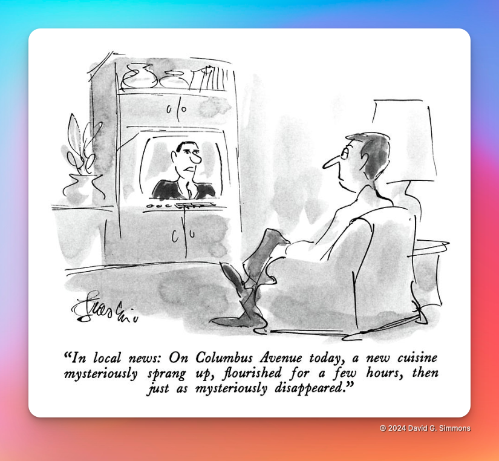
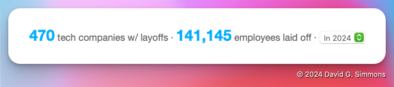
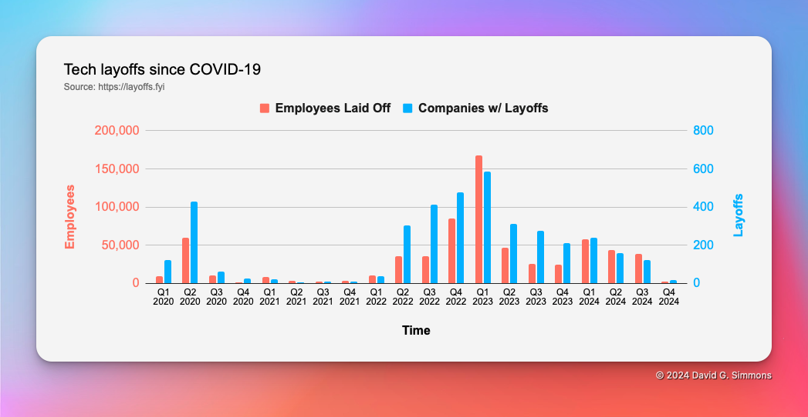
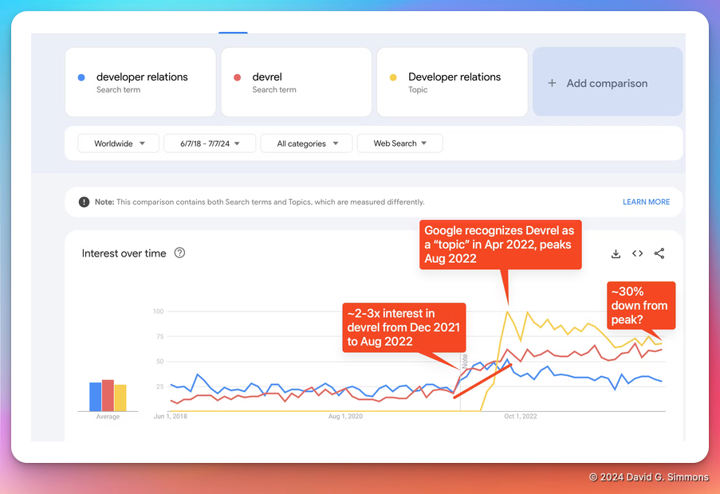
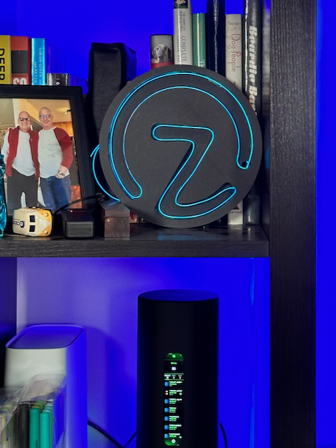

# Wacht, wat?!?
Ik weet het, ik weet het, het lijkt erop dat ik de laatste tijd veel van baan ben veranderd. Zoveel zelfs dat ik over sommige ervan nog geen berichten heb geschreven.

> **Opmerking:** Dit is altijd een van mijn favoriete [New Yorker](https://newyorker.com) cartoons geweest van lang geleden, toen ik in NYC woonde. In de jaren 80 was dit een echt fenomeen in de Upper West Side.

Het is een heel moeilijke tijd geweest voor de industrie, voor DevRel in het bijzonder, en voor mij persoonlijk. En geloof me als ik zeg dat als dingen onstabiel zijn op het gebied van werkgelegenheid voor mij, dingen onstabiel zijn op *veel* andere gebieden voor mij. Het is de afgelopen 3 jaar of zo geen leuke rit geweest.

Enkele basiscijfers voor u, alleen al dit jaar (2024):

Dat zijn een hoop mensen die hun baan kwijt zijn. Als je het over een langere periode bekijkt, is het niet echt beter:

Ben je al depressief? Dankzij [dit bericht](https://dx.tips/zirp) zijn wij in DevRel nog depressiever:

Het was *geen* leuke tijd.

## Afvlakken

Dat gezegd hebbende, lijkt het erop dat de zaken een beetje beginnen te stabiliseren. Ja, techbedrijven ontslaan nog steeds massaal mensen, of [dwingen ze om te stoppen](https://www.linkedin.com/posts/anthony-b-carr_pretty-much-everyone-i-know-who-works-at-activity-7249767966215475200-IOVI), maar er lijkt wel wat licht aan het einde van de tunnel te zijn.

Ik voel me ontzettend gelukkig dat ik, ondanks alles, weinig moeite heb gehad om een nieuwe baan te vinden, omdat de oude banen zijn weggesmolten. Dat geldt niet voor iedereen en ik vind het verdrietig dat anderen het zo moeilijk hebben. Ik heb nog niet zo lang geleden ongeveer 22 maanden werkloos gezeten, dus ik kan me zeker inleven in jouw situatie. Zoals ik al vaak heb gezegd, als er iets is wat ik kan doen om te helpen, aarzel dan niet om contact met me op te nemen. Zelfs als je alleen maar wilt praten, neem dan even de tijd op mijn [agenda](https://dgs.st/mycal) en laten we chatten!

## Waar ik landde

Dat gezegd hebbende (en nee, ik ga niet in op de details van alle banen die zijn gekomen en gegaan, in ieder geval niet openbaar), ben ik terug in de wereld van IoT en ik kan niet gelukkiger zijn! Ik werk bij een klein bedrijf genaamd [Zymbit](https://zymbit.com) dat hoge beveiliging biedt voor Raspberry Pi-apparaten. En met "hoge beveiliging" bedoel ik vrijwel ondoordringbaar.

We maken onze eigen hardware (gebaseerd op de Raspberry Pi compute module) die we in een extreem veilige behuizing stoppen. Als het goed is ingesteld, betekent dit dat als iemand erin slaagt de behuizing te openen, het apparaat erin onbruikbaar wordt. Alle gegevens, programma's, etc. zijn onherstelbaar.

We maken ook Hardware Security Modules (HSM's) voor de Pi die kunnen helpen bij het beveiligen van uw standaard Raspberry Pi. Eenmaal ingesteld, zijn de Pi, de SD-kaart en de HSM onlosmakelijk met elkaar verbonden, zodat u de SD-kaart niet kunt verwijderen, in een andere Pi kunt stoppen en toegang hebt tot alles wat erop is opgeslagen.

Als je me al een tijdje volgt, weet je dat ik extreem vocaal ben over beveiliging in IoT (of het gebrek daaraan, afhankelijk van het geval). Het is een van de belangrijkste factoren, naar mijn mening, die de bredere acceptatie van IoT-technologie beperkt.

Ik ben erg blij dat ik weer terug ben in IoT en werk aan een oplossing die IoT edge-apparaten ongelooflijk veilig maakt. Blijf terugkomen, want ik zal nog veel meer posten over Zymbit en hoe je je IoT-implementaties kunt beveiligen.

**Bonus:** Ik heb nog niet zo lang geleden een nieuwe 3D-printer gekocht en besloot een Zymbit Logo-bord te maken. Het is best cool geworden, vind ik!

